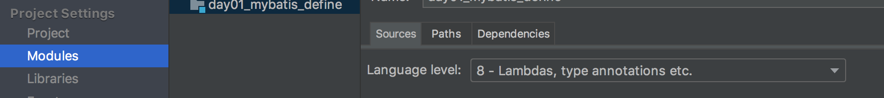

# 01 Error Summary

#### Issue-01:

```
'while' statement cannot complete without throwing an exception.

Reports for, while, or do statements which can only exit by throwing an exception. While such statements may be correct, they are often a symptom of coding errors.
```

> If so**,** you **can** add this above your method containing the infinite loop to suppress warnings: 
>
> 无限循环引发的可能性错误，压制warning即可！@SuppressWarnings("InfiniteLoopStatement")
>
> infinite:无限的  suppress:压制


#### Issue-02:

```java
Unchecked call to 'getConstructor(Class<?>...)' as a member of raw type 'java.lang.Class' less... (⌘F1) 
Inspection info: Signals places where an unchecked warning is issued by the compiler, for example:
-----------------------------------------------------------------------------------------
        Class cls = Class.forName(className);
        Constructor con= cls.getConstructor(String.class);
        Method method = cls.getMethod(methodName);
```

> Firstly this is just **a warning and should not cause you undue alarm when working with reflection and types that are unknown at compile time**. The virtue of generics is stronger compile time type checking and **all that goes out the window once you call Class.forName(className).**
>
> `Class<?> cls = Class.forName(className);`,solve this issue!


#### issue-03:

```
ERROR 1820 (HY000): You must reset your password using ALTER USER statement before executing this statement.
```

> 1、 修改用户密码
> mysql> alter user 'root'@'localhost' identified by 'youpassword';  
>
> 或者       
>
> mysql> set password=password("youpassword");
>
> 2、刷新权限
>
> mysql> flush privileges;


#### issue-04:

```java
'catch' branch identical to 'ClassNotFoundException' branch less... 

Inspection info: Reports identical catch sections in try blocks under JDK 7. A quickfix is available to collapse the sections into a multi-catch section.
This inspection only reports if the project or module is configured to use a language level of 7.0 or higher.
    
    try {
            Properties pro = new Properties();
            ClassLoader classLoader = JDBCUtils.class.getClassLoader();
            URL resource = classLoader.getResource("jdbc.properties");
            assert resource != null;
            String path1 = resource.getPath();
            System.out.println(path1);
            pro.load(new FileReader(path1));
            url = pro.getProperty("url");
            user = pro.getProperty("user");
            password = pro.getProperty("password");
            Class.forName(pro.getProperty("driver"));
        } catch (ClassNotFoundException e) {
            e.printStackTrace();
        } catch (IOException e) { // ISSUE point
            e.printStackTrace();
        }
```

> Resolution:
>
> the same warning in IntelliJ (and I think you're using IntelliJ too), why not let Alt+Enter (or Option+Return if you rather) show you what it means?
>
> ```java
> try {
> 	...
> }catch(ClassNotFoundException | IOException e){
>       e.printStackTrace();
> }
> ```


#### issue-05:

```
Intellij idea 出现错误 error:java: 无效的源发行版: 11解决方法!!
```

> Select the project, then File > ProjectStructure > ProjectSettings > Modules -> sources You probably have the Language Level set at 8: 根据当前jdk版本而定！！！


#### issue-06:

```java
Caused by: java.lang.IllegalStateException: ContainerBase.addChild: start: org.apache.catalina.LifecycleException: Failed to start component [StandardEngine[Catalina].StandardHost[localhost].StandardContext[/day16]]
	at org.apache.catalina.core.ContainerBase.addChildInternal(ContainerBase.java:758)
	at org.apache.catalina.core.ContainerBase.addChild(ContainerBase.java:730)
	at org.apache.catalina.core.StandardHost.addChild(StandardHost.java:734)
	at org.apache.catalina.startup.HostConfig.manageApp(HostConfig.java:1736)
	at sun.reflect.NativeMethodAccessorImpl.invoke0(Native Method)
	at sun.reflect.NativeMethodAccessorImpl.invoke(NativeMethodAccessorImpl.java:62)
	at sun.reflect.DelegatingMethodAccessorImpl.invoke(DelegatingMethodAccessorImpl.java:43)
	at java.lang.reflect.Method.invoke(Method.java:483)
	at org.apache.tomcat.util.modeler.BaseModelMBean.invoke(BaseModelMBean.java:300)
	... 31 more
	
	Artifact day16_cookie:war exploded: Error during artifact deployment.
        
Caused by: java.lang.IllegalArgumentException: The servlets named [cn.itcast.cookie.CookieDemo4] and [com.lolo.example.CookieDemo4] are both mapped to the url-pattern [/cookieDemo4] which is not permitted.
```

>由于影射了相同的路径，造成项目部署失败！


#### issue-07:

```java
// 运行maven项目是发现如下警告
Warning:java: 源值1.5已过时, 将在未来所有发行版中删除
```

> ##### 修改module的jdk版本，maven默认是jdk1.5。File/Project_stucture/Modules目录
>
> 


#### issue-8:

```
部署本地maven项目时，发现如下error：

Error:Cannot build artifact 'springmvc_day02_fileserver:war exploded' because it is included into a circular dependency (artifact 'springmvc_day02_fileserver:war exploded', artifact 'springmvc_day02_02_fileupload:war exploded')
```

> 报个这个错的意思，你大概在编译项目的时候，你构建项目的时候，你点的是build project；而不是选择rebuild project，导致重复的依赖。
>
> 这时候找到项目目录中的.idea目录，在进入artifacts文件目录，发现里面有两个重复的文件，删除即可解决错误。


