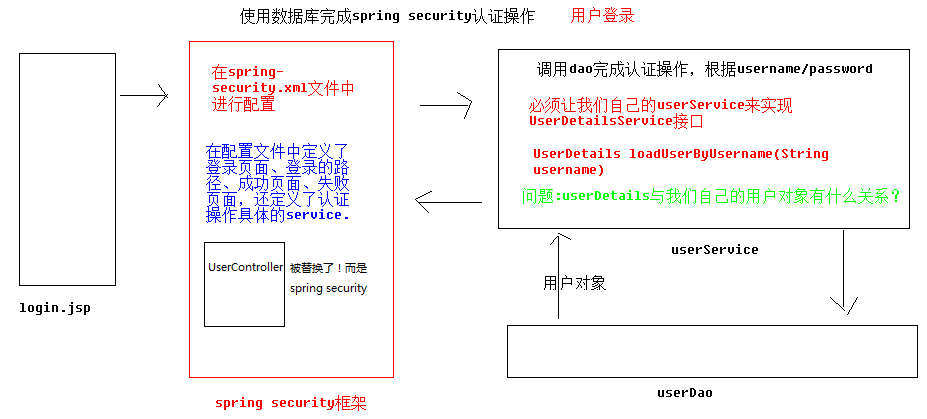

# SSM综合案例_03 权限控制／Spring Security

## 一、数据库与表的分析

user －－ role： 用户与角色多对多关系；

role －－ permission：用户与权限资源多对多关系；

```sql
CREATE TABLE users(
    id varchar2(32) default SYS_GUID() PRIMARY KEY,
    email VARCHAR2(50) UNIQUE NOT NULL,
    username VARCHAR2(50),
    PASSWORD VARCHAR2(50),
    phoneNum VARCHAR2(20),
    STATUS INT
)

 
CREATE TABLE role(
    id varchar2(32) default SYS_GUID() PRIMARY KEY,
    roleName VARCHAR2(50) ,
    roleDesc VARCHAR2(50)
)

CREATE TABLE users_role(
    userId varchar2(32),
    roleId varchar2(32),
    PRIMARY KEY(userId,roleId),
    FOREIGN KEY (userId) REFERENCES users(id),
    FOREIGN KEY (roleId) REFERENCES role(id)
)

 CREATE TABLE permission(
    id varchar2(32) default SYS_GUID() PRIMARY KEY,
    permissionName VARCHAR2(50) ,
    url VARCHAR2(50)
)

 CREATE TABLE role_permission(
    permissionId varchar2(32),
    roleId varchar2(32),
    PRIMARY KEY(permissionId,roleId),
    FOREIGN KEY (permissionId) REFERENCES permission(id),
    FOREIGN KEY (roleId) REFERENCES role(id)
)
```


## 二、Spring Security

### 2.1 Spring Security介绍 

Spring Security 的前身是 Acegi Security ,是 Spring 项目组中用来提供安全认证服务的框架。 (https://projects.spring.io/spring-security/) Spring Security 为基于J2EE企业应用软件提供了全面安全服务。特别 是使用领先的J2EE解决方案-Spring框架开发的企业软件项目。人们使用Spring Security有很多种原因,不过通常吸 引他们的是在J2EE Servlet规范或EJB规范中找不到典型企业应用场景的解决方案。 特别要指出的是他们不能再 WAR 或 EAR 级别进行移植。这样,如果你更换服务器环境,就要,在新的目标环境进行大量的工作,对你的应用 系统进行重新配 置安全。使用Spring Security 解决了这些问题,也为你提供很多有用的,完全可以指定的其他安 全特性。 安全包括两个主要操作。 

“认证”,是为用户建立一个他所声明的主体。主题一般式指用户,设备或可以在你系 统中执行动作的其他系 统。
 “授权”指的是一个用户能否在你的应用中执行某个操作,在到达授权判断之前,身份的主题已经由 身份验证 过程建立了。 

这些概念是通用的,不是Spring Security特有的。在身份验证层面,Spring Security广泛支持各种身份验证模式, 这些验证模型绝大多数都由第三方提供,或则正在开发的有关标准机构提供的,例如 Internet Engineering Task Force.作为补充,Spring Security 也提供了自己的一套验证功能。 

### 2.2、Spring Security快速入门

- #### pom.xml maven依赖

```xml
<dependencies>
    <dependency>
        <groupId>org.springframework.security</groupId>
        <artifactId>spring-security-web</artifactId>
        <version>5.0.1.RELEASE</version>
    </dependency>
    <dependency>
        <groupId>org.springframework.security</groupId>
        <artifactId>spring-security-config</artifactId>
        <version>5.0.1.RELEASE</version>
    </dependency>
</dependencies>
```

- ##### web.xml

```xml
<?xml version="1.0" encoding="UTF-8"?>
<web-app xmlns:xsi="http://www.w3.org/2001/XMLSchema-instance"
         xmlns="http://xmlns.jcp.org/xml/ns/javaee"
         xsi:schemaLocation="http://xmlns.jcp.org/xml/ns/javaee http://xmlns.jcp.org/xml/ns/javaee/web-app_3_1.xsd"
         version="3.1">

    <!-- 配置加载类路径的配置文件 -->
    <context-param>
        <param-name>contextConfigLocation</param-name>
        <param-value>classpath*:spring-security.xml</param-value>
    </context-param>

    <listener><!--需要配置监听器，监听security框架-->
        <listener-class>org.springframework.web.context.ContextLoaderListener</listener-class>
    </listener>
    <filter>
        <!--必须叫这个名字，不能更改！-->
        <filter-name>springSecurityFilterChain</filter-name>
        <filter-class>org.springframework.web.filter.DelegatingFilterProxy</filter-class>
    </filter>
    <filter-mapping>
        <filter-name>springSecurityFilterChain</filter-name>
        <url-pattern>/*</url-pattern>
    </filter-mapping>
</web-app>
```

- ##### spring-security.xml

```xml
<?xml version="1.0" encoding="UTF-8"?>
<beans xmlns="http://www.springframework.org/schema/beans"
       xmlns:security="http://www.springframework.org/schema/security"
       xmlns:xsi="http://www.w3.org/2001/XMLSchema-instance"
       xsi:schemaLocation="http://www.springframework.org/schema/beans
    http://www.springframework.org/schema/beans/spring-beans.xsd
    http://www.springframework.org/schema/security
    http://www.springframework.org/schema/security/spring-security.xsd">
    <!--若没有指定就使用默认配置-->
    <security:http auto-config="true" use-expressions="false">
        <!-- intercept-url定义一个过滤规则 pattern表示对哪些url进行权限控制,ccess属性表示在请求对应 的URL时需要什么权限,
               默认配置时它应该是一个以逗号分隔的角色列表,请求的用户只需拥有其中的一个角色就能成功访问对应
        的URL -->
        <security:intercept-url pattern="/**" access="ROLE_USER" />
        <!-- auto-config配置后,不需要在配置下面信息 <security:form-login /> 定义登录表单信息
        <security:http-basic
                    /> <security:logout /> -->
    </security:http>
    <security:authentication-manager>
        <security:authentication-provider>
            <security:user-service>
                <security:user name="user" password="{noop}user"
                               authorities="ROLE_USER" />
                <security:user name="admin" password="{noop}admin"
                               authorities="ROLE_ADMIN" />
            </security:user-service>
        </security:authentication-provider>
    </security:authentication-manager>
</beans>
```

### 2.3、指定页面验证

```xml
<?xml version="1.0" encoding="UTF-8"?>
<beans xmlns="http://www.springframework.org/schema/beans"
       xmlns:security="http://www.springframework.org/schema/security"
       xmlns:xsi="http://www.w3.org/2001/XMLSchema-instance"
       xsi:schemaLocation="http://www.springframework.org/schema/beans
    http://www.springframework.org/schema/beans/spring-beans.xsd
    http://www.springframework.org/schema/security
    http://www.springframework.org/schema/security/spring-security.xsd">
  
    <!-- 配置不过滤的资源（静态资源及登录相关） -->
    <security:http security="none" pattern="/login.html" />
    <security:http security="none" pattern="/failer.html" />
    <security:http auto-config="true" use-expressions="false" >
        <!-- 配置资料连接，表示任意路径都需要ROLE_USER权限 -->
        <security:intercept-url pattern="/**" access="ROLE_USER" />
        <!-- 自定义登陆页面，login-page 自定义登陆页面 authentication-failure-url 用户权限校验失败之后才会跳转到这个页面，如果数据库中没有这个用户则不会跳转到这个页面。
            default-target-url 登陆成功后跳转的页面。 注：登陆页面用户名固定 username，密码 password，action:login -->
        <security:form-login login-page="/login.html"
                             login-processing-url="/login" username-parameter="username"
                             password-parameter="password" authentication-failure-url="/failer.html"
                             default-target-url="/success.html" authentication-success-forward-url="/success.html"/>

        <!-- 关闭CSRF,默认是开启的 -->
        <security:csrf disabled="true" />
    </security:http>
    <security:authentication-manager>
        <security:authentication-provider>
            <security:user-service> <!--测试时，权限用户可以在xml配置-->
                <security:user name="user" password="{noop}user"
                               authorities="ROLE_USER" />
                <security:user name="admin" password="{noop}admin"
                               authorities="ROLE_ADMIN" />
            </security:user-service>
        </security:authentication-provider>
    </security:authentication-manager>
</beans>
```


### 2.4、Spring Security使用数据库认证

在Spring Security中如果想要使用数据进行认证操作,有很多种操作方式,这里我们介绍使用UserDetails、UserDetailsService来完成操作。 

- ##### UserDetails是一个接口,我们可以认为UserDetails作用是于封装当前进行认证的用户信息,但由于其是一个接口,所以我们可以对其进行实现,也可以使用Spring Security提供的一个UserDetails的实现类User来完成
操作;

  ```java
  public interface UserDetails extends Serializable {
      Collection<? extends GrantedAuthority> getAuthorities();
      String getPassword();
      String getUsername();
      boolean isAccountNonExpired();
      boolean isAccountNonLocked();
      boolean isCredentialsNonExpired();
      boolean isEnabled();
  }
  ```

  ````java
  public class User implements UserDetails, CredentialsContainer {
      private String password;
      private final String username;
      private final Set<GrantedAuthority> authorities;
      private final boolean accountNonExpired; //帐户是否过期 
      private final boolean accountNonLocked; //帐户是否锁定 
      private final boolean credentialsNonExpired; //认证是否过期 
      private final boolean enabled; //帐户是否可用
  }
  ````

- ##### UserDetailsService: 规范认证方法的接口；

  ```java
   public interface UserDetailsService {
      UserDetails loadUserByUsername(String username) throws UsernameNotFoundException;
  }
  ```

- ##### 认证原理图

  

### 2.5、spring-security源码分析

#### 2.5.1、在web.xml文件中配置

##### 问题:为什么DelegatingFilterProxy的filter-name必须是springSecurityFilterChain?

```xml
<filter>
    <!--必须叫这个名字-->
    <filter-name>springSecurityFilterChain</filter-name>
    <filter-class>org.springframework.web.filter.DelegatingFilterProxy</filter-class>
</filter>
<filter-mapping>
    <filter-name>springSecurityFilterChain</filter-name>
    <url-pattern>/*</url-pattern>
</filter-mapping>
```

1）从web.xml配置看出，过滤器是DelegatingFilterProxy。然而查看源码知，DelegatingFilterProxy并不是真正的Filter，在其initFilterBean方法中会从WebApplicationContext获取到真实的delegate过滤器！这个真是过滤器就是FilterChainProxy，因为其在spring在解析配置文件时装配到上下文中,并且beanName为springSecurityFilterChain。

```java
// 1. DelegatingFilterProxy initFilterBean获取真实的filter
protected void initFilterBean() throws ServletException {
    synchronized (this.delegateMonitor) {
        if (this.delegate == null) {
            // If no target bean name specified, use filter name.
            if (this.targetBeanName == null) {
                this.targetBeanName = getFilterName();
            }
            // Fetch Spring root application context and initialize the delegate early,
            // if possible. If the root application context will be started after this
            // filter proxy, we'll have to resort to lazy initialization.
            WebApplicationContext wac = findWebApplicationContext();
            if (wac != null) {
                this.delegate = initDelegate(wac);
            }
        }
    }
}
// 依据web.xml中需要配置filter-name为springSecurityFilterChain获取delegate对象。getTargetBeanName()方法就是springSecurityFilterChain字段；
protected Filter initDelegate(WebApplicationContext wac) throws ServletException {
		String targetBeanName = getTargetBeanName();
		Assert.state(targetBeanName != null, "No target bean name set");
		Filter delegate = wac.getBean(targetBeanName, Filter.class);
		if (isTargetFilterLifecycle()) {
			delegate.init(getFilterConfig());
		}
		return delegate;
	}
```

```java
// 2. DelegatingFilterProxy doFilter真正干活的其实是delegate这个Filter,而delegate其实就是FilterChainProxy.
public void doFilter(ServletRequest request, ServletResponse response, FilterChain filterChain)
    throws ServletException, IOException {

    // Lazily initialize the delegate if necessary.
    Filter delegateToUse = this.delegate;
    if (delegateToUse == null) {
        synchronized (this.delegateMonitor) {
            delegateToUse = this.delegate;
            if (delegateToUse == null) {
                WebApplicationContext wac = findWebApplicationContext();
                if (wac == null) {
                    throw new IllegalStateException("No WebApplicationContext found: " +
                                                    "no ContextLoaderListener or DispatcherServlet registered?");
                }
                delegateToUse = initDelegate(wac);
            }
            this.delegate = delegateToUse;
        }
    }

    // Let the delegate perform the actual doFilter operation.
    invokeDelegate(delegateToUse, request, response, filterChain);
}
```

```java
// 3. FilterChainProxy 
public void doFilter(ServletRequest request, ServletResponse response,
			FilterChain chain) throws IOException, ServletException {
		boolean clearContext = request.getAttribute(FILTER_APPLIED) == null;
		if (clearContext) {
			try {
				request.setAttribute(FILTER_APPLIED, Boolean.TRUE);
				doFilterInternal(request, response, chain);
			}
			finally {
				SecurityContextHolder.clearContext();
				request.removeAttribute(FILTER_APPLIED);
			}
		}
		else {
			doFilterInternal(request, response, chain);
		}
	}
// doFilter其实际执行doFilterInternal，大概就是获取spring securityFilters所有过滤器，一一执行
	private void doFilterInternal(ServletRequest request, ServletResponse response,
			FilterChain chain) throws IOException, ServletException {
		FirewalledRequest fwRequest = firewall
				.getFirewalledRequest((HttpServletRequest) request);
		HttpServletResponse fwResponse = firewall
				.getFirewalledResponse((HttpServletResponse) response);

		List<Filter> filters = getFilters(fwRequest);

		if (filters == null || filters.size() == 0) {
			if (logger.isDebugEnabled()) {
				logger.debug(UrlUtils.buildRequestUrl(fwRequest)
						+ (filters == null ? " has no matching filters"
								: " has an empty filter list"));
			}

			fwRequest.reset();
			chain.doFilter(fwRequest, fwResponse);
			return;
		}
		...
	}
// securityFilters
enum SecurityFilters {
	FIRST(Integer.MIN_VALUE),
	CHANNEL_FILTER,
	SECURITY_CONTEXT_FILTER,
	CONCURRENT_SESSION_FILTER,
	WEB_ASYNC_MANAGER_FILTER /** {@link WebAsyncManagerIntegrationFilter} */,
	HEADERS_FILTER, CORS_FILTER,
	CSRF_FILTER,
	LOGOUT_FILTER,
	X509_FILTER,
	PRE_AUTH_FILTER,
	CAS_FILTER,
	FORM_LOGIN_FILTER,
	OPENID_FILTER,
	LOGIN_PAGE_FILTER,
	DIGEST_AUTH_FILTER,
	BASIC_AUTH_FILTER,
	REQUEST_CACHE_FILTER,
	SERVLET_API_SUPPORT_FILTER,
	JAAS_API_SUPPORT_FILTER,
	REMEMBER_ME_FILTER,
	ANONYMOUS_FILTER,
	SESSION_MANAGEMENT_FILTER,
	EXCEPTION_TRANSLATION_FILTER,
	FILTER_SECURITY_INTERCEPTOR,
	SWITCH_USER_FILTER,
	LAST(Integer.MAX_VALUE);
	...
}
```

> ##### 至于如何确定FilterChainProxy在spring容器的beanName就是springSecurityFilterChain，参考下面第二部分源码分析！

#### 2.5.2、在spring-security.xml文件中配置

```xml
<!-- 配置不拦截的资源 -->
<security:http pattern="/login.jsp" security="none"/>
<security:http pattern="/failer.jsp" security="none"/>
<security:http pattern="/css/**" security="none"/>
<security:http pattern="/img/**" security="none"/>
<security:http pattern="/plugins/**" security="none"/>

<security:http auto-config="true" use-expressions="false">
    <security:intercept-url pattern="/**" access="ROLE_USER,ROLE_ADMIN"/>
    <security:form-login
                         login-page="/login.jsp"
                         login-processing-url="/login.do"
                         default-target-url="/index.jsp"
                         authentication-failure-url="/failer.jsp"
                         authentication-success-forward-url="/pages/main.jsp"
                         />
    <security:logout invalidate-session="true" logout-url="/logout.do" logout-success-url="/login.jsp" />
</security:http>
```

http标签是自定义标签,我们可以在spring-security-config包中查看META-INF/spring.handlers

```scheme
http\://www.springframework.org/schema/security=org.springframework.security.config.SecurityNamespaceHandler
```

继续查看SecurityNamespaceHandler类,在其init方法-->loadParsers()方法中,指定由HttpSecurityBeanDefinitionParser进行解析

```java
parsers.put(Elements.HTTP, new HttpSecurityBeanDefinitionParser());
```

在HttpSecurityBeanDefinitionParser完成具体解析的parse方法中

```java
registerFilterChainProxyIfNecessary(pc, pc.extractSource(element));
```

#### 这里就是注册了名为springSecurityFilterChain的filterChainProxy类。

```java
static void registerFilterChainProxyIfNecessary(ParserContext pc, Object source) {
    if (pc.getRegistry().containsBeanDefinition(BeanIds.FILTER_CHAIN_PROXY)) {
        return;
    }
    // Not already registered, so register the list of filter chains and the
    // FilterChainProxy
    BeanDefinition listFactoryBean = new RootBeanDefinition(ListFactoryBean.class);
    listFactoryBean.getPropertyValues().add("sourceList", new ManagedList());
    pc.registerBeanComponent(new BeanComponentDefinition(listFactoryBean,
                                                         BeanIds.FILTER_CHAINS));

    BeanDefinitionBuilder fcpBldr = BeanDefinitionBuilder
        .rootBeanDefinition(FilterChainProxy.class);
    fcpBldr.getRawBeanDefinition().setSource(source);
    fcpBldr.addConstructorArgReference(BeanIds.FILTER_CHAINS);
    fcpBldr.addPropertyValue("filterChainValidator", new RootBeanDefinition(
        DefaultFilterChainValidator.class));
    BeanDefinition fcpBean = fcpBldr.getBeanDefinition();
    pc.registerBeanComponent(new BeanComponentDefinition(fcpBean,
                                                         BeanIds.FILTER_CHAIN_PROXY));
    pc.getRegistry().registerAlias(BeanIds.FILTER_CHAIN_PROXY,
                                   BeanIds.SPRING_SECURITY_FILTER_CHAIN);
}
```

接下查看一下注册一系列Filter的地方createFilterChain,在这个方法中我们重点关注

```java
private BeanReference createFilterChain(Element element, ParserContext pc) {
		boolean secured = !OPT_SECURITY_NONE.equals(element.getAttribute(ATT_SECURED));
    ...
	AuthenticationConfigBuilder authBldr = new AuthenticationConfigBuilder(element,
                forceAutoConfig, pc, httpBldr.getSessionCreationPolicy(),
                httpBldr.getRequestCache(), authenticationManager,
                httpBldr.getSessionStrategy(), portMapper, portResolver,
                httpBldr.getCsrfLogoutHandler());
    ...
}
```

##### 查看AuthenticationConfigBuilder创建代码: 这就是为什么不需要自己写loginFilter、logoutFilter以及配置UserDetailsService就自动加入到spring容器的原因。

```java
public AuthenticationConfigBuilder(Element element, boolean forceAutoConfig,
			ParserContext pc, SessionCreationPolicy sessionPolicy,
			BeanReference requestCache, BeanReference authenticationManager,
			BeanReference sessionStrategy, BeanReference portMapper,
			BeanReference portResolver, BeanMetadataElement csrfLogoutHandler) {
		this.httpElt = element;
		this.pc = pc;
		this.requestCache = requestCache;
		autoConfig = forceAutoConfig
				| "true".equals(element.getAttribute(ATT_AUTO_CONFIG));
		this.allowSessionCreation = sessionPolicy != SessionCreationPolicy.NEVER
				&& sessionPolicy != SessionCreationPolicy.STATELESS;
		this.portMapper = portMapper;
		this.portResolver = portResolver;
		this.csrfLogoutHandler = csrfLogoutHandler;

		createAnonymousFilter();
		createRememberMeFilter(authenticationManager);
		createBasicFilter(authenticationManager);
		createFormLoginFilter(sessionStrategy, authenticationManager);
		createOpenIDLoginFilter(sessionStrategy, authenticationManager);
		createX509Filter(authenticationManager);
		createJeeFilter(authenticationManager);
		createLogoutFilter();
		createLoginPageFilterIfNeeded();
		createUserDetailsServiceFactory();
		createExceptionTranslationFilter();
	}
```


## 三、用户管理

### 3.1、用户登录认证

- ##### web.xml 及pom.xml依赖配置参考上面的！

- ##### spring-security.xml

  ```xml
  <?xml version="1.0" encoding="UTF-8"?>
  <beans xmlns="http://www.springframework.org/schema/beans"
         xmlns:security="http://www.springframework.org/schema/security"
         xmlns:xsi="http://www.w3.org/2001/XMLSchema-instance"
         xsi:schemaLocation="http://www.springframework.org/schema/beans
      http://www.springframework.org/schema/beans/spring-beans.xsd
      http://www.springframework.org/schema/security
      http://www.springframework.org/schema/security/spring-security.xsd">
  
      <!-- 配置不拦截的资源 -->
      <security:http pattern="/login.jsp" security="none"/>
      <security:http pattern="/failer.jsp" security="none"/>
      <security:http pattern="/css/**" security="none"/>
      <security:http pattern="/img/**" security="none"/>
      <security:http pattern="/plugins/**" security="none"/>
  
      <!--
      	配置具体的规则
      	auto-config="true"	不用自己编写登录的页面，框架提供默认登录页面
      	use-expressions="false"	是否使用SPEL表达式（没学习过）
      -->
      <security:http auto-config="true" use-expressions="false">
          <!-- 配置具体的拦截的规则 pattern="请求路径的规则" access="访问系统的人，必须有ROLE_USER的角色" -->
          <security:intercept-url pattern="/**" access="ROLE_USER,ROLE_ADMIN"/>
  
          <!-- 定义跳转的具体的页面 -->
          <security:form-login
                  login-page="/login.jsp"
                  login-processing-url="/login.do"
                  default-target-url="/index.jsp"
                  authentication-failure-url="/failer.jsp"
          />
  
          <!-- 关闭跨域请求 -->
          <security:csrf disabled="true"/>
  
          <!-- 退出 -->
          <security:logout invalidate-session="true" logout-url="/logout.do" logout-success-url="/login.jsp" />
  
      </security:http>
  
      <!-- 切换成数据库中的用户名和密码 -->
      <security:authentication-manager>
          <security:authentication-provider user-service-ref="userService">
              <!-- 配置加密的方式 -->
              <security:password-encoder ref="passwordEncoder"/>
          </security:authentication-provider>
      </security:authentication-manager>
  
      <!-- 配置加密类 -->
      <bean id="passwordEncoder" class="org.springframework.security.crypto.bcrypt.BCryptPasswordEncoder"/>
  
      <!-- 提供了入门的方式，在内存中存入用户名和密码
      <security:authentication-manager>
      	<security:authentication-provider>
      		<security:user-service>
      			<security:user name="admin" password="{noop}admin" authorities="ROLE_USER"/>
      		</security:user-service>
      	</security:authentication-provider>
      </security:authentication-manager>
      -->
  </beans>
  ```

- ##### UserServiceImpl

  ```java
  @Service("userService")
  public class UserServiceImpl implements IUserService {
  
      @Autowired
      private IUserDao userDao;
  
      @Override
      public UserDetails loadUserByUsername(String username) throws UsernameNotFoundException {
          User user = null;// org.springframework.security.core.userdetails.User;
          try {
              UserInfo userInfo = userDao.findByUsername(username);
  //            user =  new User(userInfo.getUsername(),"{noop}"+userInfo.getPassword(),getAuthority(userInfo.getRoles()));
  
              user = new User(username,"{noop}"+userInfo.getPassword(),userInfo.getStatus()==0?false:true,true,
                      true,true,getAuthority(userInfo.getRoles()));
  
          } catch (Exception e) {
              e.printStackTrace();
          }
  
          return user;
      }
  
      // 返回一个角色描述的集合, 
      private List<SimpleGrantedAuthority> getAuthority(){
          List<SimpleGrantedAuthority> authorities = new ArrayList<>();
          authorities.add(new SimpleGrantedAuthority("ROLE_USER"));// 手动添加不行，需要到role表去查找
          return authorities;
      }
  
      // 返回一个角色描述的集合
      private List<SimpleGrantedAuthority> getAuthority(List<Role> roles){
          List<SimpleGrantedAuthority> authorities = new ArrayList<>();
          for(Role role:roles) {
              authorities.add(new SimpleGrantedAuthority("ROLE_"+role.getRoleName()));// 手动添加不行，需要到role表去查找
          }
          return authorities;
      }
  }
  ```

- ##### IUserDao

  ```java
  public interface IUserDao {
  
      @Select(" select * from users where username=#{username} ")
      @Results(value = {
              @Result(id = true, property = "id", column = "id"),
              @Result(property = "username", column = "username"),
              @Result(property = "email", column = "email"),
              @Result(property = "password", column = "password"),
              @Result(property = "phoneNum", column = "phoneNum"),
              @Result(property = "status", column = "status"),
              @Result(property = "roles", column = "id", javaType = List.class, many = @Many(select = "com.eoony.dao.IRoleDao.findByUserId"))
      })
      public UserInfo findByUsername(String username) throws Exception;
  }
  ----------------------------------
  public interface IRoleDao {
      @Select(" select * from role where id in ( select roleId from users_role where userId=#{userId}) ")
      public List<Role> findByUserId(String userId) throws Exception;
  }
  ```

### 3.2、用户退出：

使用spring security完成用户退出,非常简单!!

- ##### spring-security配置

  ```xml
  <security:logout invalidate-session="true" logout-url="/logout.do" logout-success-url="/login.jsp" />
  ```

- ##### 页面

  ```html
  <a href="${pageContext.request.contextPath}/logout.do" 
     							class="btn btn-default btn-flat">注销</a>
  ```

### 3.3、用户查询/添加

```java
@Service("userService")
@Transactional
public class UserServiceImpl implements IUserService {

    @Autowired
    private IUserDao userDao;

    @Autowired
    private BCryptPasswordEncoder passwordEncoder;

    @Override
    public UserDetails loadUserByUsername(String username) throws UsernameNotFoundException {
        User user = null;
        try {
            UserInfo userInfo = userDao.findByUsername(username);
		// 加密后，就不需要{noop}前缀了
            user = new User(username,/*"{noop}"+*/userInfo.getPassword(),userInfo.getStatus()==0?false:true,true,
                            true,true,getAuthority(userInfo.getRoles()));

        } catch (Exception e) {
            e.printStackTrace();
        }

        return user;
    }

    // 返回一个角色描述的集合
    private List<SimpleGrantedAuthority> getAuthority(List<Role> roles){
        List<SimpleGrantedAuthority> authorities = new ArrayList<>();
        for(Role role:roles) {
            authorities.add(new SimpleGrantedAuthority("ROLE_"+role.getRoleName()));// 手动添加不行，需要到role表去查找
        }
        return authorities;
    }

    // 查询用户
    @Override
    public List<UserInfo> findAll() throws Exception {
        return userDao.findAll();
    }

    // 添加用户
    @Override
    public void save(UserInfo userInfo) throws Exception {
        // password加密
        userInfo.setPassword(passwordEncoder.encode(userInfo.getPassword()));
        userDao.save(userInfo);
    }
}
```

```xml
 // 1. 放开配置加密方式； 2. 配置加密类BCryptPasswordEncoder(这个也可以直接调用，参考BCryptPasswordEncoderUtils)
<!-- 切换成数据库中的用户名和密码 -->
    <security:authentication-manager>
        <security:authentication-provider user-service-ref="userService">
            <!-- 配置加密的方式 -->
            <security:password-encoder ref="passwordEncoder"/>
        </security:authentication-provider>
    </security:authentication-manager>

    <!-- 配置加密类 -->
    <bean id="passwordEncoder" class="org.springframework.security.crypto.bcrypt.BCryptPasswordEncoder"/>
```

```java
public class BCryptPasswordEncoderUtils {

    private static BCryptPasswordEncoder passwordEncoder = new BCryptPasswordEncoder();

    public static String encoderPassword(String password){
        return passwordEncoder.encode(password);
    }

    public static void main(String[] args) {
        String ps = "123";
        System.out.println(encoderPassword(ps));
    }
}
----------
    $2a$10$6.mfIHTctyt9b3RSgS/nXuPpNwmNE5Rxko4tD9q4eD.xGRhN5QD.G
    $2a$10$ufZCO3X2r7j0.BeoTMiTJ.ke/qjvQY9cnnjiBkf/0HZ4VgmQD0UZC
    $2a$10$0HyX8454Z8eN4MS9ErOBwepVwbrsWULP90KHkXA8Az27lLxx1Ybfq
    
    同一密码123， 加密后的结果会不同。加密方式优于md5。

   public String encode(CharSequence rawPassword) {
		String salt;
		if (strength > 0) {
			if (random != null) {
				salt = BCrypt.gensalt(strength, random);
			}
			else {
				salt = BCrypt.gensalt(strength);
			}
		}
		else {
			salt = BCrypt.gensalt();
		}
		return BCrypt.hashpw(rawPassword.toString(), salt);
	}
--------
查看源码，加密会生成一个salt。然后再进行加密；
那么解码，也一定是根据前缀得到这个salt，再进行解密；
```

### 3.4、用户详情

分析：用户有多个角色，而角色又会有多个资源权限！

- IUserDao

```java
 @Select(" select * from users where id=#{id} ")
    @Results(value = {
            @Result(id = true, property = "id", column = "id"),
            @Result(property = "username", column = "username"),
            @Result(property = "email", column = "email"),
            @Result(property = "password", column = "password"),
            @Result(property = "phoneNum", column = "phoneNum"),
            @Result(property = "status", column = "status"),
            @Result(property = "roles", column = "id", javaType = List.class, many = @Many(select = "com.eoony.dao.IRoleDao.findByUserId"))
    })
    UserInfo findById(String id) throws Exception;
```

- IRoleDao

```java
@Select(" select * from role where id in ( select roleId from users_role where userId=#{userId} ) ")
    @Results({
            @Result(id = true,property = "id",column = "id"),
            @Result(property = "roleName",column = "roleName"),
            @Result(property = "roleDesc",column = "roleDesc"),
            @Result(property = "permissions",column = "id",javaType = List.class,many = @Many(select = "com.eoony.dao.IPermissionDao.findByRoleId"))
    })
    public List<Role> findByUserId(String userId) throws Exception;
```

- IPermission

```java
 @Select(" select * from permission where id in (select permissionId from role_permission where roleId=#{roleId})")
    List<Permission> findByRoleId(String roleId);
```

- userController

```java
 @RequestMapping("/findById.do")
    public ModelAndView findById(String id) throws Exception{
        ModelAndView mv = new ModelAndView();
        UserInfo userInfo = userService.findById(id);
        mv.setViewName("user-show2");
        mv.addObject("user",userInfo);
        return mv;
    }
```


## 四、角色管理/权限管理

```java
@Controller
@RequestMapping("/role")
public class RoleController {

    @Autowired
    private IRoleService roleService;

    @RequestMapping("/findAll.do")
    public ModelAndView findAll() throws Exception {
        ModelAndView mv = new ModelAndView();
        List<Role> roleList = roleService.findAll();
        mv.setViewName("role-list");
        mv.addObject("roleList",roleList);
        return mv;
    }

    @RequestMapping("/save.do")
    public String save(Role role) throws Exception{
        roleService.save(role);
        return "redirect:findAll.do";
    }
}

public interface IRoleDao {
    @Select(" select * from role where id in ( select roleId from users_role where userId=#{userId} ) ")
    @Results({
            @Result(id = true,property = "id",column = "id"),
            @Result(property = "roleName",column = "roleName"),
            @Result(property = "roleDesc",column = "roleDesc"),
            @Result(property = "permissions",column = "id",javaType = List.class,many = @Many(select = "com.eoony.dao.IPermissionDao.findByRoleId"))
    })
    public List<Role> findByUserId(String userId) throws Exception;

    @Select(" select * from role")
    List<Role> findAll() throws Exception;

    @Insert(" insert into role(roleName,roleDesc) values(#{roleName},#{roleDesc}) ")
    void save(Role role) throws Exception;
}
```

> 权限管理等同上！


