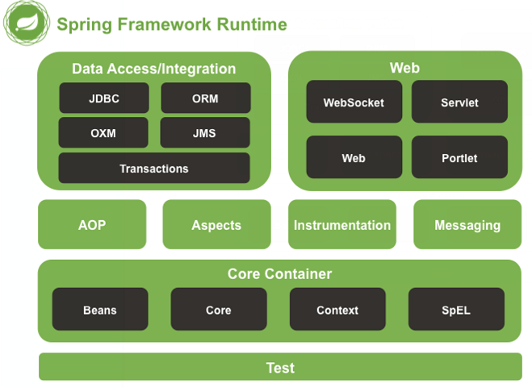

# Spring框架_01

## 一、spring的概述

#### 1.1、Spring 是什么？

```shell
Spring 是分层的 Java SE/EE 应用 full-stack 轻量级开源框架,以 IoC(Inverse Of Control: 反转控制)和 AOP(Aspect Oriented Programming:面向切面编程)为内核,提供了展现层 Spring MVC 和持久层 Spring JDBC 以及业务层事务管理等众多的企业级应用技术,还能整合开源世界众多 著名的第三方框架和类库,逐渐成为使用最多的 Java EE 企业应用开源框架。
```

#### 1.2、Spring 的发展历程

```shell
- 1997 年 IBM 提出了 EJB 的思想
- 1998 年,SUN 制定开发标准规范 EJB1.0 1999 年,EJB1.1 发布
- 2001 年,EJB2.0 发布
- 2003 年,EJB2.1 发布
- 2006 年,EJB3.0 发布
    Rod Johnson(spring之父)
        Expert One-to-One J2EE Design and Development(2002) 阐述了 J2EE 使用 EJB 开发设计的优点及解决方案
        Expert One-to-One J2EE Development without EJB(2004) 阐述了 J2EE 开发不使用 EJB 的解决方式(Spring 雏形)
        
- 2017年9月份发布了spring的最新版本spring 5.0通用版(GA)
```

#### 1.3、Spring 的优势

```properties
1. 方便解耦,简化开发:通过 Spring 提供的 IoC 容器,可以将对象间的依赖关系交由 Spring 进行控制,避免硬编码所造 成的过度程序耦合。用户也不必再为单例模式类、属性文件解析等这些很底层的需求编写代码,可 以更专注于上层的应用。
2. AOP 编程的支持:通过 Spring 的 AOP 功能,方便进行面向切面的编程,许多不容易用传统 OOP 实现的功能可以通过 AOP 轻松应付。
3. 声明式事务的支持:可以将我们从单调烦闷的事务管理代码中解脱出来,通过声明式方式灵活的进行事务的管理, 提高开发效率和质量。
4. 方便程序的测试:可以用非容器依赖的编程方式进行几乎所有的测试工作,测试不再是昂贵的操作,而是随手可 做的事情。
5. 方便集成各种优秀框架:Spring 可以降低各种框架的使用难度,提供了对各种优秀框架(Struts、Hibernate、Hessian、Quartz 等)的直接支持。
6. 降低 JavaEE API 的使用难度:Spring 对 JavaEE API(如 JDBC、JavaMail、远程调用等)进行了薄薄的封装层,使这些 API 的 使用难度大为降低。
7. Java 源码是经典学习范例:Spring 的源代码设计精妙、结构清晰、匠心独用,处处体现着大师对 Java 设计模式灵活运用以 及对 Java 技术的高深造诣。它的源代码无意是 Java 技术的最佳实践的范例。
```

#### 1.4、Spring 的体系结构




## 二、IoC 的概念和作用

### 2.1、程序的耦合和解耦

- #### 什么是程序的耦合?

  程序间的依赖关系。

- #### 依赖的分类：

  1. 类之间的依赖

  2. 方法之间的依赖

- #### 解耦：

  降低程序的耦合。

- #### 实际开发：

  应该做到编译时不依赖，运行时依赖。（不可能完全解耦）

- #### 解耦思路：

  第一步：使用反射来创建对象，避免使用new对象；

  第二步：通过读取配置文件来获取创建对象的权限定类名；


### 2.2、工厂模式解耦

**容器：**即一个Map，在应用加载时,创建一个 Map,用于存放三层对象。

**工厂：**就是负责给我们从容器中获取指定对象的类。这时候我们获取对象的方式发生了改变。

```java
/** 
 * 一个创建Bean对象的工厂
 *
 * Bean：在计算机英语中，有可重用组件的含义。
 * JavaBean：用java语言编写的可重用组件。
 *      javabean >  实体类
 *
 *   它就是创建我们的service和dao对象的。
 *
 *   第一个：需要一个配置文件来配置我们的service和dao
 *           配置的内容：唯一标识=全限定类名（key=value)
 *   第二个：通过读取配置文件中配置的内容，反射创建对象
 *
 *   我的配置文件可以是xml也可以是properties
 */
 public class BeanFactory {
    //定义一个Properties对象
    private static Properties props;

    //定义一个Map,用于存放我们要创建的对象。我们把它称之为容器
    private static Map<String,Object> beans;

    //使用静态代码块为Properties对象赋值
    static {
        try {
            //实例化对象
            props = new Properties();
            //获取properties文件的流对象
            InputStream in = BeanFactory.class.getClassLoader().getResourceAsStream("bean.properties");
            props.load(in);
            //实例化容器
            beans = new HashMap<String,Object>();
            //取出配置文件中所有的Key
            Enumeration keys = props.keys();
            //遍历枚举
            while (keys.hasMoreElements()){
                //取出每个Key
                String key = keys.nextElement().toString();
                //根据key获取value
                String beanPath = props.getProperty(key);
                //反射创建对象
                Object value = Class.forName(beanPath).newInstance();
                //把key和value存入容器中
                beans.put(key,value);
            }
        }catch(Exception e){
            throw new ExceptionInInitializerError("初始化properties失败！");
        }
    }

    /**
     * 根据bean的名称获取对象，单例对象
     * @param beanName
     * @return
     */
    public static Object getBean(String beanName){
        return beans.get(beanName);
    }

    /**
     * 根据Bean的名称获取bean对象
     * @param beanName
     * @return
    public static Object getBean(String beanName){
        Object bean = null;
        try {
            String beanPath = props.getProperty(beanName);
//            System.out.println(beanPath);
            bean = Class.forName(beanPath).newInstance();//每次都会调用默认构造函数创建对象
        }catch (Exception e){
            e.printStackTrace();
        }
        return bean;
    }*/
}
```


### 2.3、控制反转-Inversion Of Control（IoC）

#### 定义：

##### 控制反转：就是把创建对象的权利交给框架，是框架的重要特征，并非面向对象编程的专用术语。它包括依赖注入（Dependency Injection，简称DI）和依赖查找（Dependency lookup）。

#### 作用：

削减计算机程序的耦合(解除我们代码中的依赖关系)。


## 三、使用 spring 的 IOC 解决程序耦合

### 3.1、快速入门

```java

/**
* 获取spring的Ioc核心容器，并根据id获取对象
*
* ApplicationContext的三个常用实现类：
*      ClassPathXmlApplicationContext：它可以加载类路径下的配置文件，要求配置文件必须在类路径下。不在的话，加载不了。(更常用)
*      FileSystemXmlApplicationContext：它可以加载磁盘任意路径下的配置文件(必须有访问权限）
*
*      AnnotationConfigApplicationContext：它是用于读取注解创建容器的，是明天的内容。
*
* 核心容器的两个接口引发出的问题：
*  ApplicationContext:     单例对象适用              实际开发主要：采用此接口
*      它在构建核心容器时，创建对象采取的策略是采用立即加载的方式。也就是说，只要一读取完配置文件马上就创建配置文件中配置的对象。
*
*  BeanFactory:            多例对象使用
*      它在构建核心容器时，创建对象采取的策略是采用延迟加载的方式。也就是说，什么时候根据id获取对象了，什么时候才真正的创建对象。
* @param args
*/
public class Client {
    public static void main(String[] args) {
        ApplicationContext ac = new ClassPathXmlApplicationContext("bean.xml");
        IUserService service  = (IUserService) ac.getBean("userService");
        IUserDao dao = (IUserDao) ac.getBean("userDao");

        System.out.println(service);
        System.out.println(dao);

        // ---------- BeanFactory ------------
        //        Resource resource = new ClassPathResource("bean.xml");
        //        BeanFactory factory = new XmlBeanFactory(resource);
        //        IUserService service = (IUserService) factory.getBean("userServiceImpl");
        //        System.out.println(service);
    }
}
```

- ##### bean.xml

```xml
<?xml version="1.0" encoding="UTF-8"?>
<beans xmlns="http://www.springframework.org/schema/beans"
       xmlns:xsi="http://www.w3.org/2001/XMLSchema-instance"
       xsi:schemaLocation="http://www.springframework.org/schema/beans
        http://www.springframework.org/schema/beans/spring-beans.xsd">

    <bean id="userDao" class="com.eoony.dao.impl.UserDaoImpl"/>
    <bean id="userService" class="com.eoony.service.impl.UserServiceImpl"/>
</beans>
```

- ##### pom.xml : 暂时只需要spring-context依赖

```xml
<dependency>
    <groupId>org.springframework</groupId>
    <artifactId>spring-context</artifactId>
    <version>5.0.2.RELEASE</version>
</dependency>
<!--用spring test替换junit，简化测试-->
<dependency>
    <groupId>org.springframework</groupId>
    <artifactId>spring-test</artifactId>
    <version>5.0.2.RELEASE</version>
</dependency>
```


### 3.2、Spring对bean的管理细节

- #### 创建bean的三种方式

  ```xml
  <!-- 
  第一种方式：使用默认构造函数创建。
      在spring的配置文件中使用bean标签，配以id和class属性之后，且没有其他属性和标签时。
      采用的就是默认构造函数创建bean对象，此时如果类中没有默认构造函数，则对象无法创建。
  -->
  <bean id="accountService" class="com.itheima.service.impl.AccountServiceImpl"/>
  ```

  ```xml
  <!-- 
  第二种方式： 使用普通工厂中的方法创建对象（使用某个类中的方法创建对象，并存入spring容器）
   -->
  <bean id="instanceFactory" class="com.itheima.factory.InstanceFactory"/>
  <bean id="accountService" factory-bean="instanceFactory" factory-method="getAccountService"/>
  ```

  ```xml
  <!-- 
  第三种方式：使用工厂中的静态方法创建对象（使用某个类中的静态方法创建对象，并存入spring容器)
   -->
  <bean id="accountService" class="com.itheima.factory.StaticFactory" factory-method="getAccountService"/>
     
  ```

- #### bean对象的作用范围

  ```xml
  <!-- 
  bean的作用范围调整----bean标签的scope属性：
      作用：用于指定bean的作用范围
      取值： 常用的就是单例的和多例的
        singleton：单例的（默认值）
        prototype：多例的
        request：作用于web应用的请求范围
        session：作用于web应用的会话范围
        global-session:作用于集群环境的会话范围（全局会话范围),当不是集群环境时,它就是session
     -->
  <bean id="accountService" class="com.itheima.service.impl.AccountServiceImpl" scope="prototype">
  ```

- #### bean对象的生命周期

  ```xml
  <!-- bean对象的生命周期
              单例对象
                  出生：当容器创建时对象出生
                  活着：只要容器还在，对象一直活着
                  死亡：容器销毁，对象消亡
                  总结：单例对象的生命周期和容器相同
              多例对象
                  出生：当我们使用对象时spring框架为我们创建
                  活着：对象只要是在使用过程中就一直活着。
                  死亡：当对象长时间不用，且没有别的对象引用时，由Java的垃圾回收器回收(spring不管死亡)
       -->
  <bean id="accountService" class="com.itheima.service.impl.AccountServiceImpl"
        scope="prototype" init-method="init" destroy-method="destroy"/>
  ```


## 四、依赖注入（Dependency Injection）

- ##### IOC的作用：降低程序间的耦合（依赖关系）;

- ##### 依赖关系的管理：以后都交给spring来维护;

- ##### 在当前类需要用到其他类的对象，由spring为我们提供，我们只需要在配置文件中说明;

#### 依赖注入: 依赖关系的维护。

### 4.1、依赖注入：

- #### 能注入的数据：有三类

  - 基本类型和String
  - 其他bean类型（在配置文件中或者注解配置过的bean）
  - 复杂类型/集合类型

- #### 注入的方式：有三种

  - ##### 第一种：使用构造函数提供 (参数不太变化时，使用该注入)

    ```xml
    <!--构造函数注入：
            使用的标签:constructor-arg
            标签出现的位置：bean标签的内部
            标签中的属性
                type：用于指定要注入的数据的数据类型，该数据类型也是构造函数中某个或某些参数的类型
                index：用于指定要注入的数据给构造函数中指定索引位置的参数赋值。索引的位置是从0开始
                name：用于指定给构造函数中指定名称的参数赋值          (常用的)
      ================以上三个用于指定给构造函数中哪个参数赋值==========================
    
             value：用于提供基本类型和String类型的数据
             ref：用于指定其他的bean类型数据。它指的就是在spring的Ioc核心容器中出现过的bean对象
    
            优势：
                在获取bean对象时，注入数据是必须的操作，否则对象无法创建成功。
            弊端：
                改变了bean对象的实例化方式，使我们在创建对象时，如果用不到这些数据，也必须提供。
        -->
    <bean id="accountService" class="com.itheima.service.impl.AccountServiceImpl">
        <constructor-arg name="name" value="泰斯特"></constructor-arg>
        <constructor-arg name="age" value="18"></constructor-arg>
        <constructor-arg name="birthday" ref="now"></constructor-arg>
    </bean>
    
    <!-- 配置一个日期对象 -->
    <bean id="now" class="java.util.Date"></bean>
    ```

  - ##### 第二种：使用set方法提供 (参数可变化，常用注入方式)

    ```xml
    <!-- 
    set方法注入                更常用的方式
        涉及的标签：property
        出现的位置：bean标签的内部
        标签的属性
           name：用于指定注入时所调用的set方法名称
           value：用于提供基本类型和String类型的数据
           ref：用于指定其他的bean类型数据。它指的就是在spring的Ioc核心容器中出现过的bean对象
    
           优势：
                创建对象时没有明确的限制，可以直接使用默认构造函数
           弊端：
                如果有某个成员必须有值，则获取对象是有可能set方法没有执行(无法保证一定有值！)。
        -->
    <bean id="accountService2" class="com.itheima.service.impl.AccountServiceImpl2">
        <property name="name" value="TEST" ></property>
        <property name="age" value="21"></property>
        <property name="birthday" ref="now"></property>
    </bean>
    ```

  - ##### 第三种：使用注解提供（参考下一节）

- #### 补充：复杂类型/集合类型注入

  ```xml
  <!-- 复杂类型的注入/集合类型的注入
          用于给List结构集合注入的标签：
              list array set(三个标签可以互换)
          用于个Map结构集合注入的标签:
              map  props(这两个也可以互换)
          结构相同，标签可以互换
      -->
  <bean id="accountService3" class="com.itheima.service.impl.AccountServiceImpl3">
      <property name="myStrs">
          <set>
              <value>AAA</value>
              <value>BBB</value>
              <value>CCC</value>
          </set>
      </property>
  
      <property name="myList">
          <array>
              <value>AAA</value>
              <value>BBB</value>
              <value>CCC</value>
          </array>
      </property>
  
      <property name="mySet">
          <list>
              <value>AAA</value>
              <value>BBB</value>
              <value>CCC</value>
          </list>
      </property>
  
      <property name="myMap">
          <props>
              <prop key="testC">ccc</prop>
              <prop key="testD">ddd</prop>
          </props>
      </property>
  
      <property name="myProps">
          <map>
              <entry key="testA" value="aaa"></entry>
              <entry key="testB">
                  <value>BBB</value>
              </entry>
          </map>
      </property>
  </bean>
  ```


## 五、其他特殊说明

### 5.1、spring 在web.xml 里面如何使用多个xml配置文件

##### 注意：分隔是用','，不是‘;’。

```xml
<context-param>
    <param-name>contextConfigLocation</param-name>
    <param-value>
        classpath*:conf/spring/applicationContext_core*.xml,
        classpath*:conf/spring/applicationContext_dict*.xml,
        classpath*:conf/spring/applicationContext_hibernate.xml,
        classpath*:conf/spring/applicationContext_staff*.xml,
        classpath*:conf/spring/applicationContext_security.xml
        classpath*:conf/spring/applicationContext_modules*.xml
        classpath*:conf/spring/applicationContext_cti*.xml
        classpath*:conf/spring/applicationContext_apm*.xml
    </param-value>
</context-param> 

<context-param>
    <param-name>contextConfigLocation</param-name>
    <param-value>classpath:spring/spring-security.xml,classpath:spring/applicationContext*.xml</param-value>
</context-param>
<listener>
    <listener-class>
        org.springframework.web.context.ContextLoaderListener
    </listener-class>
</listener>
```


