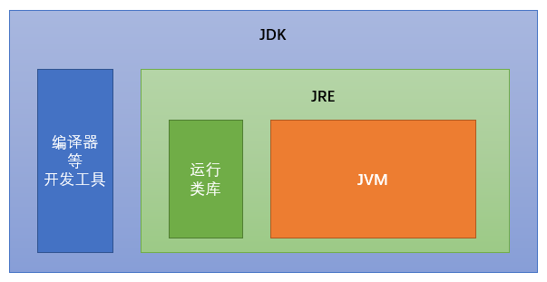

# 前言概述、常量、变量
## 1. 前言概述
### 1. 什么是JAVA语言？
Java 语言是美国Sun公司（Stanford University Network）,在1995年推出的高级编程语言。

扩展： Java是编译语言，同时又是解释型语言；[编译型语言vs脚本语言.md](编译型语言vs脚本语言.md)

### 2. Java 语言的发展时
1995 Sun 发布1.0  
1997 1.1  
1998 1.2  
2000 1.3  
2002 1.4  
2004 5.0 （版本改动大，提供中文API，之后只有英文）  
2006 6.0  
2009 甲骨文Oracle收购Sun  
2011 7.0  
2014 8.0（大版本改动）  
2017 9.0 （增加一些新特性）

## 二、计算机基础
### 1. 二进制
二进制、即bit(位、又称比特)，是计算机存储信息的最小单位；    
字节(Byte、简称B)：是存储器的计量基本单位；8个二进制称为1字节；  

1B=8bit;  
1KB=1024B;  
1MB=1024KB;  
1GB=1024MB;  
1TB=1024GB;

扩展：  

1.	为什么计算机的所有数据都采用二进制表示？因为所需的物理元件简单，电路设计容易，运算简单，工作可靠且逻辑性强；
2.	为什么我们的光纤宽带100Mbs，下载速度大概15MB/s，这就是B与b之间的换算造成；
3.	二进制 八进制 十进制 十六进制切换！(API:Integer,不是Math)


	```
	int num = 189;
        System.out.println(Integer.toBinaryString(num)); // 2
        System.out.println(Integer.toHexString(num)); // 16
        System.out.println(Integer.toOctalString(num));  // 8
      ==============================
      10111101
		bd
		275  
	```

	
### 2.Windows操作命令


## 三、Java语言的开发环境搭建
### 1.Java虚拟机——JVM
1.	JVM(Java Virtual Machine):Java虚拟机，简称JVM。是运行所有Java程序的假想计算机，是Java程序的运行环境，是Java最具吸引力的特性之一。
2.	有了JVM，Java程序实现了跨平台。只要在相应系统下安装对应的JVM，即可运行我们的Java程序；（注意是对应系统下的虚拟机，也就是JVM并不跨平台！）

### 2. JRE 和 JDK
1. JDK(Java Development Kit):包含了Java SDK（Software Development Kit）＋ Java运行环境（JRE），即编写java程序时程序员使用的软件；
2. JRE（Java Runtime Environment）:运行Java程序的用户使用的软件，即java程序运行的环境；

	**当我们在安装JDK时，会发现安装目录下会有两个JRE包，在Java/jdk1.8.0目录下的JRE为专有环境，是本地开发程序运行时的环境，而java/jre1.8为公用环境，其他java程序运行时，调用这个运行环境。两个jre是不同的，不能随便替换，同时平时java自动更新就是更新公用的jre，并非更新jdk，因为更新公用jre，当其他java 程序运行就不会出现异常。若要更新jdk，只能到官方下载，重新安装咯。**

	三者关系图：

	


### 3. 环境配置
1. JAVA_HOME＝C:\Program Files\Java\jdk1.7.0，这个替代品，简化Classpath,Path的配置；

2. Classpath=.;%JAVA_HOME%\lib\dt.jar;%JAVA_HOME%\lib\tools.jar; 目的是为了程序能找到相应的“.class”文件；  
**前面"."代表在当前目录下执行java程序，这也是Linux安全机制引起的。记住编译时可以不在当前目录下，但是运行一定要.class的当前目录**；  

	特别说明：JDK 6.0之后就不再需要配置Classpath。之前JDK版本需要配置，是因为dt.jar/tools.jar两个包在Javac时用到，但是没有放到Classpath	路径下面，若不配置，万一用到这两个包下API，就会出现NoClassFoundException!

3. Path＝%JAVA_HOME%\bin;%JAVA_HOME%\jre\bin;配置这个，主要是为在任何目录下能使用bin目录中的命令，如java命令；jre\bin一般可以不用配置，其中的命令使用也少；

Windows下配置：同上，JAVA_HOME，Classpath是新建变量，Path将跟随到系统path变量即可；
Linux／Unix配置：打开终端－－>open ~/.bashrc或者~/.bash_profile(在这个文件下配置环境变量)－－> 

	JAVA_HOME=/Library/Java/JavaVirtualMachines/jdk1.8.0_25.jdk/Contents/Home
	PATH=$PATH:$JAVA_HOME/bin
	CLASSPATH=.:$JAVA_HOME/lib/dt.jar:$JAVA_HOME/lib/tools.jar
	export JAVA_HOME
	export PATH
	export CLASSPATH




