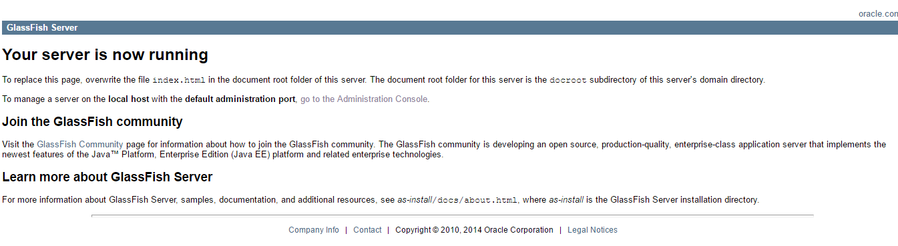
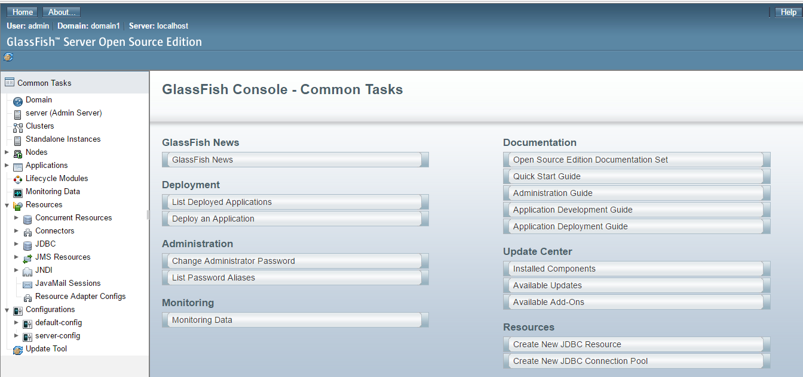
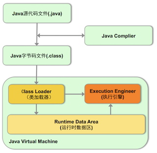
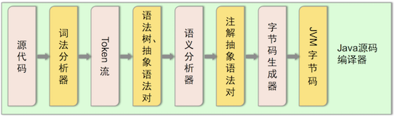
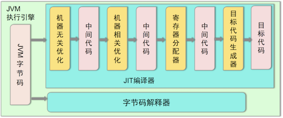

# 第一节 前言概述、常量、变量
## 1. 前言概述
### 1. 什么是JAVA语言？
Java 语言是美国Sun公司（Stanford University Network）,在1995年推出的高级编程语言。

扩展： Java是编译语言，同时又是解释型语言；[编译型语言vs脚本语言.md](./attach/F_编译型语言vs脚本语言.md)

### 2. Java 语言的发展时
1995 Sun 发布1.0  
1997 1.1  
1998 1.2  
2000 1.3  
2002 1.4  
2004 5.0 （版本改动大，提供中文API，之后只有英文）  
2006 6.0  
2009 甲骨文Oracle收购Sun  
2011 7.0  
2014 8.0（大版本改动）  
2017 9.0 （增加一些新特性）

## 二、计算机基础
### 1. 二进制
二进制、即bit(位、又称比特)，是计算机存储信息的最小单位；    
字节(Byte、简称B)：是存储器的计量基本单位；8个二进制称为1字节；  

1B=8bit;  
1KB=1024B;  
1MB=1024KB;  
1GB=1024MB;  
1TB=1024GB;

注意：  
1. 汉字占用2个字节；  
2. 字(word)：由若干个字节组成1个字。字长：代表计算机一次能处理数据的最大位数，是计算机性能的一个重要标志；（跟Java 语言没有太多关联，计算机本身的基础知识！）如我们用的电脑64位系统，就是电脑的字长为64bit；


扩展：  

1. 为什么计算机的所有数据都采用二进制表示？因为所需的物理元件简单，电路设计容易，运算简单，工作可靠且逻辑性强；
2. 为什么我们的光纤宽带100Mbs，下载速度大概15MB/s，这就是B与b之间的换算造成；15*8=120~100
3. 二进制 八进制 十进制 十六进制切换！(API:Integer,不是Math)


```java
int num = 189;
System.out.println(Integer.toBinaryString(num)); // 2
System.out.println(Integer.toHexString(num)); // 16
System.out.println(Integer.toOctalString(num));  // 8
==============================
10111101
bd
275  
```

### 2.Windows操作命令(略)


## 三、Java语言的开发环境搭建
### 3.1、Java虚拟机——JVM
1.	JVM(Java Virtual Machine):Java虚拟机，简称JVM。是运行所有Java程序的假想计算机，是Java程序的运行环境，是Java最具吸引力的特性之一。
	.	有了JVM，Java程序实现了跨平台。只要在相应系统下安装对应的JVM，即可运行我们的Java程序；（注意是对应系统下的虚拟机，也就是JVM并不跨平台！）

### 3.2. JRE 和 JDK
1. JDK(Java Development Kit):包含了Java SDK（Software Development Kit）＋ Java运行环境（JRE），即编写java程序时程序员使用的软件；
2. JRE（Java Runtime Environment）:运行Java程序的用户使用的软件，即java程序运行的环境；

	**当我们在安装JDK时，会发现安装目录下会有两个JRE包，在Java/jdk1.8.0目录下的JRE为专有环境，是本地开发程序运行时的环境，而java/jre1.8为公用环境，其他java程序运行时，调用这个运行环境。两个jre是不同的，不能随便替换，同时平时java自动更新就是更新公用的jre，并非更新jdk，因为更新公用jre，当其他java 程序运行就不会出现异常。若要更新jdk，只能到官方下载，重新安装咯。**

	三者关系图：

	


### 3.3、 环境配置
1. JAVA_HOME＝C:\Program Files\Java\jdk1.7.0，这个替代品，简化Classpath,Path的配置；

2. Classpath=.;%JAVA_HOME%\lib\dt.jar;%JAVA_HOME%\lib\tools.jar; 目的是为了程序能找到相应的“.class”文件；  (前面"."代表在当前目录下执行java程序，这也是Linux安全机制引起的。记住编译时可以不在当前目录下，但是运行一定要.class的当前目录)；  

  **特别说明：JDK 6.0之后就不再需要配置Classpath。之前JDK版本需要配置，是因为dt.jar/tools.jar两个包在Javac时用到，但是没有放到Classpath	路径下面，若不配置，万一用到这两个包下API，就会出现NoClassFoundException!**

3. Path＝%JAVA_HOME%\bin;%JAVA_HOME%\jre\bin;配置这个，主要是为在任何目录下能使用bin目录中的命令，如java命令；jre\bin一般可以不用配置，其中的命令使用也少；

> java 9 开始不需要jre\bin，因为jre是外部程序运行的环境，而jdk包含了jre，完全可以替代。故，安装jdk可以省去安装jre。环境变量配置%JAVA_HOME%\bin即可。
>
> ##### 但是要注意，安装jdk后，系统会自动添加一个C:\ProgramData\Oracle\Java\javapath\java.exe的系统变量。这个变量一定要在%JAVA_HOME%\bin之后，否则会出错：
>
> ```shell
> $ could not find java.dll
> ```


   Windows下配置：同上，JAVA_HOME，Classpath是新建变量，Path将跟随到系统path变量即可；
   Linux／Unix配置：打开终端－－>open ~/.bashrc或者~/.bash_profile(在这个文件下配置环境变量)－－> 

   ```shell
# 1.系统管理员身份 ，需要输入系统密码
sudo -i 
# 2. 直接在终端的vim窗口编辑。 同Linux。 或者也可以open -e /.bash_profile 命名，mac系统特有的。
vim ～/.bash_profile 
# 3. 然后输入下面的内容即可：
JAVA_HOME=/Library/Java/JavaVirtualMachines/jdk1.8.0_25.jdk/Contents/Home
PATH=$PATH:$JAVA_HOME/bin
CLASSPATH=.:$JAVA_HOME/lib/dt.jar:$JAVA_HOME/lib/tools.jar
export JAVA_HOME
export PATH
export CLASSPATH
# 4. 最后需要将修改内容刷新进内存
source ~/.bash_profile 
   ```

### 3.4、JDK、JavaSE、JavaEE、JavaME

JDK： Java Development Kit包含了Java SDK（Software Development Kit）＋ Java运行环境（JRE），即编写java程序时程序员使用的软件；

#### Java 三个版本：只是概念的区别，其他没有啥意思

 JavaSE：JAVA Standard Edition 是Java的标准版，用于标准应用开发，也是Java基础版本，相当于就是jdk；

JavaEE：JAVA Enterprise Edition，是Java的一种企业版，用于企业级应用开发。

JavaME：Java  Micro Edition，是Java的微型版，用于手机、PDA等嵌入式开发，针对手机开发，还有专门的J2ME Wireless Toolkit免费套件提供。

##### 那么，JavaEE SDK vs Java JDK？又是啥区别，为啥oracle官网有这两个？难道是基本开发用JDK，而当企业级开发时就要用JavaEE SDK?

然而，我们做项目几乎没有见到JavaEE SDK的影子。

##### 1）Java EE SDK

从官网下载JavaEE SDK，然后安装。你可以用localhost:8080链接看到默认的登录界面：(若端口被占用，看是不是Tomcat开启了！)



##### 2）GlassFish 应用服务器管理界面：localhost:4848



##### 3）Java EE 8 SDK 介绍

```shell
Java EE 8 Platform SDK
A free integrated development kit used to build, test, and deploy Java EE 8 applications.

It includes :
 - GlassFish Open Source Edition 5.0
 - Java EE 8 Code Samples
 - Java EE 8 API Documentation
 - Java EE 8 Tutorial  
 - Your First Cup: An Introduction to the Java EE Platform
 
 What's New in Java EE 8

Java EE 8 continues to improve API and programming models needed for today's applications and adds features requested by our world-wide community. This release modernizes support for many industry standards and continues simplification of enterprise ready APIs. Enhancements include:
Java Servlet 4.0 API with HTTP/2 support
Enhanced JSON support including a new JSON binding API
A new REST Reactive Client API
Asynchronous CDI Events
A new portable Security API
Server-Sent Events support (Client & Server-side)
Support for Java SE 8 new capabilities (e.g. Date & Time API, Streams API, annotations enhancements)
Java EE 8 builds on Java EE 7. The following JSRs are new or updated in Java EE 8:
JSR 366 – Java EE 8 Platform
JSR 365 – Contexts and Dependency Injection (CDI) 2.0
JSR 367 – The Java API for JSON Binding (JSON-B) 1.0
JSR 369 – Java Servlet 4.0
JSR 370 – Java API for RESTful Web Services (JAX-RS) 2.1
JSR 372 – JavaServer Faces (JSF) 2.3
JSR 374 – Java API for JSON Processing (JSON-P)1.1
JSR 375 – Java EE Security API 1.0
JSR 380 – Bean Validation 2.0
JSR 250 – Common Annotations 1.3
JSR 338 – Java Persistence 2.2
JSR 356 – Java API for WebSocket 1.1
JSR 919 – JavaMail 1.6
```

从官网信息看出，JavaEE SDK 包含了：

1、一个GlassFish server应用服务器，即用来发布java web项目的，如同tomcat。

2、java EE 8 代码例子、api文档、指导教程（在JDK上的额外扩充api，如servlet，jsp，Contexts and Dependency Injection等）

#### 总结：Javaee SDK / JDK

##### 1） SDK：其实是每个软件程序都存在的工具包，包括的软件的应用，使用介绍，api详解等信息；

那么，javaee SDK即是javaee平台开发的对应工具包，是一款免费的用于编译、测试、发布java ee的整合软件。 

由于平时我们都是轻量级 java web开发，使用了其他第三方工具包替代了javaee 企业级项目的开发。如tomcat 用于发布web应用，测试直接使用了IDE集成junit搞定等；从而导致大家javaee sdk的疏忽。 从狭义面讲，javaee sdk 即为jdk；

##### 2） JDK：Java development toolkit，相当于是Java的库函数，是编译、运行java程序的工具包，是一切java应用程序的基础,所有java应用程序是构建在这个之上的。

它是一组API，也可以说是一些java Class。JDK作为Java开发工具包，主要用于构建在Java平台上运行的应用程序、Applet 和组件等，目前ORACLE官网介绍看，JDK属于SDK的一部分，JDK和SDK一起发行的。

> #### Tomcat  vs GlassFish 区别
>
> GlassFish 支持 EJB， 即她是EJB容器，又是web容器；
>
> Tomcat 仅仅只是web容器；
>
> ##### 题外EJB: 
>
> EJB ： 是sun的JavaEE服务器端组件模型，设计目标与核心应用是部署分布式应用程序。简单来说就是把已经编写好的程序（即：类）打包放在服务器上执行。凭借java跨平台的优势，用EJB技术部署的分布式系统可以不限于特定的平台。EJB (Enterprise JavaBean是J2EE(javaEE)的一部分，定义了一个用于开发基于组件的企业多重应用程序的标准。其特点包括网络服务中心支持和核心开发工具(SDK)。 在J2EE里，Enterprise Java Beans(EJB)称为Java 企业Bean，是Java的核心代码，分别是会话Bean（Session Bean），实体Bean（Entity Bean）和消息驱动Bean（MessageDriven Bean）。在EJB3.0推出以后，实体Bean被单独分了出来，形成了新的规范JPA。
>
> EJB实际上是SUN的J2EE中的一套规范,并且规定了一系列的API用来实现把EJB概念转换成EJB产品。
>
> 由于EJB2.0的复杂性，在Spring和Hibernate [1]  等轻量级框架出现后，大量的用户转向应用轻量级框架; 但是EJB3.0开始已在做大量简化工作；


## 四、入门程序、关键词、标示符

### 4.1、 入门程序：  
1. 编译javac：是指我们编写Java源文件翻译成JVM认识的class文件，在这个过程，编译器会检查我们的程序是否有错误，有错误就提示出来。这里是编译错误，运行时错误是不能提示的！

2. 运行java：指将class文件，交给JVM去运行；

  **扩展：Java程序执行过程图解**   
  
  
  

3. main(String[] args)方法说明：程序的入口，JVM是从main方法开始执行；  
  其中String[] args的意义：

4. 注释：  
  // 单行注释     
  ／＊ ＊／多行注释   
  ／＊＊  ＊／ 文档注释（包、作者、时间、是否遗弃等）

### 4.2、关键字
1. 关键字全部都是**小写字母**，在编码过程当中会特殊颜色显示；
2. 关键字很多，如class、interface、byte、short、int、long、float、double、 char、boolean、void、true、false、null......； 

### 4.3、标识符
1. 标识符，是指在程序中，定义自己定义的内容，如类名、方法名、变量名等；
2. 命名规则：硬性要求  
  (1)可以包含英文字母(区分大小写)，数字，$和（_下划线）；  
  (2)不能以数字开头；  
  (3)不能是关键字；  
3. 命名规范：软件建议
  (1)类名：使用大驼峰
  (2)方法名／变量名：使用小驼峰
  (3)常量：全部大写，英文词之间用_下划线分开；
4. 详细参考：[阿里巴巴Java开发手册](./attach/F1-阿里巴巴Java开发手册.pdf)


## 五、常量，变量，数据类型

### 5.1、 常量
1. 在JAVA程序中固定不变的数据，称为常量；
2. 分类：整型常量、浮点型常量、字符常量、字符串常量、布尔常量、空常量（null，表示什么都没有）

### 5.2、 数据类型

#####1、分类：基本类型、引用类型

#####2、基本数据类型：4类8种

整型：byte,short,int,long  
浮点类型：float,double  
字符类型：char  
布尔类型：boolean 

| 简单类型 | boolean | byte | char | short | int | long | float | double | void |
|:------:|:--------:|:----:|:----:|:-----:|:---:|:----:|:-----:|:------:|:----:|
| 二进制位数 | 1     | 8     | 16   | 16    | 32  | 64   | 32    | 64     | －－ |
| 封装类型 | Boolean | Byte | Character | Short | Integer | Long| Float| Double|Void |

注意事项：

a. 字符串不是基本类型，而是引用类型。

b. 浮点型可能只是一个近似值，并非精确的值。

c. 数据范围与字节数不一定相关，例如float数据范围比long更加广泛，但是float是4字节，long是8字节。

d. 浮点数当中默认类型是double。如果一定要使用float类型，需要加上一个后缀F；

e. 如果是整数，默认为int类型，如果一定要使用long类型，需要加上一个后缀L。推荐使用大写字母后缀。.

f.  byte:-128~127(-2^7~2^7-1)；	

#####3、引用数据类型：字符串、类、接口、数组


### 5.3、 变量

语法格式： 数据类型 变量名称  如 int x;  赋值形式随意，可以重复赋值；

注意事项：   
1. 在同一个大括号范围内，变量的名不可以重复；  
2. 变量不赋值，不能使用；（在后续的类中，看似变量没有赋值，其实都会默认赋值；若不是在类中，而是在main方法中，那就必须自己赋值，否则无法使用）；
  

思考：int i=10 vs int i;i=10; 有什么区别？ 没区别；


