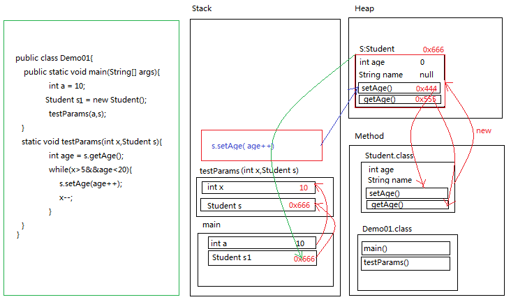

# 第三节 流程控制语句、方法、数组（内存分析）

## 一、流程控制语句

### 1、 顺序结构：

执行顺序，按编写顺序，从上往下执行到底！

### 2、 条件结构： 

需要判断语句 ：3类，如下

#### 2.1、 if...else 语句（3种）

1. 单if语句：if(...){ ....}
2. 第二种：if(...) { .... } else {....}
3. 第三种：if(...) {....} else if(... ){...} ..... else if(...){ ...} else{ .... }  // if开头，else结尾，中间多个else if  

#### 2.2 、三元运算：a>b?c=a:c=b

#### 2.3 、switch语句：

**格式如下**

```java
switch(表达式){
	case 常量值1:
	...
		break;
	case 常量值1:
	...
		break;
	case 常量值1:
	...
		break;
	...
	default:
	...
		break;
}
```

**【注意事项，以下3点】**

1. 表达式：在JDK 7之前，类型只有byte、short、char、int、integer、enum枚举类型，而JDK 7后，支持String类型 ; (是否支持任意类型？？No) 
2. case的穿透：没有遇到break，在case之间的代码都会执行；
3. case 后的常量值不能重复；


### 3、循环结构

需要循环语句：2类，如下

#### 3.1、while语句 

有分2种形式：

1. while(布尔表达式){ ....}：**先判断条件，只有条件满足才执行循环体;**
2. do{.....} while(布尔表达式)：**先执行循环体，再判断条件，条件满足，再继续执行循环体; **

#### 3.2、for语句

也有2种形式：

1. for(初始化表达式: 布尔表达式: 步进表达式){ ...}

2. for-each对象循环表达式：for(Entry e: entryList){ ... } ：**在后面的集合遍历有特别重要意义**

   Java 1.5开始，引入了另一种形式的for循环、即增加for循环。借助这种形式的for循环，现在可以用一种更简单地方式来进行遍历的工作 。

   **注意：增强for循环，遍历对象一定是Collection集合和数组；**


#### 3.3、while 与 for区别

1. 若步进变量要在循环体外使用，最好使用while;

2. 若循环有限次数，最好使用for语句；

3. for 的步进变量的作用域在循环体内，循环结束时，该变量在内存被释放。用于优化内存。

4. 无限循环如下：

   ```
   while(true){ // while 的无限循环
       ....
       if(...) break;
   }
   -------------------
   for(;;){ // for 的无限循环
         ....
       if(...) break; // 当满足条件，可以通过break语句跳出无限循环语句；
   }
   ----------------------
   for(int i=0;i<10;){ // 也是个死循环
         ....
       if(...) break; 
   }
   ```

#### 3.4、 break 、continue

1. break: 跳出本层循环，不能跳多层循环！
2. continue:  马上执行下一次循环，continue后面的语句不再执行；

#### 3.5 循环嵌套

```
for(int i=0;i<10;i++){ // 循环嵌套
    for(j=i;j<100;j++){
        ...
    }
}
```


## 二、IDEA工具

IDE: Integrated Development Environment 集成开发环境；

免费的IDE: Eclipse

收费的IDE: IntelliJ IDEA (使用人最多，开发神器)

IntelliJ IDEA 安装使用（略）


##三、方法 （函数）

###3.1、 概述

1. 定义：在类中的具有特定功能的一段独立小程序，称为方法、又称函数；

2. **方法三要素：返回值类型，方法名称，参数列表；**

   有了三要素，我们就能轻易创建一个方法；

   ```java
   public void setName(String name) {
        this.name = name;
        return; // 其实每个方法都有返回值，只不过放回void这个return一般省略；
   }
   ```

3. 方法的三种调用：

   (1)单独调用; (2)打印调用; (3)赋值调用

   ```java
   public class Outer {
       private int num;
       
       public static void main(String[] args){
           Outer outer = new Outer();
           outer.setNum(100); // 1. 单独调用
           System.out.println("num="+outer.getNum());// 2. 打印调用
           int c = Outer.getNum(); // 3. 赋值调用
       }
       
       public void setNum(int num){
           this.num = num;
       }
       
   	public int getNum(){
           return num;
   	}
   }
   ```


###3.2、方法参数

1. **形参 与 实参**: 

   > 形参：方法中标示的参数；
   >
   > 实参：在方法调用时，传入的参数值，来替换形参的值；
   >
   > - **特别重点：引用传递 vs 值传递**
   >
   > 数据类型分为：基本数据类型、引用数据类型；基本类型的变量保存数值本身、引用变量保存引用值（即指向堆空间的地址）；
   >
   > 1. **值传递：方法调用时，实参将它的值传递给对应的形参。此时，内存存在两个相等的基本类型。若方法中对形参执行处理，并不会影响到实际参数的值；（如同下图，实参int a,形参int x之间值传递）**
   > 2. **引用传递：方法调用时，实参的引用被传递给方法中相应的形式参数，即方法接收的是原始值的内存地址，在方法中，形参实参内容相同，但是方法处理形参会影响实参的值；(如下图，实参Student s1,形参Student s之间的引用传递)**
   >
   > 
   >
   > 结论：
   >
   > 1) 形参为基本类型时，对形参操作不会影响实参；
   >
   > 2) 形参为引用类型时，对形参操作会影响实参；
   >
   > 3) String，Integer，Double等类型的特殊处理，可以理解为值传递；(String是不可变的，肯定是值传递)

2. 方法的参数类型：可以是任意类型，即不管是基本类型、还是引用类型；所以，数组、集合、自定义类对象等都可以作为参数；

3. 方法参数数量：可以任意多个。但实际开发过程，一般不要给一个方法传入太多参数；若实在有那么多参数，可以使用**(可变参数)**替换；

4. **方法的可变参数使用：**(其内涵相当于一个数组参数)

   > 在**JDK1.5**之后，如果我们定义一个方法需要接受多个参数，并且多个参数类型一致，我们可以对其简化成如下格式：

   ```java
   	修饰符 返回值类型 方法名(参数类型... 形参名){  }
   
    	//可变参数写法
       public static int getSum(int... arr) {
           int sum = 0;
           for (int a : arr) {
               sum += a;
           }
           return sum;
       }
   ```

   > 使用可变参数注意事项：1.方法参数只能只有一个可变参数；2.可变参数一定在参数末位；


### 3.3、方法的返回值

1. 方法的返回值类型：任意类型；

2. 返回值的个数：只能是一个或没有（没有代表：不是`return null;` 而相当于`return;`，一般都省略了。在特定情况下，需要显性输出。下面这段就显性不能省略！）

   ```java
   	public static void sort(int arr[],int low,int height){
           if(arr==null || height > arr.length-1 || low <0 || low > height) return ; 
           int result = QuickSort.partition(arr,low,height);
           sort(arr,low,result-1);
           sort(arr,result+1,height);
       }
   ```

3. 若要同时返回多个值，怎么办？那必须用引用对象封装返回，如数组、集合、自定义类等，反正返回值最多只能有一个；


###3.4、JDK 8新增的Lambda表达式：(参考后面统一特性讲解)

```java
	public static void main(String[] args) {
		List<String> names = Arrays.asList("peter","anna","mike","xenia");
		// Collections.sort(names); // 默认按首字母升序

        // ====== old =======
        Collections.sort(names, new Comparator<String>() {
            @Override
            public int compare(String o1, String o2) {
                // 按首字母降序排列
                byte[] ch1 = o1.getBytes();
                byte[] ch2 = o2.getBytes();
                return ch2[0]-ch1[0];
            }
        });
      
		// ===== new Lambda=====
        Collections.sort(names,(a,b)->b.compareTo(a)); // 降序
        Collections.sort(names,(a,b)->a.compareTo(b)); // 升序
        
		// <!-- new api 简化代码 -->
		//Collections.sort(names,Comparator.reverseOrder());// 反序排列
       // Collections.sort(names,Comparator.naturalOrder()); // 升序排列
        // names.sort(Comparator.reverseOrder()); // 精简版
	}
```


###3.5、方法的重载 vs  方法重写（覆盖重写）

overload 重载          override 覆盖重写

#### 3.5.1、方法重载：

定义：在同一类中，允许一个以上的同名方法，只要他们的参数列表不同即可，【**与修饰符和返回值类型无关**】；

【方法重载相关因素】

1. 参数个数不同；
2. 参数的数据类型不同；
3. 参数多类型顺序不同；

【方法重载无关因素】

1. 参数名称无关；
2. 与方法的返回值无关；
3. 与方法的修饰符无关；

#### 3.5.2、方法的覆盖重写（主要体现父子类方法重写）

定义：子类继承符类方法，对方法重写；


## 四、数组

### 4.1、数组的定义

【一维数组：3种方式】：

1. 方式一：元素类型[] 数组名=new 元素类型[元素个数或数组长度]；

   ``` java
   int[] arr=new int[5]；int arra[] = new int[5];// 数组长度不能null,可以为0；
   -----
   int[] arr = null;
   arr = new int[5];// 这个是成立的
   ```

   【**注意‘ [] ‘可在实例对象前，也可在后，但是强烈要求在前** 】

2. 方式二：元素类型[] 数组名=new 元素类型[]{元素， 元素， ...}；

   ```
   int[] arr=new int[]{3,5,1,7}；
   ```

3. 方式三：元素类型[] 数组名= {元素， 元素， ...}

   ```
   int[] arr = {3,5,7,1};
   ```

【扩展：二位数组】

1. 方式一：

   ``` java
   int[][] arr = new int[3][2];//一维数组：arr[0]、arr[1]、arr[2]
   arr[1][0] = 78;  
   ```

2. 方式二：

   ```java
   int[][] arr = new int[3][];// 二维数组中有 3 个一维数组；每个一维数组都是默认初始值 null
   arr[0] = new int[3], arr[1] = new int[1], arr[2] = new int[2];
   ```

   【数组在初始化确认length之后，就不能再改变了！即无法扩容，这是数组的缺陷！】


### 4.2、JVM内存分析

1.  从第一节图，运行时数据取，就是JVM的内存；JVM要运行程序，必须对内存进行空间的分配和管理；

2.  JVM内存划分：[JVM内存详解](attach/F_java内存管理机制.md)

   ```
   1) 栈(Stack): 存放的都是方法中的局部变量，方法的运行一定要在栈当中；
          局部变量：方法的参数，或者时方法{}内部的变量；
          作用域：一旦超出作用域，立即从栈内存当中消失；
          
   2）堆(Heap)：凡是new出来的东西，都在堆当中。
   	堆内存里面的东西都有一个地址值：16进制；
   	堆内存里面的数据，都有默认值，规则：
   		若是整数  默认为0
   		若是浮点数  默认0.0
   		若是字符   默认为'\u0000'
   		若是布尔   默认为false
   		若是引用类型  默认为null
   
   3）方法区(Method Area)：存储.class相关信息，包含方法的信息；
   4）本地方法栈(Native Method Stack)：与操作系统相关；
   5）寄存器(PC Register)：与CPU相关；
   ```


### 4.3、数组排序方法

1. 快速排序

```java
public class Test{
    public static void main(String[] args){
        int[] arr = {12, 27, 10, 25, 89, 2, 78, 45, 48, 11, 77, 76, 33, 46, 55, 4};
        sort(arr,0,arr.length-1);
        System.out.println(Arrays.toString(arr));
    }
    
 /** 第1步 将数组分成两段，小的放左边，大的数放右边。
// 如何做？先数字k的右往左找，若大于k，height递减；若发现小于k,立马标记，把该数字与k交换；然后，左往右
// 找大于k的，不大于low递增，发现大于。把该数字与k位置数再交换；依次循环，直到height<=low，代表已经把
// 数字分离；
//
// 参数：arr[], low，height;返回值 int partPosition.（可以用方法封装，也可以使用类封装该步骤）
*/
    static class QuickSort{
        public static int partition(int[] arr,int low,int height){
            if(arr==null || height > arr.length-1 || low <0 || low > height) return 0; // 不排序
            int key = arr[low];
            while(low < height){ // 
                while(low < height && arr[height] > key) 
                    height--;
                arr[low] = arr[height];
                while(low < height && arr[low] < key)
                    low++;
                arr[height] = arr[low];
            }
            // 最后不变的位置,即low==height位置，再赋值key
            arr[low] = key;
            // arr[height] = key;
            return low;
        }
    }
    
    /**
    * 第2步，再将两个分段数组，进行同样操作，即递归
    * 参数：arr[],originLow,originHeight;无需返回值
    */
    static void sort(int arr[],int low,int height){
        if(arr==null || height > arr.length-1 || low <0 || low > height) return ; // 不排序
        int result = QuickSort.partition(arr,low,height);
        sort(arr,low,result-1);
        sort(arr,result+1,height);// 特别注意：arr数组进行了排序有变化，int low,height却没有变化！
    }
}
```

**注意事项：**

**方法参数：在调用时传入实参。这时会有两种传递方式！**

**1. 基本数据类型是值传递：对实参没有影响！**

**2. 引用对象是引用传递：对实参有影响！**

why? 基本类型作为实参，只是把值传递给了方法，其一同跟方法进栈操作，当方法调用完后，值也随方法消失！但是，引用对象作实参，实际是把堆的对象跟方法进栈操作，改变的堆内的值，所以会影响引用对象的数据。


2. 插入法

```java
    /**
     * 插入法：将首数字先固定，然后挨个将后边的数字与前面已排列好的数字比较，若没有发现插入点，将比较的数字往下索引放。
     * 直到发现插入点，先将比较数字往下索引放，而自己放大插入点索引中；
     */
    static void insertSort(int[] arr){
        for(int i=1,length=arr.length;i<length;i++){ // 从第2个数字起，找对比
            int temp = arr[i];
            int j;
            for(j=i-1;j>=0 && arr[j] > temp;j--){
//                if(arr[j] <= temp) break; // 发现插入点，就不再比较了
                arr[j+1] = arr[j]; // 要使用temp接替arr[i],因为arr[i]在数组有变化
            }
            if(i != j+1){ // 若temp大于前面所有数,啥事也不干
                arr[j+1] = temp;
            }
        }
    }
```

3. 冒泡法

```java
	/**
     * 冒泡法：先给出个位置，也可以说是冒泡多少次数，然后在数组中依次去冒泡比较两两间数字的大小，小数字
     往上顶
     */
    static void bubbleSort(int[] arr){
        int length = arr.length;
        for(int i=0;i<length-1;i++){
            for(int j=length-1;j>=i+1;j--){
                if(arr[j-1]>arr[j]){
                    int temp = arr[j-1];
                    arr[j-1] = arr[j];
                    arr[j] = temp;
                }
            }
        }
    }
```

4. 选择法

```java
    /**
     *  选择法：固定位置，找出最值排入该位置
     */
    static void selectSort1(int[] arr){
        int length = arr.length;
        for(int i=0;i<length-1;i++){ // 最后一个位置不需要比较
            for(int j=i+1;j<length;j++){
                if(arr[j]<arr[i]){// 升序
                    int temp = arr[j];
                    arr[j] = arr[i];
                    arr[i] = temp;
                }
            }
        }
    }

    /**
     * selectSort1 进行了多次数据交换，产生很多临时变量。现在优化，只交换一次，那就该找出最值的索引，遍历完后，再交换
     */
    static void selectSort2(int[] arr){
        int length = arr.length;
        for(int i=0;i<length-1;i++){
            int index = i;
            for(int j=i+1;j<length;j++){
                if(arr[j]<arr[index]){
                    index = j;
                }
            }
            if(index != i){ // 减少交换次数
                int temp = arr[i];
                arr[i] = arr[index];
                arr[index] = temp;
            }
        }
    }
```


