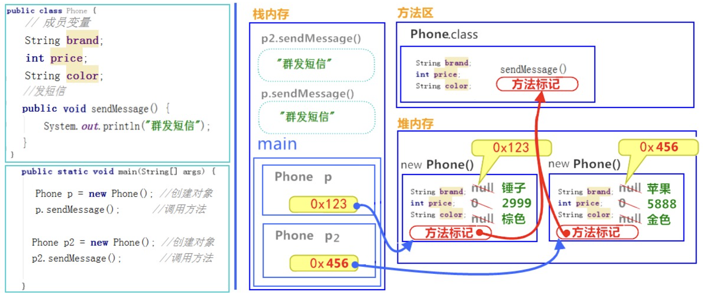

# 第四节 类(抽象类)、封装、继承

## 一、面向对象

**1. 面向对象(Object Oriented Program:OOP) vs 面向过程(Oriented Process Program:OPP).**

1. OPP强调“算法＋数据结构 ＝ 程序”，其中算法放在第一位，数据结构第二位；而OOP却调换了顺序，数据第一位，然后是操作机算法；  
2. OOP复杂问题简单化，如Web浏览器可能需要大约2000过程，若使用OOP设计100个类来均摊，每个类只有10个过程，便于程序bug的发现；  
3. 优点／缺点：  
   OPP：性能比面向对象高，因为类调用时需要实例化，开销比较大，比较消耗资源;比如单片机、嵌入式开发、Linux/Unix等一般采用面向过程开发，性能是最重要的因素。 缺点：没有面向对象易维护、易复用、易扩展；   
   OOP：易维护、易复用、易扩展，由于面向对象有封装、继承、多态性的特性，可以设计出低耦合的系统，使系统更加灵活、更加易于维护 。缺点：性能比面向过程低 ；

**2. OOP的特性（4大），原则（6个）--- 设计模式**

1. 四大特性

> a) 抽象(数据抽象／过程抽象)；
>
> b) 封装；
>
> c) 继承；
>
> d) 多态

2. 六个原则

> 1. 单一功能原则 ： 每个类型（包括接口和抽象）功能要求单一，只负责一件事情。
> 2. 开放封闭原则：一个软件实体应该对扩展开发，对修改关闭。可扩展但是不可更改。核心：用抽象构建框架，用实现类来扩展；
> 3. 替换原则（里氏代换原则）：子类能够替换父类，出现在父类能够出现的任何地方当使用继承时，尽量遵循历史替换原则，尽量不要去重写或者重载父类的方法，以免破坏整个继承体系的 。因为父类在定义或者实现某些方法时，规定了必须遵守的规则和契约。
> 4. 依赖原则：具体依赖抽象，上层依赖下层。核心思想是面向接口编程。两个模块之间依赖的应该是抽象（接口或抽象类）而不是细节。细节（实现类）依赖于抽象。依赖原则基于的事实：相对于实现类的多变性，抽象的东西要稳定得多，基于抽象的构架也比基于实现的架构更加稳定，且扩展性更高；
> 5. 接口分离原则：模块间要通过具体接口分离开，而不是通过类强耦合。例如A类对B类的依赖，可以抽象接口I，B实现I，A类依赖I来实现。但是抽象接口必须功能最小化（与单一功能原则有点不谋而合）；
> 6. 迪米特原则：最小依赖原则，一个类对其他类尽可能少的了解，只与朋友通信。降低耦合；


##二、类 与 对象

1. 什么是类？是一组相关属性和行为的集合。可以看成是一类事物的模版，使用事物的属性和行为特征来描述该类事物；
2. 什么是对象？是一类事物的具体体现。也就是类的一个实例，必然具备该类事物的属性和行为；
3. 类与对象的关系：
   - 类是对一类事物的描述，是抽象的；
   - 对象是一类事物的实例，是具体的；
   - 类是对象的模版，对象是类的实体；

### 2.1、类的定义格式（关键字：class)

```java
public class ClassName{
    // 成员变量
    // 成员方法
    // 嵌套类(非静态内部类，也是个成员)
    
    // 类变量 static修饰
    // 类方法（静态方法） static修饰
    // 嵌套接口 （必定是类的属性）
    // 静态内部类
    
    // 构造方法
}
```

> **思考：类怎么没有定义主函数？main()主函数，代表一个程序的入口，被JVM调用的！若写了main，表示该类可以独立运行，若不需要独立运行，则不需要定义main方法；**

###2.2、对象的使用格式

1. 创建对象：new关键字

```java
类名 对象名 ＝ new 类名()；
```

2. 对象只能调用类中的成员属性：

```java
对象名.成员变量；
对象名.成员方法；
对象名.new 内部类()；
```

### 2.3、对象调用的内存图



> 引用类型作为参数，传递的是地址值；

### 2.4、成员变量、局部变量、类变量

```java
public class Demo01 {
    
    private int a0; // 成员变量
    
    public static int num = 100; // 类变量
    
    public void method(){
        
        int a = 10; // 局部变量
    }
 ｝  
```

- 在类中的位置不同
  - 成员变量／类变量：类中，方法外
  - 局部变量：方法中或者方法声明上(形参)
- 作用域不同
  - 成员变量：类中
  - 局部变量：方法中
  - 类变量：类外也可以使用，看修饰词觉得范围
- 初始化值不同
  - 成员变量／类变量：可以赋值，也可以不赋值即为默认值；
  - 局部变量：没有默认值。必须先赋值，再使用；
- 在内存的位置不同
  - 成员变量：堆内存
  - 局部变量：栈内存
  - 类变量：方法区，因为有static修饰，在类加载时，就完成加载，并在方法区的静态区开辟地址；
- 生命周期不同
  - 成员变量：随着对象创建存在，对象消失而消失；
  - 局部变量：随方法调用存在，随方法调用完毕而消失；
  - 类变量：类加载时就存在，随类加载信息消失而消失，生命周期最长，一般是跟谁程序的生命周期；


### 2.5、构造方法

前面讲了，对象通过`new 类名()` 创建！那么具体是个啥？其实就是**构造方法**！

构造方法作用：可以通过new 类的构造方法，来创建其一个具体的实例对象！

1. 特点：

   - 构造方法名称固定，与类名称相同；
   - 不需要定义返回值类型；
   - 也没有具体的返回值；

2. 与普通方法区别：

   - 写法不同，普通方法需要明确的三要素，构造方法则不然，参考上面特点；
   - 运行上不同：构造方法对象一建立就运行，普通方法则需要对象调用才运行；
   - 运行次数不同：构造方法只运行一次，普通方法可以被对象多次调用；

3. 注意事项：

   - 如果不提供构造方法，系统会默认一个无参构造方法；
   - 如果你提供了构造方法，系统将不再提供无参构造方法；
   - 构造方法可以重载，既可以定义参数，也可以不定义参数；

4. **思考：一个类中的方法名能否与构造方法名相同？**

   可以相同，why?因为构造方法，并非一个真正意义上的方法，对象无法去调用构造方法。所以即便构造方法可以重载，也不会与普通方法重载存在意义上的冲突！

   构造方法作用主要是通过关键词 new 指令，传递给JVM，告知JVM要创建一个对象。JVM这时就回预加载相关类的信息，最后调用构造方法，完成对象的创建！

   但是，最好不要同名类名，这样就会出现一些莫名其妙的无法找到构造器的错误，这里是要加倍注意的。

### 2.6、类的成员方法、类方法

参与后面（第五节 static部分）


##三、封装

### 3.1、概述

面向对象编程语言是对客观世界的模拟，客观世界里成员变量都是隐藏在对象内部的，外界无法直接操作呵修改，这就是所谓的封装。

封装定义：就是把具体细节步骤隐藏起来，通过指定方式去访问相应的数据；

封装的作用：

- 防止类的代码呵数据被其他类随意访问或修改；
- 适当的封装可以让代码更容易理解和维护，并加强代码的安全性；

### 3.2、典型封装操作 －－private 关键字

1.使用private 关键字来修饰成员变量；

2.对需要访问的成员变量，提供对应的一对`getXXX`方法、`setXXX`方法；

```java
public class Student {

    private String name;
    private int age;

    public Student() {
    }

    public String getName() {
        return name;
    }

    public void setName(String name) {
        this.name = name;
    }
 }   
```


###3.3、封装的优化 －－ this关键字

```java
public class Student {
    private String name;
    private int age;

    public Student(String name) {
    	name = name; // 在这里就分不清name是哪个
        System.out.println(this.name);// 这个就知道是成员变量
    }

    public String getName() {
        return name;
    }

    public void setName(String name) {
        this.name = name;
    }
 } 
```

- this关键字可以解决成员变量与局部变量同名的问题！

- this的含义：代表所在类的当前对象的引用(地址值)，即对象自己的引用；也就是方法被哪个对象调用，this就代表哪个对象；

- this的使用格式：this.成员变量名；


##四、继承

###4.1、 定义

什么是继承？就是子类继承父类的属性和行为，使得子类对象具体与父类相同的属性和行为。子类可以直接访问父类中的非私有的属性和行为；

为什么要有继承？

- 提高代码的复用性；
- 类与类之间产生关系，是多态的前提；

###4.2、继承的格式 －－ extends关键字

```java
class Fu{
    ...
}

class Zi extends Fu{
    ...
}
```

### 4.3、继承后的特点1 －－成员变量

1. **父子类成员变量不重名：**访问没有影响；

2. **父子类成员变量重名：**访问有影响，此时子类若要访问父类重名的成员变量，就得使用`super.成员变量`;

3. 父子类访问成员变量规则：

   - 直接调用：通过子类对象访问成员变量

     规则：等号左边是谁，就优先使用谁的成员变量，没有就往上父类找；

   - 间接调用：通过方法调用访问成员变量

     规则：方法在谁那里就优先使用谁的成员变量；

   ```java
   public static void main(String[] args) {
           Student s = new Student();
           Person p  = new Student();
           
           System.out.println(s.age); // 子类没有，往上找，父类age＝35
           System.out.println(s.name); // Son，左边引用为Student，优先Student成员
           System.out.println(p.age); // 35
           System.out.println(p.name); // Father，左边引用为Person，优先Person成员
        //   System.out.println(p.grade);// 不强转，编译不通过 134
       
       	System.out.println(s.getName()); // Father，方法在Person中，使用Person的成员
       }
       
   public class Person {
       String name = "Father";
       int age = 35;
   
       public String getName() {
           return name;
       }
   
       public int getAge() {
           return age;
       }
   
       public void fuMethod(){
           name = "Lily";
       }
   }
   
   public class Student extends Person{
   
       public String name = "Son";
   
       public int grade = 134;
   
       public int getGrade() {
           return grade;
       }
   
       public void ziMethod(){
           name = "Marry";
       }
   }
   ```

4. 局部变量、子类成员变量、父类成员变量（成员变量重名说明）

   ```java
   public class Student extends Person{
   
       public String name = "Son";
   
       public void print(){
           String name = "Ming ming";
           System.out.println(name); //
           System.out.println(this.name);
           System.out.println(super.name);
       }
   }
   ```


### 4.4、继承后的特点2 －－成员方法

1. **父子类成员方法不重名：**访问没有影响；

2. **父子类成员方法重名：**－－ **［方法重写］**

3. 访问规则：右边子类对象内有该方法就优先调用子类的，没有再往上父类找；

   ```java
   public static void main(String[] args) {
           Student s = new Student();
           Person p  = new Student();
           p.method(); // zi method 
   }
   
   public class Person {
       public void method(){
           System.out.println("fu method");
       }
   }
   
   public class Student extends Person{
       @Override
       public void method() {
           System.out.println("zi method");
       }
   }
   ```

> 注意事项：不论成员变量、还是成员方法，若没有，则往父类去找对应的项，绝不会往子类去找对应项；

### 4.5、方法重写 －－ 覆盖重写 override

- 方法重写：子类中出现与父类一模一样的方法（返回值类型、方法名和参数列表都相同），会出现覆盖效果；

注意事项：

1. 依据定义，方法覆盖，返回值类型、方法名和参数列表要一模一样。特别提醒，重写时，方法上面可以附上override标注，用来检查该方法是否属于重写。但是，并不是没有override标注，就不是重写，只要符合要求，也是方法重写；

2. 子类方法返回值范围一定要小于等于父类方法的返回值范围；

3. 子类方法的权限保证大于等于父类方法的权限，修饰词（public>protected>default>private）；

   ```java
   public class Person {
       public void method(){
           System.out.println("fu method");
       }
   }
   
   public class Student extends Person{
       @Override
       protected void method() { // error
           System.out.println("zi method");
       }
   }
   ```

### 4.6、继承后的特点3 －－ 构造方法

特点：

1. 构造方法与类名一致，所以子类是无法继承父类构造方法的；

2. 构造方法的作用是初始化成员变量的。所以子类的初始化过程中，必须先执行父类的初始化动作。

3. **子类可以通过`super(...)`调用父类构造方法，并且必须在子类构造方法第一行，不能一个子类构造多次调用`super(...)`；**

4. super构造无参数，一般可以省略不写，编译器后会自动补上；

   ```java
   public static void main(String[] args){
       new Student();
   }
   
   public class Student extends Person{
   
       public Student(){
    		//super(); 被隐藏了
           System.out.println("Student gou"); 
       }
   }
   
   public class Person {
       public Person(){
           System.out.println("Person gou");
       }
   }
   ----------
   Person gou
   Student gou
   ```


### 4.7、super 和 this 关键字总结

super用来访问父类内容，3种方式调用：

- super.属性：访问父类的成员变量；
- super.方法：访问父类中的成员方法；
- super(...)：访问父类的构造方法，只能子类构造方法访问！

this用来访问本类内容，也有如同上面3种方式调用：

- this.属性
- this.方法
- this(...)：也必须在本类的构造方法第1行且1次，不能循环调用，不能与super(...)同时调用；

**[super this内存图解]**


### 4.8、继承的3个特点

- java只支持单继承，不支持多继承；
- java支持多层继承（继承体系）
- 父类只能一个，子类可以多个；


## 五、抽象类

### 5.1、概述

为什么要抽象类？比如动物要吃东西，但是不知道具体吃什么东西！那么这个吃东西动物就是一个抽象的。我们把每一方法主体的方法称为抽象方法。**在java中，包含抽象方法的类就是抽象类**。

抽象类格式： 必须要有关键字abstract

```java
abstract class ClassName{
    ...
}
```

###5.2、抽象类的使用

1. 不能直接创建抽象类的对象，必须有一个子类继承；
2. 子类必须实现（覆盖重写）所有的抽象方法，并去除abstract关键字；
3. 最后，创建子类对象调用；
4. 注意两点：**a) 抽象类可以有构造方法；b) 抽象类可以没有抽象方法，但是有抽象方法的一定是抽象类；**