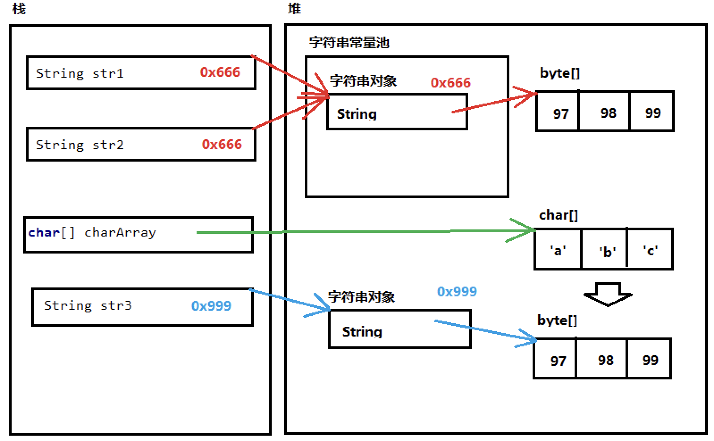

# 第四节 Java 常用API（一）

## 一、Scanner类

一个可以解析基本类型和字符的简单文本扫描器。

```
Scanner sr = new Scanner(System.in); // 参数，指用户能够从System.in读取一个数据、即键盘录入；
int i = sr.nextInt(); // 输入一个int
String s = sr.next(); // 输入一个字符串
```

## 二、Random类

1. 定义：是一个随机数生成器；

   ```
   Random r = new Random();
   int i = r.nextInt(); // 随机任意大于等于0的整型数
   int j = r.nextInt(10); // [0,10)范围数字，注意：1.左闭右开;2.bound范围不能小于0； 
   ```

2. 练习使用

   ```java
   1) 生成一个m~n之间范围的随机数([m,n]之间数字)
   	public static int generateNum(int m,int n){
           int minNum = 0;
           int maxNum = 0;
           if(m<n){
               minNum = m;
               maxNum = n;
           }else{
               minNum = n;
               maxNum = m;
           }
   
           Random r = new Random(); //
           return r.nextInt(maxNum-minNum+1)+minNum;
       }
   
   2) 猜猜数小游戏(综合Scanner)
          int num = generateNum(1,100);
           System.out.println("随机数："+num);
           System.out.println("请猜猜数字：");
           int time = 1; // guess beyond 10 ,failed
           do{
               int guessNum = sr.nextInt();
               if(guessNum == num){
                   System.out.println("Great!you are right!");
                   break;
               }else if(guessNum < num){
                   System.out.println("Bad luck! smaller!");
               }else{
                   System.out.println("On,no! bigger!");
               }
               time++;
           }while(time<=10);
   
          if(time > 10){
              System.out.println("you are failed,time is over!");
          }
   ```


## 三、ArrayList集合类

1. 为什么要引入ArrayList？前面讲了数组，一旦创建，其大小长度就固定不变，使用很不方便，所以出现ArrayList替代，增加了数组的扩展能力！

2. 注意事项：

   1）附带泛型必须是引用类型，那基本类型必须转化成其对应的包装类；

   2）JDK 5.0之前是没有泛型，所以需要强转。因为默认的对象都是Object对象；但是在5.0后，增加了泛型概念，所以编译时会发现有泛型，编译会自动添加强转。

   ```java
   ArrayList<String> list1 = new ArrayList<>(); // 7.0 之后的写法
   ArrayList<String> list2 = new ArrayList<String>(); // 5.0 之后的写法，右侧也需要把泛型添加
   ArrayList list3 = new ArrayList(); // 5.0 之前的写法
   String str = (String)list3.get(0); // 需要手动添加强转，在5.0之后就不需要
   ```


## 四、String类

### 4.1、概述

1. java.lang.String类代表字符串。（lang是系统的默认包，所以不需要手动进行导入包；）

2. 类String包括了用于检查各个字符串的方法，如比较字符串，搜索字符串，提取字符串以及创建具有翻译为大写或小写的所有字符的字符串的副本...


### 4.2、特点

1. 字符串不变：字符串的值在创建后不能被更改；

   ```
   String s1= "abc";
   s1 = s1+"d";  //这一过程，内存会有“abc”，“abcd”两个对象，s1只是指向变化而已；
   ```

2. String对象是不可变，它们可以被共享；

   ```
   String s1 = "abc";
   String s2 = "abc";
   // 内存只有一个“abc”对象被创建，同时被s1和s2共享；
   ```

3. "abc"等效于char[] data= {'a','b','c'}

   ```
   String str ＝ “abc”;
   相当于：
   char[] data = {'a','b','c'};
   String str = new String(data);
   // String 底层是靠byte[]数组实现的；
   ```


### 4.3、构造方法（3+1）

```java
1. public String(); 
String str = new String(); // 无参数，是一个“”对象，连空格也没有；
Sting str = new String("abc");

2. public String(cahr[] value);
char[] data = {'a','b','c'};
String str2 = new String(data);

3. public String(byte[] btyes);
byte[] bytes = {97,98,99};
String str3 = new String(bytes)

4.String str4 = "abc"; // 直接赋值
```

**注意：1. 只要是字符串，就一定是对象；2. 第4种构造，没有通过new，其实是编译器会自动添加的；**


### 4.4、字符串常量池

```
String s1 = "abc";
String s2 = "abc";
String s3= new String("abc");

System.out.println(s1==s2);
System.out.println(s1==s3);
System.out.println(s2==s3);
---------------
true
false
false
```

1. Java 7.0开始，字符串常量池分配在堆(Heap)当中。s1,s2都是指向字符串常量池中的对象，所以地址值相等；
2. 而 s3 是用new关键字创建的，那这个对象就不在字符串常量池当中，所以地址值不相等；

参考内存分析：




## 五、Arrays类

1. java.util.Arrays：此类包含了操作数组的各种方法，比如排序和搜索等；其内部都是静态方法，使用简单；

2. 方法：

   ```
   1. public static void toString(int[] arr):返回指定数组内容的字符串表示形式；
   System.out.println(arr); // 这个输出是数组的地址；
   
   2. public static void sort(int[] a):对指定的int数组数字升序排序；
   说明：sort(String[] array)：按首字母升序；sort(Object[] array):排序对象，该对象一定要实现comparable / comparator接口；
   ```

##六、Math类

1. java.lang.Math：此类包含了执行数学运算的方法，如指数，对数，平方根和三角函数等；

2. 记得以下方法：

   ```
   double d1 = Math.abs(-5);// 绝对值为5.0
   
   double d2 = Math.ceil(3.3);// 向上取整 4.0
   
   double d3 = Math.floor(3.3); // 向下取整 3.0
   
   double d4 = Math.round(5.5); // 四舍五入 6.0
   double d5 = Math.round(4.4); // 4.0
   
   Math.PI: 代表近似的圆周率
   ```

