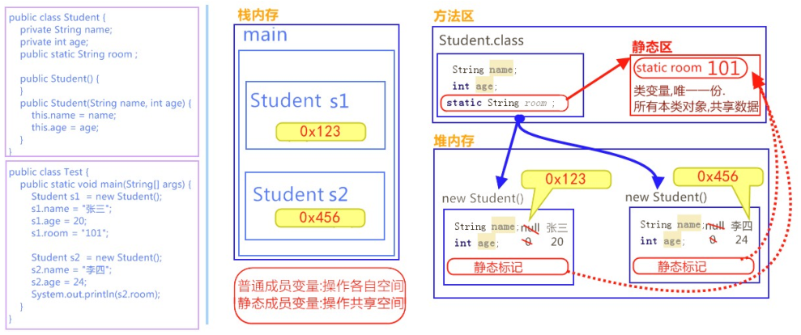

# 第五节 static、接口、多态、final、内部类

##一、static关键字

​	为什么要用static关键字？在开发时，我们遇到类中的变量为所有对象公有。比如，一班的学生，每个学生的姓名/年龄属于对象的私有，而所有对象班级都是101。这时我们将班级升级为类变量，使用`static`关键字修饰。优化内存，同时优化代码。

### 1.1、类变量

定义：当类的成员变量使用`static`修饰，称为**类变量**。

特点：

1. 类的所有对象共享该类变量。
2. 任何对象都可以改变类变量，不创建对象也可以对类变量进行操作；

###1.2、类变量使用

- 调用：**ClassName.类变量**

```java
class Demo{
	public static String name = "JavaEE";
    public static void main(String[] args){
        System.out.println(Demo.name);
        Demo d = new Demo();
        System.out.println(d.name);
    }
}
```

>也可以使用对象d.name方式调用，但是不推荐，其实际还是类名调用，编译器优化；

### 1.3、类变量与成员变量区别

- 成员变量（实例变量）所属于对象，为对象特有数据。类变量（即静态变量）所属于类，为对象的共享数据。  
- 成员变量存在于堆内存中。静态变量存在于方法区中。  
- 成员变量随着对象创建而存在，随着对象被回收而消失。类变量随着类的加载而存在，随着类的消失而消失。  
- 成员变量只能被对象所调用 。类变量可以被对象调用，也可以被类名调用。  
- 参考内存图解如下：



###1.4、静态方法（类方法）

当`static`修饰成员方法是，该方法成为静态方法，即类方法。

调用格式：`类名.静态方法()`

```java
class Demo{
    public static void main(String[] args){
        Demo.show();
    }
    public static void show(){
    	System.out.println("num="+numberOfStudent);
	}
}
```

注意事项：（包含区别成员方法）

- 不管是成员方法，还是成员变量，前面有static修饰，就推荐使用类名访问；

- 静态方法不能【**直接**】访问普通成员变量或成员方法，只能直接访问静态成员。反之，普通成员方法可以直接访问类任意成员；

- 静态方法中，不能使用this/super关键字。成员方法则都可以；

- 静态方法是不可以被子类继承的：

  1 没有super关键字吗，哪来的继承；

  2 静态方法是在静态公共区，难道还得继承静态公共区，其实静态公共区是共享，无需继承也不能继承；

  3 父类静态公共区的方法，能不给子类用，若不是private就可以分享给子类；

### 1.5、静态代码块

```java
class ClassName{
    static{
        .....
    }
}
```

上面就是一个静态代码块，其作用：给类变量进行一次性赋值！

- **为什么需要静态代码来进行一次性初始化赋值？ 就是统一作用，避免赋值杂乱，代码不易维护！同时静态代码有自己的作用域，即{}之内，我们也可以在这里添加一些统一初始化处理代码**

```java
	static {
		value = 23;
	}
	private static int value = 0;
	
	public static void main(String[] args) {
		System.out.println(value);
	}
----------
	0
     
     private static int value = 0;
     static {
		value = 23;
	}
	public static void main(String[] args) {
		System.out.println(value);
	}
--------------
    23
```

> 从上面代码得出结论:
>
> 1. 静态变量加载 比static代码块要快；
> 2. 初始化赋值速度是一样的，谁在后，值就是谁；


## 二、接口 －－ interface

### 2.1、概述

**接口**，是Java语言中一种引用类型，是方法的集合。类的内部封装了成员变量，构造方法和成员方法，那么接口的内部主要就是**封装了方法**。

JDK7及之前，只有抽象方法；JDK8增加了默认方法和静态方法；JDK9还新增了private方法；

接口的定义，与类相似。但使用的关键字为**`interface`**。它同样会被编译成.class文件，但一定要明确它并不是类，而是另一种引用数据类型；

> 前面也提过，引用数据类型：数组，类（包含特殊的：字符串String类，基本类型的包装类），接口。


### 2.2、定义格式

```java
public interface 接口名称{
    // 1.抽象方法
    /*public abstract*/ void method1();//public abstract前缀可省略 
    
    // 2.默认方法
    /*public*/ default void method2(){ // public 前缀可省略 
        ....// 具体实现
    }
    
    // 3.静态方法
    /*public*/ static void method3(){ // public 前缀可省略 
        ....// 具体实现
    }
    
    // 4.私有方法(包括私有静态方法)
    private void method4(){
        ...// 具体实现
    }
}
```


### 2.3、接口的多实现

在继承体系中，一个类只能继承一个父类。而对于接口而言，**一个类可以实现多个接口，称为接口的多实现**。

```java
class Zi extends Fu implements 接口1，接口2，接口3....{
    // 必须实现接口中的抽象方法
    // 必须重写重名的默认方法，不重名可选重写
    // 静态方法：不可选重写，只可自己定义，自定义重名也无所谓；
}
```

1. JDK 8新增默认方法：主要目的是扩展接口功能。

   因为有些情况，默认方法能适应大部分对象，对于小部分对象重写即可，没有必要每个对象类写重复代码；以前可能使用抽象类解决此问题！也会增加类的数目，何必要如此！故，优化给接口增加默认方法；

   至于静态方法，同理，相当于不必重写的共享方法；

2. JDK 9 新增private方法，是为了简化JDK 8的方法代码而来的；

3. **优先级的问题：**同时继承一个父类，实现若干接口，会存在父类中的方法与接口方法重名，这时调用谁？？？

   答案：未重写调用父类重名方法；若重写了，那就用自己的！


### 2.4、接口间的多继承（了解）

### 2.5、其它特点

- 接口中，无法定义变量，但可以有常量，其值不可以改变，默认使用public static final修饰；
- - **这点我们开发使用的常量类Constant，正好可以定义为接口，省去public static final修饰；**
- 接口中，没有构造方法，不能创建对象；
- 接口中，没有静态代码块；

### 2.6、抽象类 VS 接口

1. 抽象类：一般用于描述一个体系单元，将一组共性内容进行抽取，特点：可以在类中定义抽象内容让子类实现，可以定义非抽象内容让子类直接使用。它里面定义的都是一些体系中的基本内容。

2. 接口：一般用于定义对象的扩展功能，是在继承之外还需这个对象具备的一些功能。

3. 抽象类和接口的共性：都是不断向上抽取的结果。

4. 抽象类和接口的区别：

   - 抽象类只能被继承，而且只能单继承。接口需要被实现，而且可以多实现。

   - 抽象类中可以定义非抽象方法，也可以没有，子类可以直接继承使用。JDK7及以前接口中只能有抽象方法，需要子类去实现，JDK 8扩展更多功能；

   - 抽象类使用的是  is_a 关系。接口使用的 like_a 关系。

   - 抽象类的成员修饰符可以自定义。接口中的成员修饰符是固定的。全都是public的。

在开发之前，先定义规则，A和B分别开发，A负责实现这个规则，B负责使用这个规则。至于A是如何对规则具体实现的，B是不需要知道的。这样这个接口的出现就降低了A和B直接耦合性。


## 三、多态

