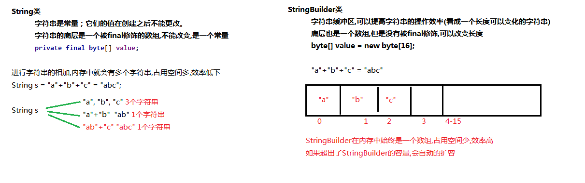

# 第七节 Java常用API（二）

## 一、Object类

### 1.1 概述

`java.lang.Object`类是Java语言中的根类，即所有类的父类。它中描述的所有方法子类都可以使用。在对象实例化的时候，最终找的父类就是Object。

如果一个类没有特别指定父类，	那么默认则继承自Object类。例如：

```java
public class MyClass /*extends Object*/ {
  	// ...
}
```

根据JDK源代码及Object类的API文档，Object类当中包含的方法有11个。今天主要了解下面3个

- `public String toString()`：返回该对象的字符串表示。

- `public boolean equals(Object obj)`：指示其他某个对象是否与此对象“相等”。

- `public native int hashCode();`底层本地方法，一个计算hashcode的方法；


###1.2、== （vs） equal 区别：

1. == 比较值是否相等，基本类型之间判断，若是对象引用则判断他们是否指向同一对象，即对象在内存中的地址。因为引用类型的变量就是内存的地址；

2. equals:这个方法是由Object类继承下来的，对于原始的，类同“==”功能，但是，我们一般情况下，都会重写equals来达到自己的目标要求，如String,基本类型的包装类，Date等都重写了equals方法，所以才有上面的结果 true；同样，下面也如此：

   ```
   String str1 = new String("hello");
   String str2 = new String("hello");
   System.out.println(str1.equals(str2));
   ===========answer============
   true
   ```

3. 用IntelliJ IDEA 自动添加equals方法，快捷键（Alt+Enter）,Mac(Ctrl+Enter)

   ```java
   @Override
       public boolean equals(Object o) {
           if (this == o) return true;
           // 系统用getClass判断是否是同类
           if (o == null || getClass() != o.getClass()) return false;
           Student student = (Student) o;
           return age == student.age &&
                   Objects.equals(name, student.name);
       }
   
       @Override
       public int hashCode() {
           return Objects.hash(name, age);
       }
   ```

**详解参考：[hashcode与equals详解](./attach/F_hashcode_与_equals详解.md)**


###1.3、Objects类

在刚才IDEA自动重写equals代码中，使用到了`java.util.Objects`类，那么这个类是什么呢？

在**JDK7**添加了一个Objects工具类，它提供了一些方法来操作对象，它由一些静态的实用方法组成，这些方法是null-save（空指针安全的）或null-tolerant（容忍空指针的），用于计算对象的hashcode、返回对象的字符串表示形式、比较两个对象。

在比较两个对象的时候，Object的equals方法容易抛出空指针异常，而Objects类中的equals方法就优化了这个问题。方法如下：

- `public static boolean equals(Object a, Object b)`:判断两个对象是否相等。

我们可以查看一下源码，学习一下：

```java
public static boolean equals(Object a, Object b) {  
    return (a == b) || (a != null && a.equals(b));  
}
```


## 二、日期时间类

### 2.1、Date类

1. 概述： java.util.Date类，表示特定的瞬间，精确到毫秒；

   ```java
   // 1. public Date(): 创建日期对象，把当前的时间
   System.out.println(new Date()); // Tue Jan 16 14:37:35 CST 2018
   
   // 2. public Date(long date): 创建日期对象，把当前的毫秒值转成日期对象
   System.out.println(new Date(0L)); // Thu Jan 01 08:00:00 CST 1970
   ```

   > tips: 由于我们处于东八区，所以我们的基准时间为1970年1月1日8时0分0秒。

2. 常用方法：

   ```
   public long getTime() 把日期对象转换成对应的时间毫秒值；
   ```

### 2.2、DateFormat类

`java.text.DateFormat` 是日期/时间格式化子类的抽象类，我们通过这个类可以帮我们完成日期和文本之间的转换,也就是可以在Date对象与String对象之间进行来回转换。

两个作用：

- **格式化**：按照指定的格式，从Date对象转换为String对象。

  ```
  public String format(Date date) : 将Date对象格式化为字符串。
  ```

- **解析**：按照指定的格式，从String对象转换为Date对象。

  ```
  public Date parse(String source) : 将字符串解析为Date对象。
  ```

#### 构造方法

由于DateFormat为抽象类，不能直接使用，所以需要常用的子类`java.text.SimpleDateFormat`。这个类需要一个模式（格式）来指定格式化或解析的标准。构造方法为：

- `public SimpleDateFormat(String pattern)`：用给定的模式和默认语言环境的日期格式符号构造SimpleDateFormat。

  参数pattern是一个字符串，代表日期时间的自定义格式。

#### 格式规则

常用的格式规则为：

| 标识字母（区分大小写） | 含义 |
| ---------------------- | ---- |
| y                      | 年   |
| M                      | 月   |
| d                      | 日   |
| H                      | 时   |
| m                      | 分   |
| s                      | 秒   |

> 备注：更详细的格式规则，可以参考SimpleDateFormat类的API文档0。

```java
	// 1. format方法
	public static void main(String[] args) {
        Date date = new Date();
        // 创建日期格式化对象,在获取格式化对象时可以指定风格
        DateFormat df = new SimpleDateFormat("yyyy年MM月dd日");
        String str = df.format(date);
        System.out.println(str); // 2008年1月23日
    }

	// 2. parse方法
	public static void main(String[] args) throws ParseException {
        DateFormat df = new SimpleDateFormat("yyyy年MM月dd日");
        String str = "2018年12月11日";
        Date date = df.parse(str);
        System.out.println(date); // Tue Dec 11 00:00:00 CST 2018
    }
```

> 思考题：  输出格式时间  30/May/2017:12:44:58
>
> ```java
> Date date = new Date();
> DateFormat df = new SimpleDateFormat("dd/MM/yyyy:HH:mm:ss");
> System.out.println(df.format(date)); // 05/11/2018:14:46:08 (月份还是数字，如何转化？)
> -----------------------------------------------
> 
>     
>     
>     
> ```


###2.4、Calendar类

####概念

`java.util.Calendar`是日历类，在Date之后出现的，替换掉了许多Date的方法。该类将所有可能用到的时间信息封装为静态成员变量，方便获取。日历类就是方便获取各个时间属性的。

#### 获取方式

Calendar为抽象类，由于语言敏感性，Calendar类在创建对象时并非直接创建，而是通过静态方法创建，返回子类对象，如下：

```
public static Calendar getInstance()：// 使用默认时区和语言环境获得一个日历
```

####常用方法

- `public int get(int field)`：返回给定日历字段的值。
- `public void set(int field, int value)`：将给定的日历字段设置为给定值。
- `public abstract void add(int field, int amount)`：根据日历的规则，为给定的日历字段添加或减去指定的时间量。
- `public Date getTime()`：返回一个表示此Calendar时间值（从历元到现在的毫秒偏移量）的Date对象。

Calendar类中提供很多成员常量，代表给定的日历字段：

| 字段值       | 含义                                  |
| ------------ | ------------------------------------- |
| YEAR         | 年                                    |
| MONTH        | 月（从0开始，可以+1使用）             |
| DAY_OF_MONTH | 月中的天（几号）                      |
| HOUR         | 时（12小时制）                        |
| HOUR_OF_DAY  | 时（24小时制）                        |
| MINUTE       | 分                                    |
| SECOND       | 秒                                    |
| DAY_OF_WEEK  | 周中的天（周几，周日为1，可以-1使用） |


### 2.5、开发中常用的工具包（积累）

[DateUtil工具包](./attach/F_DateUtil.md)


## 三、System类

`java.lang.System`类中提供了大量的静态方法，可以获取与系统相关的信息或系统级操作，在System类的API文档中，常用的方法有：

- `public static long currentTimeMillis()`：返回以毫秒为单位的当前时间。
- `public static void arraycopy(Object src, int srcPos, Object dest, int destPos, int length)`：将数组中指定的数据拷贝到另一个数组中。

```java
  public static void main(String[] args) {
        int[] src = new int[]{1,2,3,4,5};
        int[] dest = new int[]{6,7,8,9,10};
        System.arraycopy( src, 0, dest, 0, 3);
        /*代码运行后：两个数组中的元素发生了变化
         src数组元素[1,2,3,4,5]
         dest数组元素[1,2,3,9,10]
        */
    }
```


##四、StringBuilder类 ／ StringBuffer类

### 4.1、概述

String类在前面说过，创建后就不可改变！但是，平时开发往往需要改变字符串。当然我们可以如下：

```java
String str = "a";
for(int i = 0;i<100;i++){
      str = str + String.valueOf(i);  // 这个每循环一次，就创建一个String对象
}
```

如果对字符串进行拼接操作，每次拼接，都会构建一个新的String对象，既耗时，又浪费空间。这样就很不像话！极大的消耗我们的内存资源，很不科学！此时，引入StringBuilder类可以大大提升程序性能，占用空间少；



###4.2、构造方法

根据StringBuilder的API文档，常用构造方法有2个：

- `public StringBuilder()`：构造一个空的StringBuilder容器。

- `public StringBuilder(String str)`：构造一个StringBuilder容器，并将字符串添加进去。


###4.3、 常用方法

StringBuilder常用的方法有2个：

- `public StringBuilder append(...)`：添加任意类型数据的字符串形式，并返回当前对象自身。
- `public String toString()`：将当前StringBuilder对象转换为String对象。

```java
StringBuilder builder = new StringBuilder();
StringBuilder builder1 = builder.append("HelloWorld!");
System.out.println(builder==builder1); // true, 由于append方法返回this，所以相等

// 链式编程
builder.append("hello").append("world").append(true).append(100);
```

### 4.4、StringBuffer类

1. StringBuilder和StringBuffer类拥有的成员属性以及成员方法基本相同，作用几乎相同！

2. 区别是StringBuffer类的成员方法前面多了一个关键字：synchronized，不用多说，这个关键字是在多线程访问时起到安全保护作用的,也就是说StringBuffer是线程安全的。

### 4.5、考试题

```java
// 1. 
String a = "hello2"; 　　
String b = "hello" + 2; 　　// 字符串常量相加，编译器优化，两者相等
System.out.println((a == b)); // true

// 2. 
String a = "hello2"; 　  
String b = "hello";       
String c = b + 2;       
System.out.println((a == c)); // false

// 3. 
String a = "hello2";   　 
final String b = "hello";       
String c = b + 2;       
System.out.println((a == c)); // true
```


## 五、包装类

### 5.1、概述

Java提供了两个类型系统，基本类型与引用类型，使用基本类型在于效率，然而很多情况，会创建对象使用，因为对象可以做更多的功能，如果想要我们的基本类型像对象一样操作，就可以使用基本类型对应的包装类，如下：

| 基本类型 | 对应的包装类（位于java.lang包中） |
| -------- | --------------------------------- |
| byte     | Byte                              |
| short    | Short                             |
| int      | **Integer**                       |
| long     | Long                              |
| float    | Float                             |
| double   | Double                            |
| char     | **Character**                     |
| boolean  | Boolean                           |

### 5.2、自动装箱 ／ 自动拆箱

JDK 5开始，基本类型与包装类自动装拆箱了！

```java
Integer i = 4; // 自动装箱 相当于 Integer i = Integer.valueOf(i);
i = i + 5; // 自动拆箱，后再自动装箱  分两步 i+5[i.intValue()+5] 
```

### 5.3、基本类型与String相互转换

#####基本类型＝＝> String方式

1. 基本类型 ＋"";
2. String.valueOf(基本类型);
3. 基本类型.toString();

##### String ==>基本类型

使用包装类的静态方法parseXXX(String s);  // s转换后一定是对应包装类型，否则会报错，转型错误

```java
// 代表String ＝ “TRUE/FALSE，false/true”才能转换，否则返回一个false；
public static boolean parseBoolean(String s) { 
        return ((s != null) && s.equalsIgnoreCase("true"));
    }
```

**［注意：Character类不能转化］**


