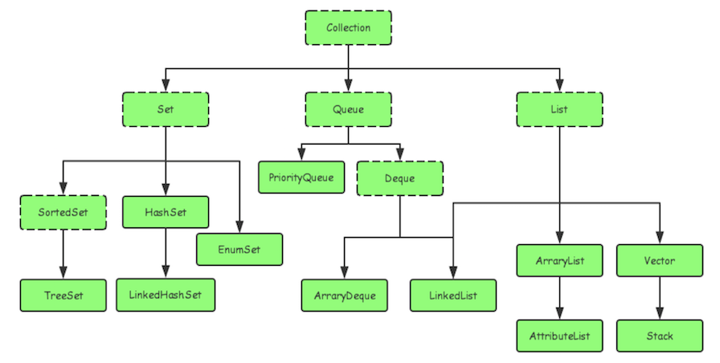
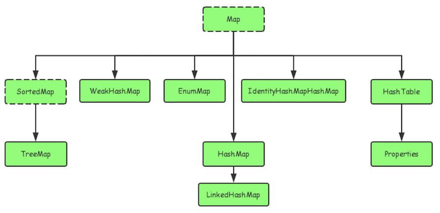
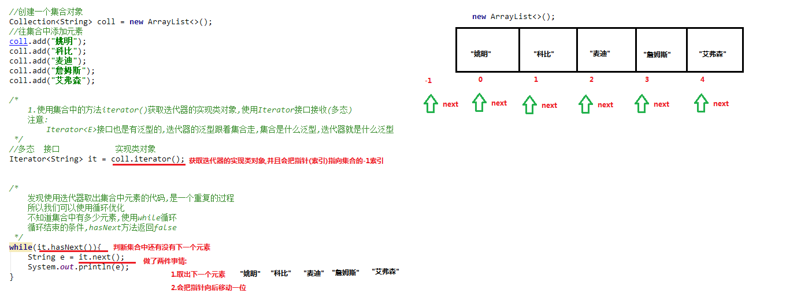
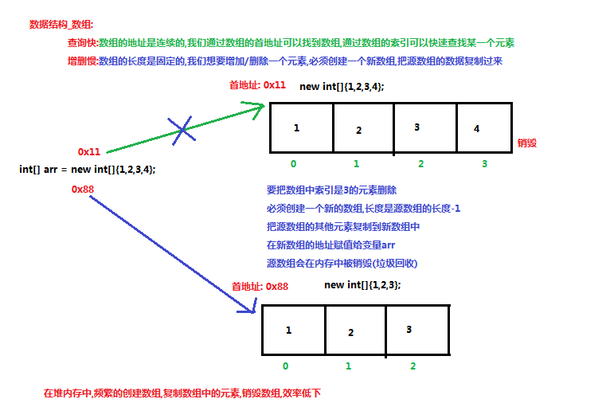
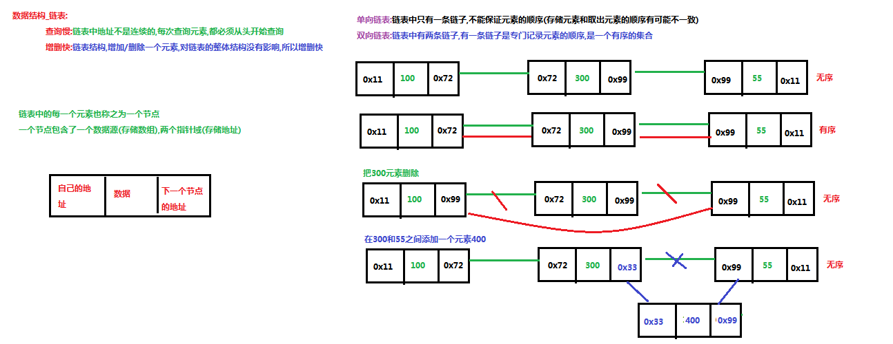
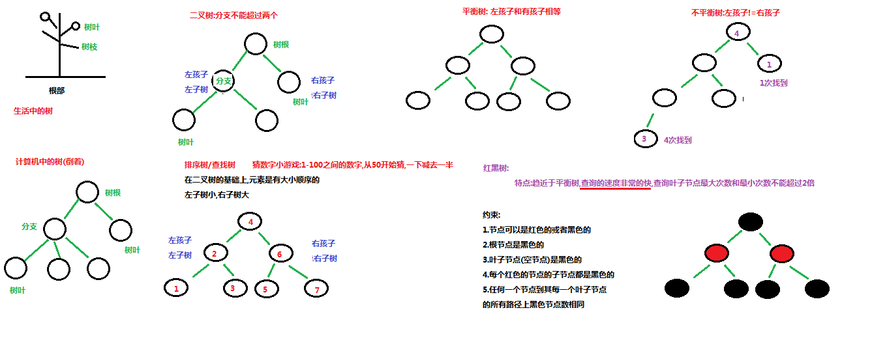

#第八节 集合框架(一)  & 泛型 & 数据结构

## 一、集合框架

### 1.1 概述

- **集合**：集合是java中提供的一种容器，可以用来存储多个数据。

集合和数组既然都是容器，它们有啥区别呢？

- 数组的长度是固定的。集合的长度是可变的。
- 数组中存储的是同一类型的元素，可以存储基本数据类型值。集合存储的都是对象。而且对象的类型可以不一致。在开发中一般当对象多的时候，使用集合进行存储。

### 1.2、集合框架

- 什么是Java集合框架？每种语言都有集合，Java也不例外。所谓Java集合框架，就是对常用的数据结构和算法做一些规范和实现。把所有抽象出来的数据结构和算法统称为集合框架。

- 为啥要组建集合框架？有了集合框架，程序员就不必考虑数据结构和算法实现的细节，只需要创建出集合框架中对应的对象就可以了，从而大大提高编程效率；

- Java集合框架主要分两条支线：

  (1) 单列集合：java.util.Collection

  (2)双列集合：java.util.Map

- Collection集合框架图

  

- Map集合框架图

  


下面先讲解：Collection集合

##二、 Collection接口

Collection是所有单列集合的父接口，因此在Collection中定义了单列集合(List和Set)通用的一些方法，这些方法可用于操作所有的单列集合。方法如下：

- `public boolean add(E e)`：  把给定的对象添加到当前集合中 。

- `public void clear()` :清空集合中所有的元素。

- `public boolean remove(E e)`: 把给定的对象在当前集合中删除。

- `public boolean contains(E e)`: 判断当前集合中是否包含给定的对象。

- `public boolean isEmpty()`: 判断当前集合是否为空。

- `public int size()`: 返回集合中元素的个数。

- `public Object[] toArray()`: 把集合中的元素，存储到数组中。

  > tips: 有关Collection中的方法可不止上面这些，其他方法可以自行查看API学习。

**[Collection有很多方法，但是没法遍历，怎么办？没事，其内有迭代器Iterator！！]**


##三、Iterator接口

### 3.1、Iterator概述

1. `java.util.Iterator`接口：也是java集合框架的一员，它与Collection,Map接口不同。Collection接口与Map接口主要用于存储元素，**而Iterator主要用于迭代访问（即遍历）Collection中的元素，故俗称迭代器**。

2. 查看源码，Collection继承类Iterable接口，由Iterable将terator接口带入Collection：

   ```java
   interface Collection<E> extends Iterable<E> 
   ```

3. Iterator接口的常用方法如下：

   - `public E next()`:返回迭代的下一个元素。

   - `public boolean hasNext()`:如果仍有元素可以迭代，则返回 true。
   - `remove()`:删除元素 （这个方法调用前，一定要先调用next()，否则会报错！）

4. Iterator实现遍历原理图：

   

5. 特例：

```java
public class IteratorTest {
	public static  final String DELETSEQUENCE = "Rube";
	public static void main(String[] args) {
		List<String> list1 = 		  Arrays.asList("Java11","Mathatics11","Python11","Rube","PHP11");
		List<String> list2 = new ArrayList<>();
		list2.add("Java");
		list2.add("Mathatics");
		list2.add("Python");
		list2.add("Rube");
		list2.add("PHP");
		
		Iterator<String> iterator = list1.iterator();
		while(iterator.hasNext()) {
			String next = iterator.next();
			if(DELETSEQUENCE.equals(next)) {
				iterator.remove();
			}
			System.out.println(next);
		}
		System.out.println("list1:"+list1.toString());
		System.out.println("list2:"+list2.toString());
	}
}
-----------------
Exception in thread "main" java.lang.UnsupportedOperationException
注意：Arrays.asList返回的是一个Arrays$ArrayList,而并非真正的ArrayList。查看源码，Arrays.asList并没有实现remove方法，故会报错！！因为Iterator.remove()方法最终还是会调用Collection.remove方法去删除元素；
list2.remove()则没有问题！！！
```

**［思考：Collection.remove() 与 Iterator.remove()区别］**

###3.2、 Iterator和ListIterator的区别

```java
 interface ListIterator<E> extends Iterator<E>
```

从继承关系看：ListIterator是Iterator的子接口；

区别点如下：

1. ListIterator继承自Iterator接口，然后添加了一些额外的功能; 
2. 两者都有hasNext()和next()方法，可以实现顺序向后遍历，ListIterator还有hasPrevious()和previous()方法，可以实现逆序遍历; 
3. 都有remove()方法可以实现删除对象，ListIterator还有添加方法add()和修改方法set()，可以实现添加和修改对象， Iterator的协议不能确保迭代的次序，所以没有提供add()方法; 
4. Iterator可以遍历Set和List集合，而ListIterator只能遍历List集合; 
5. ListIterator有nextIndex()和previousIndex()方法，可以定位当前的索引位置，Iterator没有此功能;

###3.3、Enumeration和Iterator的区别 

1. Enumeration是JDK1.0出现的，只能读取集合的数据； 
   Iterator是JDK1.2出现的，用来替代Enumeration，增加了remove()方法，可以在迭代过程中移除元素 
2. Iterator的方法名是标准化的 ；
3. Iterator支持fail-fast机制，而Enumeration不支持 ；
4. Enumeration的内存占用较少，效率比Iterator高，但Iterator更安全；


## 四、泛型

### 4.1、概述

集合里面你会发现：<E>跟在Collection，Iterator后面，干嘛用的？这里引入“泛型”概念！

```java
public class GenericDemo {
	public static void main(String[] args) {
		Collection coll = new ArrayList();
		coll.add("abc");
		coll.add("itcast");
		coll.add(5);//由于集合没有做任何限定，任何类型都可以给其中存放
		Iterator it = coll.iterator();
		while(it.hasNext()){
			//需要打印每个字符串的长度,就要把迭代出来的对象转成String类型
			String str = (String) it.next();
			System.out.println(str.length());
		}
	}
}
```

程序在运行时发生了问题**java.lang.ClassCastException**。  

1. 为什么会发生类型转换异常呢？                                                                                                                                       我们来分析下：由于集合中什么类型的元素都可以存储。导致取出时强转引发运行时 ClassCastException。
2. 怎么来解决这个问题呢？                                                                                                                                                           Collection虽然可以存储各种对象，但实际上通常Collection只存储同一类型对象。例如都是存储字符串对象。因此在JDK5之后，新增了**泛型**(**Generic**)语法，让你在设计API时可以指定类或方法支持泛型，这样我们使用API的时候也变得更为简洁，并得到了编译时期的语法检查f；
3. 泛型：可以在类或方法中预支地使用未知的类型；
4. tips:一般在创建对象时，将未知的类型确定具体的类型。当没有指定泛型时，默认类型为Object类型。

### 4.2、使用泛型的好处

上一节只是讲解了泛型的引入，那么泛型带来了哪些好处呢？

- 将运行时期的ClassCastException，转移到了编译时期变成了编译失败。
- 避免了类型强转的麻烦。

```java
public class GenericDemo2 {
	public static void main(String[] args) {
        Collection<String> list = new ArrayList<String>();
        list.add("abc");
        list.add("itcast");
        // list.add(5);//当集合明确类型后，存放类型不一致就会编译报错
        // 集合已经明确具体存放的元素类型，那么在使用迭代器的时候，迭代器也同样会知道具体遍历元素类型
        Iterator<String> it = list.iterator();
        while(it.hasNext()){
            String str = it.next();
            //当使用Iterator<String>控制元素类型后，就不需要强转了。获取到的元素直接就是String类型
            System.out.println(str.length());
        }
	}
}
```

> tips:
>
> 1.泛型是数据类型的一部分，我们将类名与泛型合并一起看做数据类型。
>
> 2.泛型只在编译阶段有效，正确检验泛型结果后，会将泛型的相关信息擦出，并且在对象进入和离开方法的边界处添加类型检查和类型转换的方法。

### 4.3、泛型的使用

泛型有三种使用方式，分别为：泛型类、泛型接口、泛型方法；

具体使用参考：[泛型详解](attach/F_泛型详解.md)

### 4.4、泛型通配符

**1. 通配符基本使用**

泛型的通配符:**不知道使用什么类型来接收的时候,此时可以使用?,?表示未知通配符。**

此时只能接受数据,不能往该集合中存储数据。

举个例子大家理解使用即可：

```java
public static void main(String[] args) {
    Collection<Intger> list1 = new ArrayList<Integer>();
    getElement(list1);
    Collection<String> list2 = new ArrayList<String>();
    getElement(list2);
}
public static void getElement(Collection<?> coll){}
//？代表可以接收任意类型
```

> tips:泛型不存在继承关系 Collection<Object> list = new ArrayList<String>();这种是错误的。

**2. 通配符高级使用----受限泛型**

之前设置泛型的时候，实际上是可以任意设置的，只要是类就可以设置。但是在JAVA的泛型中可以指定一个泛型的**上限**和**下限**。

**泛型的上限**：

- **格式**： `类型名称 <? extends 类 > 对象名称`
- **意义**： `只能接收该类型及其子类`

**泛型的下限**：

- **格式**： `类型名称 <? super 类 > 对象名称`
- **意义**： `只能接收该类型及其父类型`


##五、数据结构

这里只讲解常见的数据结构：堆栈，队列，数组，链表和红黑树！

####5.1、栈

特点：先进后出

####5.2、队列

特点：先进先出

详解图如下：


####5.3、数组

特点：查询快，增删慢。

1. 查询快：通过索引，可以快速访问指定位置的元素；
2. 增删慢：需要创建一个新数组，将指定新元素存储在指定索引位置，再把原数组元素根据索引，复制到新数组对应索引的位置

详解图：



#### 5.4、链表

特点：查询慢，增删快

详解图：



#### 5.5、红黑树

1. 二叉树：每个结点不超过2的有序树（binary tree)，每个结点分两支，称为左子树、右子树;

2. 排序树／查找树：在二叉树的基础上时有大小顺序的（左子树小，右子树大），查询速度很快；

3. 平衡树：左子树和右子树的元素相等；

4. 不平衡树：反之平衡树；

5. #####红黑树：特点趋近平衡树，查询速度很快。查询叶子节点最大次数和最小次数不能超过2倍；

   约束：1. 节点可以是红色或黑色；2. 根节点是黑色的； 3. 叶子节点是黑色的； 4. 每个红色节点的子节点都是黑色的；5. 任何一个节点到其每一个叶子节点的所有路径上黑色节点相同；

详解图：




