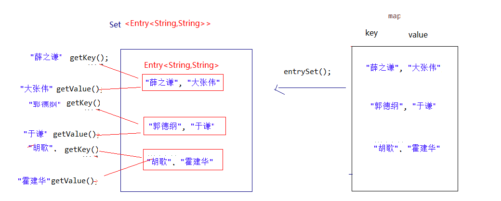
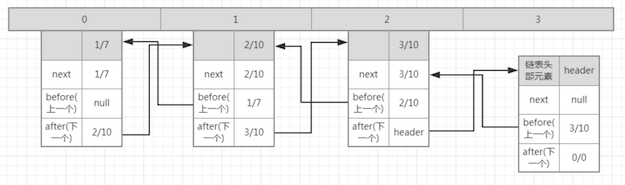

# 第十节 集合框架(三) －－Map


##一、Map接口

###1.1、概述

java.util.Map`，不是Collection的继承，它是一个双列集合，而Collection是单列的；

Map双列，所以有两个泛型、即`Map<K,V>`

- 注意：k键泛型不需要重复；

为什么要Map？编程中，常常遇到一一对应的关系，就叫做映射。如IP地址与主机名，身份证号与个人，系统用户名与系统用户对象等，此时用Map集合保存很方便；

###1.2、Map的常用实现类

- **HashMap<K,V>**：存储数据采用的哈希表结构，元素的存取顺序不能保证一致。由于要保证键的唯一、不重复，需要重写键的hashCode()方法、equals()方法。
- **LinkedHashMap<K,V>**：HashMap下有个子类LinkedHashMap，存储数据采用的哈希表结构+链表结构。通过链表结构可以保证元素的存取顺序一致；通过哈希表结构可以保证的键的唯一、不重复，需要重写键的hashCode()方法、equals()方法。

> tips：Map接口中的集合都有两个泛型变量<K,V>,在使用时，要为两个泛型变量赋予数据类型。两个泛型变量<K,V>的数据类型可以相同，也可以不同。

### 1.3、 Map接口中的常用方法

Map接口中定义了很多方法，常用的如下：

- `public V put(K key, V value)`:  把指定的键与指定的值添加到Map集合中。
- `public V remove(Object key)`: 把指定的键 所对应的键值对元素 在Map集合中删除，返回被删除元素的值。
- `public V get(Object key)` 根据指定的键，在Map集合中获取对应的值。
- `boolean containsKey(Object key)  ` 判断集合中是否包含指定的键。
- `public Set<K> keySet()`: 获取Map集合中所有的键，存储到Set集合中。
- `public Set<Map.Entry<K,V>> entrySet()`: 获取到Map集合中所有的键值对对象的集合(Set集合)。

### 1.4、Map集合遍历

4种方法：

```java
public class MapTest {
    public static void main(String[] args) {
        Map<String, String> map = new HashMap<String, String>();
        map.put("1", "Hello");
        map.put("2", "Java");
        map.put("3", "Map");

        //方法一：先通过Map.keySet遍历key，再通过key获取value值
        for (String key : map.keySet()) {
            System.out.println("key= "+ key + " and value= " + map.get(key));
        }

        //方法二：通过Map.entrySet使用iterator遍历键值对对象，再通过getKey()和getValue()获取key和value的值
        Iterator<Map.Entry<String, String>> it = map.entrySet().iterator();
        while (it.hasNext()) {
            Map.Entry<String, String> entry = it.next();
            System.out.println("key= " + entry.getKey() + " and value= " + entry.getValue());
        }

        //方法三：通过Map.entrySet遍历key和value
        for (Map.Entry<String, String> entry : map.entrySet()) {
            System.out.println("key= " + entry.getKey() + " and value= " + entry.getValue());
        }

        //方法四：通过Map.values()遍历所有的value，但不能遍历key.同时也没有普通for循环遍历方法，因为没有get方法
        for (String value : map.values()) { // 
            System.out.println("value= " + value);
        }
    }
}
```

### 1.5、Map.Entry<K,V>接口

Entry接口：用于记录保存在Map中键值对，作为Entry实现类的一个对象；

所以，Map.entrySet()相当于把Map中Entry对象们，放入Set集合中，然后方便进行遍历：



##二、Map的实现类对比

HashMap,      TreeMap, EnumMap, WeakHashMap, IdentityHashMap,    Hashtable

LinkedHashMap  ==========================================      Properties (对应项子类)

### 2.1、HashMap

HashMap是基于哈希表的Map接口的非同步实现: ［继承AbstractMap类］

1. 允许使用null值和null键(HashMap最多只允许一条记录的键为null，允许多条记录的值为null。)。此类不保证映射的顺序，特别是它不保证该顺序恒久不变。
2. HashMap中不允许出现重复的键（Key）,Hashmap是非线程安全的，其迭代器是fail-fast的;
3. HashMap实际上是一个“链表散列”的数据结构，即数组和链表的结合体，（**JDK1.8增加了红黑树部分,会将时间复杂度从O(n)降为O(logn)**）。
4. 数据存储：先根据key的hashCode（使用key的hashCode()方法获取）重新计算hash值，根据hash值算出这个元素在数组中的位置（即下标）， 如果数组该位置上已经存放有其他元素了，那么在这个位置上的元素将以链表的形式存放，新加入的放在链头，最先加入的放在链尾。如果数组该位置上没有元素，就直接将该元素放到此数组中的该位置上。
5. 数据读取：首先根据key的hashCode，找到其数组中对应位置的数据(可能只有一个数据，也可能是多个数据，其表现形式是一个链表)，然后通过key的equals方法在对应位置的链表中找到需要的元素。
6. hashMap的默认初始容量是16个，其会有一个负载因子，用于当hashMap中的数据量等于容量*负载因子时，hashMap会进行扩容，扩大的容量是原本的2倍。负载因子的默认初始值为0.75；

### 2.2、HashTable

Hashtable也是一个散列表，它存储的内容是键值对。继承于Dictionary类，实现Map接口;

1. 存储数据: 首先判断value是否为空，为空则抛出异常；计算key的hash值，并根据hash值获得key在table数组中的位置index，如果table[index]元素不为空，则进行迭代，如果遇到相同的key，则直接替换，并返回旧value；否则，我们可以将其插入到table[index]位置。

2. **对比HashMap：**

   - 都是基于hash表实现的，每个元素都是key-value对，内部都是通过**[单向链表]**解决冲突，容量都会自动增长 。HashMap默认容量为16，每次扩容变为原来的2倍，HashTable初始容量为11，每次扩容变为原来的2倍加1 ；
   - HashTable是同步的，适合多线程环境，而HashMap不是，但效率相对较高 ；
   - HashMap允许key和value为null，而HashTable不允许 ；
   - HashTable直接使用对象的hashcode值，而HashMap重新计算hash值 ；
   - HashMap提供对key的Set进行遍历，因此它支持fail-fast机制，而HashTable提供对key的Enumeration进行遍历，不支持fail-fast ；
   - HashTable产生于JDK1.1，是个遗留的类，如果在迭代的时候修改Map，可以使用ConcurrentHashMap（Java5出现）;  于JDK1.2被HashMap；
   - 但是其子类Properities还流行，主要是由于根IO流相关；


### 2.3、LinkedHashMap

1. LinkedHashMap是HashMap的一个子类，它保留插入顺序，帮助我们实现了有序的HashMap。

2. 其维护一个**双向链表**，并不是说其除了维护存入的数据，另外维护了一个双向链表对象，而是说其根据重写HashMap的实体类Entry，来实现能够将HashMap的数据组成一个双向列表，其存储的结构还是数组+链表的形式；(双链表图解如下：)

   

3. **LinkedHashMap和HashMap比较**

| HashMap             | LinkedHashMap           |
| ------------------- | ----------------------- |
| 无序存储            | 有序存储,以双向链表实现 |
| 读取速度与容量有关  | 读取速度与容量无关      |
| 线程不安全          | 线程不安全              |
| key-value都允许null | key-value都允许null     |

###2.4、TreeMap

正如Set接口派生出了SortedSet子接口，SortedSet接口有一个TreeSet实现类，Map接口也派生了一个SortedMap子接口，SortedMap也有一个TreeMap实现类。

1. TreeMap也是基于红黑树对TreeMap中所有key进行排序，从而保证TreeMap中所有key-value对处于有序状态。TreeMap也有两种排序方式：

   - 自然排序：TreeMap的所有key必须实习那Comparable接口，而且所有key应该是同一个类的对象，否则将会抛出ClassCaseException。
   - 定制排序：创建TreeMap时，传入一个Comparator对象，该对象负责对TreeMap中所有key进行排序。采用定制排序时不要求Map的key实现Comparable接口。

2. **TreeMap与HashMap的区别**

   | HashMap                           | TreeMap                                       |
   | --------------------------------- | --------------------------------------------- |
   | 遍历出来数据无序                  | 自然排序或者创建映射提供的Comparator 进行排序 |
   | 基于散列表                        | 红黑树                                        |
   | 存取值速度快 O(1)                 | 存取值速度慢 O(logn)                          |
   | 适用于在Map中插入、删除和定位元素 | 适用于按自然顺序或自定义顺序遍历键(key)       |
   | 非线程安全，支持fail-fast         | 非线程安全，支持fail-fast                     |

### 2.5、 ConcurrentHashMap

`java.util.concurrent`包下，都是对相应的集合处理线程安全优化类！

为什么说优化了线程安全处理呢？

线程安全的集合只能使用使用锁的HashTable或者Collections.synchronizedMap(hashMap)，但是由于其操作都是使用锁进行锁定操作的，其性能较差，所以**ConcurrentHashMap就是为了解决HashMap的非线程安全性的,并使用分段锁提高性能**。

#### 2.6 、WeakHashMap 

WeakHashMap与HashMap的用法基本相同，区别在于：后者的key保留对象的强引用，即只要HashMap对象不被销毁，其对象所有key所引用的对象不会被垃圾回收，HashMap也不会自动删除这些key所对应的键值对对象。但WeakHashMap的key所引用的对象没有被其他强引用变量所引用，则这些key所引用的对象可能被回收。WeakHashMap中的每个key对象保存了实际对象的弱引用，当回收了该key所对应的实际对象后，WeakHashMap会自动删除该key所对应的键值对。

#### 2.7、IdentifyHashMap

IdentityHashMap与HashMap基本相似，只是当两个key严格相等时，即key1==key2时，它才认为两个key是相等的 。IdentityHashMap也允许使用null，但不保证键值对之间的顺序。

对于常用的HashMap来说，我们都知道只要key的值相同（严谨说法是：key.equals(k)） 那么我们认为他们是同一个可以Entry。如果我们把颜色作为研究对象：key值，那么我们就得出双胞胎兄弟的颜色一致，key.equals(k)=true，他们是同一个人（脸盲症）。
JDK源码：  
if (e.hash == hash && ((k = e.key) == key || key.equals(k))) 

而IdentifyHashMap他是非分明，他只承认key==e.key的结果为true时，才认为是相同的Entry。不管双胞胎弟弟今天穿绿色，明天穿蓝色，他都认为你是同一个人，不会“脸盲”。 

###2.8、EnumMap实现类

　　EnumMap是一个与枚举类一起使用的Map实现，EnumMap中所有key都必须是单个枚举类的枚举值。创建EnumMap时必须显示或隐式指定它对应的枚举类。

　　EnumMap不允许使用null作为key值，但容许使用null值做为value。如果试图使用null做为key将抛出NullPointerException异常。如果仅仅只是查询是否包含值为null的key，或者仅仅只是使用删除值为null的key，都不会抛出异常。

```java
enum Season{
    SPRING,SUMMER,AUTUMN,WINTER
}
public class Test {
    public static void main(String[] args){
        EnumMap<Season, String> map = new EnumMap<Season, String>(Season.class);
        //打印结果为{}
        System.out.println(map);
        map.put(Season.SPRING, "春");
        map.put(Season.SUMMER, "夏");
        map.put(Season.AUTUMN, "秋");
        map.put(Season.WINTER, "冬");
        //打印结果为{SPRING=春, SUMMER=夏, AUTUMN=秋, WINTER=冬}
        System.out.println(map);
    }
}
 ========
{}
{SPRING=春天, SUMMER=夏天, AUTUMN=秋天, WINTER=冬天}
```

###2.9、Properties类

​	Properties类是Hashtable类的子类，正如它的名字所暗示的，该文件在处理属性文件。 Properties类可以把Map对象和属性文件关联起来，从而可以把Map对象中的key-value对写入属性文件，也可以把属性文件中的属性名=属性值加载到Map对象中。由于属性文件里的属性名、属性值只能是字符串类型，所以Properties里的key、value都是字符串类型，该类提供了如下三个方法来修改Properties里的key、value值。

> IO流章节，再来详解！


## 三、JDK 9对集合添加的优化

 Java 9，添加了几种集合工厂方法,更方便创建少量元素的集合。新的List、Set、Map的静态工厂方法可以更方便地创建集合的不可变实例。

```java
public class HelloJDK9 {  
    public static void main(String[] args) {  
        Set<String> str1=Set.of("a","b","c");  
        //str1.add("c");这里编译的时候不会错，但是执行的时候会报错，因为是不可变的集合  
        System.out.println(str1);  
        Map<String,Integer> str2=Map.of("a",1,"b",2);  
        System.out.println(str2);  
        List<String> str3=List.of("a","b");  
        System.out.println(str3);  
    }  
} 
```

> 注意3点：
>
> 1. of()方法只是Map，List，Set这三个接口的静态方法，其父类接口和子类实现并没有这类方法，不适用于实现类；
> 2. of方法的返回值是一个不能改变的集合，不能再使用add，put方法添加元素，否则会报错；
> 3. Set和Map接口调用of方法，不能有重复元素，否则会报错；


##四、Fail-Fast机制

参考详解：[集合框架fail-fast机制](attah/F_集合框架fail-fast.md)


##五、斗地主综合案例

```java
import java.util.*;

/**
 * 斗地主综合案例
 * 扑克：54张 三个人：17张 底牌：3张
 */
public class FightLandlord {

    public static void main(String[] args) {
        /*
            1. 初始化一副扑克 54张牌
         */
        List<String> colors = new ArrayList<>();
        List<String> numbers = new ArrayList<>();
        Collections.addAll(colors,"♠️","♥️","♣️","♦️");
        Collections.addAll(numbers,"2","A","K","Q","J","10","9","8","7","6","5","4","3");

        Map<Integer,String> poker = new HashMap<>();
        poker.put(0,"大王");
        poker.put(1,"小王");
        int n = 2; // poker 编号
        for(String num:numbers){
            for(String color:colors){
                poker.put(n,color+num);
                n++;
            }
        }

        System.out.println(poker);

        /*
            2. 洗牌，我们只需要把对应牌的编号错乱即可
          */
        Set<Integer> pokerKeys = poker.keySet();
        List<Integer> keyList =new ArrayList<>();
        keyList.addAll(pokerKeys);
        Collections.shuffle(keyList);
        System.out.println(keyList);

        /*
            3. 发牌  相当于发对应编号
          */
        List<Integer> play1 = new ArrayList<>();
        List<Integer> play2 = new ArrayList<>();
        List<Integer> play3 = new ArrayList<>();
        List<Integer> lastCard = new ArrayList<>();

        int size = keyList.size(); // 共牌数

        for(int i=0;i<size;i++){
            int key = keyList.get(i);
            if(i>50){ // 3 piece lastCard
                lastCard.add(key);
            }else{
                if(i%3==0){
                    play1.add(key);
                }else if(i%3==1){
                    play2.add(key);
                }else{
                    play3.add(key);
                }
            }
        }
        //排序
        Collections.sort(play1);
        Collections.sort(play2);
        Collections.sort(play3);
        Collections.sort(lastCard);

        /*
         4. 看牌
          */
        lookPoker("刘德华",play1,poker);
        lookPoker("周润发",play2,poker);
        lookPoker("周星驰",play3,poker);
        lookPoker("底牌",lastCard,poker);
    }

  public static void lookPoker(String name,List<Integer> who,Map<Integer,String> poker){
        List<String> pokerList = new ArrayList<>();
        for(Integer i:who){
            pokerList.add(poker.get(i));
        }
        System.out.println(name+":"+pokerList);
    }
}
```


