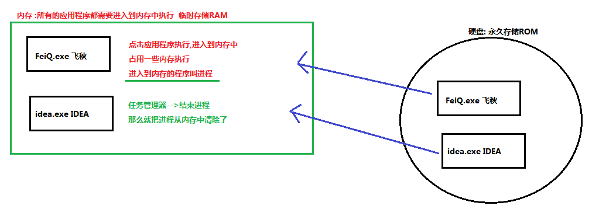
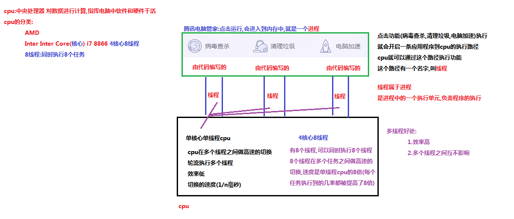
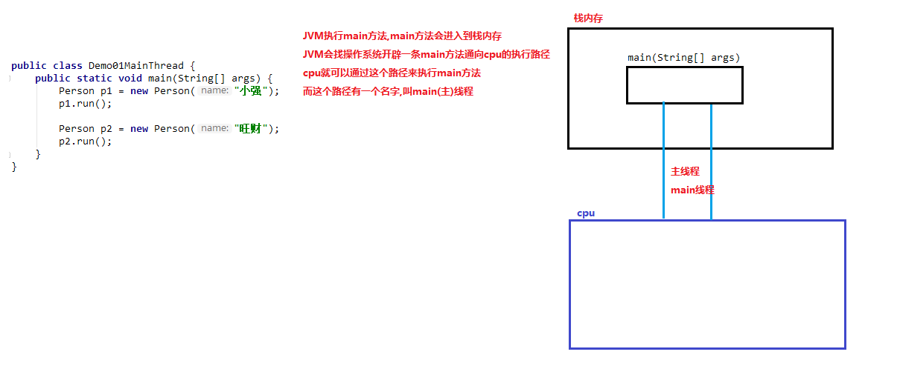
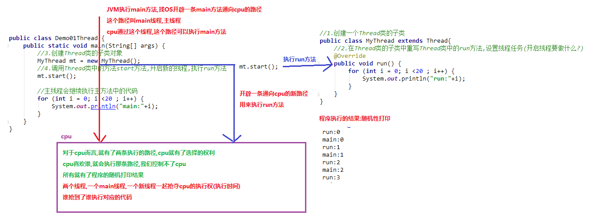
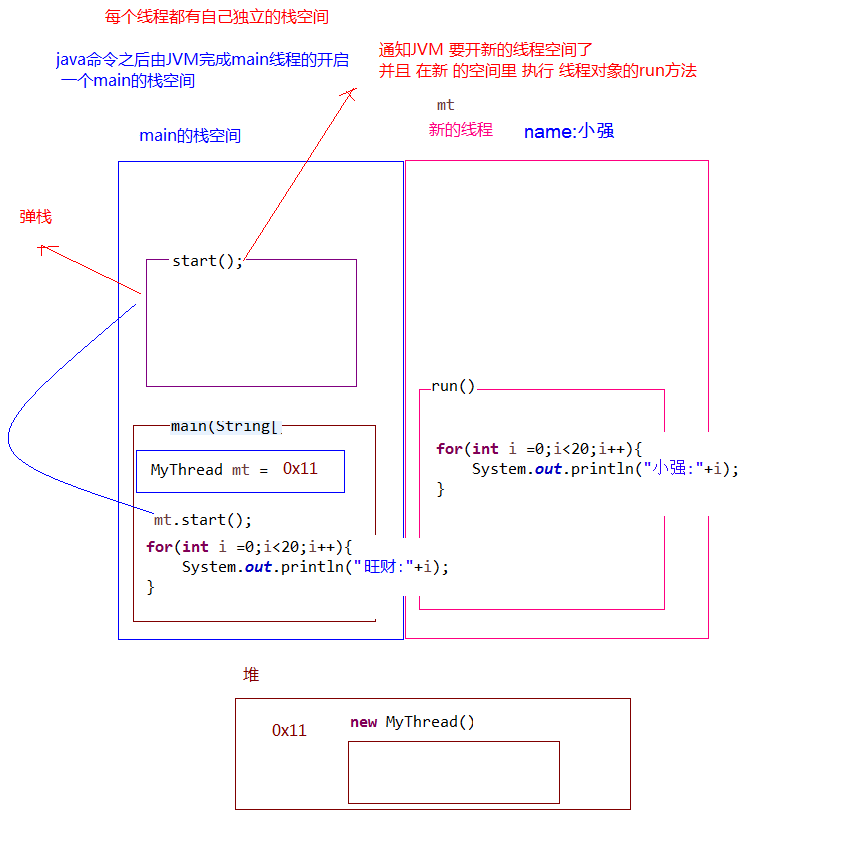

# 第十一节 异常、多线程

##一、异常

###1.1、异常概念

**异常** ：指的是程序在执行过程中，出现的非正常的情况，最终会导致JVM的非正常停止。

在Java等面向对象的编程语言中，异常本身是一个类，产生异常就是创建异常对象并抛出了一个异常对象。Java处理异常的方式是中断处理。

> 异常指的并不是语法错误,语法错了,编译不通过,不会产生字节码文件,根本不能运行.

###1.2、异常体系

异常机制其实是帮助我们**找到**程序中的问题，异常的根类是`java.lang.Throwable`，其下有两个子类：`java.lang.Error`与`java.lang.Exception`，平常所说的异常指`java.lang.Exception`。

**Throwable体系：**

- **Error**:严重错误Error，无法通过处理的错误，只能事先避免，好比绝症。
- **Exception**:表示异常，异常产生后程序员可以通过代码的方式纠正，使程序继续运行，是必须要处理的。好比感冒、阑尾炎。

###1.3 异常分类

我们平常说的异常就是指Exception，因为这类异常一旦出现，我们就要对代码进行更正，修复程序。

**异常(Exception)的分类**:根据在编译时期还是运行时期去检查异常?

- **编译时期异常**:checked异常。在编译时期,就会检查,如果没有处理异常,则编译失败。(如日期格式化异常)
- **运行时期异常**:runtime异常。在运行时期,检查异常.在编译时期,运行异常不会编译器检测(不报错)。(如数学异常)


### 1.4、异常的产生过程解析


##二、异常的处理

Java异常处理的五个关键字：**try、catch、finally、throw、throws**

###2.1、抛出异常throw

在编写程序时，我们必须要考虑程序出现问题的情况。比如，在定义方法时，方法需要接受参数。那么，当调用方法使用接受到的参数时，首先需要先对参数数据进行合法的判断，数据若不合法，就应该告诉调用者，传递合法的数据进来。这时需要使用抛出异常的方式来告诉调用者。

在java中，提供了一个**throw**关键字，作用：**抛出一个指定的异常对象。**

1. 创建一个异常对象。封装一些提示信息(信息可以自己编写)。
2. 需要将这个异常对象告知给调用者。怎么告知呢？怎么将这个异常对象传递到调用者处呢？通过关键字throw就可以完成。throw 异常对象。
3. throw**用在方法内**，用来抛出一个异常对象，将这个异常对象传递到调用者处，并结束当前方法的执行。

**使用格式：**

```java
throw new NullPointerException("要访问的arr数组不存在");

throw new ArrayIndexOutOfBoundsException("该索引在数组中不存在，已超出范围");
```

>注意：如果产生了问题，我们就会throw将问题描述类即异常进行抛出，也就是将问题返回给该方法的调用者。那么对于调用者来说，该怎么处理呢？
>
>一种是进行捕获处理，另一种就是继续讲问题声明出去，使用throws声明处理。

### 2.2、Objects非空判断

```java
public static <T> T requireNonNull(T obj); // 查看指定引用对象不是null。

// 源码查看
public static <T> T requireNonNull(T obj) {
    if (obj == null)
      	throw new NullPointerException();
    return obj;
}
```

> 作用：简化我们代码，不要写那么一堆thow new Exception代码！

### 2.3、声明异常throws

**声明异常**：将问题标识出来，报告给调用者。如果方法内通过throw抛出了编译时异常，而没有捕获处理（稍后讲解该方式），那么必须通过throws进行声明，让调用者去处理。

- 关键字**throws**运用于方法声明之上,用于表示当前方法不处理异常,而是提醒该方法的调用者来处理异常(抛出异常).

```java
public class MyThrowable {

    public static void read(String path) {
        if(!path.equals("a.txt")){
            throw new FileNotFoundException("file doesn't excite!"); // 报错，why？这是编译时异常，必须处理！
        }
    }
    
    public static int getElement(int[] arr,int index){
        if(index < 0 || index > arr.length - 1){
            throw new ArrayIndexOutOfBoundsException("yue jie le "); // 运行时异常，可以处理，也可以不处理
        }
        
        return arr[index];
    }

}
```

### 2.4、捕获异常try…catch

如果异常出现的话，不处理，JVM最终会终止程序。所以在必要时，我们得处理异常:

怎么处理异常？**try-catch**－－异常捕获。

用法格式：

```java
try{
     编写可能会出现异常的代码
}catch(异常类型  e){
     处理异常的代码
     //平时工作时：记录日志/打印异常信息/继续抛出异常
}
```

> 注意：
>
> 1. 如果有多个异常，那么可以用多层catch一一处理；
> 2. try和catch不能单独使用，必须连用。try一层，catch可以多层；
> 3. try没有异常，不会执行catch。try内代码执行完后，会继续执行try外的代码；

Throwable类中定义了一些查看方法:

- `public String getMessage()`:获取异常的描述信息,原因(提示给用户的时候,就提示错误原因。

- `public String toString()`:获取异常的类型和异常描述信息(不用)。
- `public void printStackTrace()`:打印异常的跟踪栈信息并输出到控制台。

> **包含了异常的类型,异常的原因,还包括异常出现的位置,在开发和调试阶段,都得使用printStackTrace。**

```java
 			/*
            java.lang.ArrayIndexOutOfBoundsException: 6
	        at cn.itcast.day11.lolo.MyThrowable.getElement(MyThrowable.java:18)
	        at cn.itcast.day11.lolo.ThrowableDemo.main(ThrowableDemo.java:8)
             */
            e.printStackTrace(); // 在控制台打印
           
            /*
            java.lang.ArrayIndexOutOfBoundsException: 6
             */
            System.out.println(e.toString()); 
            
            /*
             6
             */
            System.out.println(e.getMessage()); 
```

### 2.5、finally 代码块

**finally**：有一些特定的代码无论异常是否发生，都需要执行。另外，因为异常会引发程序跳转，导致有些语句执行不到。而finally就是解决这个问题的，在finally代码块中存放的代码都是一定会被执行的。

finally的语法:

```java
try{
    ...
}catch(Exception e){
    ...
}finally{ // 必须放在最后
    ...
}
```

> 应用的一个场景：操作IO流，自身需要处理异常,最终还得关闭资源。
>
> 注意:finally不能单独使用。

### 2.6、异常注意事项

- 运行时异常被抛出可以不处理。即不捕获也不声明抛出。直接交给JVM处理即可！
- 如果finally有return语句,永远返回finally中的结果,避免该情况. 
- 如果父类抛出了多个异常,子类重写父类方法时,抛出和父类相同的异常、或者是父类异常的子类、或者不抛出异常。
- 父类方法没有抛出异常，子类重写父类该方法时也不可抛出异常。此时子类产生该异常，只能捕获处理，不能声明抛出
- 多层catch处理异常时，存在父子类异常，子类异常一定写前面，否则子类异常是没有意义的，编译错误；


## 三、自定义异常

**什么是自定义异常类:**

在开发中根据自己业务的异常情况来定义异常类.

自定义一个业务逻辑异常: **RegisterException**。一个注册异常类。

```java
// 业务逻辑异常
public class RegisterException extends Exception {
    public RegisterException() {
    
    }
    
    public RegisterException(String message) {
        super(message);
    }
}

public class Demo {
    // 模拟数据库中已存在账号
    private static String[] names = {"bill","hill","jill"};
   
    public static void main(String[] args) {     
        //调用方法
        try{
              // 可能出现异常的代码
            checkUsername("nill");
            System.out.println("注册成功");//如果没有异常就是注册成功
        }catch(RegisterException e){
            //处理异常
            e.printStackTrace();
        }
    }

    //判断当前注册账号是否存在
    //因为是编译期异常，又想调用者去处理 所以声明该异常
    public static boolean checkUsername(String uname) throws RegisterException{
        for (String name : names) {
            if(name.equals(uname)){//如果名字在这里面 就抛出登陆异常
                throw new RegisterException("亲"+name+"已经被注册了！");
            }
        }
        return true;
    }
}
```

> 1. 继承Exception，相当于编译时异常，必须处理；
> 2. 继承RuntimeException，即运行时异常，可以不处理，交给JVM中断处理；


#四、多线程

### 4.1、并发与并行

- **并发**：指两个或多个事件在**同一个时间段内**发生。－－交替事件，效率低！
- **并行**：指两个或多个事件在**同一时刻**发生（同时发生）。－－同时事件，效率高！

###4.2、线程与进程

- **进程**：是指一个内存中运行的应用程序，每个进程都有一个独立的内存空间，一个应用程序可以同时运行多个进程；进程也是程序的一次执行过程，是系统运行程序的基本单位；系统运行一个程序即是一个进程从创建、运行到消亡的过程。



- **线程**：线程是进程中的一个执行单元，负责当前进程中程序的执行，一个进程中至少有一个线程。一个进程中是可以有多个线程的，这个应用程序也可以称之为多线程程序。 

  简而言之：一个程序运行后至少有一个进程，一个进程中可以包含多个线程 



- **线程调度:**

  1. 分时调度

     所有线程轮流使用 CPU 的使用权，平均分配每个线程占用 CPU 的时间。

  2. 抢占式调度

     优先让优先级高的线程使用 CPU，如果线程的优先级相同，那么会随机选择一个(线程随机性)，Java使用的为抢占式调度。

- 抢占式调度详解

  大部分操作系统都支持多进程并发运行，现在的操作系统几乎都支持同时运行多个程序。比如：现在我们上课一边使用编辑器，一边使用录屏软件，同时还开着画图板，dos窗口等软件。此时，这些程序是在同时运行，”感觉这些软件好像在同一时刻运行着“。

  实际上，CPU(中央处理器)使用抢占式调度模式在多个线程间进行着高速的切换。对于CPU的一个核而言，某个时刻，只能执行一个线程，而 CPU的在多个线程间切换速度相对我们的感觉要快，看上去就是在同一时刻运行。
  其实，多线程程序并不能提高程序的运行速度，但能够提高程序运行效率，让CPU的使用率更高。


### 4.3、主线程

我们程序的执行，最终是靠CPU来执行。内存是存储作用！

Java程序的入口为main方法，当执行执行该程序，首先在栈内存开辟空间将main压栈，然后就会创建一个main线程与CPU连接，执行main方法、这里的main线程即为主线程！



### 4.4、创建线程类

Java中通过继承`java.lang.Thread`类来**创建**并**启动多线程**的步骤如下：

1. 定义Thread类的子类，并重写该类的run()方法，该run()方法的方法体就代表了线程需要完成的任务,因此把run()方法称为线程执行体；
2. 创建Thread子类的实例，即创建了线程对象；
3. 调用线程对象的start()方法来启动新的线程，来执行run()方法；结果就会与main线程并发执行。

> 注意：
>
> 1. 多次启动一个线程是非法的！特别是当线程已经结束执行后，不能再重新启动；
> 2. java线程是抢占式调度，谁的优先级高，谁优先执行。优先相同，那就随机抢占执行；


- **多线程随机性打印结果图解：**开辟的新通道线程与main线程同优先级，抢占式执行；



- **多线程内存图解：**通过start是开辟新栈执行方法，所以多线程互不干涉




