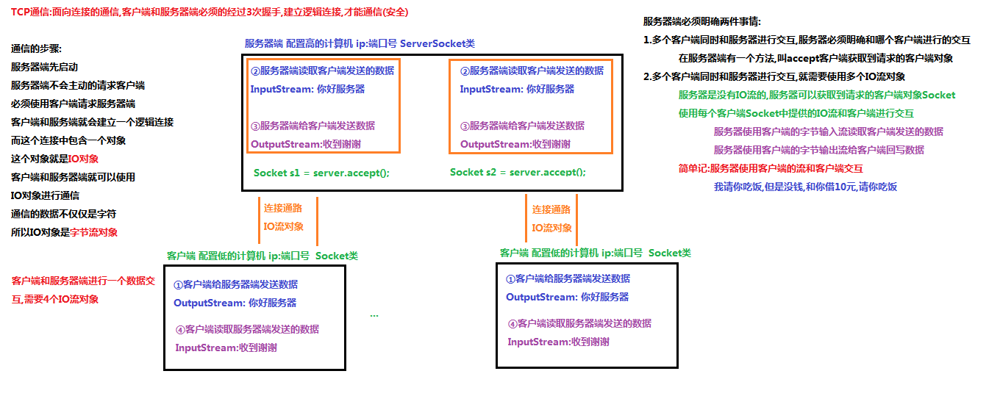

# 第十五节 网络编程、JDK8新特性

## 一、网络编程概述

### 1.1、 软件结构

- **C/S结构** ：全称为Client/Server结构，是指客户端和服务器结构。常见程序有ＱＱ、迅雷等软件。

- **B/S结构** ：全称为Browser/Server结构，是指浏览器和服务器结构。常见浏览器有谷歌、火狐等。

两种架构各有优势，但是无论哪种架构，都离不开网络的支持。**网络编程**，就是在一定的协议下，实现两台计算机的通信的程序。

### 1.2、网络通信协议

- **TCP/IP协议：** 传输控制协议/因特网互联协议( Transmission Control Protocol/Internet Protocol)，是Internet最基本、最广泛的协议。它定义了计算机如何连入因特网，以及数据如何在它们之间传输的标准。它的内部包含一系列的用于处理数据通信的协议，并采用了4层的分层模型，每一层都呼叫它的下一层所提供的协议来完成自己的需求。


上图中，TCP/IP协议中的四层分别是应用层、传输层、网络层和链路层，每层分别负责不同的通信功能。
链路层：链路层是用于定义物理传输通道，通常是对某些网络连接设备的驱动协议，例如针对光纤、网线提供的驱动。
网络层：网络层是整个TCP/IP协议的核心，它主要用于将传输的数据进行分组，将分组数据发送到目标计算机或者网络。
运输层：主要使网络程序进行通信，在进行网络通信时，可以采用TCP协议，也可以采用UDP协议。
应用层：主要负责应用程序的协议，例如HTTP协议、FTP协议等。

### 1.3、协议分类

`java.net` 包中提供了两种常见的网络协议的支持：

- **UDP**：用户数据报协议(User Datagram Protocol)。UDP是无连接通信协议，即在数据传输时，数据的发送端和接收端不建立逻辑连接。简单来说，当一台计算机向另外一台计算机发送数据时，发送端不会确认接收端是否存在，就会发出数据，同样接收端在收到数据时，也不会向发送端反馈是否收到数据。

  由于使用UDP协议消耗资源小，通信效率高，所以通常都会用于音频、视频和普通数据的传输例如视频会议都使用UDP协议，因为这种情况即使偶尔丢失一两个数据包，也不会对接收结果产生太大影响。

  但是在使用UDP协议传送数据时，由于UDP的面向无连接性，不能保证数据的完整性，因此在传输重要数据时不建议使用UDP协议。

  特点:

  1. 数据被限制在64kb以内，超出这个范围就不能发送了;

  2. 数据报(Datagram):网络传输的基本单位 ;

- **TCP**：传输控制协议 (Transmission Control Protocol)。TCP协议是**面向连接**的通信协议，即传输数据之前，在发送端和接收端建立逻辑连接，然后再传输数据，它提供了两台计算机之间可靠无差错的数据传输。

  在TCP连接中必须要明确客户端与服务器端，由客户端向服务端发出连接请求，每次连接的创建都需要经过“三次握手”。

  - 三次握手：TCP协议中，在发送数据的准备阶段，客户端与服务器之间的三次交互，以保证连接的可靠。
    - 第一次握手，客户端向服务器端发出连接请求，等待服务器确认。
    - 第二次握手，服务器端向客户端回送一个响应，通知客户端收到了连接请求。
    - 第三次握手，客户端再次向服务器端发送确认信息，确认连接。

  完成三次握手，连接建立后，客户端和服务器就可以开始进行数据传输了。由于这种面向连接的特性，TCP协议可以保证传输数据的安全，所以应用十分广泛，例如下载文件、浏览网页等。

### 1.4、网络编程三要素：协议、IP地址、端口号

- **协议：**参考上面；

- **IP地址：指互联网协议地址（Internet Protocol Address）**，俗称IP。IP地址用来给一个网络中的计算机设备做唯一的编号。假如我们把“个人电脑”比作“一台电话”的话，那么“IP地址”就相当于“电话号码”。

  **IP地址分类**

  - IPv4：是一个32位的二进制数，通常被分为4个字节，表示成`a.b.c.d` 的形式，例如`192.168.65.100` 。其中a、b、c、d都是0~255之间的十进制整数，那么最多可以表示42亿个。

  - IPv6：由于互联网的蓬勃发展，IP地址的需求量愈来愈大，但是网络地址资源有限，使得IP的分配越发紧张。

    为了扩大地址空间，拟通过IPv6重新定义地址空间，采用128位地址长度，每16个字节一组，分成8组十六进制数，表示成`ABCD:EF01:2345:6789:ABCD:EF01:2345:6789`，号称可以为全世界的每一粒沙子编上一个网址，这样就解决了网络地址资源数量不够的问题。

  - **特殊的IP地址**：本机IP地址：`127.0.0.1`、`localhost` 。
  - **常用命令**：ipconfig    ping 220.181.57.216

- **端口号：用两个字节表示的整数，它的取值范围是0~65535**。其中，0~1023之间的端口号用于一些知名的网络服务和应用，普通的应用程序需要使用1024以上的端口号。如果端口号被另外一个服务或应用所占用，会导致当前程序启动失败。

利用`协议`+`IP地址`+`端口号` 三元组合，就可以标识网络中的进程了，那么进程间的通信就可以利用这个标识与其它进程进行交互。


## 二、TCP通信程序

## 2.1 概述

TCP通信能实现两台计算机之间的数据交互，通信的两端，要严格区分为客户端（Client）与服务端（Server）。

**两端通信时步骤：**

1. 服务端程序，需要事先启动，等待客户端的连接。
2. 客户端主动连接服务器端，连接成功才能通信。服务端不可以主动连接客户端。

**在Java中，提供了两个类用于实现TCP通信程序：**

1. 客户端：`java.net.Socket` 类表示。创建`Socket`对象，向服务端发出连接请求，服务端响应请求，两者建立连接开始通信。
2. 服务端：`java.net.ServerSocket` 类表示。创建`ServerSocket`对象，相当于开启一个服务，并等待客户端的连接。

##### TCP通信原理：



> 总结：
>
> 1. 服务器与客户端：IO流连接进行数据通信；
> 2. 服务器本身没有IO流对象，它是借客户端Socket中IO流，再把数据返回给客户端；

## 2.2 Socket类  

`Socket` 类：该类实现客户端套接字，套接字指的是两台设备之间通讯的端点。

#### 构造方法

- `public Socket(String host, int port)` :创建套接字对象并将其连接到指定主机上的指定端口号。如果指定的host是null ，则相当于指定地址为回送地址。  

  > 小贴士：回送地址(127.x.x.x) 是本机回送地址（Loopback Address），主要用于网络软件测试以及本地机进程间通信，无论什么程序，一旦使用回送地址发送数据，立即返回，不进行任何网络传输。

构造举例，代码如下：

```java
Socket client = new Socket("127.0.0.1", 6666);
```

#### 成员方法

- `public InputStream getInputStream()` ： 返回此套接字的输入流。
  - 如果此Scoket具有相关联的通道，则生成的InputStream 的所有操作也关联该通道。
  - 关闭生成的InputStream也将关闭相关的Socket。
- `public OutputStream getOutputStream()` ： 返回此套接字的输出流。
  - 如果此Scoket具有相关联的通道，则生成的OutputStream 的所有操作也关联该通道。
  - 关闭生成的OutputStream也将关闭相关的Socket。
- `public void close()` ：关闭此套接字。
  - 一旦一个socket被关闭，它不可再使用。
  - 关闭此socket也将关闭相关的InputStream和OutputStream 。 
- `public void shutdownOutput()` ： 禁用此套接字的输出流。   
  - 任何先前写出的数据将被发送，随后终止输出流。 

### 2.3、 ServerSocket类

`ServerSocket`类：这个类实现了服务器套接字，该对象等待通过网络的请求。

#### 构造方法

- `public ServerSocket(int port)` ：使用该构造方法在创建ServerSocket对象时，就可以将其绑定到一个指定的端口号上，参数port就是端口号。

构造举例，代码如下：

```java
ServerSocket server = new ServerSocket(6666);
```

#### 成员方法

- `public Socket accept()` ：侦听并接受连接，返回一个新的Socket对象，用于和客户端实现通信。该方法会一直阻塞直到建立连接。 


## 2.4 简单的TCP网络程序	

### TCP通信分析图解

1. 【服务端】启动,创建ServerSocket对象，等待连接。
2. 【客户端】启动,创建Socket对象，请求连接。
3. 【服务端】接收连接,调用accept方法，并返回一个Socket对象。
4. 【客户端】Socket对象，获取OutputStream，向服务端写出数据。
5. 【服务端】Scoket对象，获取InputStream，读取客户端发送的数据。

> 到此，客户端向服务端发送数据成功。


> 自此，服务端向客户端回写数据。

1. 【服务端】Socket对象，获取OutputStream，向客户端回写数据。
2. 【客户端】Scoket对象，获取InputStream，解析回写数据。
3. 【客户端】释放资源，断开连接。

Server端

```java
 public static void main(String[] args) throws IOException {

        ServerSocket server = new ServerSocket(8080);
        // 阻塞不动
        Socket socket = server.accept();
        
        while(true){
            // 1. accept client msg
            InputStream is = socket.getInputStream();
            System.out.println("Server accept msg:");

            byte[] buf = new byte[10];
            int len = is.read(buf); // 阻塞点
            System.out.println(new String(buf,0,len));
//            int len;
//            while((len=is.read(buf))!=-1){
//                System.out.println(new String(buf,0,len));
//            }
            
            // 2. server return msg
            Scanner sc = new Scanner(System.in);
            System.out.println("Server return msg:");

            String msg = sc.nextLine(); // 阻塞点
            OutputStream os = socket.getOutputStream();
            os.write(msg.getBytes());
//
    }        
```

Client端

```java
public static void main(String[] args) throws IOException {
        Socket socket = new Socket("127.0.0.1",8080);
        while(true){
            // 1. send msg
            System.out.println("Client send msg:");
            Scanner sc = new Scanner(System.in);
            String msg = sc.nextLine();// 阻塞点

            OutputStream os = socket.getOutputStream();
            os.write(msg.getBytes());

            // 2. receive msg
            InputStream is = socket.getInputStream();

            System.out.println("Client accept msg:");
            byte[] buff = new byte[1024];
            int len = is.read(buff);// 阻塞点
            System.out.println(new String(buff,0,len));
//            int len;
//            while((len=is.read(buff))!=-1){
//                System.out.println(new String(buff,0,len));
//            }

        }
    }
```


## 三、函数式接口

### 3.1、概念

**有且仅有一个抽象方法的接口**，称为函数式接口；

当然接口中可以包含其他的方法(默认,静态,私有)；

函数式接口，在java中的体现就是Lambda。

> 备注：**语法糖**--是指使用更加方便但原理不变的代码语法。例如for-each语法，其实际底层的实现原理依然是迭代器，这就是**”语法糖“**。java中Lambd可以看作匿名内部类的语法糖，但是二者原理上是不同的；

- #### @FunctionalInterface注解

作用:可以检测接口是否是一个函数式接口
    是:编译成功
    否:编译失败(接口中没有抽象方法抽象方法的个数多余1个)

```java
@FunctionalInterface
public interface MyFunctionalInterface {
    //定义一个抽象方法
    public abstract void method();
}
```

- #### 函数式接口初步

```java
public class Demo {
    //定义一个方法,参数使用函数式接口MyFunctionalInterface
    public static void show(MyFunctionalInterface myInter){
        myInter.method();
    }

    public static void main(String[] args) {
        //方式一：定义一个实现类。调用show方法,方法的参数是一个接口,所以可以传递接口的实现类对象
        show(new MyFunctionalInterfaceImpl());

        //方法二：调用匿名内部类。调用show方法,方法的参数是一个接口,所以我们可以传递接口的匿名内部类
        show(new MyFunctionalInterface() {
            @Override
            public void method() {
                System.out.println("使用匿名内部类重写接口中的抽象方法");
            }
        });

        //方式三：Lambda。调用show方法,方法的参数是一个函数式接口,所以我们可以Lambda表达式
        show(()->{
            System.out.println("使用Lambda表达式重写接口中的抽象方法");
        });

        //简化Lambda表达式
        show(()-> System.out.println("使用Lambda表达式重写接口中的抽象方法"));
    }
}
```

> - **匿名内部类方式，发现编译后会有一个Demo$1.class文件，而Lambda则没有，表明两者的原理是不一致的！**


### 3.2、函数式编程

- **Lambda的延迟执行**：有些场景的代码执行后，结果不一定会被使用，从而造成性能浪费。而使用Lambda表达式延迟执行，正好解决此问题；
- **性能浪费的日志案例：**

```java
/*
    日志案例

    发现以下代码存在的一些性能浪费的问题
    调用showLog方法,传递的第二个参数是一个拼接后的字符串
    先把字符串拼接好,然后在调用showLog方法
    showLog方法中如果传递的日志等级不是1级
    那么就不会是如此拼接后的字符串
    所以感觉字符串就白拼接了,存在了浪费
 */
public class Demo01Logger {
    //定义一个根据日志的级别,显示日志信息的方法
    public static void showLog(int level, String message){
        //对日志的等级进行判断,如果是1级别,那么输出日志信息
        if(level==1){
            System.out.println(message);
        }
    }

    public static void main(String[] args) {
        //定义三个日志信息
        String msg1 = "Hello";
        String msg2 = "World";
        String msg3 = "Java";

        //调用showLog方法,传递日志级别和日志信息
        showLog(2,msg1+msg2+msg3);

    }
}
```