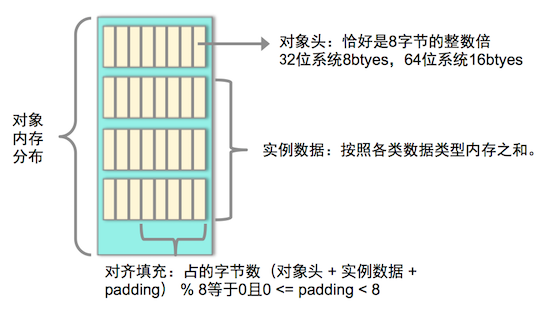
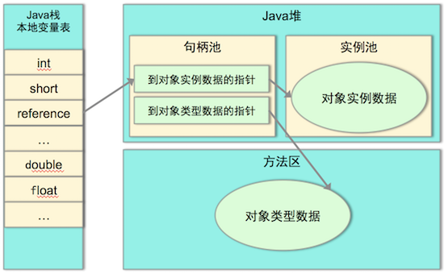
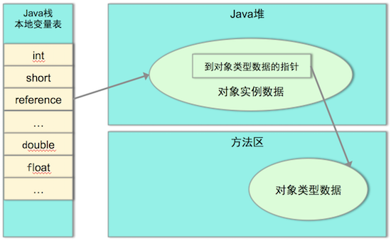
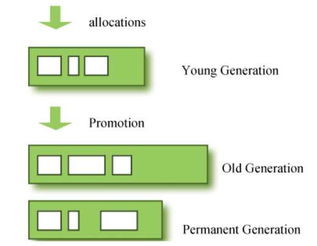
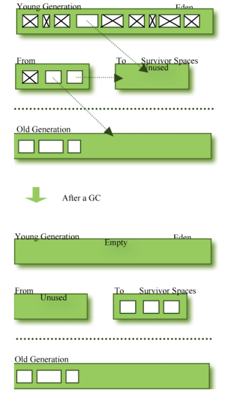

# Java内存管理机制
## 1. java与C++内存管理机制对比
> 在C++中，所有的对象都会被销毁，局部对象的销毁发生在以右花括号为界的对象作用域的末尾处，而程序猿new出来的对象则应该主动调用delete操作符从而调用析构函数去回收对象占用的内存。但是C++这种直接操作内存的方式存在很大内存泄露风险，而且人为管理内存复杂且困难。

> 在java中，内存管理由JVM完全负责，java中的“垃圾回收器”负责自动回收无用对象占据的内存资源，这样可以大大减少程序猿在内存管理上花费的时间，可以更集中于业务逻辑和具体功能实现；但这并不是说java有了垃圾回收器程序猿就可以高枕无忧，将内存管理抛之脑外了！一方面，实际上java中还存在垃圾回收器没法回收以某种“特殊方式”分配的内存的情况(这种特殊方式我们将在下文中进行详细描述)；另一方面，java的垃圾回收是不能保证一定发生的，除非JVM面临内存耗尽的情况。所以java中部分对象内存还是需要程序猿手动进行释放，合理地对部分对象进行管理可以减少内存占用与资源消耗。


## 2、 Java 虚拟机内存
#### 2.1、JVM分类：  

与高性能的C/C++相比，Java具有gc机制，并且没有那让人望而生畏的指针，上手门槛相对较低；而与上手成本更低的PHP、Ruby等脚本语言来说，又比这些脚本语言有性能上的优势(这里暂时忽略FB自己开发的HHVM)。  
对于Java来说，最终是要依靠字节码运行在jvm上的。目前，常见的jvm有以下几种：  
1）Sun HotSpot 应用最广
2）BEA Jrockit
3）IBM J9
4）Dalvik(Android)--移动端市场

####  2.2、Java运行时的内存模型  


1. **程序计数器（Program Counter Register）**

    	程序计数器，是一个比较小的内存区域，用于指示当前线程所执行的字节码执行到了第几行,可以看做是当前线程所执行的字节码的行号指示器。在虚拟机的概念模型里，字节码解释器工作就是通过改变程序计数器的值来选择下一条需要执行的字节码指令，分支、循环、跳转、异常处理、线程恢复等基础功能都要依赖这个计数器来完成。  

   ​	多线程中，为了让线程切换后能恢复到正确的执行位置，每条线程都需要有一个独立的程序计数器，各条线程之间互不影响、独立存储，因此这块内存是 线程私有的。  

   ​	当线程正在执行的是一个Java方法，这个计数器记录的是在正在执行的虚拟机字节码指令的地址；当执行的是Native方法，这个计数器值为Undefined。 由于程序计数器只是记录当前指令地址，所以不存在内存溢出的情况，此内存区域是唯一一个没有规定任何OutOfMemoryError情况的区域 。

2. **Java虚拟机栈  (Java Stack)**

   ​	Java虚拟机栈也是线程私有的 ，它的生命周期与线程相同。虚拟机栈描述的是Java方法执行的内存模型：一个线程的每个方法在执行的同时，都会创建一个栈帧（Statck Frame），栈帧中存储的有局部变量表、操作站、动态链接、方法出口等，当方法被调用时，栈帧在JVM栈中入栈，当方法执行完成时，栈帧出栈。

   ​	局部变量表中存储着方法的相关局部变量，包括各种基本数据类型，对象的引用，返回地址等。在局部变量表中，只有long和double类型会占用2个局部变量空间（Slot，对于32位机器，一个Slot就是32个bit），其它都是1个Slot。需要注意的是，局部变量表是在编译时就已经确定好的，方法运行所需要分配的空间在栈帧中是完全确定的，在方法的生命周期内都不会改变。

   ​	虚拟机栈中定义了两种异常，如果线程调用的栈深度大于虚拟机允许的最大深度，则抛出StatckOverFlowError（栈溢出）；不过多数Java虚拟机都允许动态扩展虚拟机栈的大小(有少部分是固定长度的)，所以线程可以一直申请栈，直到内存不足，此时，会抛出OutOfMemoryError（内存溢出）。 

   ​	 如果扩展时无法申请到足够的内存，就会抛出OutOfMemoryError异常。

3. **本地方法栈 (Native Method Stack)**

   ​	本地方法栈与虚拟机的作用相似，不同之处在于虚拟机栈为虚拟机执行的Java方法服务，而本地方法栈则为虚拟机使用到的Native方法服务。有的虚拟机直接把本地方法栈和虚拟机栈合二为一。  

   ​	本地方法栈也是线程私有的。 会抛出stackOverflowError和OutOfMemoryError异常。

4. **Java堆(Heap)**

   ​	堆区是理解Java GC机制最重要的区域，没有之一。在JVM所管理的内存中，堆区是最大的一块，堆区也是Java GC机制所管理的主要内存区域，堆区由所有线程共享，在虚拟机启动时创建。堆区的存在是为了存储对象实例，原则上讲，所有的对象都在堆区上分配内存（不过现代技术里，也不是这么绝对的，也有栈上直接分配的）。

   ​	一般的，根据Java虚拟机规范规定，堆内存需要在逻辑上是连续的（在物理上不需要），在实现时，可以是固定大小的，也可以是可扩展的，目前主流的虚拟机都是可扩展的。如果在执行垃圾回收之后，仍没有足够的内存分配，也不能再扩展，将会抛出OutOfMemoryError:Java heap space异常。

   ​	关于堆区的内容还有很多，将在下节“Java内存分配机制”中详细介绍。

5. **方法区(Method Area)**

   ​	在Java虚拟机规范中，将方法区作为堆的一个逻辑部分来对待，但事实上，方法区并不是堆（Non-Heap）；另外，不少人的博客中，将Java GC的分代收集机制分为3个代：青年代，老年代，永久代，这些作者将方法区定义为“永久代”，这是因为，对于之前的HotSpot Java虚拟机的实现方式中，将分代收集的思想扩展到了方法区，并将方法区设计成了永久代。不过，除HotSpot之外的多数虚拟机，并不将方法区当做永久代，HotSpot本身，也计划取消永久代。本文中，由于笔者主要使用Oracle JDK6.0，因此仍将使用永久代一词。

   ​	方法区是各个线程共享的区域，用于存储已经被虚拟机加载的类信息（即加载类时需要加载的信息，包括版本、field、方法、接口等信息）、final常量、静态变量、编译器即时编译的代码等。

   ​	方法区在物理上也不需要是连续的，可以选择固定大小或可扩展大小，并且方法区比堆还多了一个限制：可以选择是否执行垃圾收集。一般的，方法区上执行的垃圾收集是很少的，这也是方法区被称为永久代的原因之一（HotSpot），但这也不代表着在方法区上完全没有垃圾收集，其上的垃圾收集主要是针对常量池的内存回收和对已加载类的卸载。

   ​	在方法区上进行垃圾收集，条件苛刻而且相当困难，效果也不令人满意，所以一般不做太多考虑，可以留作以后进一步深入研究时使用。

   ​	在方法区上定义了OutOfMemoryError:PermGen space异常，在内存不足时抛出。

   ​	【**运行时常量池（Runtime Constant Pool）**】是方法区的一部分，用于存储编译期就生成的字面常量、符号引用、翻译出来的直接引用（符号引用就是编码是用字符串表示某个变量、接口的位置，直接引用就是根据符号引用翻译出来的地址，将在类链接阶段完成翻译）；运行时常量池除了存储编译期常量外，也可以存储在运行时间产生的常量（比如String类的intern()方法，作用是String维护了一个常量池，如果调用的字符“abc”已经在常量池中，则返回池中的字符串地址，否则，新建一个常量加入池中，并返回地址）。

6. **直接内存(Direct Memory)**

   ​	直接内存并不是JVM管理的内存，可以这样理解，直接内存，就是JVM以外的机器内存，比如，你有4G的内存，JVM占用了1G，则其余的3G就是直接内存，在jdk1.4之后新加入了NIO，在NIO类中引入一种基于通道（Channel）和缓冲区（Buffer）的内存分配方式，将由C语言实现的native函数库分配在直接内存中，用存储在JVM堆中的DirectByteBuffer来引用。由于直接内存收到本机器内存的限制，所以也可能出现OutOfMemoryError的异常。

   

## 4. 对象的创建，布局和访问过程  
#### 4.1 对象的创建
  创建一个对象通常是需要new关键字，当虚拟机遇到一条new指令时，首先检查这个指令的参数是否在常量池中定位到一个类的符号引用，并且检查这个符号引用代表的类是否已被加载、解析和初始化过。如果那么执行相应的类加载过程。  

  类加载检查通过后，虚拟机将为新生对象分配内存。为对象分配空间的任务等同于把一块确定大小的内存从Java堆中划分出来。分配的方式有两种： 一种叫 指针碰撞 ，假设Java堆中内存是绝对规整的，用过的和空闲的内存各在一边，中间放着一个指针作为分界点的指示器，分配内存就是把那个指针向空闲空间的那边挪动一段与对象大小相等的距离。 另一种叫 空闲列表 ：如果Java堆中的内存不是规整的，虚拟机就需要维护一个列表，记录哪个内存块是可用的，在分配的时候从列表中找到一块足够大的空间划分给对象实例，并更新列表上的记录。 采用哪种分配方式是由Java堆是否规整决定的，而Java堆是否规整是由所采用的垃圾收集器是否带有压缩整理功能决定的。 另 外一个需要考虑的问题就是对象创建时的线程安全问题，有两种解决方案：一是对分配内存空间的动作进行同步处理；另一种是吧内存分配的动作按照线程划分在不 同的空间之中进行，即每个线程在Java堆中预先分配一小块内存(TLAB)，哪个线程要分配内存就在哪个线程的TLAB上分配，只有TLAB用完并分配 新的TLAB时才需要同步锁定。

  内存分配完成后，虚拟机需要将分配到的内存空间初始化为零值。这一步操作保证了对象的实例字段在Java代码中可以不赋初始值就可以直接使用。

接下来虚拟机要对对象进行必要的设置，例如这个对象是哪个类的实例、如何才能找到类的元数据信息等，这些信息存放在对象的对象头中。

上面的工作都完成以后，从虚拟机的角度来看一个新的对象已经产生了。但是从Java程序的角度，还需要执行init方法，把对象按照程序员的意愿进行初始化，这样一个真正可用的对象才算完全产生出来。

#### 4.2 对象的内存布局
  在HotSpot虚拟机中，对象在内存中存储的布局可分为三个部分： 对象头（header）、实例数据（Instance Data）和对齐填充(Padding)。

  对象头包括两个部分：
  第一部分用于存储对象自身的运行时数据，如hashCode、GC分代年龄、锁状态标志、线程持有的锁、偏向线程ID、偏向时间戳等。这部分数据的长度在32位和64的虚拟机（未开启指针压缩）中分别为4B和8B，官方称之为”Mark Word”。
  第二个部分为是类型指针（kclass），即对象指向它的类元数据的指针，虚拟机通过这个指针来确定这个对象是那个类的实例。另外如果对象是一个Java数组，那再对象头中还必须有一块用于记录数组长度的数据，因为虚拟机可以通过普通Java对象的元数据信息确定Java对象的大小，但是从数组的元数据中却无法确定数组的大小。
  对象头在32位系统上占用8B，64位系统上占16B。 无论是32位系统还是64位系统，对象都采用8字节对齐。Java在64位模式下开启指针压缩，比32位模式下，头部会大4B（mark区域变位8B,kclass区域被压缩），如果没有开启指针压缩，头部会大8B（mark和kclass都是8B），换句话说，
HotSpot的对齐方式为8字节对齐：(对象头+实例数据+padding)%8 等于0 且 0<=padding<8。以下说明都是以HotSpot为基准。

  实例数据是对象真正存储的有效信息，也是程序代码中所定义的各种类型的字段内容。  
  **
  原生类型（基本数据类型）: 按基本数据大小计算；(按字节byte计算)  
  reference类型（引用类型）: 在32位系统上每个占用4bytes, 在64位系统上每个占用8bytes。
  **

  对齐填充并不是必然存在的，仅仅起着占位符的作用。Hotpot VM要求对象起始地址必须是8字节的整数倍，对象头部分正好是8字节的倍数，所以当实例数据部分没有对齐时，需要通过对齐填充来对齐。  



#### 4.3 对象的访问定位
Java程序通过栈上的reference数据来操作堆上的具体对象。主要的访问方式有使用句柄和直接指针两种：

句柄：Java堆将会划出一块内存来作为句柄池，引用中存储的就是对象的句柄地址，而句柄中包含了对象实例数据与类型数据各自的具体地址信息 。如图所示：  
    
直接指针：Java堆对象的布局要考虑如何放置访问类型数据的相关信息，引用中存储的就是对象地址 。如图所示：
  
两个方式各有优点，使用句柄最大的好处是引用中存储的是稳定的句柄地址，对象被移动时只会改变句柄中实例的地址，引用不需要修改、使用直接指针访问的好处是速度更快，它节省了一次指针定位的时间开销。

#### 4.5 对象占内存计算
指针压缩：对象占用的内存大小受到JVM参数[UseCompressedOops](file:///Volumes/C/Study/Java%20（重点）/Java base notes/JvmCompressOops.md)的影响。  
开启指针优化 java -XX:+UseCompressedOops class ;关闭指针优化 java -XX:-UseCompressedOops class; 

1. 对对象头的影响：64位机器，对象头大小为12字节 ＝ 12bytes ＝ 12*8bits 
```
static class A {
        int a;
    }
```
A对象占用内存情况：
关闭指针压缩： 16+4=20不是8的倍数，所以+padding/4=24;
开启指针压缩： 12+4=16已经是8的倍数了，不需要再padding。  
2. 对reference类型的影响：64位机器上reference类型占用8个字节，开启指针压缩后占用4个字节。  
```
static class B2 {
        int b2a;
        Integer b2b;
}
```
B2对象占用内存情况：
关闭指针压缩： 16+4+8=28不是8的倍数，所以+padding/4=32;
开启指针压缩： 12+4+4=20不是8的倍数，所以+padding/4=24;
3. 对数组对象的影响： 64位机器上，数组对象的对象头占用24个字节，启用压缩之后占用16个字节。之所以比普通对象占用内存多是因为需要额外的空间存储数组的长度。  
```
static class B3 {
        int a;
        Integer b;
    }
```
new B3[3]占用的内存大小：
未开启压缩：48
开启压缩后：32

4. 复合对象计算：  
```
static class B {
        int a;
        int b;
    }
```
```
static class C {
    int ba;
    B[] as = new B[3];
	C() {
         for (int i = 0; i < as.length; i++) {
            as[i] = new B();
          }
       }
    }
```
对象C占内存的情况：
未开启压缩：
(16 + 4 + 8+4(padding)) + (24+ 8\*3) +(16+8)\*3 = 152bytes
开启压缩：
(12 + 4 + 4 +4(padding)) + (16 + 4\*3 +4(数组对象padding)) + (12+8+4（B对象padding）)\*3= 128bytes


### 5.OutOfMemoryError异常
如果这种虚拟机不支持动态扩展，那么将会抛出StackOverflow异常。如果支持动态扩展，那么这个栈会请求再扩展部分空间。当然内存不是无穷的，如果频繁扩展内存，以至于无法再继续扩展了，这时候会抛出OutOfMemory异常。

#### 5.1 Java堆溢出
StringBuilder创建的字符串实例在Java堆上；  
Java堆用于存储对象实例，只要不断的创建对象，并且保证GCRoots到对象之间有可达路径来避免垃圾回收机制清除这些对象，那么在数量到达最大堆的容量限制后就会产生内存溢出异常。  
　　如果是内存泄漏，可进一步通过工具查看泄漏对象到GC Roots的引用链。于是就能找到泄漏对象是通过怎样的路劲与GC Roots相关联并导致垃圾收集器无法自动回收它们的。掌握了泄漏对象的类型信息及GC Roots引用链的信息，就可以比较准确的定位出泄漏代码的位置。  
　　如果不存在泄漏，换句话说，就是内存中的对象确实都还必须存活着，那就应当检查虚拟机的堆参数（-Xmx与-Xms）,与机器物理内存对比看是否还可以调大，从代码上检查是否存在某些对象生命周期过长，持有状态时间过长的情况，尝试见啥程序运行期的内存消耗。  
　　Xmx最大内存，Xms:最小堆内存，当Xmx=Xms时堆不扩展。-XX:+HeapDumpOnOutOfMemoryError ；实例化大量对象可测试堆溢出。  
　　OOM解决：增大xmx扩大堆内存

#### 5.2 虚拟机栈和本地方法栈溢出
对于Hotspot来说，虽然-Xoss参数（设置本地方栈大小）存在，但实际上是无效的，栈容量只由-Xss参数设定。关于虚拟机栈和本地方法栈，在Java虚拟机规范中描述了两种异常：  
　　如果线程请求的栈深度大于虚拟机所允许的最大深度，将抛出StackOverflowError。  
　　如果虚拟机在扩展栈时无法申请到足够的内存空间，则抛出OutOfMemoryError异常。  
　　在单线程下，无论由于栈帧太大还是虚拟机栈容量太小，当内存无法分配的时候，虚拟机抛出的都是StackOverflowError异常。  
　　如果是多线程导致的内存溢出，与栈空间是否足够大并不存在任何联系，这时候每个线程的栈分配的内存越大，反而越容易产生内存溢出异常。解决的时候是在不能减少线程数或更换64位的虚拟机的情况下，就只能通过减少最大堆和减少栈容量来换取更多是线程。  
　　Xss:每个栈的大小；Xoss：本地方法栈大小，不过实际上xoss无效，栈容量只由-Xss参数设置。 

OOM/StackOverflowError解决：  
　　(1)OOM:由于栈内存=操作系统内存 - 堆内存 - 方法区内存 - 程序计数器内存，所有可以减小堆内存来扩大栈内存大小。栈内存大小影响系统并发线程量（栈内存>=每个栈的大小xss * 线程量）;具体设置由n台服务器，每台服务器m个cpu,则最大线程量=n * m;每个栈的大小xss<=栈内存/n*m; 注意一下有个问题 ，这个公式没有直接内存？  
　　(2)StackOverflowError深度：如果使用jvm默认设置，栈的深度大多数情况下可达到1000~2000,足以在日常开发中使用。注意避免代码中存在超过1000的方法嵌套。每个方法嵌套对应一个栈帧。  
　　(3)StackOverflowError栈帧大小：单线程下避免代码中存在大量基本类型或对象引用。  
　　
#### 5.3 方法区和运行时常量池溢出
String.intern（）是一个Native方法，它的作用是：如果字符串常量池中已经包含一个等于此String对象的字符串，则返回代表池中这个字符串的String对象；否则，将此String对象包含的字符串添加到常量池中，并且返回此String对象的引用。  
　　由于常量池分配在永久代中，可以通过-XX:PermSize和_XX:MaxPermSize限制方法区大小，从而间接限制其中常量池的容量。  
　　Intern（）  
　　JDK1.6 intern（）方法会把首次遇到的字符串实例复制到永久代，返回的也是永久代中这个字符串实例的引用，而由StringBuilder创建的字符串实例在Java堆上，所以必然不是一个引用。  
　　JDK1.7 intern（）方法的实现不会再复制实例，只是在常量池中记录首次出现的实例引用，因此intern（）返回的引用和由StringBuilder创建的那个字符串实例是同一个。    
　　OOM解决：避免大量的string.intern()；避免大量的动态java（jsp,java反射）。
　　
#### 5.4 本机直接内存溢出：-XX:MaxDirectMemorySize：最大直接内存；默认为Xmx
OOM解决：使用NIO分配本机内存多注意是否超过MaxDirectMemorySize；平常开发容易忽略直接内存；

### 6. JAVA 内存分配机制
这里所说的内存分配，主要指的是在堆上的分配，一般的，对象的内存分配都是在堆上进行，但现代技术也支持将对象拆成标量类型（标量类型即原子类型，表示单个值，可以是基本类型或String等），然后在栈上分配，在栈上分配的很少见，我们这里不考虑。

　　Java内存分配和回收的机制概括的说，就是：分代分配，分代回收。对象将根据存活的时间被分为：年轻代（Young Generation）、年老代（Old Generation）、永久代（Permanent Generation，也就是方法区）。如下图（来源于《成为JavaGC专家part I》，http://www.importnew.com/1993.html）：  
　　

年轻代（Young Generation）：对象被创建时，内存的分配首先发生在年轻代（大对象可以直接被创建在年老代），大部分的对象在创建后很快就不再使用，因此很快变得不可达，于是被年轻代的GC机制清理掉（IBM的研究表明，98%的对象都是很快消亡的），这个GC机制被称为Minor GC或叫Young GC。注意，Minor GC并不代表年轻代内存不足，它事实上只表示在Eden区上的GC。

　　年轻代上的内存分配是这样的，年轻代可以分为3个区域：Eden区（伊甸园，亚当和夏娃偷吃禁果生娃娃的地方，用来表示内存首次分配的区域，再贴切不过）和两个存活区（Survivor 0 、Survivor 1）。内存分配过程为（来源于《成为JavaGC专家part I》，http://www.importnew.com/1993.html）：　  
　　  

1.绝大多数刚创建的对象会被分配在Eden区，其中的大多数对象很快就会消亡。Eden区是连续的内存空间，因此在其上分配内存极快；  
2. 最初一次，当Eden区满的时候，执行Minor GC，将消亡的对象清理掉，并将剩余的对象复制到一个存活区Survivor0（此时，Survivor1是空白的，两个Survivor总有一个是空白的）；  
3.下次Eden区满了，再执行一次Minor GC，将消亡的对象清理掉，将存活的对象复制到Survivor1中，然后清空Eden区；
4.将Survivor0中消亡的对象清理掉，将其中可以晋级的对象晋级到Old区，将存活的对象也复制到Survivor1区，然后清空Survivor0区；  
5.当两个存活区切换了几次（HotSpot虚拟机默认15次，用-XX:MaxTenuringThreshold控制，大于该值进入老年代，但这只是个最大值，并不代表一定是这个值）之后，仍然存活的对象（其实只有一小部分，比如，我们自己定义的对象），将被复制到老年代。  

　　从上面的过程可以看出，Eden区是连续的空间，且Survivor总有一个为空。经过一次GC和复制，一个Survivor中保存着当前还活着的对象，而Eden区和另一个Survivor区的内容都不再需要了，可以直接清空，到下一次GC时，两个Survivor的角色再互换。因此，这种方式分配内存和清理内存的效率都极高，这种垃圾回收的方式就是著名的“停止-复制（Stop-and-copy）”清理法（将Eden区和一个Survivor中仍然存活的对象拷贝到另一个Survivor中），这不代表着停止复制清理法很高效，其实，它也只在这种情况下高效，如果在老年代采用停止复制，则挺悲剧的。

　　在Eden区，HotSpot虚拟机使用了两种技术来加快内存分配。分别是bump-the-pointer和TLAB（Thread-Local Allocation Buffers），这两种技术的做法分别是：由于Eden区是连续的，因此bump-the-pointer技术的核心就是跟踪最后创建的一个对象，在对象创建时，只需要检查最后一个对象后面是否有足够的内存即可，从而大大加快内存分配速度；而对于TLAB技术是对于多线程而言的，将Eden区分为若干段，每个线程使用独立的一段，避免相互影响。TLAB结合bump-the-pointer技术，将保证每个线程都使用Eden区的一段，并快速的分配内存。

　　年老代（Old Generation）：对象如果在年轻代存活了足够长的时间而没有被清理掉（即在几次Young GC后存活了下来），则会被复制到年老代，年老代的空间一般比年轻代大，能存放更多的对象，在年老代上发生的GC次数也比年轻代少。当年老代内存不足时，将执行Major GC，也叫 Full GC。　　

 　　可以使用-XX:+UseAdaptiveSizePolicy开关来控制是否采用动态控制策略，如果动态控制，则动态调整Java堆中各个区域的大小以及进入老年代的年龄。
　　如果对象比较大（比如长字符串或大数组），Young空间不足，则大对象会直接分配到老年代上（大对象可能触发提前GC，应少用，更应避免使用短命的大对象）。用-XX:PretenureSizeThreshold来控制直接升入老年代的对象大小，大于这个值的对象会直接分配在老年代上。

　　可能存在年老代对象引用新生代对象的情况，如果需要执行Young GC，则可能需要查询整个老年代以确定是否可以清理回收，这显然是低效的。解决的方法是，年老代中维护一个512 byte的块——”card table“，所有老年代对象引用新生代对象的记录都记录在这里。Young GC时，只要查这里即可，不用再去查全部老年代，因此性能大大提高。
　　
　　
### 7.Java GC机制
GC机制的基本算法是：分代收集，这个不用赘述。下面阐述每个分代的收集方法。

　年轻代：

　　事实上，在上一节，已经介绍了新生代的主要垃圾回收方法，在新生代中，使用“停止-复制”算法进行清理，将新生代内存分为2部分，1部分 Eden区较大，1部分Survivor比较小，并被划分为两个等量的部分。每次进行清理时，将Eden区和一个Survivor中仍然存活的对象拷贝到 另一个Survivor中，然后清理掉Eden和刚才的Survivor。

　　这里也可以发现，停止复制算法中，用来复制的两部分并不总是相等的（传统的停止复制算法两部分内存相等，但新生代中使用1个大的Eden区和2个小的Survivor区来避免这个问题）

　　由于绝大部分的对象都是短命的，甚至存活不到Survivor中，所以，Eden区与Survivor的比例较大，HotSpot默认是 8:1，即分别占新生代的80%，10%，10%。如果一次回收中，Survivor+Eden中存活下来的内存超过了10%，则需要将一部分对象分配到 老年代。用-XX:SurvivorRatio参数来配置Eden区域Survivor区的容量比值，默认是8，代表Eden：Survivor1：Survivor2=8:1:1.

　　老年代：

　　老年代存储的对象比年轻代多得多，而且不乏大对象，对老年代进行内存清理时，如果使用停止-复制算法，则相当低效。一般，老年代用的算法是标记-整理算法，即：标记出仍然存活的对象（存在引用的），将所有存活的对象向一端移动，以保证内存的连续。
     在发生Minor GC时，虚拟机会检查每次晋升进入老年代的大小是否大于老年代的剩余空间大小，如果大于，则直接触发一次Full GC，否则，就查看是否设置了-XX:+HandlePromotionFailure（允许担保失败），如果允许，则只会进行MinorGC，此时可以容忍内存分配失败；如果不允许，则仍然进行Full GC（这代表着如果设置-XX:+Handle PromotionFailure，则触发MinorGC就会同时触发Full GC，哪怕老年代还有很多内存，所以，最好不要这样做）。
     
　　方法区（永久代）：

　　永久代的回收有两种：常量池中的常量，无用的类信息，常量的回收很简单，没有引用了就可以被回收。对于无用的类进行回收，必须保证3点：

    1.类的所有实例都已经被回收
    2.加载类的ClassLoader已经被回收
    3.类对象的Class对象没有被引用（即没有通过反射引用该类的地方）

  永久代的回收并不是必须的，可以通过参数来设置是否对类进行回收。HotSpot提供-Xnoclassgc进行控制
     使用-verbose，-XX:+TraceClassLoading、-XX:+TraceClassUnLoading可以查看类加载和卸载信息
     -verbose、-XX:+TraceClassLoading可以在Product版HotSpot中使用；
     -XX:+TraceClassUnLoading需要fastdebug版HotSpot支持
     
 ** 更多了解，参考：http://www.cnblogs.com/zhguang/p/3257367.html **
　　
　　
　　
　　
　　
　　
　　
　　
　　
　　
　　
　　
　　
　　
　　
　　
　　
　　
　　
　　
　　
　　
　　
　　
　　
　　
　　
　　
　　
　　
　　


