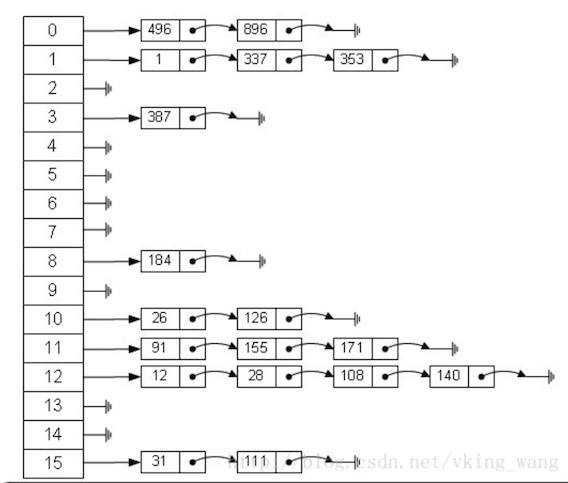

# Hash的基本原理与实现

打个比方说明Hash目的：  

我们每个活在世上的人，为了能够参与各种社会活动，都需要一个用于识别自己的标志。也许你觉得名字或是身份证就足以代表你这个人，但是这种代表性非常脆弱，因为重名的人很多，身份证也可以伪造。最可靠的办法是把一个人的所有基因序列记录下来用来代表这个人，但显然，这样做并不实际。而指纹看上去是一种不错的选择，虽然一些专业组织仍然可以模拟某个人的指纹，但这种代价实在太高了。   

**Hash简单目的：获取对应的指纹！详解参考下面：**

## 一、 概述

### 1.1 什么是Hash？
**Hash**: 一般翻译做“散列”，也有直接音译为“哈希”的，就是把任意长度的输入（又叫做预映射pre-image）通过散列算法变换成固定长度的输出，该输出就是散列值。这种转换是一种压缩映射，也就是，散列值的空间通常远小于输入的空间，不同的输入可能会散列成相同的输出，所以不可能从散列值来确定唯一的输入值。

**Hash（hash函数）简单的说:就是一种将任意长度的消息压缩到某一固定长度的消息摘要的函数。更直观解释起来，就是对一串数据m进行杂糅，输出另一段固定长度的数据h，作为这段数据的特征（指纹）的函数/方法。**

### 1.2 散列值
先看一张图：


从图来看，输入的key值由Hash函数转化成相应的散列值，存放在相应的bucket中。这些buckets(桶)的集合组成了散列表、即Hash表。我们使用桶（bucket）来保存键值对(key-value)，我们前面所说的数组索引即为桶号，决定了给定的键存于散列表的哪个桶中。散列表所拥有的桶数被称为散列表的容量（capacity）。

**散列值关键几个结论： ** 
1、如果散列表中存在和散列原始输入K相等的记录，那么K必定在f(K)的存储位置上;  
2、不同关键字经过散列算法变换后可能得到同一个散列地址、即key1!=key2,f(key1)=f(key2)，这种现象称为碰撞;   
3、如果两个Hash值不同（前提是同一Hash算法），那么这两个Hash值对应的原始输入必定不同;**


### 1.3 Hash表 / 散列表
符号表是一种用于存储键值对（key-value pair）的数据结构，我们平常经常使用的数组也可以看做是一个特殊的符号表，数组中的“键”即为数组索引，值为相应的数组元素。也就是说，当符号表中所有的键都是较小的整数时，我们可以使用数组来实现符号表，将数组的索引作为键，而索引处的数组元素即为键对应的值，但是这一表示仅限于所有的键都是比较小的整数时，否则可能会使用一个非常大的数组。散列表是对以上策略的一种“升级”，但是它可以支持任意的键而并没有对它们做过多的限定。对于基于散列表实现的符号表，若我们要在其中查找一个键，需要进行以下步骤：

1. 首先我们使用散列函数将给定键转化为一个“数组的索引”，理想情况下，不同的key会被转为不同的索引，但在实际应用中我们会遇到不同的键转为相同的索引的情况，这种情况叫做碰撞。解决碰撞的方法我们后面会具体介绍。
2. 得到了索引后，我们就可以像访问数组一样，通过这个索引访问到相应的键值对。

以上就是散列表的核心思想，散列表是时空权衡的经典例子。  

a. 当我们的空间无限大时，我们可以直接使用一个很大的数组来保存键值对，并用key作为数组索引，因为空间不受限，所以我们的键的取值可以无穷大，因此查找任何键都只需进行一次普通的数组访问;(如同数组的特点：寻址容易，插入和删除困难)  

b. 若对查找操作没有任何时间限制，我们就可以直接使用链表来保存所有键值对，这样把空间的使用降到了最低，但查找时只能顺序查找。(如同链表的特点：寻址困难，插入和删除容易)

在实际的应用中，我们的时间和空间都是有限的，所以我们必须在两者之间做出权衡，散列表就在时间和空间的使用上找到了一个很好的平衡点。散列表的一个优势在于我们只需调整散列算法的相应参数而无需对其他部分的代码做任何修改就能够在时间和空间的权衡上做出策略调整。

现在假设我们的散列表中有M个桶，桶号为0到M-1。我们的散列函数的功能就是把任意给定的key转为[0, M-1]上的整数。我们对散列函数有两个基本要求：

1. 是计算时间要短，
2. 是尽可能把键分布在不同的桶中。

对于不同类型的键，我们需要使用不同的散列函数，这样才能保证有比较好的散列效果。我们使用的散列函数应该尽可能满足均匀散列假设，以下对均匀散列假设的定义来自于Sedgewick的《算法》一书：（均匀散列假设）我们使用的散列函数能够均匀并独立地将所有的键散布于0到M – 1之间。   

   以上定义中有两个关键字，第一个是均匀，意思是我们对每个键计算而得的桶号有M个“候选值”，而均匀性要求这M个值被选中的概率是均等的；第二个关键字是独立，它的意思是，每个桶号被选中与否是相互独立的，与其他桶号是否被选中无关。这样一来，满足均匀性与独立性能够保证键值对在散列表的分布尽可能的均匀，不会出现“许多键值对被散列到同一个桶，而同时许多桶为空”的情况。

   显然，设计一个较好的满足均匀散列假设的散列函数是不容易的，好消息是通常我们无需设计它，因为我们可以直接使用一些基于概率统计的高效的实现，比如Java中许多常用的类都重写了hashCode方法（Object类的hashCode方法默认返回对象的内存地址），用于为该类型对象返回一个hashCode，通常我们用这个hashCode除以桶数M的余数就可以获取一个桶号。

### 1.4 hashCode
Object提供给我们了一个Native的方法“public native int hashCode(); 是由底层 c/c++语言实现的！

经查资源，获知信息如下：  
1) hashCode是jdk根据对象的地址/字符串/数字经Hash函数算出来的int类型的数值；（默认位Object native hashCode()方法实现,可以查看源码了解）  

2) public int hashCode()返回该对象的哈希码值。支持此方法是为了提高哈希表（例如 java.util.Hashtable 提供的哈希表）的性能。

**从上两点看，hashCode就是哈希值或散列值。并是对象的物理内存地址经过hash算法，得到的相应的hash值。所以，有时会说hashCode就是物理内存地址。但是这种说法不完全正确。其正确说法：hashCode是对象在hash表中的位置！一般hash值是由对象内存地址转化而来，但是当我们重写hashCode()方法后，其意义就有所改变，若String类、Integer类、Date类等**

**HashCode几个关键点：**

1. HashCode的存在主要是为了查找的快捷性，HashCode是用来在散列存储结构中确定对象的存储地址的;

2. 如果两个对象equals相等，那么这两个对象的HashCode一定也相同，或者说同一对象多次调用hashCode必须一致;

3. 如果对象的equals方法被重写，那么对象的HashCode方法也尽量重写;

4. 如果两个对象的HashCode相同，不代表两个对象就相同，只能说明这两个对象在散列存储结构中，存放于同一个位置;(不就是散列值碰撞嘛！)

5. 如果两个对象的HashCode都不相同，那么这两个对象必定是不同的;

### 1.5 hashcode有什么作用呢？

　　前面说了这么多关于hash函数，和hashcode是怎么得来的，还有hashcode对应的是hash表中的位置，可能大家就有疑问，为什么hashcode不直接写物理地址呢，还要另外用一张hash表来代表对象的地址？接下来就告诉你hashcode的作用，

　　HashCode的存在主要是为了查找的快捷性，HashCode是用来在散列存储结构中确定对象的存储地址的(后半句说的用hashcode来代表对象就是在hash表中的位置)

　　为什么hashcode就查找的更快，比如：我们有一个能存放1000个数这样大的内存中，在其中要存放1000个不一样的数字，用最笨的方法，就是存一个数字，就遍历一遍，看有没有相同得数，当存了900个数字，开始存901个数字的时候，就需要跟900个数字进行对比，这样就很麻烦，很是消耗时间，用hashcode来记录对象的位置，来看一下。hash表中有1、2、3、4、5、6、7、8个位置，存第一个数，hashcode为1，该数就放在hash表中1的位置，存到100个数字，hash表中8个位置会有很多数字了，1中可能有20个数字，存101个数字时，他先查hashcode值对应的位置，假设为1，那么就有20个数字和他的hashcode相同，他只需要跟这20个数字相比较(equals)，如果每一个相同，那么就放在1这个位置，这样比较的次数就少了很多，实际上hash表中有很多位置，这里只是举例只有8个，所以比较的次数会让你觉得也挺多的，实际上，如果hash表很大，那么比较的次数就很少很少了。  通过对原始方法和使用hashcode方法进行对比，我们就知道了hashcode的作用，并且为什么要使用hashcode了。

   **注意：平时直接输出对象，相当于obj.toString().这时来看，相当于输出对象的hashcode值，因为最终调用方式如下：**

```java
public String toString() {
        return getClass().getName() + "@" + Integer.toHexString(hashCode()); //将hashCode转换
    }
```


## 二、散列算法（Hash算法、散列函数）  

对于在互联网世界里传送的文件来说，如何标志一个文件的身份同样重要。比如说我们下载一个文件，文件的下载过程中会经过很多网络服务器、路由器的中转，如何保证这个文件就是我们所需要的呢？我们不可能去一一检测这个文件的每个字节，也不能简单地利用文件名、文件大小这些极容易伪装的信息，这时候，我们就需要一种指纹一样的标志来检查文件的可靠性，这种指纹就是我们现在所用的Hash算法得到的散列值(也叫散列算法)。

**散列算法（Hash Algorithm），又称哈希算法，杂凑算法，是一种从任意文件中创造小的数字「指纹」的方法。**  

与指纹一样，散列算法就是一种以较短的信息来保证文件唯一性的标志，这种标志与文件的每一个字节都相关，而且难以找到逆向规律。因此，当原有文件发生改变时，其标志值也会发生改变，从而告诉文件使用者当前的文件已经不是你所需求的文件。

这种标志有何意义呢？之前文件下载过程就是一个很好的例子，事实上，现在大部分的网络部署和版本控制工具都在使用散列算法来保证文件可靠性。而另一方面，我们在进行文件系统同步、备份等工具时，使用散列算法来标志文件唯一性能帮助我们减少系统开销，这一点在很多云存储服务器中都有应用。

当然，作为一种指纹，散列算法最重要的用途在于给证书、文档、密码等高安全系数的内容添加加密保护。这一方面的用途主要是得益于散列算法的不可逆性，这种不可逆性体现在，你不仅不可能根据一段通过散列算法得到的指纹来获得原有的文件，也不可能简单地创造一个文件并让它的指纹与一段目标指纹相一致。散列算法的这种不可逆性维持着很多安全框架的运营。

### 2.1 Hash算法有什么特点
一个优秀的 hash 算法，将能实现：

1. 正向快速：给定明文和 hash 算法，在有限时间和有限资源内能计算出 hash 值。
2. 逆向困难：给定（若干） hash 值，在有限时间内很难（基本不可能）逆推出明文。
3. 输入敏感：原始输入信息修改一点信息，产生的 hash 值看起来应该都有很大不同。
4. 冲突避免：很难找到两段内容不同的明文，使得它们的 hash 值一致（发生冲突）。即对于任意两个不同的数据块，其hash值相同的可能性极小；对于一个给定的数据块，找到和它hash值相同的数据块极为困难。但在不同的使用场景中，如数据结构和安全领域里，其中对某一些特点会有所侧重。

### 2.2 Hash在管理数据结构中的应用
在用到hash进行管理的数据结构中，就对速度比较重视，对抗碰撞不太看中，只要保证hash均匀分布就可以。比如hashmap，hash值（key）存在的目的是加速键值对的查找，key的作用是为了将元素适当地放在各个桶里，对于抗碰撞的要求没有那么高。换句话说，hash出来的key，只要保证value大致均匀的放在不同的桶里就可以了。但整个算法的set性能，直接与hash值产生的速度有关，所以这时候的hash值的产生速度就尤为重要，以JDK中的String.hashCode()方法为例：

```java
public int hashCode() {
    int h = hash;
    //hash default value : 0 
    if (h == 0 && value.length > 0) {
        //value : char storage
        char val[] = value;
        for (int i = 0; i < value.length; i++) {
            h = 31 * h + val[i];
        }
        hash = h;
    }
    return h;
}
```
很简洁的一个乘加迭代运算，在不少的hash算法中，使用的是异或+加法进行迭代，速度和前者差不多。

### 2.3 Hash在在密码学中的应用
在密码学中，hash算法的作用主要是用于消息摘要和签名，换句话说，它主要用于对整个消息的完整性进行校验。举个例子，我们登陆知乎的时候都需要输入密码，那么知乎如果明文保存这个密码，那么黑客就很容易窃取大家的密码来登陆，特别不安全。那么知乎就想到了一个方法，使用hash算法生成一个密码的签名，知乎后台只保存这个签名值。由于hash算法是不可逆的，那么黑客即便得到这个签名，也丝毫没有用处；而如果你在网站登陆界面上输入你的密码，那么知乎后台就会重新计算一下这个hash值，与网站中储存的原hash值进行比对，如果相同，证明你拥有这个账户的密码，那么就会允许你登陆。银行也是如此，银行是万万不敢保存用户密码的原文的，只会保存密码的hash值而而已。在这些应用场景里，对于抗碰撞和抗篡改能力要求极高，对速度的要求在其次。

一个设计良好的hash算法，其抗碰撞能力是很高的。以MD5为例，其输出长度为128位，设计预期碰撞概率为，这是一个极小极小的数字——而即便是在MD5被王小云教授破解之后，其碰撞概率上限也高达，也就是说，至少需要找次才能有1/2的概率来找到一个与目标文件相同的hash值。而对于两个相似的字符串，MD5加密结果如下：
MD5("version1") = "966634ebf2fc135707d6753692bf4b1e";
MD5("version2") = "2e0e95285f08a07dea17e7ee111b21c8";
可以看到仅仅一个比特位的改变，二者的MD5值就天差地别了
ps : 其实把hash算法当成是一种加密算法，这是不准确的，我们知道加密总是相对于解密而言的，没有解密何谈加密呢，HASH的设计以无法解为目的的。并且如果我们不附加一个随机的salt值，HASH口令是很容易被字典攻击入侵的。

**Hash表在海量数据处理中有着广泛应用。**
> 题目：海量日志数据，提取出某日访问百度次数最多的那个IP。  
> 方案：IP的数目还是有限的，最多2^32个，所以可以考虑使用hash将ip直接存入内存，然后进行统计。

### 2.4 Hash算法是如何实现的？
密码学和信息安全发展到现在，各种加密算法和散列算法已经不是只言片语所能解释得了的。在这里我们仅提供几个简单的概念供大家参考。  

作为散列算法，首要的功能就是要使用一种算法把原有的体积很大的文件信息用若干个字符来记录，还要保证每一个字节都会对最终结果产生影响。那么大家也许已经想到了，求模这种算法就能满足我们的需要。

1.事实上，求模算法作为一种不可逆的计算方法，已经成为了整个现代密码学的根基。只要是涉及到计算机安全和加密的领域，都会有模计算的身影。散列算法也并不例外，一种最原始的散列算法就是单纯地选择一个数进行模运算，比如以下程序。

```java
 // 构造散列函数
def hash(a):
    return a % 8

//  测试散列函数功能
print(hash(233))
print(hash(234))
print(hash(235))

// 输出结果
- 1
- 2
- 3
```

2.很显然，上述的程序完成了一个散列算法所应当实现的初级目标：用较少的文本量代表很长的内容（求模之后的数字肯定小于8）。但也许你已经注意到了，单纯使用求模算法计算之后的结果带有明显的规律性，这种规律将导致算法将能难保证不可逆性。所以我们将使用另外一种手段，那就是异或。
再来看下面一段程序，我们在散列函数中加入一个异或过程。

```java
// 构造散列函数
def hash(a):
    return (a % 8) ^ 5

//  测试散列函数功能
print(hash(233))
print(hash(234))
print(hash(235))

// 输出结果
- 4
- 7
- 6
```

3.很明显的，加入一层异或过程之后，计算之后的结果规律性就不是那么明显了。
当然，大家也许会觉得这样的算法依旧很不安全，如果用户使用连续变化的一系列文本与计算结果相比对，就很有可能找到算法所包含的规律。但是我们还有其他的办法。比如在进行计算之前对原始文本进行修改，或是加入额外的运算过程（如移位），比如以下程序。

```java
// 构造散列函数
def hash(a):
    return (a + 2 + (a << 1)) % 8 ^ 5

// 测试散列函数功能
print(hash(233))
print(hash(234))
print(hash(235))

// 输出结果
- 0
- 5
- 6
```
这样处理得到的散列算法就很难发现其内部规律，也就是说，我们并不能很轻易地给出一个数，让它经过上述散列函数运算之后的结果等于4——除非我们去穷举测试。
上面的算法是不是很简单？事实上，下面我们即将介绍的常用算法MD5和SHA1，其本质算法就是这么简单，只不过会加入更多的循环和计算，来加强散列函数的可靠性。


### 2.5 Hash有哪些流行的算法
目前流行的 Hash 算法包括 MD5、SHA-1 和 SHA-2。
MD4（RFC 1320）是 MIT 的 Ronald L. Rivest 在 1990 年设计的，MD 是 Message Digest 的缩写。其输出为 128 位。MD4 已证明不够安全。
MD5（RFC 1321）是 Rivest 于1991年对 MD4 的改进版本。它对输入仍以 512 位分组，其输出是 128 位。MD5 比 MD4 复杂，并且计算速度要慢一点，更安全一些。MD5 已被证明不具备”强抗碰撞性”。
SHA （Secure Hash Algorithm）是一个 Hash 函数族，由 NIST（National Institute of Standards and Technology）于 1993 年发布第一个算法。目前知名的 SHA-1 在 1995 年面世，它的输出为长度 160 位的 hash 值，因此抗穷举性更好。SHA-1 设计时基于和 MD4 相同原理，并且模仿了该算法。SHA-1 已被证明不具”强抗碰撞性”。
为了提高安全性，NIST 还设计出了 SHA-224、SHA-256、SHA-384，和 SHA-512 算法（统称为 SHA-2），跟 SHA-1 算法原理类似。SHA-3 相关算法也已被提出。
可以看出，上面这几种流行的算法，它们最重要的一点区别就是”强抗碰撞性”。

### 2.6 MD5的实际碰撞案例
下面让我们来看看一个真实的碰撞案例。我们之所以说MD5过时，是因为它在某些时候已经很难表现出散列算法的某些优势——比如在应对文件的微小修改时，散列算法得到的指纹结果应当有显著的不同，而下面的程序说明了MD5并不能实现这一点。

```java
import hashlib

//  两段HEX字节串，注意它们有细微差别
a = bytearray.fromhex("0e306561559aa787d00bc6f70bbdfe3404cf03659e704f8534c00ffb659c4c8740cc942feb2da115a3f4155cbb8607497386656d7d1f34a42059d78f5a8dd1ef")

b = bytearray.fromhex("0e306561559aa787d00bc6f70bbdfe3404cf03659e744f8534c00ffb659c4c8740cc942feb2da115a3f415dcbb8607497386656d7d1f34a42059d78f5a8dd1ef")

//  输出MD5，它们的结果一致
print(hashlib.md5(a).hexdigest())
print(hashlib.md5(b).hexdigest())

// a和b输出结果都为：
cee9a457e790cf20d4bdaa6d69f01e41
cee9a457e790cf20d4bdaa6d69f01e41
```
而诸如此类的碰撞案例还有很多，上面只是原始文件相对较小的一个例子。事实上现在我们用智能手机只要数秒就能找到MD5的一个碰撞案例，因此，MD5在数年前就已经不被推荐作为应用中的散列算法方案，取代它的是SHA家族算法，也就是安全散列算法（Secure Hash Algorithm，缩写为SHA）。

### 2.7 SHA家族算法以及SHA1碰撞
安全散列算法与MD5算法本质上的算法是类似的，但安全性要领先很多——这种领先型更多的表现在碰撞攻击的时间开销更大，当然相对应的计算时间也会慢一点。
SHA家族算法的种类很多，有SHA0、SHA1、SHA256、SHA384等等，它们的计算方式和计算速度都有差别。其中SHA1是现在用途最广泛的一种算法。包括GitHub在内的众多版本控制工具以及各种云同步服务都是用SHA1来区别文件，很多安全证书或是签名也使用SHA1来保证唯一性。长期以来，人们都认为SHA1是十分安全的，至少大家还没有找到一次碰撞案例。
但这一事实在2017年2月破灭了。CWI和Google的研究人员们成功找到了一例SHA1碰撞，而且很厉害的是，发生碰撞的是两个真实的、可阅读的PDF文件。这两个PDF文件内容不相同，但SHA1值完全一样。(对于这件事的影响范围及讨论，可参考知乎上的讨论:如何评价 2 月 23 日谷歌宣布实现了 SHA-1 碰撞？)
所以，对于一些大的商业机构来说， MD5 和 SHA1 已经不够安全，推荐至少使用 SHA2-256 算法。


### 2.8 Hash表碰撞处理方法

##### 2.8.1 拉链法(链表法／链地址法)
   使用不同的碰撞处理方式，我们便得到了散列表的不同实现。首先我们要介绍的是使用拉链法来处理碰撞的散列表的实现。以这种方式实现的散列表，每个桶里都存放了一个链表。初始时所有链表均为空，当一个键被散列到一个桶时，这个键就成为相应桶中链表的首结点，之后若再有一个键被散列到这个桶（即发生碰撞），第二个键就会成为链表的第二个结点，以此类推。这样一来，当桶数为M，散列表中存储的键值对数目为N时，平均每个桶中的链表包含的结点数为N / M。因此，当我们查找一个键时，首先通过散列函数确定它所在的桶，这一步所需时间为O(1)；然后我们依次比较桶中结点的键与给定键，若相等则找到了指定键值对，这一步所需时间为O(N / M)。所以查找操作所需的时间为O(N / M)，而通常我们都能够保证N是M的常数倍，所以散列表的查找操作的时间复杂度为O(1)，同理我们也可以得到插入操作的复杂度也为O(1)。

```java
public class ChainingHashMap<K, V>  {
    private int num; //当前散列表中的键值对总数
    private int capacity; //桶数
    private SeqSearchST<K, V>[] st; //链表对象数组

    public ChainingHashMap(int initialCapacity) {
        capacity = initialCapacity;
        st = (SeqSearchST<K, V>[]) new Object[capacity];
        for (int i = 0; i < capacity; i++) {
            st[i] = new SeqSearchST<>();
        }
    }

    private int hash(K key) {
        return (key.hashCode() & 0x7fffffff) % capacity;
    } 

    public V get(K key) {
        return st[hash(key)].get(key);
    }

    public void put(K key, V value) {
        st[hash(key)].put(key, value);
    }
}

public class SeqSearchST<K, V> {
    private Node first;
    private class Node {
        K key;
        V val;
        Node next;
        public Node(K key, V val, Node next) {
            this.key = key;
            this.val = val;
            this.next = next;
        }
    }

    public V get(K key) {
        for (Node node = first; node != null; node = node.next) {
            if (key.equals(node.key)) {
                return node.val;
            }
        }
        return null;
    }

    public void put(K key, V val) {
        //先查找表中是否已存在相应key
        Node node;
        for (node = first; node != null; node = node.next) {
            if (key.equals(node.key)) {
                node.val = val;
                return;
            }
        }

        //表中不存在相应key
        first = new Node(key, val, first);
    }
}
```

在上面的实现中，我们固定了散列表的桶数，当我们明确知道我们要插入的键值对数目最多只能到达桶数的常数倍时，固定桶数是完全可行的。但是若键值对数目会增长到远远大于桶数，我们就需要动态调整桶数的能力。实际上，散列表中的键值对数与桶数的比值叫做负载因子（load factor）。通常负载因子越小，我们进行查找所需时间就越短，而空间的使用就越大；若负载因子较大，则查找时间会变长，但是空间使用会减小。比如，Java标准库中的HashMap就是基于拉链法实现的散列表，它的默认负载因子为0.75。HashMap实现动态调整桶数的方式是基于公式loadFactor = maxSize / capacity，其中maxSize为支持存储的最大键值对数，而loadFactor和capacity（桶数）都会在初始化时由用户指定或是由系统赋予默认值。当HashMap中的键值对的数目达到了maxSize时，就会增大散列表中的桶数。

##### 2.8.2 线性探测法
线性探测法是另一种散列表的实现策略的具体方法，这种策略叫做开放定址法。开放定址法的主要思想是：用大小为M的数组保存N个键值对，其中M > N，数组中的空位用于解决碰撞问题。
    线性探测法的主要思想是：当发生碰撞时（一个键被散列到一个已经有键值对的数组位置），我们会检查数组的下一个位置，这个过程被称作线性探测。线性探测可能会产生三种结果：
命中：该位置的键与要查找的键相同；
未命中：该位置为空；
该位置的键和被查找的键不同。
    当我们查找某个键时，首先通过散列函数得到一个数组索引后，之后我们就开始检查相应位置的键是否与给定键相同，若不同则继续查找（若到数组末尾也没找到就折回数组开头），直到找到该键或遇到一个空位置。由线性探测的过程我们可以知道，若数组已满的时候我们再向其中插入新键，会陷入无限循环之中。
    理解了以上原理，要实现基于线性探测法的散列表也就不难了。这里我们使用数组keys保存散列表中的键，数组values保存散列表中的值，两个数组同一位置上的元素共同确定一个散列表中的键值对。具体代码如下：

```java
public class LinearProbingHashMap<K, V> {

    private int num; //散列表中的键值对数目

    private int capacity; 

    private K[] keys;

    private V[] values;
    public LinearProbingHashMap(int capacity) {
        keys = (K[]) new Object[capacity];
        values = (V[]) new Object[capacity];
        this.capacity = capacity;
    }

    private int hash(K key) {
        return (key.hashCode() & 0x7fffffff) % capacity;
    }

    public V get(K key) {
        int index = hash(key);
        while (keys[index] != null && !key.equals(keys[index])) {
            index = (index + 1) % capacity;
        }
        return values[index]; //若给定key在散列表中存在会返回相应value，否则这里返回的是null
    }

    public void put(K key, V value) {
        int index = hash(key);
        while (keys[index] != null && !key.equals(keys[index])) {
            index = (index + 1) % capacity;
        }
        if (keys[index] == null) {
            keys[index] = key;
            values[index] = value;
            return;
        }
        values[index] = value;
        num++;
    }
}
```

##### 2.8.3 动态调整数组大小
   在我们上面的实现中，数组的大小为桶数的2倍，不支持动态调整数组大小。而在实际应用中，当负载因子（键值对数与数组大小的比值）接近1时，查找操作的时间复杂度会接近O(n)，而当负载因子为1时，根据我们上面的实现，while循环会变为一个无限循环。显然我们不想让查找操作的复杂度退化至O(n)，更不想陷入无限循环。所以有必要实现动态增长数组来保持查找操作的常数时间复杂度。当键值对总数很小时，若空间比较紧张，可以动态缩小数组，这取决于实际情况。
    要实现动态改变数组大小，只需要在上面的put方法最开始加上一个如下的判断：

```java
if (num == capacity / 2) {
    resize(2 * capacity);
}

 private void resize(int newCapacity) {
    LinearProbingHashMap<K, V> hashmap = new LinearProbingHashMap<>(newCapacity);
    for (int i = 0; i < capacity; i++) {
        if (keys[i] != null) {
            hashmap.put(keys[i], values[i]);
        }
    }
    keys  = hashmap.keys;
    values = hashmap.values;
    capacity = hashmap.capacity;
}
```

关于负载因子与查找操作的性能的关系，这里贴出《算法》（Sedgewick等）中的一个结论：
 在一张大小为M并含有N = a*M（a为负载因子）个键的基于线性探测的散列表中，若散列函数满足均匀散列假设，命中和未命中的查找所需的探测次数分别为：

~ 1/2 * (1 + 1/(1-a))和~1/2*(1 + 1/(1-a)^2)
    关于以上结论，我们只需要知道当a约为1/2时，查找命中和未命中所需的探测次数分别为1.5次和2.5次。还有一点就是当a趋近于1时，以上结论中的估计值的精度会下降，不过我们在实际应用中不会让负载因子接近1，为了保持良好的性能，在上面的实现中我们应保持a不超过1/2。


## 三、Hash在Java中的应用

### 3.1 算法的复杂度
**算法的复杂度分为时间复杂度和空间复杂度。其作用： 时间复杂度是度量算法执行的时间长短；而空间复杂度是度量算法所需存储空间的大小.**

O 后面的括号中有一个函数，指明某个算法的耗时/耗空间与数据增长量之间的关系。其中的n代表输入数据的量。  

1. 比如时间复杂度为O(n)，就代表数据量增大几倍，耗时也增大几倍。比如常见的遍历算法。   
2. 再比如时间复杂度O(n^2)，就代表数据量增大n倍时，耗时增大n的平方倍，这是比线性更高的时间复杂度。比如冒泡排序，就是典型的O(n^2)的算法，对n个数排序，需要扫描n×n次。   
3. 再比如O(logn)，当数据增大n倍时，耗时增大logn倍（这里的log是以2为底的，比如，当数据增大256倍时，耗时只增大8倍，是比线性还要低的时间复杂度）。二分查找就是O(logn)的算法，每找一次排除一半的可能，256个数据中查找只要找8次就可以找到目标。   
4. O(nlogn)同理，就是n乘以logn，当数据增大256倍时，耗时增大256*8=2048倍。这个复杂度高于线性低于平方。归并排序就是O(nlogn)的时间复杂度。   
5. O(1)就是最低的时空复杂度了，也就是耗时/耗空间与输入数据大小无关，无论输入数据增大多少倍，耗时/耗空间都不变。 哈希算法就是典型的O(1)时间复杂度，无论数据规模多大，都可以在一次计算后找到目标（不考虑冲突的话）


### 3.2 HashMap的复杂度
在介绍HashMap的实现之前，先考虑一下，HashMap与ArrayList和LinkedList在数据复杂度上有什么区别。下图是他们的性能对比图：

| 集合       |       获取       |       查找       |    添加/删除     | 空间 |
| ---------- | :--------------: | :--------------: | :--------------: | ---- |
| ArrayList  |       O(1)       |       O(1)       |       O(N)       | O(N) |
| LinkedList |       O(N)       |       O(N)       |       O(1)       | O(N) |
| HashMap    | O(N/Bucket_size) | O(N/Bucket_size) | O(N/Bucket_size) | O(N) |

可以看出HashMap整体上性能都非常不错，但是不稳定，为O(N/Buckets)，N就是以数组中没有发生碰撞的元素，Buckets是因碰撞产生的链表。  
**注：发生碰撞实际上是非常稀少的，所以N/Bucket_size约等于1;这点也说明了HashMap解决碰撞方法，若hash相等，那么就在对应位置生成链表，新来的排前面new-old,这时却值，还需要调用equals方法进行再次比较！一般这种情况少的很** 

HashMap是对Array与Link的折衷处理，Array与Link可以说是两个速度方向的极端，Array注重于数据的获取，而处理修改（添加/删除）的效率非常低；Link由于是每个对象都保持着下一个对象的指针，查找某个数据需要遍历之前所有的数据，所以效率比较低，而在修改操作中比较快。


### 3.3 HashMap的实现

**1、HashMap的数据结构**

数据结构中有数组和链表来实现对数据的存储，但这两者基本上是两个极端。  

a) 数组  
数组存储区间是连续的，占用内存严重，故空间复杂的很大。但数组的二分查找时间复杂度小，为O(1)；数组的特点是：寻址容易，插入和删除困难；  
b) 链表  
链表存储区间离散，占用内存比较宽松，故空间复杂度很小，但时间复杂度很大，达O（N）。链表的特点是：寻址困难，插入和删除容易。  
c) 哈希表  
那么我们能不能综合两者的特性，做出一种寻址容易，插入删除也容易的数据结构？答案是肯定的，这就是我们要提起的哈希表。哈希表（(Hash table）既满足了数据的查找方便，同时不占用太多的内容空间，使用也十分方便。  
　　哈希表有多种不同的实现方法，我接下来解释的是最常用的一种方法—— 拉链法，我们可以理解为“链表的数组” ，如图：
　　
　　
　　
　　
　　

从上图我们可以发现哈希表是由数组+链表组成的，一个长度为16的数组中，每个元素存储的是一个链表的头结点。那么这些元素是按照什么样的规则存储到数组中呢。一般情况是通过hash(key)%len获得，也就是元素的key的哈希值对数组长度取模得到。比如上述哈希表中，12%16=12,28%16=12,108%16=12,140%16=12。所以12、28、108以及140都存储在数组下标为12的位置。
　　HashMap其实也是一个线性的数组实现的,所以可以理解为其存储数据的容器就是一个线性数组。这可能让我们很不解，一个线性的数组怎么实现按键值对来存取数据呢？这里HashMap有做一些处理。
　　首先HashMap里面实现一个静态内部类Entry，其重要的属性有 key , value, next，从属性key,value我们就能很明显的看出来Entry就是HashMap键值对实现的一个基础bean，我们上面说到HashMap的基础就是一个线性数组，这个数组就是Entry[]，Map里面的内容都保存在Entry[]里面。


**下面以JDK8的API实现进行分析.**
#### 3.3.1 对key进行Hash计算
在JDK8中，由于使用了红黑树来处理大的链表开销，所以hash这边可以更加省力了，只用计算hashCode并移动到低位就可以了。

```java
// HashMap中的hash算法
static final int hash(Object key) {
    int h;
    //计算hashCode，并无符号移动到低位
    return (key == null) ? 0 : (h = key.hashCode()) ^ (h >>> 16);
}
＝＝＝＝＝＝＝＝＝
// put方法，显然put之后马上将key hash运算了
 public V put(K key, V value) {
        return putVal(hash(key), key, value, false, true);
    } 
＝＝＝＝＝＝＝＝＝＝
// putVal中 将V value传递给本地封装对象 Node<K,V> table，具体是依据hash值，分配到表中具体位置；
final V putVal(int hash, K key, V value, boolean onlyIfAbsent,
                   boolean evict) {
        Node<K,V>[] tab; Node<K,V> p; int n, i;
        if ((tab = table) == null || (n = tab.length) == 0)
            n = (tab = resize()).length;
        if ((p = tab[i = (n - 1) & hash]) == null)  // 依据hash值插入到数组具体位置
            tab[i] = newNode(hash, key, value, null);
        else {
            Node<K,V> e; K k;
            if (p.hash == hash &&
                ((k = p.key) == key || (key != null && key.equals(k))))
                e = p;
            else if (p instanceof TreeNode)
                e = ((TreeNode<K,V>)p).putTreeVal(this, tab, hash, key, value);
            else {
                for (int binCount = 0; ; ++binCount) {
                    if ((e = p.next) == null) {
                        p.next = newNode(hash, key, value, null);
                        if (binCount >= TREEIFY_THRESHOLD - 1) // -1 for 1st
                            treeifyBin(tab, hash);
                        break;
                    }

                    if (e.hash == hash &&
                        ((k = e.key) == key || (key != null && key.equals(k))))
                        break;
                    p = e;
                }
            }

            if (e != null) { // existing mapping for key
                V oldValue = e.value;
                if (!onlyIfAbsent || oldValue == null)
                    e.value = value;
                afterNodeAccess(e);
                return oldValue;
            }
        }

        ++modCount;
        if (++size > threshold)
            resize();
        afterNodeInsertion(evict);
        return null;
    }    

 ＝＝＝＝＝＝＝＝＝＝＝＝＝＝＝

 // get方法，后也是将key使用同样的hash算法运算
   public V get(Object key) {
        Node<K,V> e;
        return (e = getNode(hash(key), key)) == null ? null : e.value;
    }

 // 再通过getNode(hash(key), key)，在本地table对应位置找出 value
     final Node<K,V> getNode(int hash, Object key) {
        Node<K,V>[] tab; Node<K,V> first, e; int n; K k;
        if ((tab = table) != null && (n = tab.length) > 0 &&
            (first = tab[(n - 1) & hash]) != null) {
            if (first.hash == hash && // always check first node
                ((k = first.key) == key || (key != null && key.equals(k))))
                return first;

            if ((e = first.next) != null) {
                if (first instanceof TreeNode)
                    return ((TreeNode<K,V>)first).getTreeNode(hash, key);
                do {
                    if (e.hash == hash &&
                        ((k = e.key) == key || (key != null && key.equals(k))))
                        return e;
                } while ((e = e.next) != null);
            }
        }
        return null;
    }

举个例子: 363771819^(363771819 >>> 16)
0001 0101 1010 1110 1011 0111 1010 1011(363771819)
0000 0000 0000 0000 0001 0101 1010 1110(5550) XOR
--------------------------------------- =
0001 0101 1010 1110 1010 0010 0000 0101(363766277)
```
这样做可以实现了高地位更加均匀地混到一起。
下面给出在Java中几个常用的哈希码(hashCode)的算法。
Object类的hashCode. 返回对象的经过处理后的内存地址，由于每个对象的内存地址都不一样，所以哈希码也不一样。这个是native方法，取决于JVM的内部设计，一般是某种C地址的偏移。
String类的hashCode. 根据String类包含的字符串的内容，根据一种特殊算法返回哈希码，只要字符串的内容相同，返回的哈希码也相同。
Integer等包装类，返回的哈希码就是Integer对象里所包含的那个整数的数值，例如Integer i1=new Integer(100), i1.hashCode的值就是100 。由此可见，2个一样大小的Integer对象，返回的哈希码也一样。
int，char这样的基础类，它们不需要hashCode，如果需要存储时，将进行自动装箱操作，计算方法同上。
#### 3.3.2 获取到数组的index的位置
计算了Hash，我们现在要把它插入数组中了
i = (tab.length - 1) & hash；
通过位运算，确定了当前的位置，因为HashMap数组的大小总是2^n，所以实际的运算就是 (0xfff…ff) & hash ，这里的tab.length-1相当于一个mask，滤掉了大于当前长度位的hash，使每个i都能插入到数组中。

#### 3.3.3 生成包装类
这个对象是一个包装类，Node

```java
static class Node<K,V> implements Map.Entry<K,V> {
        final int hash;
        final K key;
        V value;
        Node<K,V> next;
        //getter and setter .etc.
}
```

#### 3.3.4 扩容
如果当表中的75%已经被占用，即视为需要扩容了
(threshold = capacity * loadfactor ) < size;一般情况，我们默认系统的。所以loadfactor = DEFAULT_LOAD_FACTOR = 0.75f。当然我们也可以调HashMap的其它构造函数，设置hashMap的capacity,loadfactor。这点应该是具体调优时考虑！

```java
它主要有两个步骤：

	1. 容量加倍:
	左移1位，就是扩大到两倍，用位运算取代了乘法运算
	newCap = oldCap << 1;
	newThr = oldThr << 1;
	
	2.遍历计算Hash
	for (int j = 0; j < oldCap; ++j) {
        Node<K,V> e;
        //如果发现当前有Bucket
        if ((e = oldTab[j]) != null) {
            oldTab[j] = null;
            //如果这里没有碰撞
            if (e.next == null)
                //重新计算Hash，分配位置
                newTab[e.hash & (newCap - 1)] = e;
            //这个见下面的新特性介绍，如果是树，就填入树
            else if (e instanceof TreeNode)
                ((TreeNode<K,V>)e).split(this, newTab, j, oldCap);
            //如果是链表，就保留顺序....目前就看懂这点
            else { // preserve order
                Node<K,V> loHead = null, loTail = null;
                Node<K,V> hiHead = null, hiTail = null;
                Node<K,V> next;
                do {
                    next = e.next;
                    if ((e.hash & oldCap) == 0) {
                        if (loTail == null)
                            loHead = e;
                        else
                            loTail.next = e;
                        loTail = e;
                    }
                    else {
                        if (hiTail == null)
                            hiHead = e;
                        else
                            hiTail.next = e;
                        hiTail = e;
                    }
                } while ((e = next) != null);
                if (loTail != null) {
                    loTail.next = null;
                    newTab[j] = loHead;
                }
                if (hiTail != null) {
                    hiTail.next = null;
                    newTab[j + oldCap] = hiHead;
                }
            }
        }
    }
```
由此可以看出扩容需要遍历并重新赋值，成本非常高，所以选择一个好的初始容量非常重要。

#### 3.3.5 扩容如何提升性能？
解决扩容损失：如果知道大致需要的容量，把初始容量设置好以解决扩容损失； 
比如我现在有1000个数据，需要 1000/0.75 = 1333 个坑位，又 1024 < 1333 < 2048，所以最好使用2048作为初始容量。
解决碰撞损失：使用高效的HashCode与loadFactor，这个…由于JDK8的高性能出现，这儿问题也不大了。

#### 3.3.6 HashMap与HashTable的主要区别
在很多的Java基础书上都已经说过了，他们的主要区别其实就是Table全局加了线程同步保护
HashTable线程更加安全，代价就是因为它粗暴的添加了同步锁，所以会有性能损失。
其实有更好的concurrentHashMap可以替代HashTable，一个是方法级，一个是Class级。

#### 3.3.7 在Android中使用SparseArray代替HashMap
官方推荐使用SparseArray([spɑ:s][ə’reɪ],稀疏的数组)或者LongSparseArray代替HashMap。官方总结有一下几点好处：
SparseArray使用基本类型(Primitive)中的int作为Key，不需要Pair;

#### 3.3.8 HashMap中碰撞解决

 Hashmap散列表要解决的一个问题就是散列值的冲突问题，通常解决hash冲突的办法一般有：

	开放定址法（线性探测再散列，二次探测再散列，伪随机探测再散列）
	再哈希法
	链地址法
	建立一个公共溢出区
Java中hashmap的解决办法就是采用的链地址法。

 链表法（链地址法）就是将相同hash值的对象组织成一个链表放在hash值对应的槽位；开放地址法是通过一个探测算法，当某个槽位已经被占据的情况下继续查找下一个可以使用的槽位。java.util.HashMap采用的链表法的方式，链表是单向链表。形成单链表的核心代码如下：

```java
void addEntry(int hash, K key, V value, int bucketIndex) { // <=JDK 1.7 version写法
Entry<K,V> e = table[bucketIndex];
    table[bucketIndex] = new Entry<K,V>(hash, key, value, e);
    if (size++ >= threshold)
        resize(2 * table.length);
}
```

上面方法的代码很简单，但其中包含了一个设计：系统总是将新添加的 Entry 对象放入 table 数组的 bucketIndex 索引处——如果 bucketIndex 索引处已经有了一个 Entry 对象，那新添加的 Entry 对象指向原有的 Entry 对象(产生一个 Entry 链)，如果 bucketIndex 索引处没有 Entry 对象，也就是上面程序代码的 e 变量是 null，也就是新放入的 Entry 对象指向 null，也就是没有产生 Entry 链。 HashMap里面没有出现hash冲突时，没有形成单链表时，hashmap查找元素很快,get()方法能够直接定位到元素，但是出现单链表后，单个bucket 里存储的不是一个 Entry，而是一个 Entry 链，系统只能必须按顺序遍历每个 Entry，直到找到想搜索的 Entry 为止——如果恰好要搜索的 Entry 位于该 Entry 链的最末端(该 Entry 是最早放入该 bucket 中)，那系统必须循环到最后才能找到该元素。
   通过上面可知如果多个hashCode()的值落到同一个桶内的时候，这些值是存储到一个链表中的。最坏的情况下，所有的key都映射到同一个桶中，这样hashmap就退化成了一个链表——查找时间从O(1)到O(n)。也就是说我们是通过链表的方式来解决这个Hash碰撞问题的。

 **现在进一步细节说明Hash碰撞：**  
1.什么是hashMap碰撞？  **（JDK 8之前版本：使用链表地址解决，而JDK 8采用红黑树）**
就是两个对象的key的hashcode是一样的，这个时候怎么get他的value呢？

#### 答案是通过equals遍历table那个位置上面的Entry链表。

2.举例

```java
public class HashCodeTest {
    public static void main(String[] args) {
        HashMap<MyPerson, Dog> map = new HashMap<>();
        MyPerson person1 = new MyPerson("Lily",1,180);
        MyPerson person2 = new MyPerson("Lily",2,180);
        Dog dog1 = new Dog("dog_1", 1);
        Dog dog2 = new Dog("dog_2", 2);
        map.put(person2, dog2);
        map.put(person1, dog1);
        System.out.println("--"+map.get(person1).getName());
        System.out.println("--"+map.get(person2).getName());
    }
}

class MyPerson{
    private int id = 0;
    private String name = "";
    private int height = 0;
    public MyPerson(String name,int id,int height){
        this.name = name;
        this.id=id;
        this.height=height;
    }

    @Override

    public int hashCode() {
        System.out.println("person id:" + id + ",hashCode() invoked,"
                           + "hashcode:" + this.name.hashCode() + this.height);
        //		return super.hashCode();
        return this.name.hashCode() + this.height;// 重写的地方
    }

    @Override
    public String toString() {
        return "id:" + id + "; Name:" + this.name + "; height:" + this.height;
    }

    @Override
    public boolean equals(Object obj) {
        System.out.println("id:" + id + ", equals invokes");
        return super.equals(obj);
    }

    public void MyPerson(String name,int id,int height) { // 方法可以与构造方法同名
        //
    }
}

class Dog{
    private int id = 0;
    private String name = "";
    public Dog(String name,int id) {
        this.name = name;
        this.id=id;
    }

    public String getName() {
        return name;
    }

    public int getId() {
        return id;
    }

    @Override
    public int hashCode() {
        System.out.println("dog's hashCode() invoked");
        return id;
    }

    @Override
    public boolean equals(Object obj) {
        System.out.println("dog's equals invokes");
        return super.equals(obj);
    }
}

------------------
    结果：
person id:2,hashCode() invoked,hashcode:2368490180
person id:1,hashCode() invoked,hashcode:2368490180
id:1, equals invokes  // 不重写person hashCode方法，不打印（暂时不研究打印顺序及打印值的问题！！）

person id:1,hashCode() invoked,hashcode:2368490180
 id:1, equals invokes
--dog_1

person id:2,hashCode() invoked,hashcode:2368490180
--dog_2
```
**结论：**   
（1）我们重写了Person，也就是key的hashCode方法，人为的产生hash碰撞现象;  
（2）从输出可以看出，上面的代码需要用到equals方法;

**注意:JDK 8之前版本，打印结果会有点不同，但结论判断是一致的！**

#### 3.3.9 Hash碰撞性能分析

　　Java 7：随着HashMap的大小的增长，get()方法的开销也越来越大。由于所有的记录都在同一个桶里的超长链表内，平均查询一条记录就需要遍历一半的列表。不过Java 8的表现要好许多！它是一个log的曲线，因此它的性能要好上好几个数量级。尽管有严重的哈希碰撞，已是最坏的情况了，但这个同样的基准测试在JDK8中的时间复杂度是O(logn)。单独来看JDK 8的曲线的话会更清楚，这是一个对数线性分布：
　　
#### 3.3.10 Java8碰撞优化提升
　　　为什么会有这么大的性能提升，尽管这里用的是大O符号（大O描述的是渐近上界）？其实这个优化在JEP-180中已经提到了。如果某个桶中的记录过大的话（当前是TREEIFY_THRESHOLD = 8），HashMap会动态的使用一个专门的treemap实现来替换掉它。这样做的结果会更好，是O(logn)，而不是糟糕的O(n)。它是如何工作的？前面产生冲突的那些KEY对应的记录只是简单的追加到一个链表后面，这些记录只能通过遍历来进行查找。但是超过这个阈值后HashMap开始将列表升级成一个二叉树，使用哈希值作为树的分支变量，如果两个哈希值不等，但指向同一个桶的话，较大的那个会插入到右子树里。如果哈希值相等，HashMap希望key值最好是实现了Comparable接口的，这样它可以按照顺序来进行插入。这对HashMap的key来说并不是必须的，不过如果实现了当然最好。如果没有实现这个接口，在出现严重的哈希碰撞的时候，你就并别指望能获得性能提升了。这个性能提升有什么用处？比方说恶意的程序，如果它知道我们用的是哈希算法，它可能会发送大量的请求，导致产生严重的哈希碰撞。然后不停的访问这些key就能显著的影响服务器的性能，这样就形成了一次拒绝服务攻击（DoS）。JDK 8中从O(n)到O(logn)的飞跃，可以有效地防止类似的攻击，同时也让HashMap性能的可预测性稍微增强了一些;  

**JDK1.8在JDK1.7的基础上针对一个链上数据过多（即拉链过长的情况）导致性能下降，增加了红黑树来进行优化。即当链表超过8时，链表就转换为红黑树，利用红黑树快速增删改查的特点提高HashMap的性能，其中会用到红黑树的插入、删除、查找等算法。**

当插入新元素时，对于红黑树的判断，我们可以结合JDK1.8的HashMap的put方法源码来具体分析：

```java
public V put(K key, V value) {
     // 对key的hashCode()做hash
    return putVal(hash(key), key, value, false, true);
  }

  final V putVal(int hash, K key, V value, boolean onlyIfAbsent,
                 boolean evict) {
     Node<K,V>[] tab; Node<K,V> p; int n, i;
     //①：如果tab为null则创建
     if((tab = table) == null || (n = tab.length) == 0)
        n = (tab = resize()).length;
     //②：计算index，并对null做处理
     if((p = tab[i = (n - 1) & hash]) == null)
        tab[i] = newNode(hash, key, value, null);
    else {
        Node<K,V> e; K k;
        // ③：如果节点key存在，则直接覆盖value
        if (p.hash == hash &&
            ((k = p.key) == key || (key != null && key.equals(k))))
            e = p;
        // ④：判断该链p是否是红黑树，如果是红黑树，则直接在树中插入键值对，否则转向下面
        else if (p instanceof TreeNode)
            e = ((TreeNode<K,V>)p).putTreeVal(this, tab, hash, key, value);
        // ⑤：该链为链表遍历p，判断链表长度是否大于8，如果大于8的话把链表转换为红黑树，在红黑树中执行插入操作，否则进行链表的插入操作
        else {
            for (int binCount = 0; ; ++binCount) {
                 if ((e = p.next) == null) {
                    p.next = newNode(hash,key,value,null);
                   //链表长度大于8转换为红黑树进行处理
                     if (binCount >=TREEIFY_THRESHOLD - 1) 
                         treeifyBin(tab, hash);
                     break;
                 }

             //遍历过程中若发现key已经存在直接覆盖value即可
                 if (e.hash == hash &&
                     ((k = e.key) == key ||(key != null && key.equals(k))))  
                  p = e;
            }
         }

        if (e != null) { // existing mapping for key
            V oldValue = e.value;
            if (!onlyIfAbsent || oldValue == null)
                 e.value = value;
            afterNodeAccess(e);
            return oldValue;
        }
     }

    ++modCount;
     //⑥：超过最大容量则扩容
     if(++size > threshold)
        resize();
    afterNodeInsertion(evict);
    return null;
}
```