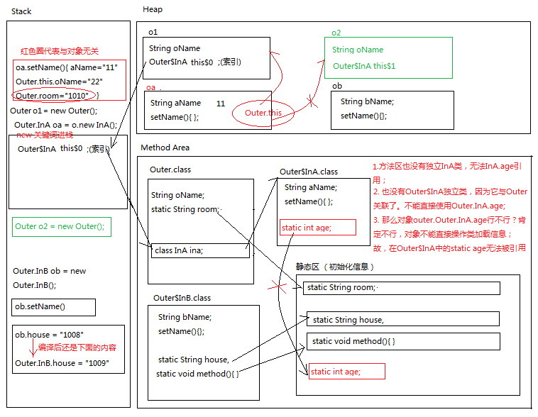

# 内部类


#### 1.	为什么要用内部类？  
一个事物的内部包含另一个事物，那么这就是一个类内部包含另一个类。
例如：身体和心脏的关系。又如：汽车和发动机的关系。


#### 2.	什么是内部类？
将一个类A定义在另一个类B里面，那么类A称为**内部类**，类B称为**外部类**；

	```
	格式：
	修饰符 class 外部类名称 {
		修饰符 class 内部类名称 {
	    	// ...
		}
		// ...
	}
	```
**注意： (条件：静态内部类除外，若是静态内部类，看静态内部类总结)   
1.内用外，随意访问，不管是成员变量、类变量，还是成员方法、类方法 (内部类都持有一个外部类的引用。这个是引用是 外部类名.this)；  
2.外用内，一定要使用对象访问。**


#### 3. 分类：成员内部类、局部内部类、匿名内部类、静态内部类
***内部类编译后的文件名为：“外部类名$内部类名.class”(不管是哪种内部类)***

#### 4.	成员内部类的使用（普通内部类，如上格式）


	如何使用成员内部类？有两种方式：
	1. 间接方式：在外部类的方法当中，使用内部类；然后main只是调用外部类的方法。
	2. 直接方式，公式：
	类名称 对象名 = new 类名称();
	【外部类名称.内部类名称 对象名 = new 外部类名称().new 内部类名称();】 // 一般不采用此方式

  **注意：  
  1.成员内部类一般都是私有化，防止外部访问，所以不推荐直接方式使用。  
  2.如果出现了重名现象，那么格式是：外部类名称.this.外部类成员变量名，如下代码：**

    public class Outer {
     int num = 10; // 外部类的成员变量
     public class Inner /*extends Object*/ {
        int num = 20; // 内部类的成员变量
        public void methodInner() {
            int num = 30; // 内部类方法的局部变量
            System.out.println(num); // 局部变量，就近原则
            System.out.println(this.num); // 内部类的成员变量
            System.out.println(Outer.this.num); // 外部类的成员变量
        }
      }
    }


#### 5. 局部内部类的使用：
Define:如果一个类是定义在一个方法内部的，那么这就是一个局部内部类。  
(“局部”：只有当前所属的方法才能使用它，出了这个方法外面就不能用了。）

	class Outer {
	  public void methodOuter() {
	 	[final] int outerNum = 100;
	    class Inner { // 局部内部类
	        int num = 10;
	        public void methodInner() {
	            System.out.println(num); // 10
	            System.out.println(outerNum); // 100
	        }
	    }
	    Inner inner = new Inner();
	    inner.methodInner();
	  }
	}
**重点：局部内部类，如果希望访问所在方法的局部变量，那么这个局部变量必须是【有效final的】。**  

**备注：从Java 8+开始，只要局部变量事实不变，那么final关键字可以省略。**  

原因：

1. new出来的对象在堆内存当中。
2. 局部变量是跟着方法走的，在栈内存当中。
3. 方法运行结束之后，立刻出栈，局部变量就会立刻消失。
4. 但是new出来的对象会在堆当中持续存在，直到垃圾回收消失。(这里也可以说是私有栈与公有堆不能建立反映射！)

**[注意：局部内部类任何地方都不能有static修饰,原因是static修饰后会跳出方法体的范围被使用!其实这点也有证明，在类的非静态方法是不能定义static对象的，但可以调用！]**


#### 6. 小节一下类的权限修饰符(重点)

权限范围：public > protected > (default) > private  

定义一个类的时候，权限修饰符规则： 

1. 外部类：public / (default也是省略了public，并非真正的default意义)，不能protected / private;
2. 成员内部类：public / protected / (default) / private;
3. 局部内部类：什么都不能写，相当于(default)，也不能用static修饰;


#### 7. 静态内部类－－针对成员内部类

内部类被static修饰，即是静态内部类，其相当于外部类。   

注意：  

1. 创建静态内部类方式：Outer.Inner inner = new Outer.Inner()；静态内部类不依赖于外部类；
2. 静态内部类中可定义静态的成员变量和方法，但注意：**内部类有静态成员，那么这个内部类必然是静态内部类；同时，局部内部类一定不能有静态成员**；
    ［why ?］  
    
    
    ```
    Outer outer = new Outer();
    outer.room =""; // 这个又可以是由于，编译器自动翻译成Outer.room
    //outer.Outer.InB.house="dbd "; //错误提示：can't resolves 'Outer' symbol 代表对象不能返回直接操作类加载信息,除非对象调用方法，	进行压栈，再在栈内找方法区类加载信息；也代表InB不属于Outer的对象公有，如同一个外部类；（外部类加载，并没有同时加载内部类，只有在被调用时才加	载）
    ```
    **所以说静态内部类相当于外部类！这点与静态成员变量，静态成员方法是不同的！！！！！**
3. 静态内部类访问外部类的静态成员变量或方法必须是静态的，访问局限性； (static修饰后相当于外部类)
4. 外部类可以创建静态内部类的实例，即使是私有的（private权限范围）；
5. 通过静态内部类的实例访问内部类的成员变量和方法，即使是私有的；(这一点请注意，是在外部类中使用才可以，也就是没有跳出private同类这个权限范围；这点对于非静态内部类也适合；但是跳出类外，就不能访问！)


应用场景：
1.Android static Handler;
2.static Viewholder;

#### 8.匿名内部类（重点）

如果接口的实现类（或者是父类的子类）只需要使用唯一的一次，
那么这种情况下就可以省略掉该类的定义，而改为使用【匿名内部类】。

匿名内部类的定义格式：

```
接口名称 对象名 = new 接口名称() {
    // 覆盖重写所有抽象方法
};
```

对格式“new 接口名称() {...}”进行解析：  

1. new代表创建对象的动作
2. 接口名称就是匿名内部类需要实现哪个接口
3. {...}这才是匿名内部类的内容

**另外还要注意几点问题：**

1. 匿名内部类，在【创建对象】的时候，只能使用唯一一次。如果希望多次创建对象，而且类的内容一样的话，那么就需要使用单独定义的实现类了。
2. 匿名对象，在【调用方法】的时候，只能调用唯一一次。如果希望同一个对象，调用多次方法，那么必须给对象起个名字。（并非给类起名，所以还是匿名类）
3. 匿名内部类是省略了【实现类/子类名称】，但是匿名对象是省略了。**【对象名称】强调：匿名内部类和匿名对象不是一回事！！！**

```
public  class TestAnony {
	public static void main(String[] args) {
		// 1 写法
		TestAnony anony = new TestAnony() { // 这里new TestAnony相当于匿名内部类创一个子类对象，因为新增了show方法；
			void show() {
				System.out.println("show run.....");
			}
		};
		anony.show(); // 这个地方编译会出错，函数编译看左边，发现TestAnony根本就没有show方法，所以编译出错；
		//
		// 2 写法
		new TestAnony() {
			void show() {
				System.out.println(" show run!!!");
			}
		}.show(); // 这里能编译通过，是由于引用，new 出来的对象就是子类本身，当然可以调用show方法；
	}
}
```


​	


