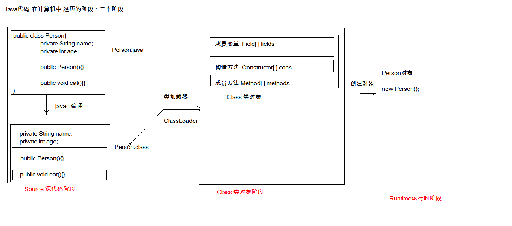

# 第一节  Junit、反射、注解

## 一、Junit单元测试

### 1.1、测试分类

- 黑盒测试：不需要写代码，给输入值，看程序是否能够输出期望的值。－－市面大多是黑盒测试，直接把程序模拟用户使用测试，只需要保证功能覆盖即可；
- 白盒测试：需要写代码，关注程序具体的执行流程；

### 1.2、Junit测试

- junit就是白盒测试中的一种方式。

- junit的好处：平时我们都是在main()方法中测试代码，很有局限性，如不能同时测试多个方法，且一个类只能一个main方法。junit都能解决这些缺陷；

- junit的使用步骤：

  - 定义一个测试类（测试用例）：

    ```
    // 建议
    * 测试类名：被测试的类名Test		CalculatorTest
    * 包名：xxx.xxx.xx.test		cn.itcast.test
    ```

  - 定义测试方法：可以独立运行：

    ```
    // 建议：
    * 方法名：test测试的方法名		testAdd()  
    * 返回值：void
    * 参数列表：空参
    ```

  - 给方法加@Test注解

  - 导入junit依赖环境

- 判定结果：
  - 以往我们往往直接在控制台查看结果（System.out.println / Log输出），这种方式会有缺陷。
  - 如何解决？一般使用断言操作处理结果。关注－－**［红色：失败］、［绿色：成功］**；

```java
    @Test
    public void testAdd(){
        Calculator cal = new Calculator();
        int result = cal.add(1,2);
        Assert.assertEquals(3,result);
    }
```

- 补充：
    * @Before:修饰的方法会在测试方法之前被自动执行
    * @After:修饰的方法会在测试方法执行之后自动被执行

```JAVA
	/**
     * 初始化方法：用于资源申请，所有测试方法在执行之前都会先执行该方法
     */
    @Before
    public void init(){
        System.out.println("init...");
    }

    /**
     * 释放资源方法：在所有测试方法执行完后，都会自动执行该方法
     */
    @After
    public void close(){
        System.out.println("close...");
    }
```


## 二、反射：框架设计的灵魂

### 2.1、反射概述

- 什么是框架？半成品软件。可以在框架的基础上进行软件开发，简化编码！！

- 什么是反射机制？将类的各个组成部分封装为其他对象，就是反射机制；

- 反射机制的好处：

  - 可以在程序运行过程中，操作这些对象；

    **简单理解，我们使用IDEA工具时，定义String str ，我们通过str.就会有很多方法弹出来，它怎么知道有那么多方法呢？就是由于IDEA已经将String加载到内存了，Method[]对象早就把String中的方法写进去了，工具直接拿来显示即可，这就是为什么IDEA方法自动提示的原理；**

  - 可以解耦，提高程序的扩展性；

- java代码的三个阶段：



> 从上图看，类加载器ClassLoader就是利用反射机制，将Person类的各个属性部分封装成了Class类对象中对应的各个对象部分，如Field[]、Constructor[]、Method[]。

**思考：类型转换中，强转为什么能转换成功？**前提是父子类关系，父类引用子类对象时可以强转成功；

其内部核心，也是通过反射去check运行时类型，即 RRTI （Ru-Time Type Identification）运行时类别识别；

在JDK 5开始，新增了一种强转：

```java
Animal animal= new Dog();
//这两句等同于Dog dog = (Dog) animal;
Class<Dog> dogType = Dog.class;
Dog dog = dogType.cast(animal)

public T cast(Object obj) {
    // isInstance 等效于 instanceOf
    if (obj != null && !isInstance(obj))  
         throw new ClassCastException(cannotCastMsg(obj));
     return (T) obj;
}
```

> 扩展：`obj instanceOf A` 底层实现原理
>
> 1. 当JVM接收到instaceOf指令后，那么就会将obj从stack取出来，得到两个索引值indexbyte1,indexbyte2，是为了构建对象对应class在运行时常量池的index索引，找到obj的最终类型class S；
> 2. A的转化，Class loader of A is used to created class T by `N`(the name `N` consists of the construction in the method area of the Java Virtual Machine )－> 对应的具体class T，然后就根据规则，判断S,T的类型是否能转换, 能转化则instanceOf指令返回1给stack，否则返回0；
> 3. 规则：S,T是同一类型，或者S是T的子类／T接口的继承接口／实现类；
> 4. 若obj是null，那么就不会做相应转换，直接返回0给Stack，即false；
> 5.  为什么使用instanceOf运算符？避免强转时发生类型转换异常错误ClassCastException;
> 6. 若是能依据上下文推断类型，则会在编译阶段直接判断，而不需到运行时去比较类型；
> 7. 什么情况会导致无法依据上下文推导呢？如反射newInstance对象，从硬盘持久化读取对象， 在方法中形参与实参不同类型替换后等；
>
> ```java
> public static void main(String[] args){
>     A a = new A();
> 	test(a);
> }
> 
> public static void test(Object b){ // 经过了Object替换后，无法依据上下文推导
>     if(b instanceOf A){ ... } 
> }
> ```
>
> 相关链接：https://docs.oracle.com/javase/specs/jvms/se7/html/jvms-6.html#jvms-6.5.instanceof

### 2.2、反射的使用

使用反射机制，name首先就得反射机制的恒定对象：**Class对象**。

> 为什么要用Class对象？
>
> 从java代码三个阶段图解看，我们定义的所有类，先成class字节码文件，然后通过ClassLoader对象将class字节码转化为Class类对应属性部分。也就是，我们定义的类，在Runtime时，都有一个对应Class类对象与之对应。代码中对类操作的其实就是类对应Class类对象的相关属性！！！

1. #### 获取Class对象：3种方式

   ```java
   Class.forName("全类名")：// 将字节码文件加载进内存，返回Class对象;
   ```

   > 多用于配置文件，将类名定义在配置文件中。读取文件，加载类；

   ```java
   类名.class：// 通过类名的属性class获取；
   ```

   > 多用于参数的传递

   ```java
   obj.getClass()：getClass()方法在Object类中定义着；
   ```

   > 多用于对象的获取字节码的方式

   **结论：同一个字节码文件(*.class)在一次程序运行过程中，只会被加载一次，不论通过哪一种方式获取的Class对象都是同一个。**

2. #### Class对象功能：

- 获取成员变量们

  ```java
  Field[] getFields() // 获取所有public修饰的成员变量
  Field getField(String name)   // 获取指定名称的 public修饰的成员变量
  Field[] getDeclaredFields()  // 获取所有的成员变量，不考虑修饰符
  Field getDeclaredField(String name)  
  ```

- 获取构造方法们

  ```java
  Constructor<?>[] getConstructors()  
  Constructor<T> getConstructor(类<?>... parameterTypes)  
  Constructor<T> getDeclaredConstructor(类<?>... parameterTypes) 
  Constructor<?>[] getDeclaredConstructors()  
  ```

- 获取成员方法们：

  ```java
  Method[] getMethods()  
  Method getMethod(String name, 类<?>... parameterTypes)  
  Method[] getDeclaredMethods()
  Method getDeclaredMethod(String name, 类<?>... parameterTypes) 
  ```

- 获取全类名

  - String getName()


3. #### Field：成员变量

   - 设置值： `void set(Object obj,Object value)`
   - 获取值：`get(Object obj)`
   - 忽略访问权限修饰符的安全检查：`setAccessible(true)`-->暴力反射

4. #### Constructor：构造方法

   - 创建对象：`T newInstance(Object... initargs) `

   ```java
   Constructor constructor = personClass.getConstructor(String.class, int.class);
   ```

   - 如果使用空参数构造方法创建对象，操作可以简化：Class对象的newInstance方法;

5. #### Method：方法对象

   - 执行方法：`Object invoke(Object obj,Object... args)`

   - 获取方法名称：`String getName()` 获取方法名

```java
        Method eat_method = personClass.getMethod("eat");
        Person p = new Person();
        //执行方法
        eat_method.invoke(p);

        Method eat_method2 = personClass.getMethod("eat", String.class);
        //执行方法
        eat_method2.invoke(p,"饭");

        //获取所有public修饰的方法
        Method[] methods = personClass.getMethods();
        for (Method method : methods) {
            String name = method.getName();
            //method.setAccessible(true);
        }

        //获取类名
        String className = personClass.getName();
        System.out.println(className);//cn.itcast.domain.Person
```

> Field, Constructor, Method都有setAccessible方法，暴力破解private修饰的属性；


### 2.3、案例 －－ 框架类编写初步

 需求：写一个"框架"类，不能改变框架类的任何代码的前提下，可以帮我们创建任意类的对象，并且执行其中任意方法；

- 实现：1. 配置文件； 2. 反射；
- 步骤：
  1. 将需要创建的对象的全类名和需要执行的方法定义在配置文件中；
  2. 在程序中加载读取配置文件
  3. 使用反射技术来加载类文件进内存
  4. 创建对象
  5. 执行方法

```

```


## 三、注解

### 3.1、概念

- 注解：说明程序的。给计算机看的；
- 注释：用文字描述程序的，给程序猿看的；

定义：注解（Annotation），也叫元数据。一种代码级别的说明。它是JDK1.5及以后版本引入的一个特性，与类、接口、枚举是在同一个层次。它可以声明在包、类、字段、方法、局部变量、方法参数等的前面，用来对这些元素进行说明，注释。
* 概念描述：
  * JDK1.5之后的新特性
  * 说明程序的
  * 使用注解：@注解名称


### 3.2、作用分类

- 编写文档：通过代码里标识的注解生成文档【生成文档doc文档】 

  ```java
  /**
   * 注解javadoc演示
   * @author itcat
   * @version 1.0
   * @since 1.5
   */
  public class AnnoDemo1 {
  
      /**
       * 计算两数的和
       * @param a 整数
       * @param b 整数
       * @return 两数的和
       */
      public int add(int a, int b ){
          return a + b;
      }
  }
  ```

  > 通过javadoc命令，就能生成该类的文档。并会将相关注解转换成相应的文字说明；

- 代码分析：通过代码里标识的注解对代码进行分析【使用反射】 －－ 是我们重点需要学习

- 编译检查：通过代码里标识的注解让编译器能够实现基本的编译检查【Override】


### 3.3、JDK中预定义的一些注解

- @Override：检测被该注解标注的方法是否是继承自父类(接口)的
- @Deprecated：该注解标注的内容，表示已过时
- @SuppressWarnings：压制警告
  * 一般传递参数all  @SuppressWarnings("all")
- @FunctionalInterface：函数式接口检查，说明可以Lambda使用


### 3.4、自定义注解

#### 1）格式：

```java
元注解
public @interface 注解名称{
    属性列表;
}
```

#### 2）本质：注解本质上就是一个接口，该接口默认继承Annotation接口

```java
// 注解反编译后，如下
public interface MyAnno extends java.lang.annotation.Annotation {
    
}
```

> 如何反编译：先javac －－> 然后javap class字节码即可；

#### 3）属性：就是接口中的抽象方法。具体有以下2点要求：

1. 属性的返回值类型有下列取值

   - 基本数据类型
   - String
   - 枚举
   - 注解
   - 以上类型的数组

   ```java
   public @interface MyAnno {
       int value();
       Person per();
       MyAnno2 anno2();
       String[] strs();
       String name() default "张三";  
   }
   ```

2. 定义了属性，在使用时需要给属性赋值

   - 如果定义属性时，使用default关键字给属性默认初始化值，则使用注解时，可以不进行属性的赋值。
   - 如果只有一个属性需要赋值，并且属性的名称是value，则value可以省略，直接定义值即可。
   - 数组赋值时，值使用{}包裹。如果数组中只有一个值，则{}可以省略;

   ```java
   @MyAnno(value=12,per = Person.P1,anno2 = @MyAnno2,strs="bbb")
   public class Worker {
      
   }
   
   @MyAnna(12) // value 省略
   public class Worker {
      
   }
   
   // 有其他注解同时赋值value不能省略，数组元素多个{}不能省略
   @MyAnna(value=12,strs={"aaa","bbb","ccc"}) 
   public class Worker {
      
   }
   ```

#### 4）元注解：用于描述注解的注解（重点掌握以下4个元注解）

1. @Target：描述注解能够作用的位置，其取值vaule是一个ElementType枚举
   - ElementType.TYPE : 可以作用于类上
   - ElementType.METHOD : 可以作用于方法上
   - ElementType.FIELD : 可以作用于成员变量上
2. @Retention：描述注解被保留的阶段
   - RetentionPolicy.RUNTIME : 当前被描述的注解，会保留到class字节码文件中，并被JVM读取到；平时一般使用这个；
   - RetentionPolicy.SOURCE : 仅保留在源码中；
   - RetentionPolicy.CLASS : 只会保留到class字节码为止
3. @Documented：描述注解是否被抽取到api文档中
4. @Inherited：描述注解是否被子类继承


### 3.5、注解的使用 －－ 解析注解

**注解的应用：在后期很多情况，我们都是使用注解来替换配置文件！！！**

在程序使用(解析)注解：获取注解中定义的属性值。

- 使用步骤：

1. 获取注解定义的位置的对象（Class，Method，Field）

2. 获取指定的注解: An a = clazz.getAnnotation(An.class);
3. 调用注解中的抽象方法获取配置的属性值;

```java
@An(className = "cn.itcast.alolo.MyAnn",methodName = "sub")
public class AnnotationTest {
    public static void main(String[] args) throws Exception {

        Class<AnnotationTest> clazz = AnnotationTest.class;
         // 这个方法，其实际就是将得到注解接口的一个实现类
        An a = clazz.getAnnotation(An.class);

        String className = a.className();
        String methodName = a.methodName();

        System.out.println(className);
        System.out.println(methodName);

        Class<?> cls = Class.forName(className);
        Constructor con= cls.getConstructor(String.class);
        Method method = cls.getMethod(methodName,int.class,int.class);
        Object obj = con.newInstance("test");
        
        Object result = method.invoke(obj,10,2);
        System.out.println(methodName+" result= "+result);
    }
}

public class MyAnn {
    private String name;

    public MyAnn(String name){
        this.name = name;
    }


    public void show(){
        System.out.println("MyAnn to show message!!!!");
    }

    public int sub(int a,int b){
        System.out.println("MyAnn name = "+name);
        return a-b;
    }
}

@Target(ElementType.TYPE)
@Retention(RetentionPolicy.RUNTIME)
public @interface An {
    String className();
    String methodName();
}
```

>**class.getAnnotation(An.class)原理：**
>
>```java
>public class AnImpl implements An{
>    public String className(){
>        return "cn.itcast.alolo.MyAnn";
>    }
>    public String methodName(){
>        return "sub";
>    }
>}
>```

### 3.6、注解总结 / 注解测试框架

**总结：**

1. 以后大多数时候，我们会使用注解，而不是自定义注解；
2. 注解给谁用？
   - 给编译器使用，如@Override，@FunctionalInterface用于编译器检测；
   - 给解析程序使用，如下面的注解测试框架，其注解代表测试整个过程的解析；
3. 注解不是程序的一部分，可以理解为注解就是一个标签

```java
@Retention(RetentionPolicy.RUNTIME)
@Target(ElementType.METHOD)
public @interface Check {

}

public class TestCheck {
    public static void main(String[] args) throws IOException {
        //1.创建计算器对象
        Calculator c = new Calculator();
        //2.获取字节码文件对象
        Class cls = c.getClass();
        //3.获取所有方法
        Method[] methods = cls.getMethods();

        int number = 0;//出现异常的次数
        BufferedWriter bw = new BufferedWriter(new FileWriter("bug.txt"));
        
        for (Method method : methods) {
            //4.判断方法上是否有Check注解
            if(method.isAnnotationPresent(Check.class)){
                //5.有，执行
                try {
                    method.invoke(c);
                } catch (Exception e) {
                    //6.捕获异常

                    //记录到文件中
                    number ++;

                    bw.write(method.getName()+ " 方法出异常了");
                    bw.newLine();
                    bw.write("异常的名称:" + e.getCause().getClass().getSimpleName());
                    bw.newLine();
                    bw.write("异常的原因:"+e.getCause().getMessage());
                    bw.newLine();
                    bw.write("--------------------------");
                    bw.newLine();

                }
            }
        }
        bw.write("本次测试一共出现 "+number+" 次异常");
        bw.flush();
        bw.close();
    }
}

public class Calculator {
    //加法
    @Check
    public void add(){
        String str = null;
        str.toString();
        System.out.println("1 + 0 =" + (1 + 0));
    }
    //减法
    @Check
    public void sub(){
        System.out.println("1 - 0 =" + (1 - 0));
    }
    //乘法
    @Check
    public void mul(){
        System.out.println("1 * 0 =" + (1 * 0));
    }
    //除法
    @Check
    public void div(){
        System.out.println("1 / 0 =" + (1 / 0));
    }
    
    public void show(){
        System.out.println("永无bug...");
    }
}
```


