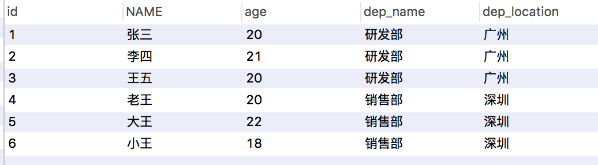

# MySQL的约束、设计、备份

## 一、约束

#### 1.1、概念：

 对表中的数据进行限定，保证数据的正确性、有效性和完整性。	

#### 1.2、分类：

 	1. 主键约束：primary key
 	2. 非空约束：not null
 	3. 唯一约束：unique
 	4. 外键约束：foreign key

#### 1.3、非空约束：not null，值不能为null

```sql
-- 1. 创建表时添加约束
CREATE TABLE person(
	id INT,
	NAME VARCHAR(20) NOT NULL -- name为非空
);
insert into person (id,name) values (1,null); // 插入失败
```

```sql
-- 2. 创建表完后，添加非空约束
ALTER TABLE person MODIFY NAME VARCHAR(20) NOT NULL;
-- 3. 删除非空约束
ALTER TABLE person MODIFY NAME VARCHAR(20) ;
```

#### 1.4、唯一约束：unique，值不能重复

```sql
-- 1. 创建表时，添加唯一约束
CREATE TABLE person(
	id INT,
	NAME VARCHAR(20) NOT NULL, -- name为非空
	phone_num varchar(32) unique
);
-- 注意mysql中，唯一约束限定的列的值可以有多个null
```

```sql
-- 2. 删除唯一约束
ALTER TABLE person MODIFY phone_num VARCHAR(32) ; // 这个是无效的
ALTER TABLE person DROP INDEX phone_num; // 这个有效！！

--3. 在创建表后，添加唯一约束
ALTER TABLE person MODIFY phone_num VARCHAR(32) unique; // 同非空判断
```

#### 1.5、主键约束：primary key

##### 特点：

1. 含义：非空且唯一
2. 一张表只能有一个字段为主键
3. 主键就是表中记录的唯一标识

```sql
-- 1. 在创建表时，添加主键约束
create table stu(
	id int primary key,-- 给id添加主键约束
	name varchar(20)
);

-- 2. 删除主键
alter table stu modify id int ; // 错误，无效
ALTER TABLE stu DROP PRIMARY KEY;

-- 3. 创建完表后，添加主键
ALTER TABLE stu MODIFY id INT PRIMARY KEY;
```

##### 自动增长：auto_increment, 一般与主键一同使用，但也可以不与主键搭配

```sql
-- 1. 在创建表时，添加主键约束，并且完成主键自增长
create table stu(
	id int primary key auto_increment,-- 给id添加主键约束
	name varchar(20)
);

-- 2. 删除自动增长
ALTER TABLE stu MODIFY id INT;

-- 3. 添加自动增长
ALTER TABLE stu MODIFY id INT AUTO_INCREMENT;
```

#### 1.6、外键约束：foreign key,让表于表产生关系，从而保证数据的正确性。



> 上面数据问题：
>
> 1. **dep_name、dep_location数据有冗余；**
> 2. **后续若要修改这个数据，还需要一个个去修改，增删改效率很低；**

怎么解决？

**可以将dep_name,dep_location抽离出来成一个新表，然后通过外键关联到对应dep_name,dep_location;**

```sql
-- 1. 在创建表时，可以添加外键
create table 表名(
		....
		外键列
		[constraint 外键名称] foreign key (外键列名称) references 主表名称(主表列名称)
); // 平时开发时，可以省略"constraint 外键名称"字段；
			
CREATE TABLE emp (
    id INT PRIMARY KEY AUTO_INCREMENT,
    NAME VARCHAR(30),
    age INT,
	dep_id INT,
	CONSTRAINT emp_deptid_fk FOREIGN KEY (dep_id) REFERENCES dep (id)
);

-- 2. 删除外键
ALTER TABLE 表名 DROP FOREIGN KEY 外键名称;

-- 3. 创建表之后，添加外键 [注意：若表中存在无法关联的数据，是无法添加外键的！！]
alter table emp add CONSTRAINT emp_deptid_fk1 FOREIGN KEY (dep_id) REFERENCES dep (id);
```

#### 1.7、级联操作

```sql
-- 语法
ALTER TABLE 表名 ADD CONSTRAINT 外键名称 FOREIGN KEY (外键字段名称) REFERENCES 主表名称(主表列名称) ON UPDATE CASCADE ON DELETE CASCADE  ;

分类：
	1. 级联更新：ON UPDATE CASCADE 
	2. 级联删除：ON DELETE CASCADE 
```

> 有好处，但是也有弊端。特别是级联删除。使用了级联也影响性能，所以在平时开发时，对于级联要谨慎使用；


## 二、数据库的设计

### 2.1、多表之间的关系

- #### 分类：［一对一、一对多、多对多］

- #### 实现关系：

1. 一对多（多对一）

   **--> ｛ 实现方式：在多的一方建立外键，指向一的一方的主键。｝**

2. 多对多 

   **--> ｛ 实现方式：多对多关系实现需要借助第三张中间表。中间表至少包含两个字段，这两个字段作为第三张表的外键，分别指向两张表的主键。 ｝**

   > 联合主键

3. 一对一（了解，实际开发比较少。一般一张表就搞定！！）

   **--> ｛ 实现方式：一对一关系实现，可以在任意一方添加`唯一`外键指向另一方的主键。｝**

```sql
案例：			
		
		/*
		创建旅游线路分类表 tab_category
		
		cid 旅游线路分类主键，自动增长
		cname 旅游线路分类名称非空，唯一，字符串 100
		*/
		CREATE TABLE tab_category (
			cid INT PRIMARY KEY AUTO_INCREMENT,
			cname VARCHAR(100) NOT NULL UNIQUE
		);
		
		/*
		创建旅游线路表 tab_route
		
		rid 旅游线路主键，自动增长
		rname 旅游线路名称非空，唯一，字符串 100
		price 价格
		rdate 上架时间，日期类型
		cid 外键，所属分类
		*/
		CREATE TABLE tab_route(
			rid INT PRIMARY KEY AUTO_INCREMENT,
			rname VARCHAR(100) NOT NULL UNIQUE,
			price DOUBLE,
			rdate DATE,
			cid INT,
			FOREIGN KEY (cid) REFERENCES tab_category(cid)
		);
		
		/*
		创建用户表 tab_user
		
		uid 用户主键，自增长
		username 用户名长度 100，唯一，非空
		password 密码长度 30，非空
		name 真实姓名长度 100
		birthday 生日
		sex 性别，定长字符串 1
		telephone 手机号，字符串 11
		email 邮箱，字符串长度 100
		*/
		CREATE TABLE tab_user (
			uid INT PRIMARY KEY AUTO_INCREMENT,
			username VARCHAR(100) UNIQUE NOT NULL,
			PASSWORD VARCHAR(30) NOT NULL,
			NAME VARCHAR(100),
			birthday DATE,
			sex CHAR(1) DEFAULT '男',
			telephone VARCHAR(11),
			email VARCHAR(100)
		);
		
		/*
		创建收藏表 tab_favorite
		
		rid 旅游线路 id，外键
		date 收藏时间
		uid 用户 id，外键
		rid 和 uid 不能重复，设置复合主键，同一个用户不能收藏同一个线路两次
		*/
		CREATE TABLE tab_favorite (
			rid INT, -- 线路id
			DATE DATETIME,
			uid INT, -- 用户id
			-- 创建复合主键
			PRIMARY KEY(rid,uid), -- 联合主键
			FOREIGN KEY (rid) REFERENCES tab_route(rid),
			FOREIGN KEY(uid) REFERENCES tab_user(uid)
		);
```


### 2.2、数据库设计的范式

#### 概念：

设计数据库时，需要遵循的一些规范。要遵循后边的范式要求，必须先遵循前边的所有范式要求;

设计关系数据库时，遵从不同的规范要求，设计出合理的关系型数据库，这些不同的规范要求被称为不同的范式，各种范式呈递次规范，越高的范式数据库冗余越小。

目前关系数据库有六种范式：第一范式（1NF）、第二范式（2NF）、第三范式（3NF）、巴斯-科德范式（BCNF）、第四范式(4NF）和第五范式（5NF，又称完美范式）。

#### 学习前三类范式：

- **第一范式（1NF**）：每一列都是不可分割的原子数据项；

- **第二范式（2NF**）：在1NF的基础上，非码属性必须完全依赖于候选码（在1NF基础上消除非主属性对主码的部分函数依赖）

```
几个概念：
1. 函数依赖：A-->B,如果通过A属性(属性组)的值，可以确定唯一B属性的值。则称B依赖于A
		例如：学号-->姓名。  （学号，课程名称） --> 分数
		
2. 完全函数依赖：A-->B， 如果A是一个属性组，则B属性值得确定需要依赖于A属性组中所有的属性值。
		例如：（学号，课程名称） --> 分数
		
3. 部分函数依赖：A-->B， 如果A是一个属性组，则B属性值得确定只需要依赖于A属性组中某一些值即可。
		例如：（学号，课程名称） --> 姓名
        
4. 传递函数依赖：A-->B, B -->C . 如果通过A属性(属性组)的值，可以确定唯一B属性的值，在通过B属性（属性组）的值可以确定唯一C属性的值，则称 C 传递函数依赖于A
		例如：学号-->系名，系名-->系主任
		
5. 码(主码)：如果在一张表中，一个属性或属性组，被其他所有属性所完全依赖，则称这个属性(属性组)为该表的码
		例如：该表中码为：（学号，课程名称）
		* 主属性：码属性组中的所有属性
		* 非主属性：除过码属性组的属性
```

- **第三范式（3NF）**：在2NF基础上，任何非主属性不依赖于其它非主属性（在2NF基础上消除传递依赖）

> **参考：[学生信息表](attach/学生信息表.xlsx)**


## 三、数据库的备份和还原 －－ DBA的主要工作，开发了解

- 命令行：

```shell
备份： mysqldump -u用户名 -p密码 数据库名称 > 保存的路径
```

```
还原：
	1. 登录数据库
	2. 创建数据库
	3. 使用数据库
	4. 执行文件。source 文件路径
```

- 图形化工具：简单


