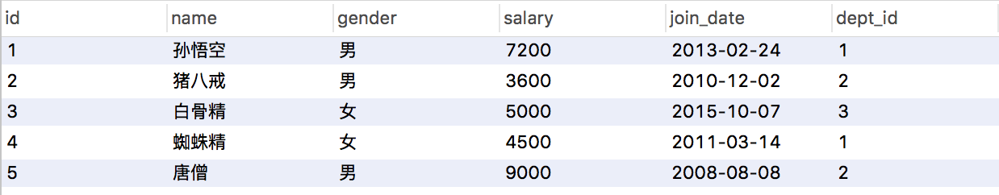

# 第四节 MySQL的多表查询、事务、DCL

## 一、多表查询



如上，我们若要查看孙悟空的部门，那么就需要多表查询了！！！

```sql
select * from emp,dept;
```

若上述查询多表，会产生很多无效数据！ 这些无效数据现象 －－ 笛卡尔积现象；

**笛卡尔积现象：**有两个集合A,B .取这两个集合的所有组成情况。

> 显然，要完成多表查询，需要消除无用的数据，即消除笛卡尔积现象。
>
> 怎么消除？参考下面三种方式：**内链接、外链接、子查询；**


### 1.2、 内链接

- ##### 隐式内连接：使用where条件消除无用数据

```sql
SELECT * FROM emp,dept WHERE emp.`dept_id` = dept.`id`;

SELECT 
	t1.name, -- 需要查询的表1的名称
	t1.gender,
	t2.name
from 
	emp t1,  -- 重命名
	dept t2
where 
	t1.`dept_id` = t2.`id`; -- 条件
```

- ##### 显式内连接

```sql
-- 语法：
select 字段列表 from 表名1 [inner] join 表名2 on 条件

select * from emp inner JOIN dept on emp.`dept_id`=dept.`id`;
```

> 内连接查询注意点：
> 1. 从哪些表中查询数据
> 2. 条件是什么
> 3. 查询哪些字段


### 1.3、外链接查询

- ##### 左外连接：查询的是左表所有数据以及其交集部分;

```sql
-- 语法：
select 字段列表 from 表1 left [outer] join 表2 on 条件；
```

> ```sql
> -- using关键字的外连接查询，前提是两张表有deptno相同的字段，否则查询不了！
> select * from dept d left outer join emp e using(deptno); 
> ```

### 1.4、子查询：查询中嵌套查询，称嵌套查询为子查询。

```sql
-- 查询工资最高者
select * from emp where emp.salary = (select max(salary) from emp);
```

子查询不同情况

- ##### 子查询的结果是单行单列的：(使用运算符去判断。 运算符： > >= < <= =)

```sql
-- 查询员工工资小于平均工资的人
SELECT * FROM emp WHERE emp.salary < (SELECT AVG(salary) FROM emp);
```

- ##### 子查询的结果是多行单列的：(使用运算符in来判断)

```sql
-- 查询'财务部'和'市场部'所有的员工信息
SELECT * from emp where emp.`dept_id` in (select id from dept WHERE name='财务部' OR name='市场部');
```

- ##### 子查询的结果是多行多列的：(子查询可以作为一张虚拟表参与查询)

```sql
-- 查询员工入职日期是2011-11-11日之后的员工信息和部门信息
select * from dept t1,(select * from emp where emp.`join_date` > '2011-11-11') t2 where t1.`id` = t2.`dept_id`;
```

> 上面也可以用普通内链接查询：
>
> ```sql
> select * from dept,emp where dept.`id`=emp.`dept_id` AND emp.`join_date` > '2011-11-11';
> ```

### 1.5、联合／连接查询  －－ union

```sql
select name,id,age from students where age<=20
union
select name,id,age from studnets where id in (14,15);

----等效于-----
select name,id,age from students
where age <= 20 or id in (14,15);
```

> 总结：
>
> ```properties
> union: 联合的意思，即把两次或多次查询结果合并起来,并消去表中任何重复行;
> 要求: 两次查询的列数必须一致(数量，顺序都一致), 列也必须拥有相似的数据类型;
> 推荐: 列的类型可以不一样，但推荐查询的每一列，想对应的类型以一样;
> 可以来自多张表的数据: 多次sql语句取出的列名可以不一致，此时以第一个sql语句的列名为准。
> 
> 1. 如果不同的语句中取出的行，有完全相同(这里表示的是每个列的值都相同)，那么union会将相同的行合并，最终只保留一行。也可以这样理解，union会去掉重复的行。
> 2. 如果不想去掉重复的行，可以使用union all。
> 3. 如果子句中有order by,limit，需用括号()包起来。推荐放到所有子句之后，即对最终合并的结果来排序或筛选，可以对union之后的数据进行排序和分页等操作。
> ```
>
> ```sql
> ---- 案例 ----
> ------table: a------             ------table: b------  
> name   age                        name2   age2 
> A1      1                          A1      1
> A2      2                          B1      2
>                                    B2      3
> ---------------------            ---------------------
> 
> select * from a union (all) select * from b;
> -------------------
> 	name    age 
> 	 A1      1                          
> 	 A2      2 
> 	 B1      2
> 	 B2      3
> 	(A1      1)   -- all : 不去重
> -------------------
> ```


## 二、事务

### 2.1、 事务的基本介绍

- 概念：如果一个包含多个步骤的业务操作，被事务管理，那么这些操作要么同时成功，要么同时失败。
- 操作：
  - 开启事务： start transaction;
  - 回滚：rollback;
  - 提交：commit;

```sql
-- 下面的张三钱，不翼而飞少了500 

update account set balance = balance -500 where name = '张三';
出错了。。。-- 错误引发
update account set balance = balance +500 where name = '李四';
select * from account;

-- 正确操作，将步骤加入事务里面即可
-- 0. 开启事务
START TRANSACTION;
update account set balance = balance -500 where name = '张三';
出错了。。。-- 错误引发
update account set balance = balance +500 where name = '李四';

-- 提交事务／回滚事务 是 二选一！！
-- 若查看数据有问题，回滚事务
ROLLBACK;
-- 反之，提交事务
commit;
```

- MySQL数据库中事务默认自动提交

```
事务提交的两种方式：
	* 自动提交：
		* mysql就是自动提交的
		* 一条DML(增删改)语句会自动提交一次事务。
	* 手动提交：
		* Oracle 数据库默认是手动提交事务
		* 需要先开启事务，再提交
```

```sql
修改事务的默认提交方式：
	* 查看事务的默认提交方式：SELECT @@autocommit; -- 1 代表自动提交  0 代表手动提交
	* 修改默认提交方式： set @@autocommit = 0;
```


### 2.2、事务的四大特征：ACID

- ##### 原子性：是不可分割的最小操作单位，要么同时成功，要么同时失败。

- ##### 持久性：当事务提交或回滚后，数据库会持久化的保存数据。

- ##### 隔离性：多个事务之间，相互独立。

- ##### 一致性：事务操作前后，数据总量不变


### 2.3、事务的隔离级别（了解）

**概念：**

多个事务之间隔离的，相互独立的。但是如果多个事务操作同一批数据，则会引发一些问题，设置不同的隔离级别就可以解决这些问题。

**存在问题：**

- 脏读：一个事务，读取到另一个事务中没有提交的数据；
- 不可重复读(虚读)：在同一个事务中，两次读取到的数据不一样；
- 幻读：一个事务操作(DML)数据表中所有记录，另一个事务添加了一条数据，则第一个事务查询不到自己的修改；

**隔离级别：**

- read uncommitted：读未提交 ——> 产生的问题：脏读、不可重复读、幻读;
- read committed：读已提交 （Oracle） ——> 产生的问题：不可重复读、幻读;
- repeatable read：可重复读 （MySQL默认）——> 产生的问题：幻读
- serializable：串行化 ——> 可以解决所有的问题。相当于锁表，当有人在操作表时，其他人就不能进行表的操作；

> **我们设成serializable不就可以了嘛？ 由于隔离级别越高，效率越低，应根据相应情况下，分别设置对应的隔离级别；**

```sql
-- 数据库查询隔离级别：
select @@tx_isolation;

-- 数据库设置隔离级别
set global transaction isolation level  级别字符串;
```


## 三、数据库控制语句 DCL－－管理用户，授权

### 3.1、管理用户

先打开mysql db，里面有一个user table ，即是数据库用户表！

> root 账号有两个，一个是本地登陆，一个％代表其他任意地方也可登陆；

- 添加用户:

```sql
-- 语法
CREATE USER '用户名'@'主机名' IDENTIFIED BY '密码';
```

- 删除用户:

```sql
-- 语法
DROP USER '用户名'@'主机名';
```

- 修改用户密码:

```sql
UPDATE USER SET PASSWORD = PASSWORD('新密码') WHERE USER = '用户名';
UPDATE USER SET PASSWORD = PASSWORD('abc') WHERE USER = 'lisi';
			
SET PASSWORD FOR '用户名'@'主机名' = PASSWORD('新密码');
SET PASSWORD FOR 'root'@'localhost' = PASSWORD('123');
```

- mysql中忘记了root用户的密码？

```sql
1. cmd -- > net stop mysql 停止mysql服务
	* 需要管理员运行该cmd
2. 使用无验证方式启动mysql服务： mysqld --skip-grant-tables
3. 打开新的cmd窗口,直接输入mysql命令，敲回车。就可以登录成功
4. use mysql;
5. update user set password = password('你的新密码') where user = 'root';
6. 关闭两个窗口
7. 打开任务管理器，手动结束mysqld.exe 的进程
8. 启动mysql服务
9. 使用新密码登录。
```

- 查询用户

```sql
-- 1. 切换到mysql数据库
USE myql;

-- 2. 查询user表
SELECT * FROM USER;
	* 通配符： % 表示可以在任意主机使用用户登录数据库
```


### 3.2、权限管理：

- 查询权限：

```sql
-- 语法
SHOW GRANTS FOR '用户名'@'主机名';
SHOW GRANTS FOR 'lisi'@'%';
```

- 授予权限：

```sql
-- 语法
grant 权限列表 on 数据库名.表名 to '用户名'@'主机名';

-- 给张三用户授予查询权限，在任意数据库任意表上
grant select on db1.account to '李四'@'%';

-- 给张三用户授予所有权限，在任意数据库任意表上
GRANT ALL ON *.* TO 'zhangsan'@'localhost';
```

- 撤销权限：

```sql
-- 语法
revoke 权限列表 on 数据库名.表名 from '用户名'@'主机名';

REVOKE UPDATE ON db3.`account` FROM 'lisi'@'%';
```


