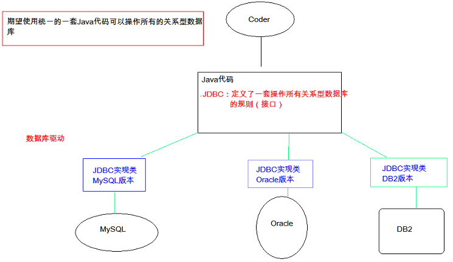

# 第五节 JDBC （重点掌握）

## 一、概述：

**概念：**Java DataBase Connectivity  Java 数据库连接， Java语言操作数据库；

**本质：**其实是官方（sun公司）定义的一套操作所有关系型数据库的规则，即接口。各个数据库厂商去实现这套接口，提供数据库驱动jar包。我们可以使用这套接口（JDBC）编程，真正执行的代码是驱动jar包中的实现类。




## 二、快速入门

 步骤：

1. 导入驱动jar包 mysql-connector-java-5.1.37-bin.jar

​	1.1复制mysql-connector-java-5.1.37-bin.jar到项目的libs目录下
​	1.2.右键-->Add As Library

2. 注册驱动

3. 获取数据库连接对象 Connection

4. 定义sql

5. 获取执行sql语句的对象 Statement

6. 执行sql，接受返回结果

		7. 处理结果

		8. 释放资源

```java
    public static void main(String[] args) throws Exception {
        // 1. 注册驱动
        Class.forName("com.mysql.jdbc.Driver");

        // 2. 获取数据库连接对象 Connection
        Connection con = DriverManager.getConnection("jdbc:mysql://localhost:3306/db4", "root", "root");

        // 3. 定义sql
        String sql = "update stu set math=99 where name='郭靖'";

        // 4. 获取执行sql的对象statement
        Statement stat = con.createStatement();

        // 5. 执行sql
        int count = stat.executeUpdate(sql);

        // 6. 查看执行结果，处理结果
        System.out.println(count);

        // 7. 关闭资源
        stat.close();
        con.close();
    }
```


## 三、JDBC操作的各个对象

### 3.1、DriverManager：驱动管理对象

功能：

- #### 注册驱动：告诉程序该使用哪一个数据库驱动jar

```java
static void registerDriver(Driver driver) :注册与给定的驱动程序 DriverManager

// 为啥写下面代码，执行注册驱动呢？ 
Class.forName("com.mysql.jdbc.Driver");

// 通过查看源码发现：在com.mysql.jdbc.Driver类中存在静态代码块
static {
	try {
		java.sql.DriverManager.registerDriver(new Driver());
	} catch (SQLException E) {
		throw new RuntimeException("Can't register driver!");
	}
}
```

> 注意：mysql5之后的驱动jar包可以省略注册驱动的步骤。
>
> 可以省略：Class.forName("com.mysql.jdbc.Driver");
>
> 因为在导入Library下META－INF/services/java.sql.Driver文件，会自动注册；

- #### 获取数据库连接：

```java
// 方法
static Connection getConnection(String url, String user, String password); 

/*
url：指定连接的路径
	语法：jdbc:mysql://ip地址(域名):端口号/数据库名称
	例子：jdbc:mysql://localhost:3306/db3
	细节：如果连接的是本机mysql服务器，并且mysql服务默认端口是3306，则url可以简写为：jdbc:mysql:///
	数据库名称
user：用户名
password：密码
*/
```


### 3.2、Connection：数据库连接对象

功能：

- #### 获取执行sql 的对象

```java
Statement createStatement();
PreparedStatement prepareStatement(String sql); 
```

- #### 管理事务：

```java
// 1. 开启事务：参数为false，即开启事务
setAutoCommit(boolean autoCommit);

// 2. 提交事务：
commit(); 

// 3. 回滚事务：
rollback();
```


### 3.3、Statement：执行sql的对象

功能：

- #### 执行sql

```java
/*
*	1. 执行任意的sql (了解)
*/
boolean execute(String sql);

/*
*	2. 执行DML（insert、update、delete）语句，会有返回值［主要用法］；
*	   也可执行DDL(create，alter、drop)语句，没有返回值，默认0;
*
* 	返回值：影响的行数，可以通过这个影响的行数判断DML语句是否执行成功 返回值>0的则执行成功，反之，则失败。
*/
int executeUpdate(String sql)；

/*
*	3. 执行DQL（select)语句
*/
ResultSet executeQuery(String sql);

```


### 3.4、ResultSet：结果集对象,封装查询结果

```java
/*
* 1. 游标向下移动一行，判断当前行是否是最后一行末尾(是否有数据)，如果是，则返回false，如果不是则返回	*	true;
*/
boolean next();

/*
* 2. 获取数据
*
* Xxx：代表数据类型   如： int getInt() ,	String getString()
* 参数：
* 	1. int：代表[列]的编号,从1开始,不是从0开始   如： getString(1)
*	2. String：代表列名称。 如： getDouble("balance")
*/
getXxx(参数);

```

```java
 public static void main(String[] args) {
        Connection con = null;
        Statement stat = null;
        ResultSet rs = null;
        try {
            // 1 加载驱动
            Class.forName("com.mysql.jdbc.Driver");
            // 2 链接数据库，并获取链接对象
            con = DriverManager.getConnection("jdbc:mysql://localhost:3306/db4", "root", "root");
            // 3 编写sql语句
            String sql1 = "select * from person";
            // 4 获取sql执行对象
            stat = con.createStatement();
            // 5 执行sql
            rs = stat.executeQuery(sql1);
            // 6 处理执行结果
            while(rs.next()){
                int id = rs.getInt(1);
                String name = rs.getString(2);
                String phoneNum = rs.getString("phone_num");
                System.out.println(id+"-----"+name+"----"+phoneNum);
            }
        }catch (Exception e){
            e.printStackTrace();
        }finally {// 7 关闭资源
            if(null != rs){
                try {
                    rs.close();
                } catch (SQLException e) {
                    e.printStackTrace();
                }
            }
			...
        }
    }
```


### 3.5、PreparedStatement：执行sql的对象 （预处理对象）

- 概念：**SQL注入**

```java
String sql = "select name,password from user where name = '"+user+"' and password = '"+password+"'";

// 上面就是java代码写的用户帐号密码验证。
user 输入'任意字符'，
password 输入 'dd or 'a'='a''
那么最后的SQL就是：
select name,password from user where name = 'dsfsd' and password = 'dd' or 'a'='a'；
由于一些sql的特殊关键字参与字符串的拼接，致使条件恒成立,从而造成SQL注入现象；

怎么解决？使用'PreparedStatement'来执行sql，即可防治SQL注入！！！！
```

- 预编译的SQL：参数使用?作为占位符
- 步骤

```java
1. 导入驱动jar包 mysql-connector-java-5.1.37-bin.jar
2. 注册驱动
3. 获取数据库连接对象 Connection
4. 定义sql
	* 注意：sql的参数使用？作为占位符。 
	* 如：select * from user where username = ? and password = ?;
5. 获取执行sql语句的对象 PreparedStatement  Connection.prepareStatement(String sql) 
6. 给？赋值：
	* 方法： setXxx(参数1,参数2)
	* 参数1：？的位置编号 从1 开始
	* 参数2：？的值
7. 执行sql，接受返回结果，不需要传递sql语句
8. 处理结果
9. 释放资源
```

> 注意：后期都会使用PreparedStatement来完成增删改查的所有操作
> 1. **可以防止SQL注入**
> 2. **效率更高**


### 3.6、JDBC工具类

```java
public final class JDBCUtils {

    private static String url;
    private static String user;
    private static String password;

    static {
        try {
            Properties pro = new Properties();

            ClassLoader classLoader = JDBCUtils.class.getClassLoader();
            URL resource = classLoader.getResource("jdbc.properties");
            assert resource != null;
            String path1 = resource.getPath();
            System.out.println(path1);

            pro.load(new FileReader(path1));

            url = pro.getProperty("url");
            user = pro.getProperty("user");
            password = pro.getProperty("password");
            Class.forName(pro.getProperty("driver"));
        } catch (ClassNotFoundException | IOException e) {
            e.printStackTrace();
        }
    }

    /**
     * 获取数据库链接对象
     *
     * @return
     * @throws SQLException
     */
    public static Connection getConnection() throws SQLException {
        return DriverManager.getConnection(url,user,password);
    }


    /**
     * 释放资源
     *
     * @param stat
     * @param con
     */
    public static void close(Statement stat, Connection con){
        if(null != stat){
            try {
                stat.close();
            } catch (SQLException e) {
                e.printStackTrace();
            }
        }

        if(null != con){
            try {
                con.close();
            } catch (SQLException e) {
                e.printStackTrace();
            }
        }
    }


    /**
     * 释放资源--重载
     *
     * @param rs
     * @param stat
     * @param con
     */
    public static void close(ResultSet rs, Statement stat, Connection con){
        if(null != rs){
            try {
                rs.close();
            } catch (SQLException e) {
                e.printStackTrace();
            }
        }
        close(stat,con);
    }
}
```


## 四、JDBC控制事务

### 4.1、事务 －－ 同SQL事务同概念

一个包含多个步骤的业务操作。如果这个业务操作被事务管理，则这多个步骤要么同时成功，要么同时失败。

### 4.2、操作

- 开启事务

```java
// 调用该方法设置参数为false，即开启事务.反之，true代表关闭事务
Connection.setAutoCommit(false);
```

-  提交事务

```java
// 在操作sql代码完成时，通过下面代码执行事务提交
Connection.commit(); 
```

- 回滚事务

```java
// 在catch中回滚事务
Connection.rollback(); 
```


代码范例：

```java
    public static void main(String[] args) {
        Connection con = null;
        PreparedStatement pstat1 = null;
        PreparedStatement pstat2 = null;

        try {
            con = JDBCUtils.getConnection();
            con.setAutoCommit(false);

            String sql1 = "update account set balance= balance - ? where id=?";
            String sql2 = "update account set balance= balance + ? where id=?";

            pstat1 = con.prepareStatement(sql1);
            pstat1.setDouble(1,500);
            pstat1.setInt(2,1);

            pstat2 = con.prepareStatement(sql2);
            pstat2.setDouble(1,500);
            pstat2.setInt(2,2);

            pstat1.executeUpdate(); 
            int i = 3/0;
            pstat2.executeUpdate();

            con.commit();
        } catch (Exception e) {
            if(null != con){
                try {
                    con.rollback();
                } catch (SQLException e1) {
                    e1.printStackTrace();
                }
            }
            e.printStackTrace();
        } finally {
            JDBCUtils.close(pstat1,con);
            JDBCUtils.close(pstat2,con);
        }
    }
```


