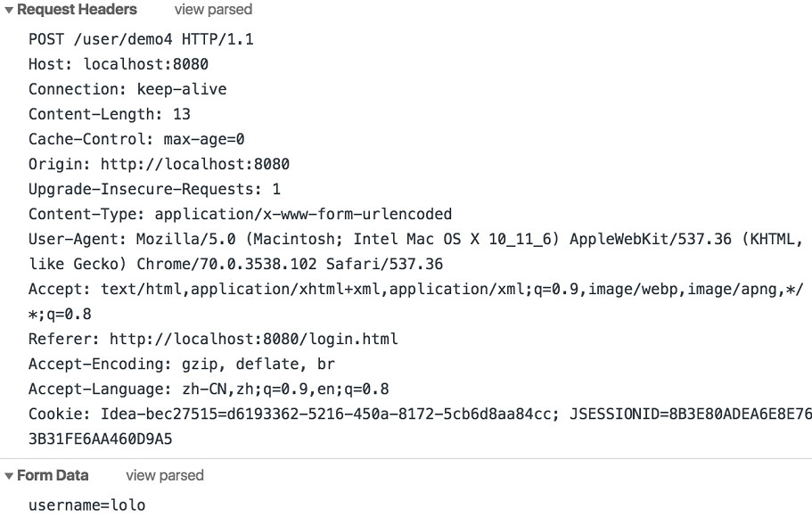

# 第十三节  Servlet、Http、Request

## 一、Servlet深入

#### 1.1、Servlet的体系结构

```
	Servlet -- 接口
		|
	GenericServlet -- 抽象类
		|
	HttpServlet  -- 抽象类
	
	* GenericServlet：将Servlet接口中其他的方法做了默认空实现，只将service()方法作为抽象
		* 将来定义Servlet类时，可以继承GenericServlet，实现service()方法即可;
		
	* HttpServlet：对http协议的一种封装，简化操作 (实际开发使用这个！！！！)
		1. 定义类继承HttpServlet
		2. 复写doGet/doPost方法		
```

#### 1.2、Servlet相关配置

 urlpartten:Servlet访问路径：

- 一个Servlet可以定义多个访问路径 ： @WebServlet({"/d4","/dd4","/ddd4"})；

  ```java
  @WebServlet({"/d4","/dd4","/d5"})
  public class ServletDemo4 extends HttpServlet {
  	....
  }
  ```

- 路径定义规则：

  - /xxx：路径匹配；
  - /xxx/xxx:多层路径，目录结构
  - *.do：扩展名匹配； **注意前面不能加／；**

  ```java
  @WebServlet("/user/demo4")
  @WebServlet("/user/*") // user下任意目录都可以访问
  @WebServlet("/*") // 任意目录都可以访问，优先级最低
  public class ServletDemo4 extends HttpServlet { ... }
  
  
  @WebServlet("*.do")
  public class ServletDemo4 extends HttpServlet { ... }
  ```


## 二、HTTP：

### 2.1、概述

HTTP：Hyper Text Transfer Protocol 超文本传输协议；

- **传输协议：**定义了，客户端和服务器端通信时，发送数据的格式；
- **特点：**
  1. 基于TCP/IP的高级协议；
  2. 默认端口号:80；
  3. 基于请求/响应模型的:一次请求对应一次响应；
  4. 无状态的：每次请求之间相互独立，不能交互数据；
- 历史版本：
  - version 1.0：每一次请求响应都会建立新的连接；
  - version 1.1：复用连接；相当于只建立一次连接，提升了效率！

### 2.2、请求消息数据格式：四部分

1. #### 请求行

   ```java
   // 请求方式 请求url 请求协议/版本
   GET   /login.html	HTTP/1.1
   POST  /login.html	HTTP/1.1
   ```

   HTTP协议有7中请求方式，常用的有2种：GET ／ POST

   - GET:
     - 请求参数在请求行中，在url后。
     - 请求的url长度有限制的;
     - 不太安全;
   - POST:
     - 请求参数在请求体中;
     - 请求的url长度没有限制的;
     - 相对安全;

2. #### 请求头：客户端浏览器告诉服务器一些信息

   请求头信息格式 **［请求头名称: 请求头值］**

   常见的请求头信息：

   - **User-Agent：**浏览器告诉服务器，我访问你使用的浏览器版本信息

   - **Referer：`http://localhost/login.html`**

     - 告诉服务器，我(当前请求)从哪里来？

     - 作用：
       1. 防盗链；
       2. 统计工作；

3. #### 请求空行

   空行，就是用于分割POST请求的请求头，和请求体的。

4. #### 请求体(正文)：

   Form Data: username=lolo

   封装POST请求消息的请求参数的。GET方式是没有请求体的！




