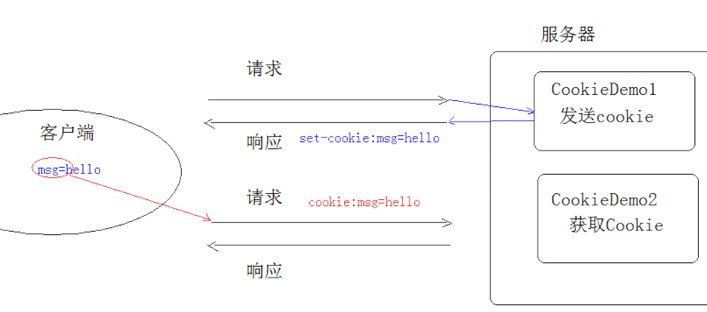

# 第十五节 Cookie & Session

## 一、会话技术

1. ##### 会话：一次会话中包含多次请求和响应。

   一次会话：浏览器第一次给服务器资源发送请求，会话建立，直到有一方断开为止；

2. ##### 功能：在一次会话的范围内的多次请求间，共享数据；

3. ##### 方式：

   - 客户端会话技术：Cookie；
   - 服务器端会话技术：Session；

> **应用：购物车，多次请求点击加入购物车，去结算就是一个会话技术数据共享！！**


## 二、Cookie

### 2.1、概念：

客户端会话技术，将数据保存到客户端；

### 2.2、快速入门：

步骤：

1. 创建Cookie对象，绑定数据 : `new Cookie(String name, String value) `
2. 发送Cookie对象 : `response.addCookie(Cookie cookie) `
3. 获取Cookie，拿到数据 :  `Cookie[]  request.getCookies() ` 

```java
protected void doPost(HttpServletRequest req, HttpServletResponse resp) throws ServletException, IOException {
        Cookie[] cks = req.getCookies();
        if(cks!=null){
            for(Cookie c:cks){
                System.out.println(c.getName()+":"+c.getValue());
            }
        }
    }
```

### 2.3、实现原理

**基于响应头set-cookie和请求头cookie实现。**



### 2.4、Cookie的细节

- ####  一次可不可以发送多个cookie? 可以！

  可以创建多个Cookie对象，使用response调用多次addCookie方法发送cookie即可。

  ```java
  response.addCookie("msg","name");
  response.addCookie("age","age");
  ```

- #### cookie在浏览器中保存多长时间？

  1. 默认情况下，保存在浏览器内存当中，当浏览器关闭后，Cookie数据被销毁；

  2. 持久化存储：调用 `setMaxAge(int seconds)`

     seconds参数说明：

     - 正数：将Cookie数据写到硬盘的文件中。持久化存储。并指定cookie存活时间，时间到后，cookie文件自动失效；
     - 负数：默认值；
     - 零：删除cookie信息；

     ```java
     protected void doPost(HttpServletRequest req, HttpServletResponse resp) throws ServletException, IOException {
             Cookie c1 = new Cookie("msg","setMaxAge");
             c1.setMaxAge(30);
             resp.addCookie(c1);
         }
     ```

- #### cookie能不能存中文？

  - 在tomcat 8 之前 cookie中不能直接存储中文数据;

    需要将中文数据转码---一般采用URL编码(%E3);

  - 在tomcat 8 之后，cookie支持中文数据。特殊字符还是不支持，建议使用URL编码存储，URL解码解析;

- #### cookie共享问题？也是获取范围有多大？

  1. ##### 假设在一个tomcat服务器中，部署了多个web项目，那么在这些web项目中cookie能不能共享？

     - 默认情况下cookie不能共享;
     - setPath(String path):设置cookie的获取范围。默认情况下，设置当前的虚拟目录;

     ```java
     默认：setPath("/day16") －－// 只有day16项目才能访问
     setPath("/"); // 当前服务器的根目录所有项目都能访问！实现共享
     ```

  2. ##### 不同的tomcat服务器间cookie共享问题？

     ```java
     // setDomain(String path):如果设置一级域名相同，那么多个服务器之间cookie可以共享
     setDomain(".baidu.com"); // 那么tieba.baidu.com和news.baidu.com中cookie可以共享
     ```


### 2.5、Cookie的特点和作用

#### 特点：

1. cookie存储数据在客户端浏览器，安全性比较差；
2. 浏览器对于单个cookie 的大小有限制(4kb) 以及 对同一个域名下的总cookie数量也有限制(20个)；

#### 作用：

1. cookie一般用于存出少量的不太敏感的数据；
2. 在不登录的情况下，完成服务器对客户端的身份识别；


### 2.6、案例：记住上一次访问时间

```java
protected void doPost(HttpServletRequest req, HttpServletResponse resp) throws ServletException, IOException {
        resp.setContentType("text/html;charset=utf-8");
        boolean flag = false;

        Date date = new Date();
        SimpleDateFormat format = new SimpleDateFormat("yyyy年MM月dd日 HH:mm:ss");
        String str_date = format.format(date);
    // 1. 先转码
    // String str_date = URLEncoder.encode(format.format(date),"utf-8");

        Cookie[] cks = req.getCookies();
        if(null != cks && cks.length>0){
            for(Cookie c:cks){
                if("lastTime".equals(c.getName())){
                    flag = true;
                    String temp = c.getValue();
                    // 2. 后转码
                    // String temp = URLDecoder.decode(c.getValue(),"utf-8");
                    c.setValue(str_date);
                    c.setMaxAge(60 * 60 * 24 * 30); // 一个月
                    resp.addCookie(c);
                    resp.getWriter().write("<h1>欢迎再次光临！您上次到访时间："+temp+"</h1>");
                    break;
                }
            }
        }

        if(null == cks || !flag){
            Cookie cookie = new Cookie("lastTime",str_date);
            cookie.setMaxAge(60 * 60 * 24 * 30); // 一个月
            resp.addCookie(cookie);
            resp.getWriter().write("<h1>欢迎首次光临!</h1>");
        }
    }
```

> **上述代码会产生如下错误：**
>
> **原因在于：‘yyyy年MM月dd日 HH:mm:ss’ 多了一个空格！其实也是由于特殊字符缘由**
>
> **解决方案：统一对cookie的内容URL编码即可！！！**
>
> ```java
> java.lang.IllegalArgumentException: An invalid character [32] was present in the Cookie value
> 	org.apache.tomcat.util.http.Rfc6265CookieProcessor.validateCookieValue(Rfc6265CookieProcessor.java:182)
> 	org.apache.tomcat.util.http.Rfc6265CookieProcessor.generateHeader(Rfc6265CookieProcessor.java:115)
> ```


## 三、JSP：入门学习

### 3.1、概念

##### JSP：Java Server Pages  java服务器端页面；

- 可以理解为：一个特殊的页面，其中既可以指定定义html标签，又可以定义java代码；
- 用于简化Servlet的书写！！！ 例如上案例，如果还有很多静态网页标签内容，若用response写，那不是疯了！！！

### 3.2、原理

**JSP本质上就是一个Servlet!!**   

1. 客户端访问index.jsp文件，index.jsp ->index.java ->index.class。最后其实际是访问对应服务器提供的index.class文件;

2. index.jsp访问，查看对应服务器运行的work目录，可以查看到对应index.java文件如下：

> **work目录:**
>
> **Mac:**
>
> **CATALINA_BASE:  /Users/iMac/Library/Caches/IntelliJIdea2018.2/tomcat/Tomcat_8_5_35_servlet_5**
>
> **Windows:**
>
>**CATALINA_BASE:  C:\Users\Hawin\\.IntelliJIdea2017.3\system\tomcat\\_web**

```jsp
<%@ page contentType="text/html;charset=UTF-8" language="java" %>
<html>
  <head>
    <title>$Title$</title>
  </head>
  <body>
  <%
    System.out.println("Hello,jsp");
  %>
  Hi ,jsp
  </body>
</html>
```

```java
public final class index_jsp extends org.apache.jasper.runtime.HttpJspBase
    implements org.apache.jasper.runtime.JspSourceDependent,
                 org.apache.jasper.runtime.JspSourceImports {
     public void _jspService(final javax.servlet.http.HttpServletRequest request, final javax.servlet.http.HttpServletResponse response){
         ...
          out.write("\n");
          out.write("\n");
          out.write("<html>\n");
          out.write("  <head>\n");
          out.write("    <title>$Title$</title>\n");
          out.write("  </head>\n");
          out.write("  <body>\n");
          out.write("  ");
         
     	System.out.println("Hello,jsp");   
         
        out.write("\n");
      	out.write("  Hi ,jsp\n");
      	out.write("  </body>\n");
      	out.write("</html>\n");
         ...
     }
}
```


### 3.3、JSP的脚本：JSP定义Java代码的方式

1. <%  代码 %>：定义的java代码，在service方法中。service方法中可以定义什么，该脚本中就可以定义什么。
2. <%! 代码 %>：定义的java代码，在jsp转换后的java类的成员位置。
3.  <%= 代码 %>：定义的java代码，会输出到页面上。输出语句中可以定义什么，该脚本中就可以定义什么。


### 3.4、JSP的内置对象：

- ##### 概念：在jsp页面中不需要获取和创建，可以直接使用的对象；

- ##### jsp一共有9个内置对象。

- ##### 暂时学3个：

  - request

  - response

  - **out: 字符输出流对象。可以将数据输出到页面上。和response.getWriter()类似;**

    response.getWriter()和out.write()的区别：

    - 在tomcat服务器真正给客户端做出响应之前，**会先找response缓冲区数据，再找out缓冲区数据。**
    - 所以，response.getWriter()数据输出永远在out.write()之前; **而且在一切响应体之前；也就是无论response.getWriter()位置在哪里，都会优先输出！故，jsp统一out输出！！**


### 3.5、改造Cookie案例

```jsp
<body>
<h1><p> Test JSP !!!!!!</p></h1>
<%
    response.setContentType("text/html;charset=utf-8");

    boolean flag = false;

    Date date = new Date();
    SimpleDateFormat format = new SimpleDateFormat("yyyy年MM月dd日 HH:mm:ss");
    String str_date = URLEncoder.encode(format.format(date),"utf-8");

    Cookie[] cks = request.getCookies();
    if(null != cks && cks.length>0){
        for(Cookie c:cks){
            if("lastTime".equals(c.getName())){
                flag = true;
                String temp = URLDecoder.decode(c.getValue(),"utf-8");
                c.setValue(str_date);
                c.setMaxAge(60 * 60 * 24 * 30); // 一个月
                response.addCookie(c);
                out.write("<h4>欢迎再次光临！您上次到访时间："+temp+"</h4>");
                break;
            }
        }
    }

    if(null == cks || !flag){
        Cookie cookie = new Cookie("lastTime",str_date);
        cookie.setMaxAge(60 * 60 * 24 * 30); // 一个月
        response.addCookie(cookie);
%>
<%--截段操作！！--%>
<h4>欢迎首次光临!</h4>
<%
    }
%>
<form>
    <input type="text" name="username" placeholder="请输入姓名"> <br>
    <input type="password" name="password" placeholder="请输入密码"><br>
    <input type="submit" value="提交">
</form>
</body>
```

> **优点：简化了Servlet的操作；缺点：界面既有数据操作，又有静态资源展示。可读性很差；**
>
> **所以，在后续项目也不推荐使用此种方式；**


## 四、Session：主菜

### 4.1、 概念

服务器端会话技术，在一次会话的多次请求间共享数据，将数据保存在服务器端的对象中。

####      HttpSession

### 4.2、快速入门

- 获取HttpSession对象：

```java
HttpSession session = request.getSession();
```

- 使用HttpSession对象：

```java
Object getAttribute(String name)  
void setAttribute(String name, Object value)
void removeAttribute(String name)  
```

### 4.3、原理

**／*  Session的实现是依赖于Cookie的。*／**

### 4.4、细节

1. #### 当客户端关闭后，服务器不关闭，两次获取session是否为同一个？

   - 默认情况下，不是；

   - 如果需要相同，则可以创建Cookie,键为JSESSIONID，设置最大存活时间，让cookie持久化保存。

     ```java
     Cookie c = new Cookie("JSESSIONID",session.getId());
     c.setMaxAge(60*60);
     response.addCookie(c);
     ```

2. #### 客户端不关闭，服务器关闭后，两次获取的session是同一个吗？

   - 不是同一个，但是要确保数据不丢失。tomcat自动完成以下工作!

     - session的钝化：在服务器正常关闭之前，将session对象系列化到硬盘上;
     - session的活化：在服务器启动后，将session文件转化为内存中的session对象即可;

     > **如果不这样做，例如购物车在session中，服务器重启，session不一致，数据丢失，购物车内的信息就不存在，致使客户体验感变差！！！**

   - **Tomcat服务器自动进行session的钝化／活化，但是IDEA启动的服务器只会钝化，而活化却不成功，因为IDEA会删除work再重建work文件夹，而session钝化保存在work目录下**

3. #### session什么时候被销毁？失效时间！

   - 服务器关闭

   - session对象调用invalidate() 。

   - session默认失效时间 30分钟
     选择性配置修改: 

     1. 可以在Tomcat的Web.xml中，代表修改整个服务下的所有项目修改；
     2. 当然可以在对应项目，配置一个Web.xml来覆盖服务器的Web.xml;

       ```	xml
       <session-config>
       	<session-timeout>30</session-timeout>
       </session-config>
       ```


### 4.5、session的特点

1. session用于存储一次会话的多次请求的数据，存在服务器端；
2. session可以存储任意类型，任意大小的数据；


### 4.6、session与Cookie的区别：

1. session存储数据在服务器端，Cookie在客户端
2. session没有数据大小限制，Cookie有
3. session数据安全，Cookie相对于不安全


## 五、案例：校验－验证码

1. **login.jsp**

```jsp
<html>
<head>
    <title>Login</title>

    <script>
        window.onload = function () {
            document.getElementById("img").onclick = function () {
                this.src = "/day16/checkCodeServlet?"+new Date().getTime();
            }
        }
    </script>

    <style>
        #error_tips{
            color: red;
        }
    </style>
</head>
<body>

<form action="/day16/loginServlet" method="post">
    <table>
        <tr>
            <td>用户名</td>
            <td><input type="text" name="username" placeholder="请输入姓名"></td>
        </tr>
        <tr>
            <td>密码</td>
            <td><input type="password" name="password" placeholder="请输入密码"></td>
        </tr>
        <tr>
            <td>验证码</td>
            <td><input type="text" name="checkcode" placeholder="请输入验证码"></td>
        </tr>
        <tr>
            <td colspan="2"></td>
        </tr>
        <tr>
            <td colspan="2"><input type="submit" value="登录"></td>
        </tr>
    </table>
</form>

<div id="error_tips"> <%=request.getAttribute("cc_error")==null?"":request.getAttribute("cc_error")%> </div>
</body>
</html>
```

2. **LoginServlet**

```java
protected void doPost(HttpServletRequest req, HttpServletResponse resp) throws ServletException, IOException {
        req.setCharacterEncoding("utf-8");
        // 1. 获取页面传递信息
        Map<String, String[]> parameterMap = req.getParameterMap();
        // 2. 单独获取验证码
        String checkcode = parameterMap.get("checkcode")[0];

        HttpSession session = req.getSession();
        String checkcode_session = (String) session.getAttribute("checkcode_session");
        session.removeAttribute("checkcode_session");

        if(checkcode_session!=null && checkcode_session.equalsIgnoreCase(checkcode)){
            // 校验 用户信息
            try {
                User loginUser = new User();
                BeanUtils.populate(loginUser,parameterMap);
                UserDao dao = new UserDao();
                User user = dao.login(loginUser);
                if(null == user){
                    req.setAttribute("cc_error","用户信息有误！");
                    req.getRequestDispatcher("/login.jsp").forward(req,resp);
                }else{
                    req.getSession().setAttribute("user",user.getUsername());
                    resp.sendRedirect(req.getContextPath()+"/Success.jsp");
                }
            } catch (IllegalAccessException | InvocationTargetException e) {
                e.printStackTrace();
            }
        }else{
            req.setAttribute("cc_error","验证码错误！");
            req.getRequestDispatcher("/login.jsp").forward(req,resp);
        }
    }
```

3. **Success.jsp**

```jsp
<html>
<head>
    <title>Success Jsp</title>
</head>
<body>
    <h1>
       欢迎您，<%=request.getSession().getAttribute("user")%>登录成功！
    </h1>
</body>
</html>
```

