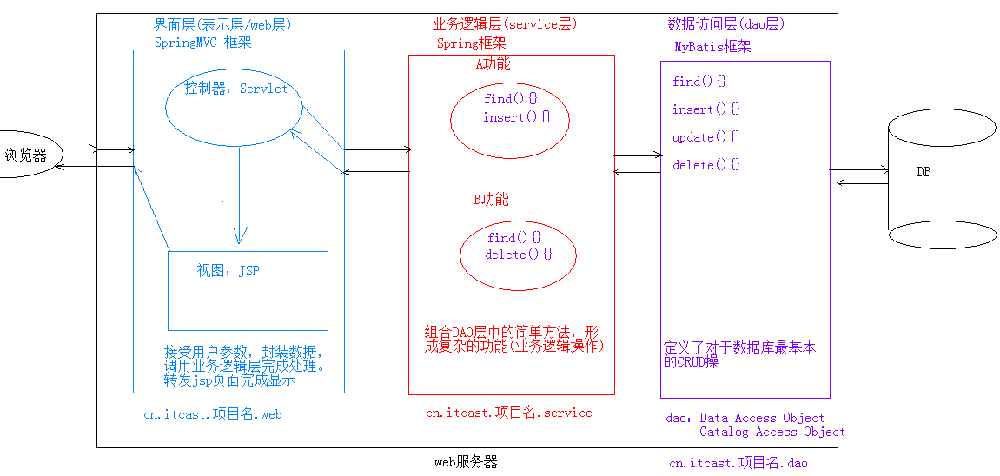

# 第十七节  JSP MVC EL JSTL

## 一、JSP

### 1.1、指令

- #### 作用：用于配置JSP页面，导入资源文件；

- #### 格式：<%@ 指令名称 属性名1=属性值1 属性名2=属性值2 ... %>

- #### 分类：

  1. ##### page	： 配置JSP页面的；

     - ##### contentType：等同于response.setContentType()；

       1）设置响应体的mime类型以及字符集；

       2）设置当前jsp页面的编码（只能是高级的IDE才能生效，如果使用低级工具，则需要设置pageEncoding属性设置当前页面的字符集）；

     - language：java (jsp的野心，想所有语言都能定义)

     - buffer：默认8k；

     - import：导包；

     - errorPage：当前页面发生异常后，会自动跳转到指定的错误页面；

     - isErrorPage：标识当前也是是否是错误页面；

       1）true：是，可以使用内置对象exception

       2）false：否。默认值。不可以使用内置对象exception

  2. ##### include	： 页面包含的。导入页面的资源文件

     `<%@include file="top.jsp"%>`

  3. ##### taglib	： 导入资源

     `<%@ taglib prefix="c" uri="http://java.sun.com/jsp/jstl/core" %>`

     * prefix：前缀，自定义的

### 1.2、注释:

- html注释：`<!-- -->` 只能注释html代码片段;
- jsp注释：推荐使用  `<%-- --%>`：可以注释所有;


### 1.3、内置对象：在jsp页面中不需要创建，直接使用的对象

一共有9个：

| 变量名      | 真实类型            | 作用                                                   |
| ----------- | ------------------- | ------------------------------------------------------ |
| pageContext | PageContext         | 当前页面共享数据，还可以获取其他八个内置对象 －>最小域 |
| request     | HttpServletRequest  | 一次请求访问的多个资源(转发) －> 再次之域              |
| session     | HttpSession         | 一次会话的多个请求间，共享数据 －> 次之域              |
| application | ServletContext      | 所有用户间共享数据，唯一对象 －> 最大域                |
| response    | HttpServletResponse | 响应对象                                               |
| page        | Object              | 当前页面(Servlet)的对象  this                          |
| out         | JspWriter           | 输出对象，数据输出到页面上                             |
| config      | ServletConfig       | Servlet的配置对象                                      |
| exception   | Throwable           | 异常对象                                               |


## 二、MVC：开发模式

### 2.1、jsp演变历史

1. 早期只有servlet，只能使用response输出标签数据，非常麻烦；
2. 后来又jsp，简化了Servlet的开发，如果过度使用jsp，在jsp中即写大量的java代码，有写html表，造成难于维护，难于分工协作；
3. 再后来，java的web开发，借鉴mvc开发模式，使得程序的设计更加合理性；


### 2.2、MVC模式

1. ##### M：Model，模型。JavaBean

   - 完成具体的业务操作，如：查询数据库，封装对象

2. ##### V：View，视图。JSP

   - 展示数据

3. ##### C：Controller，控制器。Servlet

   - 获取用户的输入

   * 调用模型
   * 将数据交给视图进行展示


### 2.3、优缺点：

1. ##### 优点：

   耦合性低，方便维护，可以利于分工协作；

   重用性高；

2. ##### 缺点：

   使得项目架构变得复杂，对开发人员要求高；

   不适合中小型项目；

> 区分：MVC、MVP、MVVM 对比详解
>
> [ MVC、MVP、MVVM三大开发模式对比分析](attach/MVC_MVP_MVVM.md)


## 三、EL表达式、JSTL标签

**引言：由于JSP只做数据展示，那么如何处理JSP中的java代码呢？ 于是就要学习EL表达式、JSTL标签，替换jsp的java代码块；**


## 3.1、EL表达式

#### 1、概念：Expression Language 表达式语言

#### 2、作用：替换和简化jsp页面中java代码的编写

#### 3、语法：${表达式}

#### 4、注意：

Jsp默认支持el表达式的。如果要忽略el表达式：

- 设置jsp中page指令中：isELIgnored="true" 忽略当前jsp页面中所有的el表达式;
- \${表达式} ：忽略当前这个el表达式;

#### 5、使用方式：

- ##### 运算：

  1. 算数运算符： + 、- 、* 、/(div) 、%(mod)；

  2. 比较运算符： > < >= <= == !=

  3. 逻辑运算符： &&(and) ||(or) !(not)

  4. ##### 空运算符： empty

     功能：用于判断字符串、集合、数组对象是否为null或者长度是否为0;

     ${empty list}:判断字符串、集合、数组对象是否为null或者长度为0;

     ${not empty str}:表示判断字符串、集合、数组对象是否不为null 并且 长度>0

- ##### 获取值

  1. el表达式只能从域对象中获取值；

  2. 语法：

     - ##### ${域名称.键名}：从指定域中获取指定键的值;

        域名称：

       1. pageScope		--> pageContext
       2. requestScope 	--> request
       3. sessionScope 	--> session
       4. applicationScope --> application（ServletContext）

       ```java
       request.setAttribute("name","张三");
       ${requestScope.name}
       ```

     - ##### ${键名}：表示依次从最小的域中查找是否有该键对应的值，直到找到为止。(若不重名，简化EL)

     - ##### 获取对象、List集合、Map集合的值

       1. 对象：${域名称.键名.属性名} ： 本质上会去调用对象的getter方法；（注意是：属性，不是成员变量）

          ```jsp
          <%
              User user = new User();
              user.setName("张三");
              user.setAge(0);
              user.setBirthday(new Date());
              request.setAttribute("u",user);
          %>
          
          ${requestScope.u}<br>
          ${u.birthday}<br>
          ${u.birStr}<br>
          ```

       2. List集合：${域名称.键名[索引]}；

       3. Map集合：

          - ${域名称.键名.key名称}
          - ${域名称.键名["key名称"]}

- ##### 隐式对象：el表达式中有11个隐式对象，类似jsp的内置对象

  pageContext：获取jsp其他八个内置对象

  ```jsp
  ${pageContext.request.contextPath}：动态获取虚拟目录
  ```


## 3.2、JSTL标签

#### 1、概念：JavaServer Pages Tag Library  JSP标准标签库

​	是由Apache组织提供的开源的免费的jsp标签		<标签>

> **由于在非常情况下，不得不书写java代码，就需要用到JSTL，方便与前端人员沟通！**

#### 2、作用：用于简化和替换jsp页面上的java代码	

#### 3、使用步骤：

​	1）导入jstl相关jar包

​	2）引入标签库：taglib指令：  <%@ taglib %>

​	3）使用标签

#### 4、常用的JSTL标签

- ##### if:相当于java代码的if语句

  1. 属性：

     test 必须属性，接受boolean表达式;

     - 如果表达式为true，则显示if标签体内容，如果为false，则不显示标签体内容;
     - 一般情况下，test属性值会结合el表达式一起使用;

  2. 注意： **c:if标签是没有else情况的，若想要else情况，则可以在定义一个c:if标签即可**

- ##### choose:相当于java代码的switch语句

  1. 使用choose标签声明         				相当于switch声明
  2. 使用when标签做判断         			        相当于case
  3. 使用otherwise标签做其他情况的声明    	相当于default

  ```jsp
  	<%
          request.setAttribute("num",10);
      %>
      <c:choose>
          <c:when test="${num == 1}">星期一</c:when>
          <c:when test="${num == 2}">星期二</c:when>
          <c:when test="${num == 3}">星期三</c:when>
          <c:when test="${num == 4}">星期四</c:when>
          <c:when test="${num == 5}">星期五</c:when>
          <c:when test="${num == 6}">星期六</c:when>
          <c:otherwise >星期日</c:otherwise>
      </c:choose>
  ```

- ##### foreach:相当于java代码的for语句

  1. 完成重复的操作
      for(int i = 0; i < 10; i ++){

      }
      * 属性：
          begin：开始值
          end：结束值
          var：临时变量
          step：步长
          varStatus:循环状态对象
          ​    index:容器中元素的索引，从0开始
          ​    count:循环次数，从1开始

      ```jsp
      <c:forEach begin="1" end="10" var="i" step="1" varStatus="s">
              ${i} ${s.index} ${s.count}<br>
          </c:forEach>
      ```

  2. 遍历容器
      List<User> list;
      for(User user : list){

      }

      * 属性：
          items:容器对象
          var:容器中元素的临时变量
          varStatus:循环状态对象
          ​    index:容器中元素的索引，从0开始
          ​    count:循环次数，从1开始

  ```jsp
  <%
          List<String> list = new ArrayList<>();
          list.add("aaa");
          list.add("bbb");
          list.add("ccc");
  
          request.setAttribute("list",list);
      %>
  
      <c:forEach items="${list}" var="str" varStatus="s">
          ${s.index} ${s.count} ${str}<br>
      </c:forEach>
  ```


## 3.3 、案例：

需求：在request域中有一个存有User对象的List集合。需要使用jstl+el将list集合数据展示到jsp页面的表格table中；

```jsp
<body>
    <%
        List<User> list = new ArrayList<>();
        list.add(new User("张三",24,new Date()));
        list.add(new User("lisi",14,new Date()));
        list.add(new User("王五",34,new Date()));

        request.setAttribute("list",list);
    %>

    <table width="500" border="1px" align="center">
        <tr>
            <th>编号</th>
            <th>姓名</th>
            <th>年龄</th>
            <th>生日</th>
        </tr>
        <c:forEach items="${list}" var="user" varStatus="s">
            <c:if test="${s.count mod 2 == 0}">
                <tr bgcolor="red">
                    <td>${s.count}</td>
                    <td>${user.name}</td>
                    <td>${user.age}</td>
                    <td>${user.birStr}</td>
                </tr>
            </c:if>

            <c:if test="${s.count mod 2 != 0}">
                <tr bgcolor="green">
                    <td>${s.count}</td>
                    <td>${user.name}</td>
                    <td>${user.age}</td>
                    <td>${user.birStr}</td>
                </tr>
            </c:if>

        </c:forEach>
    </table>
</body>
```


## 四、三层架构：软件设计架构

1. 界面层(表示层)：用户看的得界面。用户可以通过界面上的组件和服务器进行交互
2. 业务逻辑层：处理业务逻辑的。
3. 数据访问层：操作数据存储文件。




## 五、案例：用户信息列表展示

分析：


```
1. 需求：用户信息的增删改查操作
2. 设计：
	1. 技术选型：Servlet+JSP+MySQL+JDBCTemplete+Duird+BeanUtilS+tomcat
	2. 数据库设计：
		create database day17; -- 创建数据库
		use day17; 			   -- 使用数据库
		create table user(   -- 创建表
			id int primary key auto_increment,
			name varchar(20) not null,
			gender varchar(5),
			age int,
			address varchar(32),
			qq	varchar(20),
			email varchar(50)
		);

3. 开发：
	1. 环境搭建
		1. 创建数据库环境
		2. 创建项目，导入需要的jar包

	2. 编码
	
4. 测试
5. 部署运维
```


## 综合案例

```
	1. 简单功能
		1. 列表查询
		2. 登录
		3. 添加
		4. 删除
		5. 修改
		
	2. 复杂功能
		1. 删除选中
		2. 分页查询
			* 好处：
				1. 减轻服务器内存的开销
				2. 提升用户体验
		3. 复杂条件查询
```


##### 请记住：${pageContext.request.contextPath} 就是一个字段不是字符串，不能没有双引号；

```javascript
function deleteUser(id) {
    if(confirm("确定要删除此条用户信息？")){
        location.href = "${pageContext.request.contextPath}/delUserServlet?id="+id;
    }
}
```


