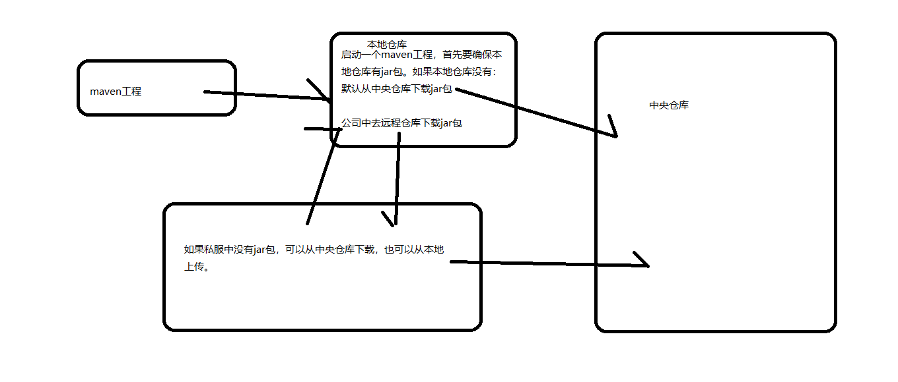
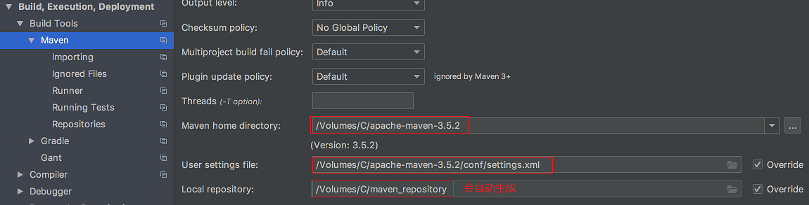
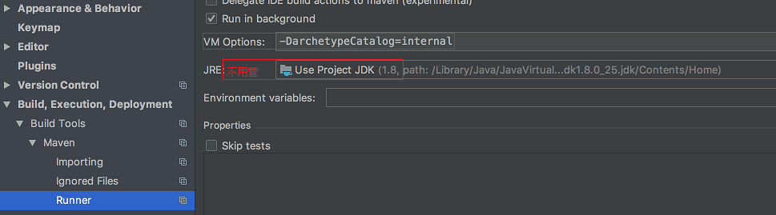

# 第二十二节 Maven

## 一、概念

### 1.1、什么是 Maven？

Maven 的正确发音是[ˈmevən],而不是“马瘟”以及其他什么瘟。Maven 在美国是一个口语化的词
语，代表专家、内行的意思。
一个对 Maven 比较正式的定义是这么说的:Maven 是一个项目管理工具,它包含了一个项目对象模
型 (POM:Project Object Model)，一组标准集合，一个项目生命周期(Project Lifecycle)，一个依赖管
理系统(Dependency Management System),和用来运行定义在生命周期阶段(phase)中插件(plugin)目标
(goal)的逻辑。


### 1.2、Maven能解决什么问题

1. ##### 较大的工程,引用的 jar 包往往有几十个乃至上百个, 每用到一种 jar 包,都需要手动引入工程目录,而且经常遇到各种让人抓狂的 jar 包冲突，版本冲突。 

   > **Maven 执行依赖导入，解决jar版本冲突！**

2. #####  Java 文件编译成二进制字节码。集成开发工具(Eclipse、IDEA)帮我们将代码即时编译。若用记事本来敲代码,然后用 javac 命令一个个地去编译,逗电脑玩吧！

   > **Maven 也能即时编译！**

3. ##### 单元测试：当代码量很大时，一个个去单元测试，疯了！

   > **Maven 能做到一次性单元测试或自动单元测试，反馈所有问题所在！**

4. ##### 后期需要把代码与各种配置文件、资源整合到一起,定型打包。如果是 web 项目，还需要将之发布到服务器,供人蹂躏。

   > **Maven 能自动部署项目，不再需要你手动打包进行部署！**


### 1.3、Maven的优势举例

同样的功能，同样的项目代码对比：

- ##### 普通项目工程：21.58M

- ##### Maven的项目工程：124KB

  ##### why？

  1. 由于普通项目是直接引入jar，即jar包直接在项目中，从而撑大了项目工程的容量；

  2. 而Maven管理的工程是间接引入jar，即jar包不是在项目中，而是在Maven jar包的仓库中，通过一个pom.xml指定jar包的坐标，间接引入；

### 1.4、两个精典应用

- ##### Maven的依赖管理： 1.3情况 就是一个依赖管理的实例；

- ##### 项目的一键构建：


## 二、Maven的使用

### 2.1、Maven软件的下载

下载地址:http://archive.apache.org/dist/maven/maven-3/

```
Binary tar.gz archive-------适用于Linux、MacOsX系统的二进制安装工具。
Binary zip archive-------适用于Windows系统的二进制安装工具。
Source tar.gz archive  -------Linux系统下的源码
Source zip archive-------Windows系统下的源码。
```

### 2.2、Maven软件的安装及配置

- **Maven安装**：下载后直接解压即可，无需特殊安装，即可使用，纯绿色版！

- **配置：(注意都需要事先配置JDK)**

  ```shell
  Windows配置环境变量: 
  1. MAVEN_HOME = D:\software\apache-maven-3.5.2
  2. PATH = ....;%MAVEN_HOME%\bin;
  
  Mac配置：
  1. open ~/.bash_profile (或者 vim ~/.bash_profile)
  2. 写入: export M2_HOME = /Volumes/C/apache-maven-3.5.2
  3. 写入: export PATH = $PATH:$M2_HOME/bin
  4. 生效：source ~/.bash_profile 
  
  最后统一查看是否生效：
  命令：mvn －v
  Maven home: /Volumes/C/apache-maven-3.5.2
  Java version: 1.8.0_25, vendor: Oracle Corporation
  Java home: /Library/Java/JavaVirtualMachines/jdk1.8.0_25.jdk/Contents/Home/jre
  Default locale: zh_CN, platform encoding: UTF-8
  OS name: "mac os x", version: "10.11.6", arch: "x86_64", family: "mac"
  ```

- ##### 文件说明：

  1. bin：存放了 maven 的命令,比如我们前面用到的 mvn tomcat:run（项目的一键构建）
  2. boot：存放了一些 maven 本身的引导程序,如类加载器等
  3. conf：存放了 maven 的一些配置文件,如 setting.xml 文件
  4. lib：存放了 maven 本身运行所需的一些 jar 包

### 2.3、Maven 仓库



- #### **本地仓库 :** 

  用来存储从远程仓库或中央仓库下载的插件和 jar 包,项目使用一些插件或 jar 包, 优先从本地仓库查找
   默认本地仓库位置在 \${user.dir}/.m2/repository,​ ${user.dir}表示windows用户目录。 

- #### 远程仓库: （私服）

  如果本地需要插件或者 jar 包,本地仓库没有,默认去远程仓库下载。 远程仓库可以在互联网内也可以在局域网内。 

- #### 中央仓库 : 

  在 maven 软件中内置一个远程仓库地址 http://repo1.maven.org/maven2 ,它是中 央仓库,服务于整个互联网,它是由 Maven 团队自己维护,里面存储了非常全的 jar 包,它包 含了世界上大部分流行的开源项目构件。 

### 2.4、Maven本地仓库的配置

由于默认本地仓库位置在 \${user.dir}/.m2/repository太难查找，所以一般我们都重新配置下本地仓库的位置，方便后续查找！

如何修改，参考如下：

1. 在 MAVE_HOME/conf/settings.xml 文件中配置本地仓库位置(maven 的安装目录下)；

2. 打开setting.xml，查找下面位置：

   ```xml
     <!-- localRepository
      | The path to the local repository maven will use to store artifacts.
      |
      | Default: ${user.home}/.m2/repository
     <localRepository>/path/to/local/repo</localRepository>
     -->
   增加：<localRepository>/Volumes/C/maven_repository</localRepository>
   
   windows版：操作一样！
   ```

### 2.5、全局 setting 与用户 setting


## 三、Maven工程的认识

### 3.1、Maven工程的目录结构

- ##### src/main/java —— 存放项目的核心java文件；

- ##### src/main/resources —— 存放项目资源文件,如 spring, hibernate 配置文件；

- ##### src/test/java —— 存放所有单元测试.java 文件,如 JUnit 测试类；

- ##### src/test/resources —— 测试资源文件；

- ##### src/main/webapp —— 页面资源，如js、css、图片资源（web项目有此目录，若是普通项目没有）

- ##### target —— 项目输出位置,编译后的 class 文件会输出到此目录；

- ##### pom.xml —— maven 项目核心配置文件；

> **AndroidStudio的android项目就是典型的maven管理项目！！**


### 3.2、Maven工程的运行

进入maven工程目录（当前目录有 pom.xml 文件），运行**tomcat:run**命令。

```shell
HawiniMac:~ F3234883$ cd /Volumes/D/maven/maven-helloworld 
HawiniMac:maven-helloworld F3234883$ mvn tomcat:run

.......
[INFO] 
[INFO] ------------------------------------------------------------------------
[INFO] Building 第一个maven工程 0.0.1-SNAPSHOT
[INFO] ------------------------------------------------------------------------
[INFO] 
[INFO] >>> tomcat-maven-plugin:1.1:run (default-cli) > compile @ maven-helloworld >>>
[INFO] 
[INFO] --- maven-resources-plugin:2.6:resources (default-resources) @ maven-helloworld ---
[WARNING] Using platform encoding (UTF-8 actually) to copy filtered resources, i.e. build is platform dependent!
[INFO] Copying 0 resource
[INFO] 
[INFO] --- maven-compiler-plugin:3.1:compile (default-compile) @ maven-helloworld ---
[INFO] Nothing to compile - all classes are up to date
[INFO] 
[INFO] <<< tomcat-maven-plugin:1.1:run (default-cli) < compile @ maven-helloworld <<<
[INFO] 
[INFO] 
[INFO] --- tomcat-maven-plugin:1.1:run (default-cli) @ maven-helloworld ---
[INFO] Running war on http://localhost:8080/maven-helloworld
[INFO] Using existing Tomcat server configuration at /Volumes/D/maven/maven-helloworld/target/tomcat
........
```

> **产生的URL：`http://localhost:8080/maven-helloworld`即可在浏览器中直接访问！**


## 四、Maven常用的命令

### 4.1、compile

##### 作用是：将 src/main/java 下的文件编译为 class 文件输出到 target目录下。

```
HawiniMac:maven-helloworld F3234883$ mvn compile
```

### 4.2、clean

#####  maven 工程的清理命令,执行 clean 会删除 target 目录及内容。

若项目是多个人开发，导入工程是，就需要清除别人编译的内容，避免相互影响！

```
HawiniMac:maven-helloworld F3234883$ mvn clean
```

### 4.3、test

```

```

### 4.4、package

```

```

### 4.5、install

##### 作用：maven 工程的安装命令,执行 install 将 maven 打成 jar 包或 war 包发布到本地仓库。

```
HawiniMac:maven-helloworld F3234883$ mvn install
```

### 4.6、Maven指令的生命周期

maven 对项目构建过程分为三套相互独立的生命周期,请注意这里说的是“三套”,而且“相互独立”, 

这三套生命周期分别是: 

- ##### Clean Lifecycle 在进行真正的构建之前进行一些清理工作。

  clean命令

- ##### DefaultLifecycle 构建的核心部分,编译,测试,打包,部署等等。

  compile - test - package - install - deploy

- ##### Site Lifecycle 生成项目报告,站点,发布站点。


## 五、Maven的概念模型


## 六、IDEA开发maven项目

### 6.1、idea 的 maven 配置

- ##### 打开 －》File－》setting配置maven  （Mac OS：IntelliJ IDEA －》preference－》setting maven ）

  

  

- ##### idea 用maven骨架生成项目速度慢的问题

> ```java
> 解决办法：// 若没有联网，使用本地maven骨架及对应的插件
> 如图 Settings中 Maven>Runner>VM Options 加上 -DarchetypeCatalog=internal
> ```


### 6.2、新建项目：

#### 6.2.1、使用maven骨架archetype，新建一个java项目

1. loading Template后，勾选`create from archetype`
2. 选择`org.apache.maven.archetype:maven-archetype-quickstart`骨架
3. 填写好项目信息三项资料：
   - GroupId: 公司或组织的名称     com_enooy
   - ArtifactId: 项目名称  maven_java
   - Version: 项目版本号  1.0-SNAPHOT (初次新建可不改)
4. 填写好项目路径信息：
   - project name: maven_java
   - project location:  /Volumes/D/maven/maven_java

> **初次加载会下载对应相关依赖或插件，比较慢！设置了使用本地maven骨架及插件，再次加载时会比较快！**

- ##### maven默认情况不会将所有maven该有的工程文件都创建，需要手动添加

  如maven_java项目，却少resources资源文件。new directory 命名为resources，默认情况，IDEA不会当成资源文件夹，需要标记为资源文件夹。右键该文件 --> **`Mark Directory as  -- Sources Root`**

```java
//1.  首次，发现本地骨架没有定义，需要download
[INFO] Archetype repository not defined. Using the one from [org.apache.maven.archetypes:maven-archetype-quickstart:1.1] found in catalog internal
Downloading from central: https://repo.maven.apache.org/maven2/org/apache/maven/archetypes/maven-archetype-quickstart/maven-metadata.xml
Downloaded from central: https://repo.maven.apache.org/maven2/org/apache/maven/archetypes/maven-archetype-quickstart/maven-metadata.xml (560 B at 57 B/s)
Downloading from central: https://repo.maven.apache.org/maven2/org/apache/maven/archetypes/maven-archetype-quickstart/1.3/maven-archetype-quickstart-1.3.pom
Downloaded from central: https://repo.maven.apache.org/maven2/org/apache/maven/archetypes/maven-archetype-quickstart/1.3/maven-archetype-quickstart-1.3.pom (1.6 kB at 420 B/s)
Downloading from central: https://repo.maven.apache.org/maven2/org/apache/maven/archetypes/maven-archetype-quickstart/1.3/maven-archetype-quickstart-1.3.jar
Downloaded from central: https://repo.maven.apache.org/maven2/org/apache/maven/archetypes/maven-archetype-quickstart/1.3/maven-archetype-quickstart-1.3.jar (7.0 kB at 1.3 kB/s)

// 2. download骨架后，build success，但是此时还没有成功，需要download 相关插件plugins，才能支撑项目运行；
```

### 6.2.2、不使用骨架创建java项目

- ##### 不勾选create archetype，直接创建即可！其余步骤一致；

- ##### 特点：

  - 能很快创建项目，不需要去下载骨架相关依赖及插件；
  - 而且，在项目会生成resources资源包，与标准项目目录更接近，故推荐使用此方式搭建工程；

### 6.2.3、创建web项目

1. 选择：`org.apache.maven.archetype:maven-archetype-webapp`创建
2. 创建后，只有webapp文件夹，其他文件都需要手动添加；


## 七、案例

#### 7.1、如何将java 文件夹（普通文件）转化为webapp相关文件夹


### 7.2、创建Servlet

- 首次new servlet根本就没有那个选项，如何解决？

  > **找到maven_web.iml文件，添加下面标签内容，然后重启项目即可**
  >
  > ```xml
  > <!-- 在sourceRoots添加第1条即可，若第2条没有，也加上 -->
  > <sourceRoots>
  >     <root url="file://$MODULE_DIR$/src/main/java" />
  >     <root url="file://$MODULE_DIR$/src/main/resources" />
  > </sourceRoots>
  > ```

```
<!-- 项目运行依赖的jar -->
<!--<dependencies>-->
  <!--<dependency>-->
    <!--<groupId>javax.servlet</groupId>-->
    <!--<artifactId>servlet-api</artifactId>-->
    <!--<version>2.5</version>-->
  <!--</dependency>-->
  <!--<dependency>-->
    <!--<groupId>javax.servlet.jsp</groupId>-->
    <!--<artifactId>jsp-api</artifactId>-->
    <!--<version>2.0</version>-->
  <!--</dependency>-->
  <!--<dependency>-->
    <!--<groupId>junit</groupId>-->
    <!--<artifactId>junit</artifactId>-->
    <!--<version>4.12</version>-->
  <!--</dependency>-->
<!--</dependencies>-->
```

> ```javascript
> <project xmlns="http://maven.apache.org/POM/4.0.0" ...
> 
> 头部提示错误 Duplicated tag: 'dependencies'  (position: START_TAG seen ...</properties>\r\n\r\n <dependencies>... @30:17) less... 
>     
> 原因：重复的<dependencies></dependencies>标签！！
> ```


