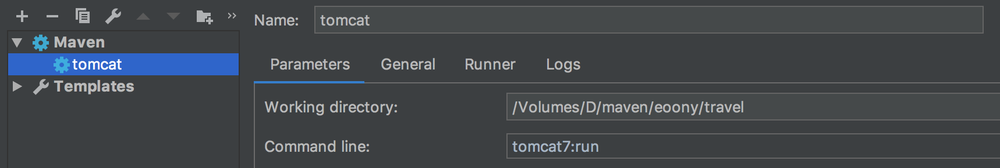
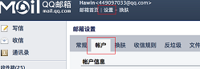
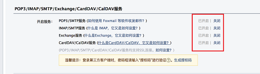
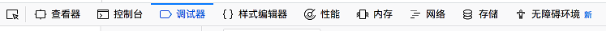
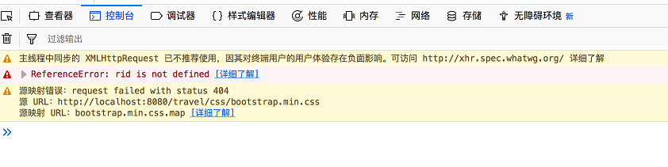
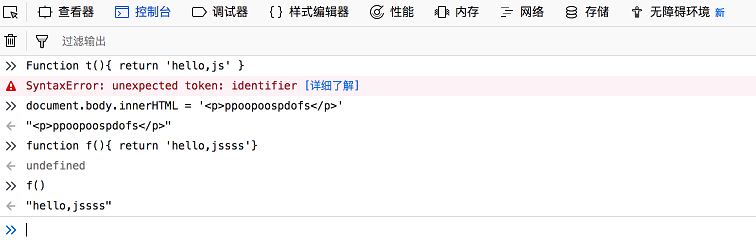
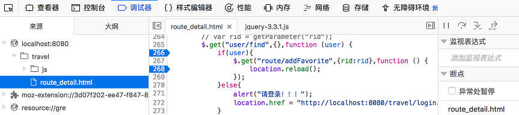

快捷：选择文本替换  ctrl+R

# 第二十三节  Web阶段项目 －－ 黑马旅游网

## 一、导入项目

##### 1.1、导入项目发现很多jar版本与本地版本不一致，所以要修正pom.xml，后再导入项目；

##### 1.2、当执行tomcat:run会出现Project JDK is not Specified. 项目的JDK没有规定。

- 解决1: 直接在pom.xml指定JDK插件；
- 解决2: 在IDEA工具，打开project structure发现NO JDK，直接选择new 找到JDK安装路径，或者下拉若有JDK版本直接选上即可！

##### 1.3、项目启动3种方式：

- 在右侧插件，找到tomcat7:run命名，双击运行；

- 也可以将tomcat7:run命令，配置到IDEA工具内；（推荐，方便调试）

  点击右上角的`Edit Configuration`，点击`+`，选择maven， 在Command line填入 `tomcat7:run`即可

  

- 直接点击m图标，在command line框输入 `tomcat7:run`；

## 二、技术选型

1. ##### Web层：

   - Servlet：前端控制器

   - html：视图 （为啥不用jsp？）

     > 1. ##### 流行，异步请求，体验感好、便于动静态资源分离部署
     >
     >    全站Html+ajax是比较流行的做法，这样做的好处就是所有处理都是异步的用户体验较好，另外有利于切割，**HTML**，css，js什么的可以单独的部署到静态文件处理比tomcat更高性能的apache服务器上，tomcat仅作为数据处理服务器。
     >
     > 2. ##### jsp有局限，响应要慢
     >
     >    jsp, java server page，也就是说离开了Java，它就费了。其次、 就算不离开Java，JSP还要服务器解析编译成servlet，响应速度慢。一般应用在小项目或者后台系统；
     >
     > 3. ##### 大型项目用HTML+AJAX，便于前后端分离
     >
     >    大型的项目肯定是**HTML+AJAX**、**HTML**只要浏览器便能解析了。平台级的项目都是**HTML**+AJAX。这样前后端分离，前后端可以同时由不同的分工开发。而且**HTML**是可以做nginx的，后端只需要提供REST风格的接口即可。不论是转向移动开发还是后台是其它语言，对于前端来说都不管，互联网型的项目都是**HTML**+AJAX，至于数据绑定可以用angular.JSP这种就把前后端绑的很紧了，不利于大型,多语言，以及访问量大的项目；
     >
     > 4. ##### 为啥还有3P(jsp、asp、aspx、php)？
     >
     >    **HTML+Ajax**很强大，适应大型项目，但若一些小项目，大材小用！Jsp在小项目还是有很大优势，因为功能够强（java，js，html都能写！），简单功能，也许就几个jsp就搞定了！
     >
     >    **但是大势是：前后端分离，HTML+Ajax技术；**

   - Filter：过滤器

   - BeanUtils：数据封装

   - Jackson：json序列化工具 （由于html只能通过异步来交互数据）

2. ##### Service层

   - javamail：
   - Redis：
   - Jedis：

3. ##### Dao层

   - mysql：
   - druid：数据库连接池
   - JDBCTemplate：JDBC工具


## 三、数据库的创建

1. #### 统一编码规则：utf8  防止数据存储乱码！

   ```sql
   -- 创建database一定要设置utf8，至于table是按db编码而来
   create database if not exists travel default character set utf8; 
   ```

2. #### 数据库链接池配置设置：druid.properties

   ```properties
   url=jdbc:mysql:///travel?useUnicode=true&characterEncoding=UTF-8
   ```


## 四、注册页面：

4.1、重点代码：

```java
/** 
* 1. 前端表单校验 
*/
function checkUsername(){
    var username = $("#username");
    var reg_value =  /^\w{5,20}$/;   // 5-20位连续任意字符，但不能含位空格
    var flag = reg_value.test(username.val());
    if(flag){
        username.css("border","");
    }else{
        username.css("border","1px solid red");
    }
    return flag;
}
// var reg_email = /^\w+@\w+\.\w+$/;  邮箱校验
// var flag = !($.trim(birthdayStr)==='');  非空判断
// var reg_phone1 = /^1[3|4|5|8][0-9]\d{4,8}$/;  多数字位电话号码
// var reg_phone = /^1\d{10}$/;  1开头的电话号码

/**
* 2. 表单提交 -- 是同步请求，不适应html＋ajax。所以要防止表单提交，热return false；
*/
$("#form").submit(function (data) {
    // (return false 不提交)，(无return return true 提交)
    if(checkUsername()&& ...){
        var formStr = $(this).serialize();
        var params = decodeURIComponent(formStr,true);
        $.post("user/register",params,function (data) {
            if(data.flag){
                location.href = "register_ok.html";
            }else{
                $("#errMsg").html(data.errorMsg);
            }
        });
    }
    return false;
});

/**
* 3. 服务器验证码校验
*/
String check = req.getParameter("check"); // 2.1 获取界面的验证码
HttpSession session = req.getSession();
String checkcode_server = (String) session.getAttribute("CHECKCODE_SERVER");
session.removeAttribute("CHECKCODE_SERVER");
if(null == checkcode_server || !checkcode_server.equalsIgnoreCase(check)){
    resp.setContentType("application/json;charset=utf-8");
    resp.getWriter().write(PublicUtil.getResultToJson(false,"验证码错误！"));
    return;
}

/**
* 4. service层 注册处理
*/
public boolean register(User regUser) {
    // 1. 根据用户名，判断用户是否存在
    User user = userDao.findByUserName(regUser.getUsername());
    if(null != user) return false;
	// 2. 不存在，初始化code，status值
    String code = UuidUtil.getUuid();
    regUser.setCode(code);
    regUser.setStatus("N");
    // 3. 发送激活邮件
    String content = "<a href='http://localhost:8080/travel/user/active?code="+code+"'>请激活用户信息［黑马旅游网］</a>";
    MailUtils.sendMail(regUser.getEmail(), content, "用户激活");
    // 4. 保存用户
    userDao.save(regUser);
    return true;
}
```


- #### 问题1：在使用$("#form").serialize()中文乱码

  ```javascript
  // 若表单存在中文，默认情况下，serialize()自动调用了encodeURIComponent方法将数据编码了 ，所以，我们进行调用decodeURIComponent(XXX,true);将数据解码 
  var formStr = $(this).serialize();
  var params = decodeURIComponent(formStr,true);
  ```

- #### 问题2：发邮件如下错误

  ```java
  javax.mail.AuthenticationFailedException: 535 Error: ÇëʹÓÃÊÚȨÂëµÇ¼¡£ÏêÇéÇë¿´: 
  ```

  > 原因：邮箱没有授权！参考QQ mail授权如下：
  >
  > 
  >
  > 


## 五、BaseServlet抽取

##### 1. 若项目很庞大，每个功能对应一个Servlet，系统则会冲挤大量Servlet类，不便于后续维护！

##### 2. 根据源码分析： 普通的Servlet doPost，doGet方法都是在HttpServlet类的service方法进行分发。若我们重写分发即可简化我们Servlet的书写，只需要一个方法对应一个功能即可！参考如下代码：（发射原理）

```java
//@WebServlet("/BaseServlet") -- 此处要注释，不被外界访问
public class BaseServlet extends HttpServlet {

    @Override
    protected void service(HttpServletRequest req, HttpServletResponse resp) throws ServletException, IOException {
        // 1. 获取访问路径，即可得到方法名
        String uri = req.getRequestURI(); // /user/add
        String methodName = uri.substring(uri.lastIndexOf("/")+1);

        // 2. 获取方法执行对象
        try {
             // 2.1 谁调用了service方法，this对象就是谁
            Method method = this.getClass().getMethod(methodName, HttpServletRequest.class, HttpServletResponse.class);
            // 2.2 执行对应方法
            method.invoke(this,req,resp);
        } catch (Exception e) {
            e.printStackTrace();
        }
    }
}    
```

##### 3. 简化原则：一个Servlet对应一张表的所有业务逻辑，通过具体方法区分具体业务逻辑；

```java
@WebServlet("/user/*")  // 操作tab_user表的所有业务
public class UserServlet extends BaseServlet {

    private UserService service = new UserServiceImpl();
	// 1. 登录
    public void login(HttpServletRequest req, HttpServletResponse resp) throws ServletException, IOException {
        ....
    }
    // 2. 查找
    public void find(HttpServletRequest req, HttpServletResponse resp) throws ServletException, IOException {
        Object user = req.getSession().getAttribute("user");
        writeJsonToClient(resp, user);
    }
   	// 3. 注册
     public void register(HttpServletRequest req, HttpServletResponse resp) throws ServletException, IOException {
         ...
     }
    // 4. 退出
    public void exit(HttpServletRequest req, HttpServletResponse resp) throws ServletException, IOException {
        req.getSession().invalidate();
        resp.sendRedirect(req.getContextPath()+"/login.html");
    }
    // 5. 激活
     public void active(HttpServletRequest req, HttpServletResponse resp) throws ServletException, IOException {
		...
    }
}  
```

##### 4. 前端访问

```js
$.get("user/find",{},function (data) { // $.get("findUserServlet",{},function) 
	$("#span_user").html("欢迎回来："+data.name);
});

$.post("user/login",params,function (data) {
    // {flag:true,"errMsg":"...","data":{"username":"hawinzeng","":""}}
    if(data.flag){
        location.href = "index.html";
    }else{
        $("#errorMsg").html(data.errorMsg);
    }
});
```


## 六、分页数据

#### 1. Redis数据缓存 —— 导航栏数据

```java
public List<Category> findAll() {
    Jedis jedis = null;
    List<Category> cs = null;
    try{
        jedis = JedisUtil.getJedis();
        Set<Tuple> categories = jedis.zrangeWithScores("categories",0,-1);
        if(null != categories && categories.size() >0){
            System.out.println(" redis 缓存数据 。。。。");
            cs = new ArrayList<>();
            for(Tuple tuple:categories){
                Category c = new Category();
                c.setCid((int) tuple.getScore());
                c.setCname(tuple.getElement());
                cs.add(c);
            }
        }else{
            System.out.println("数据库查询。。。。");
            String sql = "select * from tab_category ";
            cs = template.query(sql, new BeanPropertyRowMapper<Category>(Category.class));
            for(Category c:cs){
                jedis.zadd("categories",c.getCid(),c.getCname());
            }
        }
    }catch (Exception e){
        e.printStackTrace();
    }finally {
        if(null != jedis){
            jedis.close();
        }
    }
    return cs;
}
```

#### 2. 分页查找 —— 特别注意sql拼接

```java
public List<Route> findPageByCondition(int cid,int start, int pageSize,String search) {
    List<Route> routes = null;
    // sql  多情况字符串拼接
    String sql = "select * from tab_route where 1=1 ";
    StringBuilder sb = new StringBuilder(sql);
    List<Object> params = new ArrayList<Object>();

    if(cid != 0){
        sb.append(" and cid=? ");
        params.add(cid);
    }

    if(null != search && !"".equals(search) && !"null".equals(search)){
        //            sb.append(" like '%'?'%' ");
        //            params.add(search);
        sb.append(" and rname like ? ");
        params.add("%"+search+"%");
    }

    sb.append(" limit ?,? ");
    params.add(start);
    params.add(pageSize);

    sql = sb.toString();

    try {
        routes = template.query(sql, new BeanPropertyRowMapper<Route>(Route.class), params.toArray());
    } catch (Exception e) {
        e.printStackTrace();
    }
    return routes;
}
```

#### 3. 前端分页页码设计－－前5后4

```js
// 前5 后4 格式
var begin = pCurrentPage-5;
var end = pCurrentPage+4;
// 1. 数量少于10
if(totalPage <= 10){
    begin = 1;
    end = totalPage;
}else{
    // 2. 数量大于10
    // 2.1 当前面不足5个
    if(begin < 1){
        begin = 1;
        end = begin + 9;
    }
    // 2.2 当end 补10超出范围
    if(end > totalPage){
        end = totalPage;
        begin = end - 9;
    }
}
```

#### 4. 分页条件查询，搜索条件中文乱码

浏览器传来的中文数据是URL编码。Tomcat8 在get请求能自动将转化中文！

```js
// 1. tomcat8 get 自动将%E5%BC%A0%E4%B8%895 转化为‘张三’，注意高级浏览器在地址栏，观察到是中文，但是实际传递还是URL编码。同样查看请求头消息，高级浏览器也是中文，也是浏览器自动转化的结果，实际是URL编码。
http://localhost:8080/day16/loginServlet?username=%E5%BC%A0%E4%B8%895&password=11223344

// 2. tomcat8 post 不能实现中文转换
req.setCharacterEncoding("utf-8"); // 添加此条即可以解决中文乱码

http://./travel/route/pageByCondition?cid=5&rname=%E5%85%B5%E9%A9%AC%E4%BF%91
// 3. tomcat7 接收一个中文的URL编码，会自动转化为tomcat系统的语言iso-8859-1。那么只能使用如下方式解决乱码：(get)
rname = new String(rname.getBytes("iso-8859-1"),"utf-8");
// (post ) 设置rep编码格式即可
req.setCharacterEncoding("utf-8");; // 这个方法只对post有效

// 4. tomcat7 ，前端是ajax异步请求，get方式，发送中文，此时是实实在在的URL编码，浏览器不会自动转成中文，tomcat7也不会转成iso-8859-1；那么就只能URL编码
rname = URLDecoder.decode(rname,"utf-8");

// 问题？为什么有些系统ajax异步请求，中文还是中文，而我的系统，怎么是URL编码传递，且浏览器都无法转换成中文呢？ 这样不会造成部署后，系列中文乱码问题吗？

答：不是与系统有关！而是代码问题！

$(function () {
    var cid = getParameter("cid");
    var rname = getParameter("rname"); // 由于此行代码，已经将中文，转化成一个URL字符串了
    // 解决方法：再将URL手动转换为中文即可！从而统一问题解决！
    if(rname){
        rname = decodeURIComponent(rname);
    }
    load(cid,1,rname);
});

function load(cid,rname){
    $.get("route/pageQueryByCondition",{cid:cid,rname:rname},function (pb) {
        var totalPage = pb.totalPage;
        var pCurrentPage = pb.currentPage;
    }
}          
```

#### 5. 参数为null或空，注意项

```java
private int initPageQueryParams(String param,int defaultValue){
    // 客户端界面有时没有传值，可能会默认一个'null'字符串过来，并不是真正的null对象
    if(null==param || "".equals(param) || "null".equals(param)){
        return defaultValue;
    }
    try {
        return Integer.valueOf(param);
    }catch (Exception e){
        e.printStackTrace();
    }
    return defaultValue;
}
```

#### 6. 编码细节点：

```js
// 1. js中的数据拼接，避免出现\, ‘’串“”，“”串‘’；
var nextPage = '<li class="threeword" onclick="load('+cid+','+next+',\''+rname+'\')"><a href="javascript:void(0)">下一页</a></li>'; 

// 2. javascript:void(0)可以取消链接点击效果，也可以不写href="javascript:void(0)"

// 3. onclick="javascript:load()" -- 前缀javascript可以省略，但是href="javascript:load()"不能省略；

// 4. json 数据不是jQuery对象，不能each遍历
$.get("category/findAll",{},function (data) {
    var categoryHtml = '<li class="nav-active"><a href="index.html">首页</a></li>';
    // data.each(function (index,element) {// data:并不是jquery对象，不能调用each方法
    //     categoryHtml = categoryHtml + '<li><a href="route_list.html?cid='+element.cid+'">'+element.cname+'</a></li>';
    // });

    for(var i=0,length = data.length;i<length;i++){
        categoryHtml += '<li><a href="route_list.html?cid='+data[i].cid+'">' +data[i].cname+'</a></li>';
    }
｝

// 5. 避免写同步请求代码
for(var i=1;i<=pb.totalPage;i++){
    if(currentPage == i){
<!--  请注意这样写就是一个同步请求！！！！ -->
// page_lis += '<li class="curPage"><a href="route_list.html?cid='+cid+'&currentPage =' +i+'">'+i+'</a></li>';
   page_lis += '<li class="curPage" onclick="javascript:load('+cid+','+i+')"><a href="javascript:void(0)">'+i+'</a></li>';
}else{
   page_lis += '<li onclick="load('+cid+','+i+')"><a href="javascript:void(0)">'+i+'</a></li>';
    }
}
```


## 七、网页调试

以FireFox为例：

####按F12，打开火狐浏览器的调试工具，下面就是调试工具栏: 

##### 笔记本调试：（fn＋F12）



1. **元素选择 ：从页面中选择一个元素**

   >  鼠标点击这个图标之后，鼠标在页面上就可以选择元素了，点击选择的元素，就会迅速定位到该元素的代码上。当页面元素非常多的时候，用这个方法选择要找到的元素非常方便。

2. **查看器 ：与元素选择一并使用**

   > 这个图标的功能是，显示web页面代码的结构，当鼠标在代码中移动到某个元素的上面时，web页面的这个元素就会高亮显示。

3. **控制台** ：

   

   

   > 这个功能是非常重要的，必须会。 
   > 1、一般调试的时候在代码中可以使用console.log(‘要输出的内容’)这条语句在控制台中查看输出，用于调试简单的错误。 
   >
   > 2、控制台页面是与当前打开的页面处于同一个环境的，也就是说，当前页面的控制台只对当前页面有效，控制台可以看做是页面的js运行的一个延伸。而且，控制台可以输入输出，也可以更改页面的显示。 
   >
   > **3、界面的红三角就是夹在页面的出错，都会在控制台显示，通过配合调试器查找错误；**

4. **调试器** 

   

   > 这是页面刷新之后，左上角的四个图标。 
   > 　　第一个图标（F8），当你设置两个或两个以上的断点时，点击一下，直接运行到下一个断点。 
   > 　　第二图标（F10），当点击这个图标时，相当于一个函数一个函数的执行 
   > 　　第三个图标（F11），当点击这个图标时，相当于一步一步的执行。 
   > 上述三个图标，经常一起用，用的时候观察右侧栏显示。 点击添加监视表达式，将你需要监视的变量写进去，就可以了 。
   >
   > **调试注意：若断点不能跳，证明断点有异常！！！**

5. **网络**

   > 查看网络数据传输，如请求头、响应消息、参数等；


问题：

```
主线程中同步的 XMLHttpRequest 已不推荐使用，因其对终端用户的用户体验存在负面影响。可访问 http://xhr.spec.whatwg.org/ 详细了解!!!

1. 通过单独测试ajax异步提交是没有异常。
2. 那么问题应该是在导入很多js文件引发的！(待解决！)
```


