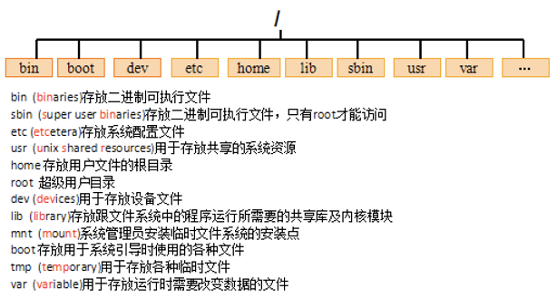

# 第二十四节 Linux 入门

## 一、Linux概念

### 1.1、什么是Linux？

#### 1.1.1、 Unix了解

- Unix 是一个强大的多用户、多任务操作系统。

- 历程：

  1. AT&T，GE，MIT(麻省理工学院) 合作开发 MULTICS项目；
  2. AT&T的Bell实验室退出MULTICS项目，Bell实验室Ken Thompson工程师写了一个MULTICS克隆版Unics（单一的意思，代表写的很粗糙，很烂！）。因为Ken并不是为写这个Unics系统，他主要是为了在MULTICS系统下的一款游戏，MULTICS系统不能用了，那么就不得不自己写系统了。
  3. Ken的另一个同事Dennis Ritchie，却对Unics很感兴趣。于是，Dennis Ritchie 在BCPL基础上，开发了一种新的高级语言将Unics重新写了一遍，并命名为 UNIX。


#### 1.1.2、Linux的概述

- ##### Linux是基于Unix的。

  是一种自由和开放源码的操作系统，存在着许多不同的Linux版本，但它们都使用了Linux内核。Linux可安装在各种计算机硬件设备中，比如手机、平板电脑、路由器、台式计算机。

- ##### 历程：

  1. AT&T对于Unix商业化，而后将Unix进行了闭源。1991，芬兰赫尔辛基大学Andrew所教授的课程《操作系统》却没有了“操作系统”。对此Andrew一咬牙，狠狠心，写出了一个兼容Unix的操作系统 －－Minix。
  2. Minix由于过于短小精悍，只能运行在一种特定机器，其他机器没有驱动。Andrew的学生就写了好多好用驱动来扩展Minix。但，Andrew很固执，觉得自己的操作系统要保持纯洁，不能有其他的代码来源。
  3. Andrew的学生Linus，就开始造反了，不让加，就自己再开发一套，Linux就此诞生！
  4. 1983年，Stallman发起了“GNU”计划，GNU编写了很多自由免费的软件（黑客很鄙视收费），但是没有自由的操作系统，都是在Unix上的运行软件，软件免费，系统却收费，悲剧！1992年，终于Linux与GNU结合，从此Linux走向未来王者之路！

  **了解更多：**[操作系统Unix、Windows、Mac OS、Linux的故事](https://www.jianshu.com/p/4a06bbe8ebe4)

- ##### Linux系统的应用：

  - ##### 服务器系统:

    Web应用服务器、数据库服务器、接口服务器、DNS、FTP等等； 

  - ##### 嵌入式系统:

    路由器、防火墙、手机、PDA、IP 分享器、交换器、家电用品的微电脑控制器等等

  - ##### 桌面应用系统

  - ##### 移动手持系统

- ##### Linux版本：内核版、发行版本

  **内核版本：**是指在Linus领导下的内核小组开发维护的系统内核的版本号；

  **发行版本：**是一些组织和公司根据自己发行版的不同而自定的 ；

  市场主流版本：

  - RedHat：(收费，命令行)
  - ubuntu：Linux桌面版
  - CentOS：（基于RedHat分支的一个免费版，主流服务器）
  - debian
  - 红旗red flag：（RedHat系列的分支）


## 二、Linux的安装

### 2.1、虚拟机安装

- #### 虚拟机软件

  - VmWare：收费的。安装简单，兼容性好！
  -  VirtualBox：免费的。安装复杂些，兼容稍差！

- #### 安装VmWare

### 2.2、CentOS的安装

### 2.3、Linux的目录结构：



> root管理员的home目录root
>
> 其他用户的home目录home目录中
>
> ##### mac os：sudo -i 进入管理员root目录 / exit 退出管理员目录


## 三、Linux的常用命令

#### 3.1、切换目录命令cd：

```shell
cd app		切换到app目录 
cd ..		切换到上一层目录 
cd /		切换到系统根目录 
cd ~		切换到用户主目录 
cd -		切换到上一个所在目录
```

#### 3.2、列出文件列表：ls 、ll (ls -l简写)、dir

```shell
ls(list)是一个非常有用的命令，用来显示当前目录下的内容。配合参数的使用，能以不同的方式显示目录内容。     格式：ls[参数] [路径或文件名]

常用：在linux中以 . 开头的文件都是隐藏的文件;

ls
ls -a 显示所有文件或目录（包含隐藏的文件）
ls -l  缩写成ll

man ls 查看对应命令所有参数，通过上下方向键，滚动查看；(Q:退出)

dir 也是显示目录(普通显示，不带任何色彩。一般是使用ls)
```

#### 3.3、创建目录和移除目录：mkdir rmdir

```shell
mkdir(make directory)命令可用来创建子目录。
	mkdir app    在当前目录下创建app目录
    mkdir –p app2/test   级联创建aap2以及test目
    
rmdir(remove directory)命令可用来删除“空”的子目录： 
	rmdir app    删除app目录 
```

#### 3.4、 浏览文件：cat、more、less

```shell
cat 用于显示文件的内容。 格式：cat[参数]<文件名>

    * cat yum.conf 
more 一般用于要显示的内容会超过一个画面长度的情况。按空格键显示下一个画面。
回车显示下一行内容。
按 q 键退出查看。
* more yum.conf
   * 空格显示下一页数据  回车显示下一行的数据 
less 用法和more类似，不同的是less可以通过PgUp、PgDn键来控制。
    * less yum.conf
        * PgUp 和 PgDn 进行上下翻页.
        
cat redhat-release // 查看CentOS 版本
```

#### 【tail】

```shell
tail命令是在实际使用过程中使用非常多的一个命令，它的功能是：用于显示文件后几行的内容。
用法:
tail -10 /etc/passwd    查看后10行数据
tail -f catalina.log   动态查看日志(*****)

ctrl+c 结束查看
```

#### 3.5、文件操作：

##### 【rm】

```shell
rm  删除文件
	用法：rm [选项]... 文件...
	rm a.txt    删除a.txt文件
	删除需要用户确认，y/n 
	
rm 删除不询问
	rm -f a.txt    不询问，直接删除 
	
rm 删除目录
	rm -r a    递归删除

不询问递归删除（慎用）
	rm -rf  a    不询问递归删除
	rm -rf *      删除所有文件
	rm -rf /*      自杀
```

##### 【cp、mv】

```shell
cp(copy)命令可以将文件从一处复制到另一处。一般在使用cp命令时将一个文件复制成另一个文件或复制到某目录时，需要指定源文件名与目标文件名或目录。
	cp a.txt b.txt    将a.txt复制为b.txt文件
	cp a.txt ../    将a.txt文件复制到上一层目录中 

mv 移动或者重命名
	mv a.txt ../    将a.txt文件移动到上一层目录中
	mv a.txt b.txt    将a.txt文件重命名为b.txt
```

##### 【tar】命令: (**打包或解压**)

```shell
tar命令位于/bin目录下，它能够将用户所指定的文件或目录打包成一个文件，但不做压缩。一般Linux上常用的压缩方式是选用tar将许多文件打包成一个文件，再以gzip压缩命令压缩成xxx.tar.gz(或称为xxx.tgz)的文件。  

常用参数： 
-c：创建一个新tar文件 
-v：显示运行过程的信息 
-f：指定文件名 
-z：调用gzip压缩命令进行压缩 
-t：查看压缩文件的内容 
-x：解开tar文件

打包：
	tar –cvf xxx.tar ./*
打包并且压缩：
	tar –zcvf xxx.tar.gz ./* 

解压 
    tar –xvf xxx.tar
	tar -xvf xxx.tar.gz -C /usr/aaa
```

##### 【grep】命令（作用：查找Tomcat——log错误信息，快速定位）

```shell
查找符合条件的字符串。
用法: grep [选项]... PATTERN [FILE]... 

示例：
grep lang anaconda-ks.cfg  在文件中查找lang
grep lang anaconda-ks.cfg –color 高亮显示
```

#### 3.6、其他常用命令

```shell
【pwd】显示当前所在目录

【touch】（linux没有什么文件后缀，1.txt  1文件其实是一样的，只是名称不一致）
	创建一个空文件   * touch a.txt
	
【ll -h】 友好显示文件大小

【wget】下载资料
* wget http://nginx.org/download/nginx-1.9.12.tar.gz
```


## 四、 Vi和Vim编辑器

### 4.1、Vim编辑器：

- Vi 与Vim用法一致，只是vim 显示带颜色，体验感好点；

- 在Linux下一般使用vi编辑器来编辑文件。

- vi既可以查看文件也可以编辑文件。

- 三种模式：命令行、插入、底行模式。

  ```shell
  1. 切换到命令行模式：按Esc键；
  2. 切换到插入模式：按 i 、o、a键；
      i 在当前位置生前插入
      I 在当前行首插入
      a 在当前位置后插入
      A 在当前行尾插入
      o 在当前行之后插入一行
      O 在当前行之前插入一行
  3. 切换到底行模式：按 :（冒号）；
  
  4. 操作：
      打开文件：vim file
      退出：esc → :q
      修改文件：输入i进入插入模式
      保存并退出：esc→:wq
  
      不保存退出：esc→:q!
  
  5. 快捷键：
      dd – 快速删除一行
      R – 替换 (单个字符替换)
      yy － 复制
      p － 粘贴
  ```


### 4.2、重定向输出>和>>

```shell
> 重定向输出，覆盖原有内容； 
>> 重定向输出，又追加功能； 

示例：
cat /etc/passwd > a.txt  将输出定向到a.txt中
cat /etc/passwd >> a.txt  输出并且追加

ifconfig > ifconfig.txt
```


### 4.3、管道 |

```shell
管道是Linux命令中重要的一个概念，其作用是将一个命令的输出用作另一个命令的输入。 

示例
ls --help | more  分页查询帮助信息
ps –ef | grep java  查询名称中包含java的进程

ifconfig | more
cat index.html | more
ps –ef | grep aio
```


### 4.4、&&命令执行控制：

```shell
命令之间使用 && 连接，实现逻辑与的功能。  
	只有在 && 左边的命令返回真（命令返回值 $? == 0），&& 右边的命令才会被执行。  
	只要有一个命令返回假（命令返回值 $? == 1），后面的命令就不会被执行。

mkdir test && cd test
```


### 4.5、 网络通讯命令

```shell
ifconfig  显示或设置网络设备。    --->  windows: ipconfig
	ifconfig  显示网络设备
	ifconfig eth0 up 启用eth0网卡
	ifconfig eth0 down  停用eth0网卡 

ping   探测网络是否通畅。
	ping 192.168.0.1  －－－ ctrl＋c中断，不分windows，mac，Linux

netstat 查看网络端口。
	netstat -an | grep 3306 查询3306端口占用情况
```


### 4.6、系统管理命令

```shell
date 显示或设置系统时间
	date  显示当前系统时间
	date -s “2014-01-01 10:10:10“  设置系统时间 

df 显示磁盘信息
	df –h  友好显示大小 
	
free 显示内存状态
	free –m 以mb单位显示内存组昂头 
	
top 显示，管理执行中的程序
	cpus / load average 负载 < 10可以，10～20会出现卡顿
	ctrl+c : 退出显示界面

clear 清屏幕 

ps 正在运行的某个进程的状态
	ps –ef  查看所有进程
	ps –ef | grep ssh 查找某一进程 
	
kill 杀掉某一进程
	kill 2868  杀掉2868编号的进程
	kill -9 2868  强制杀死进程

du 显示目录或文件的大小。
	du –h 显示当前目录的大小
 
who 显示目前登入系统的用户信息。 

hostname 查看当前主机名
	修改：vi /etc/sysconfig/network 
uname 显示系统信息。
	uname -a 显示本机详细信息。 
	
依次为：内核名称(类别)，主机名，内核版本号，内核版本，内核编译日期，硬件名，处理器类型，硬件平台类型，操作系统名称
```


## 五、Linux的用户和组

### 5.1、用户的管理

```shell
useradd 添加一个用户
	useradd test 添加test用户
	useradd test -d /home/t1  指定用户home目录 

passwd  设置、修改密码
	passwd test  为test用户设置密码

切换登录：
ssh -l test -p 22 192.168.19.128

su – 用户名
 
userdel 删除一个用户
	userdel test 删除test用户(不会删除home目录)
	userdel –r test  删除用户以及home目录
```

### 5.2 、组管理：

```
当在创建一个新用户user时，若没有指定他所属于的组，就建立一个和该用户同名的私有组 

创建用户时也可以指定所在组 
groupadd  创建组
	groupadd public  创建一个名为public的组
	useradd u1 –g public  创建用户指定组 
	
groupdel 删除组，如果该组有用户成员，必须先删除用户才能删除组。
	groupdel public

```

### 5.3、id，su命令

【id命令】

```
功能：查看一个用户的UID和GID 
用法：id [选项]... [用户名]
```

【su命令】

```
功能：切换用户。 
用法：su [选项]... [-] [用户 [参数]... ] 

示例：
	su u1  切换到u1用户
	su - u1 切换到u1用户，并且将环境也切换到u1用户的环境（推荐使用）
```


## 六、 Linux的权限命令

### 6.1、文件权限

```
-rwx rwx r--
1. -为开头：文件类型 (-/d...)
2. rwx 第一个为属性主权限，第二个为属组权限，第三个其他用户的权限
3. r(read 读取权)  w(write 写入权)  x(execute 执行权)
```

| 属主 |      |      | 属组 |      |      | 其他用户 |      |      |
| ---- | ---- | ---- | ---- | ---- | ---- | -------- | ---- | ---- |
| r    | w    | x    | r    | w    | x    | r        | w    | x    |
| 4    | 2    | 1    | 4    | 2    | 1    | 4        | 2    | 1    |

> 421 设计：相加不会产生重复数字


### 6.2、Linux三种文件类型：

- 普通文件： 包括文本文件、数据文件、可执行的二进制程序文件等。
- 目录文件： Linux系统把目录看成是一种特殊的文件，利用它构成文件系统的树型结构。  
- 设备文件： Linux系统把每一个设备都看成是一个文件;


### 6.3、文件类型标识

```
普通文件（-） 
目录（d） 
符号链接（l）
* 进入etc可以查看，相当于快捷方式 

字符设备文件（c） 
块设备文件（s） 
套接字（s） 
命名管道（p）
```


```
 远程链接阿里云Linux：
 // 使用时注意，若别人有链接过。会在/var/root/.ssh/known_hosts 保留一会SHA256信息，此时需要打开该文档先清空内容，再链接！
 ssh root@120.79.53.78
```


