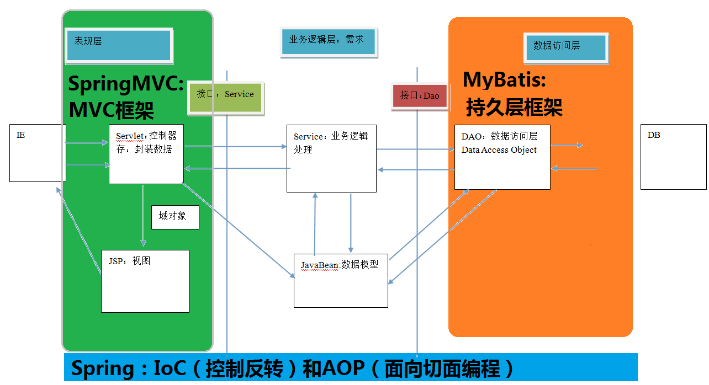

# 第1节  Mybatis  框架

## 一、框架概述

### 1.1、什么是框架

- 框架(Framework)是整个或部分系统的可重用设计,表现为一组抽象构件及构件实例间交互的方法;

- 另一种说法，框架是可被应用开发者定制的应用骨架。

前者是从应用方面而后者是从目的方面给出的定义。 

#### ［1］ 定义：框架是我们软件开发中的一套解决方案，不同的框架解决的是不同的问题。

#### ［2］ 使用框架的好处：

- ##### 框架封装了很多的细节，使开发者可以使用极简的方式实现功能。大大提高开发效率；

- ##### 软件研发将集中在应用的设计上，而不是具体的技术实现；


### 1.2、三层架构

- ##### 表现层：是用于展示数据

- ##### 业务层：处理业务需求

- ##### 持久层：与数据库交互



#### 为啥要如此分层呢？

```
为了实现 软件工程中的“高内聚、低耦合”。把问题划分开来各个解决,易于控制,易于延展,易于分配资源。我们常见的MVC 软件设计思想就是很好的分层思想。  

框架的重要性在于它实现了部分功能,并且能够很好的将低层应用平台和高层业务逻辑进行了缓和。
```

### 1.3、持久层技术解决方案

- ##### JDBC技术：

  ​		Connection
  ​		PreparedStatement
  ​		ResultSet

- ##### Spring的JdbcTemplate：

  ​		Spring中对jdbc的简单封装

- ##### Apache的DBUtils：

  ​		它和Spring的JdbcTemplate很像，也是对Jdbc的简单封装

以上这些都不是框架，只不过是 JDBC是规范。Spring的JdbcTemplate和Apache的DBUtils也都只是工具类；

##### 那么，持久层技术解决方案框架技术：Mybatis！！！


## 二、Mybatis入门

### 2.1、先回顾下jdbc程序：

```java
public static void main(String[] args) { 
    Connection connection = null;
    PreparedStatement preparedStatement = null;
    ResultSet resultSet = null; try {
        //加载数据库驱动
        Class.forName("com.mysql.jdbc.Driver"); 
        //通过驱动管理类获取数据库链接
        connection = DriverManager
            .getConnection("jdbc:mysql://localhost:3306/mybatis?characterEncoding=utf-8","ro ot", "root");
        //定义 sql 语句 ?表示占位符
        String sql = "select * from user where username = ?";
        //获取预处理 statement
        preparedStatement = connection.prepareStatement(sql); 
        //设置参数,第一个参数为 sql 语句中参数的序号(从 1 开始),第二个参数为设置的参数值
        preparedStatement.setString(1, "王五"); 
        //向数据库发出 sql 执行查询,查询出结果集
        resultSet = preparedStatement.executeQuery();
        //遍历查询结果集
        while(resultSet.next()){
            System.out.println(resultSet.getString("id")+" "+resultSet.getString("username"));
        }
    } catch (Exception e) {
        e.printStackTrace();
    }finally{ //释放资源
        if(resultSet!=null){ 
            try {
            	resultSet.close();
        	} catch (SQLException e) {
            	e.printStackTrace(); 
        	}
     	} 
        if(preparedStatement!=null){
            try { 
                preparedStatement.close();
            } catch (SQLException e) { 
                e.printStackTrace();
            }
        } 
        if(connection!=null){
            try { 
                connection.close();
            } catch (SQLException e) {
                e.printStackTrace();
            } 
        }
    }
}
```

> 问题：
>
> ##### 1、数据库链接创建、释放频繁造成系统资源浪费从而影响系统性能,如果使用数据库链接池可解决此问题。 
>
> ##### 2、Sql 语句在代码中硬编码,造成代码不易维护,实际应用 sql 变化的可能较大,sql 变动需要改变 java  代码。
>
> ##### 3、使用 preparedStatement 向占有位符号传参数存在硬编码,因为 sql 语句的 where 条件不一定,可能  								多也可能少,修改 sql 还要修改代码,系统不易维护。 
>
> ##### 4、对结果集解析存在硬编码(查询列名),sql 变化导致解析代码变化,系统不易维护,如果能将数据库记 录封装成 pojo 对象解析比较方便。  							 						 		

 						 							 								

### 2.2、MyBatis框架概述

- mybatis 是一个**优秀的基于 java 的持久层框架**，它内部封装了 jdbc，使开发者只需要关注 sql 语句本身,
  而不需要花费精力去处理加载驱动、创建连接、创建 statement 等繁杂的过程。
- mybatis 通过 xml 或注解的方式将要执行的各种 statement 配置起来，并通过 java 对象和 statement 中  							 						 					   						 							 								sql 的动态参数进行映射生成最终执行的 sql 语句，最后由 mybatis 框架执行 sql 并将结果映射为 java 对象并 返回。  
- 采用 **ORM** 思想解决了实体和数据库映射的问题，对 jdbc 进行了封装，屏蔽了 jdbc api 底层访问细节，使我  							 						 					   						 							 								们不用与jdbc api打交道，就可以完成对数据库的持久化操作。

> ##### 1. 通过了解，MyBatis框架就相应的解决传统jdbc程序遇到的问题！
>
> ##### 2. ORM：
>
> ```properties
> ORM: Object Relational Mappging 对象关系映射
> 简单的说: 就是把数据库表和实体类及实体类的属性对应起来,让我们可以操作实体类就实现操作数据库表。
> 			user			User
> 			id				userId
> 			user_name		userName
> (名称可以不一致！！！)
> ```


### 2.3、mybatis的环境搭建

- ##### 第一步：创建maven工程并导入坐标

```xml
<dependency>
    <groupId>org.mybatis</groupId>
    <artifactId>mybatis</artifactId>
    <version>3.4.5</version>
</dependency>
```

- ##### 第二步：创建实体类和dao的接口

- ##### 第三步：创建Mybatis的主配置文件——> SqlMapConifg.xml(名称自定义)

```xml
<?xml version="1.0" encoding="UTF-8"?>
<!DOCTYPE configuration
        PUBLIC "-//mybatis.org//DTD Config 3.0//EN"
        "http://mybatis.org/dtd/mybatis-3-config.dtd">
<!--mybatis的主配置文件-->
<configuration>
    <environments default="mysql">
        <!--配置mysql的环境-->
        <environment id="mysql">
            <!--配置事务的类型-->
            <transactionManager type="JDBC"></transactionManager>
            <!--配置数据源（连接池）-->
            <dataSource type="POOLED">
                 <property name="driver" value="com.mysql.jdbc.Driver"/>
                 <property name="url" value="jdbc:mysql://localhost:3306/mybatis"/>
                 <property name="username" value="root"/>
                 <property name="password" value="root"/>
            </dataSource>
        </environment>
    </environments>

    <!--
        指定映射配置文件的位置，映射配置文件的是每个dao独立的配置文件
    -->
    <mappers>
        <mapper resource="com/eoony/dao/IUserDao.xml"/>
         <!--<mapper class="com.eoony.dao.IUserDao"/>-->
    </mappers>
</configuration>
```

- ##### 第四步：创建映射配置文件——> IUserDao.xml

```XML
<?xml version="1.0" encoding="UTF-8"?>
<!DOCTYPE mapper
        PUBLIC "-//mybatis.org//DTD Mapper 3.0//EN"
        "http://mybatis.org/dtd/mybatis-3-mapper.dtd">
<mapper namespace="com.itheima.dao.IUserDao">
    <!--配置查询所有-->
    <select id="findAll" resultType="com.eoony.domain.User">
        select * from user
    </select>
</mapper>
```


### 2.4、环境搭建的注意事项：

- ##### 第一个：创建IUserDao.xml 和 IUserDao.java时名称是为了和我们之前的知识保持一致。

  ```java
  1. 在Mybatis中它把持久层的操作接口名称和映射文件也叫做：Mapper。
  2. 所以：IUserDao 和 IUserMapper是一样的。
  3. 即后续也可以使用IUserMapper名作为数据库操作对应接口。
  ```

- ##### 第二个：在maven工程中创建IUserDao.xml 目录的时候，它和java代码包是不一样的。

  ```java
  1. java代码包在创建时：com.itheima.dao它是三级结构。（一次性可以创建3级）；
  2. 创建IUserDao.xml 目录：一次性com.itheima.dao写入，只是一级目录。因此需要根据目录层级，依次创建配置目录，与IUserDao.java目录对应一致；
  ```

- ##### 第三个：mybatis的映射配置文件位置必须和dao接口的包结构相同

- ##### 第四个：映射配置文件的mapper标签namespace属性的取值必须是dao接口的全限定类名；

- ##### 第五个：映射配置文件的操作配置（select），id属性的取值必须是dao接口的方法名

> ##### 当我们遵从了第三，四，五点之后，我们在开发中就无须再写dao的实现类。


### 2.5、mybatis的入门案例 （3种）

- xml配置方式：主要是前期学习了解；

- 注解方式：后续开发主推荐方式；

- 自写dao实现类方式：了解。说明mybatis也支持此种方式；


#### 1. 根据上面xml配置方式：

```java
public static void main(String[] args) throws IOException {
    // 1. 读取配置文件
    InputStream in = Resources.getResourceAsStream("SqlMapConfig.xml");
    // 2. 创建SqlSessionFactory工厂
    SqlSessionFactoryBuilder builder = new SqlSessionFactoryBuilder();
    SqlSessionFactory factory = builder.build(in);
    // 3. 使用工厂生产SqlSession对象
    SqlSession session = factory.openSession();
    // 4. 使用SqlSession创建DAO接口的代理对象
    IUserDao userDao = session.getMapper(IUserDao.class);
    // 5. 使用代理对象执行方法
    List<User> users = userDao.findAll();
    for(User user:users){
        System.out.println(user);
    }
    // 6. 释放资源
    session.close();
    in.close();
}
```

> ```xml
> // 注意事项：
> 1. 不要忘记在映射配置中告知mybatis要封装到哪个实体类中;
> <select id="findAll" resultType="com.eoony.domain.User">
>     
> 2. 配置的方式：指定实体类的全限定类名(IUserDao.xml)
> <mapper namespace="com.itheima.dao.IUserDao">    
> ```

上面是基于xml配置（IUser.xml），是否能更简单点，使用注解？ 答案是：当然可以！

#### 2. 根据注解方式：（注意下面3点，其他一样）

> ##### 1. 不用创建IUser.xml文件及目录；
>
> ##### 2. 在对应IUserDao的方法上，添加注解
>
> ```java
> public interface IUserDao {
>     @Select("select * from user")
>     List<User> findAll();
> }
> ```
>
> ##### 3. 修改主配置文件mapper方式 －－ SqlMapConfig.xml
>
> ```xml
> <!--指定映射配置文件的位置，映射配置文件的是每个dao独立的配置文件
> 	如果使用注解配置，mapper要使用class属性置顶被注解的dao全限定类名 -->
> <mappers>
>     <!--<mapper resource="com/eoony/dao/IUserDao.xml"/>-->
>     <mapper class="com.eoony.dao.IUserDao"/>
> </mappers>
> ```

#### 3. 自写dao实现类方式（注意下面2点，其他不变）

> ```java
> // 1. 调用
> public void testMyDefine() throws IOException {
>     // 1. 读取配置文件
>     InputStream in = Resources.getResourceAsStream("SqlMapConfig.xml");
>     // 2. 创建SqlSessionFactory工厂
>     SqlSessionFactoryBuilder builder = new SqlSessionFactoryBuilder();
>     SqlSessionFactory factory = builder.build(in);
>     // 4. 使用SqlSession创建DAO接口的代理对象
>     IUserDao userDao = new UserDaoImpl(factory);
>     List<User> users = userDao.findAll();
>     for(User user:users){
>         System.out.println(user);
>     }
>     // 6. 释放资源
>     in.close();
> }
> ```
>
> ```java
> // 2. dao实现类编写
> public class UserDaoImpl implements IUserDao {
>     private SqlSessionFactory factory;
>     public UserDaoImpl(SqlSessionFactory factory){
>         this.factory = factory;
>     }
> 
>     public List<User> findAll() {
>         SqlSession session = factory.openSession();
>         List<User> users = session.selectList("com.eoony.dao.IUserDao.findAll");
>         session.close();
>         return users;
>     }
> }
> ```


