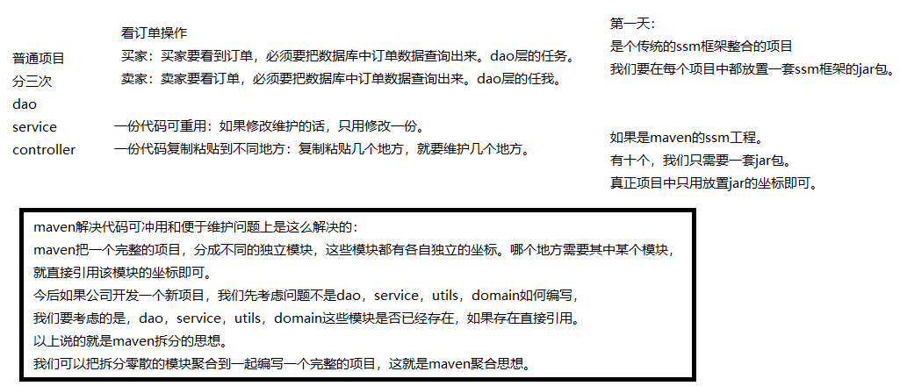

# Maven高级

## 一、基础知识回顾

#### 1.1、maven是一个项目管理工具。两个典型核心的功能：依赖管理，一键构建；

- ##### 依赖管理：maven对项目中jar包的管理过程。

  ```properties
  1. 传统工程我们直接把jar包放置在项目中。
  2. maven工程真正的jar包放置在仓库中，项目中只用放置jar包的坐标。
  ```

- ##### 一键构建：maven自身集成了tomcat插件，可以对项目进行编译，测试，打包，安装，发布等操作。

  ```properties
  1. maven常用命令：clean，compile，test，package，install，deploy。
  2. maven三套生命周期：清理生命周期，默认生命周期，站点生命周期。
  ```

#### 1.2、仓库种类：本地仓库、远程仓库【私服】、中央仓库；

- ##### 仓库之间的关系：

```properties
1. 当我们启动一个maven工程的时候，maven工程会通过pom文件中jar包的坐标去本地仓库找对应jar包。
2. 默认情况下，如果本地仓库没有对应jar包，maven工程会自动去中央仓库下载jar包到本地仓库。
3. 在公司中，如果本地没有对应jar包，会先从私服下载jar包。
4. 如果私服没有jar包，可以从中央仓库下载，也可以从本地上传。(今天一个重点就是本地上传到私服)
```


## 二、Maven工程环境搭建

### 2.1、Maven工程的jar冲突解决

```xml
<!--maven工程要导入jar包的坐标，就必须要考虑解决jar包冲突。
      解决jar包冲突的方式一：
      第一声明优先原则：哪个jar包的坐标在靠上的位置，这个jar包就是先声明的。
      先声明的jar包坐标下的依赖包，可以优先进入项目中。

      maven导入jar包中的一些概念：
      直接依赖：项目中直接导入的jar包，就是该项目的直接依赖包。
      传递依赖：项目中没有直接导入的jar包，可以通过项目直接依赖jar包传递到项目中去。

      解决jar包冲突的方式二：
      路径近者优先原则。直接依赖路径比传递依赖路径近，那么最终项目进入的jar包会是路径近的直接依赖包。

      解决jar包冲突的方式三【推荐使用】：
      直接排除法。
      当我们要排除某个jar包下依赖包，在配置exclusions标签的时候，内部可以不写版本号。
      因为此时依赖包使用的版本和默认和本jar包一样。
      -->
<dependencies>
    <dependency>
        <groupId>org.springframework</groupId>
        <artifactId>spring-beans</artifactId>
        <version>4.2.4.RELEASE</version>
        <exclusions>
            <exclusion>
                <groupId>org.springframework</groupId>
                <artifactId>spring-core</artifactId>
            </exclusion>
        </exclusions>
    </dependency>

    <dependency>
        <groupId>org.springframework</groupId>
        <artifactId>spring-context</artifactId>
        <version>${spring.version}</version>
    </dependency>

    <dependency>
        <groupId>org.springframework</groupId>
        <artifactId>spring-core</artifactId>
        <version>5.0.2.RELEASE</version>
    </dependency>
</dependencies>
```

### 2.2、jar的锁定

```xml
 <!--
    maven工程是可以分父子依赖关系的。
    凡是依赖别的项目后，拿到的别的项目的依赖包，都属于传递依赖。
    比如：当前A项目，被B项目依赖。那么我们A项目中所有jar包都会传递到B项目中。
    B项目开发者，如果再在B项目中导入一套ssm框架的jar包，对于B项目是直接依赖。
    那么直接依赖的jar包就会把我们A项目传递过去的jar包覆盖掉。
    为了防止以上情况的出现。我们可以把A项目中主要jar包的坐标锁住，那么其他依赖该项目的项目中，
    即便是有同名jar包直接依赖，也无法覆盖。
    -->
    <!-- 锁定jar包版本 ： 锁定jar不是导入jar包，下面的依赖依然需要保留！！ -->
<dependencyManagement>
    <dependencies>
        <dependency>
            <groupId>org.springframework</groupId>
            <artifactId>spring-context</artifactId>
            <version>${spring.version}</version>
        </dependency>
        <dependency>
            <groupId>org.springframework</groupId>
            <artifactId>spring-web</artifactId>
            <version>${spring.version}</version>
        </dependency>
        <dependency>
            <groupId>org.springframework</groupId>
            <artifactId>spring-webmvc</artifactId>
            <version>${spring.version}</version>
        </dependency>
        <dependency>
            <groupId>org.springframework</groupId>
            <artifactId>spring-tx</artifactId>
            <version>${spring.version}</version>
        </dependency>
        <dependency>
            <groupId>org.springframework</groupId>
            <artifactId>spring-test</artifactId>
            <version>${spring.version}</version>
        </dependency>
        <dependency>
            <groupId>org.mybatis</groupId>
            <artifactId>mybatis</artifactId>
            <version>${mybatis.version}</version>
        </dependency>
    </dependencies>
</dependencyManagement>
```

### 2.3、jar包的版本统计管理

```xml
 <!-- 
	统一管理jar包版本: 方便后续修正jar版本时，只要修改此处即可！！！！！
	xml的el表达式：key值可以随意，但是为了可读性高，请一定要写清楚！！
 -->
<properties>
    <spring.version>5.0.2.RELEASE</spring.version>
    <slf4j.version>1.6.6</slf4j.version>
    <log4j.version>1.2.12</log4j.version>
    <shiro.version>1.2.3</shiro.version>
    <mysql.version>5.1.6</mysql.version>
    <mybatis.version>3.4.5</mybatis.version>
    <spring.security.version>5.0.1.RELEASE</spring.security.version>
</properties>
```


## 三、Maven的拆分与聚合

### 3.1、Maven的拆分与聚合思想

- 让代码复用，减少后期的维护工作；
- 架构设计思维改变，先考虑是否复用；




### 3.2、工程与模块的关系及区别

```xml
<!--
工程和模块的区别：
    1. 工程不等于完整的项目，模块也不等于完整的项目；
       一个完整的项目看的是代码，代码完整，就可以说这是一个完整的项目，和此项目是工程和模块没有关系。

    2. 工程天生只能使用自己内部资源，工程天生是独立的。后天可以和其他工程或模块建立关联关系。(可以打包成jar放入本地仓库，然后其他工程依赖引用)
       模块天生不是独立的，模块天生是属于父工程的，模块一旦创建，所有父工程的资源都可以使用。

    3. 父子工程直接，子模块天生集成父工程，可以使用父工程所有资源。
       子模块之间天生是没有任何关系的。

    4. 父子工程直接不用建立关系，继承关系是先天的，不需要手动建立。

    5. 平级直接的引用叫依赖，依赖不是先天的，依赖是需要后天建立的。
-->    
<groupId>com.eoony</groupId>
<artifactId>maven_day01_parent</artifactId>
<packaging>pom</packaging>
<version>1.0-SNAPSHOT</version>
<modules>
    <module>maven_day01_dao</module>
    <module>maven_day01_service</module>
    <module>maven_day01_web</module>
</modules>
```

### 3.3、分拆聚合代码

- #### dao层模块 (applicationContext-dao.xml)  

```xml
<?xml version="1.0" encoding="UTF-8" ?>
<beans xmlns="http://www.springframework.org/schema/beans"
       xmlns:xsi="http://www.w3.org/2001/XMLSchema-instance"
       xsi:schemaLocation="
        http://www.springframework.org/schema/beans
        http://www.springframework.org/schema/beans/spring-beans.xsd">

    <!-- dao层 ： 整合mybatis -->
    <!--1. 配置连接池-->
    <bean id="dataSource" class="com.alibaba.druid.pool.DruidDataSource">
        <property name="driverClassName" value="com.mysql.jdbc.Driver"/>
        <property name="url" value="jdbc:mysql://localhost:3306/maven?useUnicode=true&amp;charset=UTF-8"/>
        <property name="username" value="root"/>
        <property name="password" value="root"/>
    </bean>

    <!--2. 配置生成SqlSession 对象的工厂-->
    <bean id="sqlSessionFactory" class="org.mybatis.spring.SqlSessionFactoryBean">
        <property name="dataSource" ref="dataSource"/>
        <!--扫描POJO包，给包下所有的POJO对象起别名-->
        <property name="typeAliasesPackage" value="com.eoony.domain"/>
    </bean>

    <!--扫描接口路径，生成包下所有的代理对象，并且存入spring容器中-->
    <bean class="org.mybatis.spring.mapper.MapperScannerConfigurer">
        <property name="basePackage" value="com.eoony.dao"/>
    </bean>
    <!--dao层 ：end-->
</beans>
```

- #### service层模块

  ##### 1. applicationContext-service.xml

  ```xml
  <?xml version="1.0" encoding="UTF-8" ?>
  <beans xmlns="http://www.springframework.org/schema/beans"
         xmlns:context="http://www.springframework.org/schema/context"
         xmlns:xsi="http://www.w3.org/2001/XMLSchema-instance"
         xmlns:tx="http://www.springframework.org/schema/tx"
         xmlns:aop="http://www.springframework.org/schema/aop"
         xsi:schemaLocation="
          http://www.springframework.org/schema/beans
          http://www.springframework.org/schema/beans/spring-beans.xsd
          http://www.springframework.org/schema/context
          http://www.springframework.org/schema/context/spring-context.xsd
          http://www.springframework.org/schema/tx
          http://www.springframework.org/schema/tx/spring-tx.xsd
          http://www.springframework.org/schema/aop
          http://www.springframework.org/schema/aop/spring-aop.xsd">
  
      <!--service层：start-->
      <!--开启组件扫描-->
      <context:component-scan base-package="com.eoony.service"/>
  
      <!--AOP切面编程：切面就是切入点与通知结合 -->
      <!--配置事务管理器-->
      <bean id="transactionManager" class="org.springframework.jdbc.datasource.DataSourceTransactionManager">
          <property name="dataSource" ref="dataSource"/>
      </bean>
  
      <!--配置事务通知-->
      <tx:advice id="txAdvice">
          <tx:attributes>
              <tx:method name="save*" propagation="REQUIRED"/>
              <tx:method name="update*" propagation="REQUIRED"/>
              <tx:method name="delete*" propagation="REQUIRED"/>
              <tx:method name="find*" propagation="SUPPORTS" read-only="true"/>
          </tx:attributes>
      </tx:advice>
  
      <!--配置切面-->
      <aop:config>
          <aop:pointcut id="pt1" expression="execution(* com.eoony.service.impl.*.*(..))"/>
          <aop:advisor advice-ref="txAdvice" pointcut-ref="pt1"/>
      </aop:config>
  </beans>
  ```

  ##### 2. pom.xml 需要添加dao层的依赖 (相当于包dao层模块代码，资源都引入service模块了)

  ```xml
  <?xml version="1.0" encoding="UTF-8"?>
  <project xmlns="http://maven.apache.org/POM/4.0.0"
           xmlns:xsi="http://www.w3.org/2001/XMLSchema-instance"
           xsi:schemaLocation="http://maven.apache.org/POM/4.0.0 http://maven.apache.org/xsd/maven-4.0.0.xsd">
      <parent>
          <artifactId>maven_day01_parent</artifactId>
          <groupId>com.eoony</groupId>
          <version>1.0-SNAPSHOT</version>
      </parent>
      <modelVersion>4.0.0</modelVersion>
  
      <artifactId>maven_day01_service</artifactId>
  
      <dependencies>
          <dependency>
              <groupId>com.eoony</groupId>
              <artifactId>maven_day01_dao</artifactId>
              <version>1.0-SNAPSHOT</version>
          </dependency>
      </dependencies>
  </project>
  ```

- #### web层模块

  ##### 1. web.xml: 此时会没有applicationContext.xml (在项目创建一个即可)

  ```xml
  <!DOCTYPE web-app PUBLIC
   "-//Sun Microsystems, Inc.//DTD Web Application 2.3//EN"
   "http://java.sun.com/dtd/web-app_2_3.dtd" >
  
  <web-app xmlns="http://java.sun.com/xml/ns/javaee"
           xmlns:xsi="http://www.w3.org/2001/XMLSchema-instance"
           xsi:schemaLocation="http://java.sun.com/xml/ns/javaee
            http://java.sun.com/xml/ns/javaee/web-app_3_0.xsd"
           version="3.0">
   ...
    <!--spring配置文件 或者配置spring核心监听器-->
    <listener>
      <listener-class>org.springframework.web.context.ContextLoaderListener</listener-class>
    </listener>
    <context-param>
      <param-name>contextConfigLocation</param-name>
      <param-value>classpath:applicationContext.xml</param-value>
    </context-param>
  ...
    
  </web-app>
  ```

  ##### 2. applicationContext.xml (将dao层模块，service层模块的spring配置import即可)

  ```xml
  <?xml version="1.0" encoding="UTF-8" ?>
  <beans xmlns="http://www.springframework.org/schema/beans"
         xmlns:context="http://www.springframework.org/schema/context"
         xmlns:xsi="http://www.w3.org/2001/XMLSchema-instance"
         xmlns:tx="http://www.springframework.org/schema/tx"
         xmlns:aop="http://www.springframework.org/schema/aop"
         xsi:schemaLocation="
          http://www.springframework.org/schema/beans
          http://www.springframework.org/schema/beans/spring-beans.xsd
          http://www.springframework.org/schema/context
          http://www.springframework.org/schema/context/spring-context.xsd
          http://www.springframework.org/schema/tx
          http://www.springframework.org/schema/tx/spring-tx.xsd
          http://www.springframework.org/schema/aop
          http://www.springframework.org/schema/aop/spring-aop.xsd">
      <import resource="classpath:spring/applicationContext-dao.xml"/>
      <import resource="classpath:spring/applicationContext-service.xml"/>
  </beans>
  ```

  ##### 3. pom.xml 添加service层模块依赖

  ```xml
  <?xml version="1.0" encoding="UTF-8"?>
  <project xmlns="http://maven.apache.org/POM/4.0.0" xmlns:xsi="http://www.w3.org/2001/XMLSchema-instance"
           xsi:schemaLocation="http://maven.apache.org/POM/4.0.0 http://maven.apache.org/xsd/maven-4.0.0.xsd">
      <parent>
          <artifactId>maven_day01_parent</artifactId>
          <groupId>com.eoony</groupId>
          <version>1.0-SNAPSHOT</version>
      </parent>
      <modelVersion>4.0.0</modelVersion>
  
      <artifactId>maven_day01_web</artifactId>
      <packaging>war</packaging>
  
      <dependencies>
          <dependency>
              <groupId>com.eoony</groupId>
              <artifactId>maven_day01_service</artifactId>
              <version>1.0-SNAPSHOT</version>
          </dependency>
      </dependencies>
  </project>
  ```

  > ##### 注意：具体代码是3层各自编写各层的代码即可！

### 3.4、父子工程的启动方式

有3种：

- ##### 第一、parent模块使用tomcat7 插件，直接启动

- ##### 第二、web模块使用tomcat7插件启动时，需要先将各个模块打jar包发布到本地仓库。为什么需要如此呢？因为子web模块，添加了其他子模块的依赖，而这些依赖又没有在本地仓库，更不可能在中央仓库，所以会报错！找不到对应的依赖。 

  ***操作：打开运行parent的LifeCycle的intall即可 !***

- ##### 第三、said 使用本地tomcat启动，这个同普通web工程一样，先在Edit Configuration配置好local tomcat。这种方式同第一种方式一致，不要发布jar到本地仓库；


## 四、Maven 私服 （了解）

##### 私服：远程仓库， 也是局域网服务器的代理仓库


### 4.1、搭建私服环境

- 下载 nexus :  `http://www.sonatype.org/nexus/archived/`
- 安装 nexus ：1. 解压 ； 2. cmd  cd到bin目录 ， 运行nexus.bat install
- 启动 nexus ：nexus.bat start / 直接找到nexus手动启动 


### 4.2、将项目发布到私服

​	参考讲义

### 4.3、将第三方jar添加到本地仓库

​	参考讲义

### 4.4、将第三方jar添加到私服

​	参考讲义


