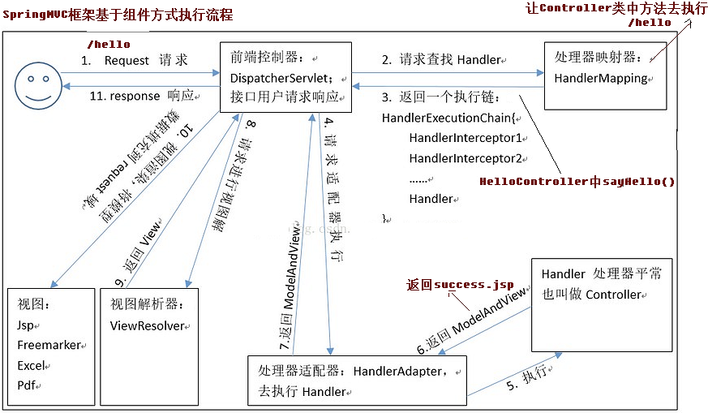

# SpringMVC框架_01

## 一、 SpringMVC 的基本概念

### 1.1、三层架构

1. 咱们开发服务器端程序,一般都基于两种形式,一种C/S架构程序,一种B/S架构程序 
2. 使用Java语言基本上都是开发B/S架构的程序,B/S架构又分成了三层架构
3. 三层架构 
   - 表现层:WEB层,用来和客户端进行数据交互的。**表现层一般会采用MVC的设计模型!!** 
   - 业务层:处理公司具体的业务逻辑的
   - 持久层:用来操作数据库的 

### 1.2、MVC模型

MVC全名是Model View Controller 模型视图控制器,每个部分各司其职。

```properties
1. Model: 数据模型,JavaBean的类,用来进行数据封装。
2. View: 指JSP、HTML用来展示数据给用户；
3. Controller: 用来接收用户的请求,整个流程的控制器。用来进行数据校验等。
```

### 1.3、SpringMVC 概述

##### -- SpringMVC是什么？

```shell
1: 是一种基于Java实现的MVC设计模型的请求驱动类型的轻量级WEB框架。
2: Spring MVC属于SpringFrameWork的后续产品,已经融合在Spring Web Flow里面。Spring 框架提供了构建 Web 应用程序的全功能 MVC 模块。
3: 使用 Spring 可插入的 MVC 架构,从而在使用Spring进行WEB开发时,可以选择使用Spring的SpringMVC框架或集成其他MVC开发框架,如Struts1(现在一般不用),Struts2等。
4: SpringMVC 已经成为目前最主流的 MVC 框架之一,并且随着 Spring3.0 的发布,全面超越 Struts2,成 为最优秀的 MVC 框架。
5: 它通过一套注解,让一个简单的 Java 类成为处理请求的控制器,而无须实现任何接口。同时它还支持 RESTful 编程风格的请求。
```

##### -- SpringMVC在三层架构中的位置

```shell
 表现层框架
```

##### -- SpringMVC的优势

```
1、清晰的角色划分: 前端控制器(DispatcherServlet)
	请求到处理器映射(HandlerMapping) 
	处理器适配器(HandlerAdapter)
	视图解析器(ViewResolver) 
	处理器或页面控制器(Controller) 
	验证器( Validator)
	命令对象(Command 请求参数绑定到的对象就叫命令对象)
	表单对象(Form Object 提供给表单展示和提交到的对象就叫表单对象)。 
2、分工明确,而且扩展点相当灵活,可以很容易扩展,虽然几乎不需要。 
3、由于命令对象就是一个 POJO,无需继承框架特定 API,可以使用命令对象直接作为业务对象。
4、和 Spring 其他框架无缝集成,是其它 Web 框架所不具备的。 
5、可适配,通过 HandlerAdapter 可以支持任意的类作为处理器。 
6、可定制性,HandlerMapping、ViewResolver 等能够非常简单的定制。
7、功能强大的数据验证、格式化、绑定机制。
8、利用 Spring 提供的 Mock 对象能够非常简单的进行 Web 层单元测试。
9、本地化、主题的解析的支持,使我们更容易进行国际化和主题的切换。
10、强大的 JSP 标签库,使 JSP 编写更容易。
..................还有比如 RESTful 风格的支持、简单的文件上传、约定大于配置的契约式编程支持、基于注解的零配
置支持等等。
```

##### -- SpringMVC 和 Struts2 的优略分析

```properties
共同点:
	它们都是表现层框架,都是基于 MVC 模型编写的。 
	它们的底层都离不开原始 ServletAPI。 
	它们处理请求的机制都是一个核心控制器。
	
区别:
	Spring MVC 的入口是 Servlet, 而 Struts2 是 Filter
	Spring MVC 是基于方法设计的,而 Struts2 是基于类,Struts2 每次执行都会创建一个动作类。所 以 Spring MVC 会稍微比 Struts2 快些。
	Spring MVC 使用更加简洁,同时还支持 JSR303, 处理 ajax 的请求更方便:  (JSR303 是一套 JavaBean 参数校验的标准,它定义了很多常用的校验注解,我们可以直接将这些注解加在我们 JavaBean 的属性上面,就可以在需要校验的时候进行校验了。)
	Struts2 的 OGNL 表达式使页面的开发效率相比 Spring MVC 更高些,但执行效率并没有比 JSTL 提
升,尤其是 struts2 的表单标签,远没有 html 执行效率高。
```


## 二、SpringMVC 的入门

### 2.1、入门案例：

- #### pom.xml

```xml
<project xmlns="http://maven.apache.org/POM/4.0.0" xmlns:xsi="http://www.w3.org/2001/XMLSchema-instance"
         xsi:schemaLocation="http://maven.apache.org/POM/4.0.0 http://maven.apache.org/xsd/maven-4.0.0.xsd">
    <modelVersion>4.0.0</modelVersion>

    <groupId>com.eoony</groupId>
    <artifactId>springmvc_day01_01</artifactId>
   ...

    <properties>
        <project.build.sourceEncoding>UTF-8</project.build.sourceEncoding>
        <maven.compiler.source>1.8</maven.compiler.source>
        <maven.compiler.target>1.8</maven.compiler.target>
        <spring.version>5.0.2.RELEASE</spring.version>
    </properties>

    <dependencies>
        <dependency>
            <groupId>org.springframework</groupId>
            <artifactId>spring-context</artifactId>
            <version>${spring.version}</version>
        </dependency>
        <dependency>
            <groupId>org.springframework</groupId>
            <artifactId>spring-web</artifactId>
            <version>${spring.version}</version>
        </dependency>
        <dependency>
            <groupId>org.springframework</groupId>
            <artifactId>spring-webmvc</artifactId>
            <version>${spring.version}</version>
        </dependency>
        <dependency>
            <groupId>javax.servlet</groupId>
            <artifactId>servlet-api</artifactId>
            <version>2.5</version>
            <scope>provided</scope>
        </dependency>
        <dependency>
            <groupId>javax.servlet.jsp</groupId>
            <artifactId>jsp-api</artifactId>
            <version>2.0</version>
            <scope>provided</scope>
        </dependency>
    </dependencies>
</project>
```

> 1. ##### `<properties>` 统一设置，后面可以el表达式调用；
>
> 2. ##### 添加相关依赖：
>
>    - spring-context : IOC；
>    - spring-web/spring-webmvc: SpringMVC要求；

- #### web.xml

```xml
<web-app>
  <display-name>Archetype Created Web Application</display-name>
  <servlet>
    <servlet-name>dispatcherServlet</servlet-name>
    <servlet-class>org.springframework.web.servlet.DispatcherServlet</servlet-class>
        <!--将springmvc.xml与servlet关联起来-->
    <init-param>
      <param-name>contextConfigLocation</param-name> 
      <param-value>classpath:springmvc.xml</param-value>
    </init-param>
      <!--正数代表，与服务器启动同时创建-->
    <load-on-startup>1</load-on-startup>
  </servlet>
  
  <servlet-mapping>
    <servlet-name>dispatcherServlet</servlet-name>
    <url-pattern>/</url-pattern>
  </servlet-mapping>
</web-app>
```

- #### springmvc.xml (Spring 的主配置文件)

```xml
<beans xmlns="http://www.springframework.org/schema/beans"
       xmlns:mvc="http://www.springframework.org/schema/mvc"
       xmlns:context="http://www.springframework.org/schema/context"
       xmlns:xsi="http://www.w3.org/2001/XMLSchema-instance"
       xsi:schemaLocation="
        http://www.springframework.org/schema/beans
        http://www.springframework.org/schema/beans/spring-beans.xsd
        http://www.springframework.org/schema/mvc
        http://www.springframework.org/schema/mvc/spring-mvc.xsd
        http://www.springframework.org/schema/context
        http://www.springframework.org/schema/context/spring-context.xsd">

    <!--开启注解扫描-->
    <context:component-scan base-package="com.eoony"/>
    <!--配置视图解析器-->
    <bean id="internalResourceViewResolver" class="org.springframework.web.servlet.view.InternalResourceViewResolver">
        <property name="prefix" value="/WEB-INF/pages/"/>
        <property name="suffix" value=".jsp"/>
    </bean>

    <!--开启springMVC注解的支持-->
    <mvc:annotation-driven/>
</beans>
```

- #### Controller : 控制器

```java
@Controller
public class HelloController {
    
    /*
    * /user/hello : 那么我们在类上加上一个@RequestMapping，那么就可以进行分模块化开发
    */
    @RequestMapping(path = "/hello")
    public String sayHello(){
        System.out.println(" hello Spring MVC!!!!!!!!!!");
        return "success";
    }
}
```

- #### 视图：index.jsp

```html
<%@ page contentType="text/html;charset=UTF-8" language="java" %>
    <html>
        <head>
            <title>Title</title>
        </head>
        <body>
            <h3>入门程序</h3>
            <h3><a href="hello">入口</a></h3>
        </body>
    </html>
```


### 2.2、springMVC执行流程原理



> ####  流程涉及的组件：
>
> ##### 1. DispatcherServlet:前端控制器
>
> ```properties
>  	用户请求到达前端控制器,它就相当于 mvc 模式中的 c,dispatcherServlet 是整个流程控制的中心,由 它调用其它组件处理用户的请求,dispatcherServlet 的存在降低了组件之间的耦合性。
> ```
>
> ##### 2. HandlerMapping:处理器映射器
>
> ```properties
>  	HandlerMapping 负责根据用户请求找到 Handler 即处理器,SpringMVC 提供了不同的映射器实现不同的 映射方式,例如：配置文件方式,实现接口方式,注解方式等。
> ```
>
> ##### 3. Handler:处理器
>
> ```properties
>  	它就是我们开发中要编写的具体业务控制器。由 DispatcherServlet 把用户请求转发到 Handler。由 Handler 对具体的用户请求进行处理。
> ```
>
> ##### 4. HandlAdapter:处理器适配器
>
> ```properties
> 	通过 HandlerAdapter 对处理器进行执行,这是适配器模式的应用,通过扩展适配器可以对更多类型的处理
> 器进行执行。
> ```
>
> ##### 5. View Resolver:视图解析器
>
> ```properties
> 	View Resolver 负责将处理结果生成 View 视图,View Resolver 首先根据逻辑视图名解析成物理视图名
> 即具体的页面地址,再生成 View 视图对象,最后对 View 进行渲染将处理结果通过页面展示给用户。
> ```
>
> ##### 6. View:视图
>
> ```properties
> 	SpringMVC 框架提供了很多的 View 视图类型的支持,包括：jstlView、freemarkerView、pdfView 等。我们最常用的视图就是 jsp。
>   	一般情况下需要通过页面标签或页面模版技术将模型数据通过页面展示给用户,需要由程序员根据业务需求开
> 发具体的页面。
> ```

#### 注意：在入门案例中，我们只配置了前端控制器，视图解析器，为啥其他组件也能使用呢？

> ```java
> 在 SpringMVC 的各个组件中,处理器映射器、处理器适配器、视图解析器称为 SpringMVC 的三大组件。
> 使用<mvc:annotation-driven>自动加载 RequestMappingHandlerMapping(处理映射器)和 RequestMappingHandlerAdapter ( 处 理 适 配 器 ) , 可 用 在 SpringMVC.xml 配 置 文 件 中 使 用 <mvc:annotation-driven>替代注解处理器和适配器的配置。
> 它就相当于在 xml 中配置了:
> ```
>
> ```xml
> <!-- 上面的标签相当于 如下配置-->
> <!-- Begin -->
> <!-- HandlerMapping -->
> <bean class="org.springframework.web.servlet.mvc.method.annotation.RequestMappingHandlerMapping"/>
> <bean class="org.springframework.web.servlet.handler.BeanNameUrlHandlerMapping"/>
> <!-- HandlerAdapter -->
> <bean class="org.springframework.web.servlet.mvc.method.annotation.RequestMappingHandlerAdapter"/>
> <bean class="org.springframework.web.servlet.mvc.HttpRequestHandlerAdapter"/>
> <bean class="org.springframework.web.servlet.mvc.SimpleControllerHandlerAdapter"/>
> <!-- HadnlerExceptionResolvers -->
> <bean class="org.springframework.web.servlet.mvc.method.annotation.ExceptionHandlerExceptionResolver"/>
> <bean class="org.springframework.web.servlet.mvc.annotation.ResponseStatusExceptionResolver"/>
> <bean class="org.springframework.web.servlet.mvc.support.DefaultHandlerExceptionResolver"/>
> ```
>
> 注意:
>  一般开发中,我们都需要写上此标签(虽然从入门案 例中看,我们不写也行,随着课程的深入,该标签还 有具体的使用场景 )。 
>
> ##### 重点是明确：我们只需要编写处理具体业务的控制器以及视图。


### 2.3、RequestMapping 注解

##### RequestMapping注解的作用： 是建立请求URL和处理方法之间的对应关系！

```java
// @Target 说明RequestMapping可以在方法，类上都可以注解
// 1. 作用在类上:第一级的访问目录
// 2. 作用在方法上:第二级的访问目录
// 3. 细节:路径可以不编写 / 表示应用的根目录开始
// 4. 细节:${ pageContext.request.contextPath }也可以省略不写,但是路径上不能写 /
@Target({ElementType.METHOD, ElementType.TYPE}) 
@Retention(RetentionPolicy.RUNTIME)
@Documented
@Mapping
public @interface RequestMapping {
	String name() default ""; // 给注解分配一个名称，
	
	@AliasFor("path") 
	String[] value() default {}; // 指定请求路径的url
	
	@AliasFor("value")
	String[] path() default {}; // 同path，可以互换
	
	RequestMethod[] method() default {}; // 指定该方法的请求方式
	
	String[] params() default {}; // 指定限制请求参数的条件
	
	String[] headers() default {}; // 发送请求中必须包含的请求头
	
	String[] consumes() default {};
	
	String[] produces() default {};
}
```


## 三、请求参数的绑定

### 3.1、入门，简单参数

```jsp
<html>
<head>
    <title>Title</title>
</head>
<body>
    <%--请求参数绑定--%>
    <a href="param/bindParams?username=alison&password=123456">请求参数绑定</a>
</body>
</html>
```

```java
@Controller
@RequestMapping("/param")
public class ParamsController {

    @RequestMapping("/bindParams")
    public String bindParams(String username,String password){
        System.out.println("参数绑定成功");
        System.out.println("用户名："+username);
        System.out.println("密码："+password);
        return "success";
    }
}
----------
参数绑定成功
用户名：alison
密码：123456
```

> ##### 注意：方法参数名称一定要与url的参数名称一致，才能绑定成功！而且，区分大小写！

### 3.2、POJO类型参数绑定（简单的JavaBean）

```jsp
<form action="param/bindAccount" method="post">
    账户名称：<input type="text" name="name"><br>
    账户密码：<input type="text" name="password"><br>
    账户金额：<input type="text" name="money"><br>
    用户姓名：<input type="text" name="user.username"><br>
    用户年龄：<input type="text" name="user.age"><br>
    <input type="submit" value="提交">
</form>
```

```java
@RequestMapping("/bindAccount")
public String bindAccount(Account account){
    System.out.println(account);
    return "success";
}

public class Account implements Serializable {
    private String name;
    private String password;
    private Double money;
    private User user;
    ...
}

public class User implements Serializable {
    private String username;
    private int age;
    ...
}
---------------------
// Account{name='jorry', password='123', money=10000.0, user=User{username='lolo', age=18}}   
```

### 3.3、集合数据类型绑定

```jsp
<form action="param/bindCollection" method="post">
    账户名称：<input type="text" name="name"><br>
    账户密码：<input type="text" name="password"><br>
    账户金额：<input type="text" name="money"><br>

    用户姓名1：<input type="text" name="list[0].username"><br>
    用户年龄1：<input type="text" name="list[0].age"><br>

    用户姓名2：<input type="text" name="map['one'].username"><br>
    用户年龄2：<input type="text" name="map['one'].age"><br>

    <input type="submit" value="提交">
</form>
```

```java
@RequestMapping("/bindCollection")
public String bindCollection(Account account){
    System.out.println(account);
    return "success";
}

public class Account implements Serializable {
    private String name;
    private String password;
    private Double money;
    private List<User> list;
    private Map<String,User> map;
    ...
}
```

### 3.4、自定义类型转换器

##### 第一步：自定义转换器

```java
public class User implements Serializable {
    private String username;
    private int age;
    // 若页面输入一个2018-10-11 的date字符串类型，spring是无法自动转换的。默认是2011/10/11格式
    // 那么如果一定要支持 2018-10-11格式输入，就必须自定义类型转换器！！！
    private Date birthday; 

}

/**
 * 自定义转化器
 */
public class StringToDateConvert implements Converter<String, Date> {
    @Override
    public Date convert(String source) {
        if(source == null){
            throw new RuntimeException("参数为null");
        }
        DateFormat df = new SimpleDateFormat("yyyy-MM-dd");
        try {
            return df.parse(source);
        } catch (ParseException e) {
            throw new RuntimeException("参数有错！");
        }
    }
}
```

##### 第二步：将自定义转换器加入spring的转换器容器中

```xml
<?xml version="1.0" encoding="UTF-8" ?>
<beans xmlns="http://www.springframework.org/schema/beans"
       xmlns:mvc="http://www.springframework.org/schema/mvc"
       xmlns:context="http://www.springframework.org/schema/context"
       xmlns:xsi="http://www.w3.org/2001/XMLSchema-instance"
       xsi:schemaLocation="
        http://www.springframework.org/schema/beans
        http://www.springframework.org/schema/beans/spring-beans.xsd
        http://www.springframework.org/schema/mvc
        http://www.springframework.org/schema/mvc/spring-mvc.xsd
        http://www.springframework.org/schema/context
        http://www.springframework.org/schema/context/spring-context.xsd">
	...
	<!--1. 添加到容器-->
    <bean id="conversionService" class="org.springframework.context.support.ConversionServiceFactoryBean">
        <property name="converters">
            <set>
                <bean class="com.eoony.utils.StringToDateConvert"/>
            </set>
        </property>
    </bean>
    <!--开启springMVC注解的支持，2. 还需要在此标签引用自定义类型转换器-->
    <mvc:annotation-driven conversion-service="conversionService"/>
</beans>
```

### 3.5、使用原生 ServletAPI 对象作为方法参数

```java
/**
* 直接添加HttpServletRequest，HttpServletResponse为参数即可
*/
@RequestMapping("/bindServlet")
public String bindServlet(HttpServletRequest request, HttpServletResponse response){
    HttpSession session =  request.getSession();
    ServletContext servletContext = session.getServletContext();
	...
    return "success";
}
```


## 四、常用的注解

### 4.1、RequestParam注解

```properties
作用:
  	把请求中指定名称的参数给控制器中的形参赋值。
属性:
	value:请求参数中的名称。
	required:请求参数中是否必须提供此参数。默认值:true。表示必须提供,如果不提供将报错。
```

```java
@Controller
@RequestMapping("/ann")
public class AnnController {
    @RequestMapping("/bindRequestParam")
    public String bindRequestParam(@RequestParam("name") String username, @RequestParam("pw") String password){
        System.out.println("bindRequestParam execute: "+ username+","+password);
        return "success";
    }
}

<a href="ann/bindRequestParam?name=alison&pw=123456">RequestParam参数绑定</a>
----------
// 输出：bindRequestParam execute: alison,123456
```

### 4.2、RequestBody注解

```properties
作用:
	用于获取请求体内容。直接使用得到是 key=value&key=value...结构的数据。
	get 请求方式不适用。 
属性:
	required:是否必须有请求体。默认值是:true。当取值为 true 时,get 请求方式会报错。如果取值 为 false,get 请求得到是 null。
```

```java
<form action="ann/bindRequestBody" method="post">
    用户名称:<input type="text" name="username" ><br/>
    用户密码:<input type="password" name="password" ><br/>
    用户年龄:<input type="text" name="age" ><br/>
    <input type="submit" value="保存">
</form>

@RequestMapping("/bindRequestBody")
    public String bindRequestBody(@RequestBody String body){
        System.out.println(body);
        return "success";
}
------------
// 输出：username=lisi&password=1008&age=18
```

### 4.3、PathVaribale

```properties
作用:
	用于绑定 url 中的占位符。例如：请求 url 中 /delete/{id},这个{id}就是 url 占位符。
	url 支持占位符是 spring3.0 之后加入的。是 springmvc 支持 rest 风格 URL 的一个重要标志。 

属性:
	value: 用于指定 url 中占位符名称。
	required: 是否必须提供占位符。
```


