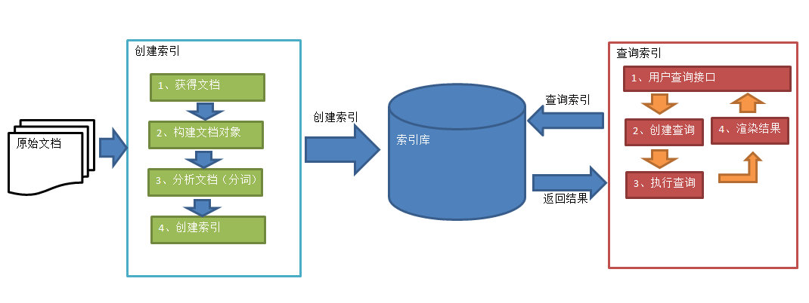
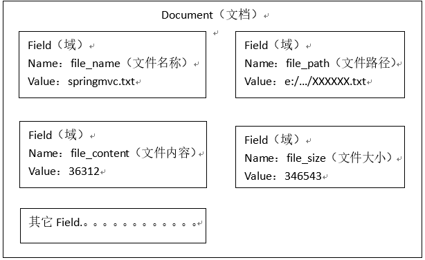
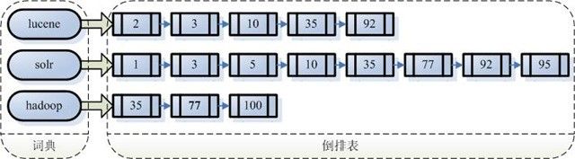

# 1-全文检索技术 -- Lucene

## 一、什么是全文检索

### 1.1、数据分类

我们生活中的数据总体分为两种：结构化数据和非结构化数据。

##### 结构化数据：指具有固定格式或有限长度的数据，如数据库，元数据等。

##### 非结构化数据：指不定长或无固定格式的数据，如邮件，word文档等磁盘上的文件；

### 1.2、数据查询：

- ##### 结构化数据查询： sql语句，简单，速度快；

- ##### 非结构化数据查询：

  （1）**顺序扫描法(Serial Scanning)** ：

  ​	相当慢，不可取；

  （2）**全文检索(Full-text Search)** ：

  ​	先根据空格进行字符拆分，得到一个单词列表，基于单词列表创建一个索引，然后查询索引，根据单词和文档的对应关系找到文档列表，这个过程叫全文检索。

  ​	索引：一个为了提高查询速度，创建某种数据结构的集合；

  ##### 这种先建立索引，再对索引进行搜索的过程就叫全文检索(Full-text Search)。

  虽然创建索引的过程也是非常耗时的，但是索引一旦创建就可以多次使用，全文检索主要处理的是查询，所以耗时间创建索引是值得的。

### 1.3、全文检索的应用场景

- 搜索引擎： 百度，360，搜狗；
- 站内搜索：论坛搜索，微博搜索，文章搜索
- 电商搜索：淘宝，京东

### 1.4、如何实现全文检索

​	可以使用Lucene实现全文检索。Lucene是apache下的一个开放源代码的全文检索引擎工具包。提供了完整的查询引擎和索引引擎，部分文本分析引擎。Lucene的目的是为软件开发人员提供一个简单易用的工具包，以方便的在目标系统中实现全文检索的功能。 


## 二、Lucene

### 2.1、什么是Lucene?

Lucene是基于java开发的全文搜索工具包！

### 2.2、Lucene实现全文搜索的流程



#### 2.2.1、创建索引

- #### 获取文档：

  - 原始文档：要基于那些数据来进行搜索，那么这些数据就是原始文档；
  - 搜索引擎：使用爬虫获得原始文档
  - 站内搜索：数据库中的数据；
  - 实例：直接使用IO流读取磁盘上的文件

- #### 构建文档对象：

  每个对应原始的文档创建一个Document对象，

  每个document对象中包含多个域（Field）

  域中保存就是原始文档数据：

  - 域的名称
  - 域的值

  

  > ##### 这里的document: 是一个文档的不同信息集合；如 文档名称，文档路径，文档内容等；

- #### 分析文档 ：分词过程

  - 字母转为小写
  - 去除标点符号
  - 去除停用词

  之后，每个关键词都封装成一个Term对象中。

  ​	Term中包含两部分内容：

  ​		1） 关键词所在的域

  ​		2） 关键词本身

  > #####  注意：
  >
  > 1. ##### 不同域分出来的相同关键词是不同的Term;
  >
  > 2. ##### 分词是根据域的值来进行分词的，即document / field的值;

- #### 创建索引

  基于关键词列表创建一个索引，保存到索引库中。

  索引库中：

  ​	索引 （对Term对象创建的索引）

  ​	document对象

  ​	关键词和文档的对应关系(Term 与document对应关系)

  > 注意：创建索引是对语汇单元索引，通过词语找文档，这种索引的结构叫**倒排索引结构**。 
  >
  > 传统方法是根据文件找到该文件的内容，在文件内容中匹配搜索关键字，这种方法是顺序扫描方法，数据量大、搜索慢。 


- #### 查询索引

  - ##### 用户查询接口：

    Lucene不提供制作用户搜索界面的功能，需要根据自己的需求开发搜索界面。 

  - ##### 创建查询：把关键词封装成一个查询对象

    “fileName:lucene”表示要搜索Field域的内容为“lucene”的文档 

  - ##### 执行查询：

    搜索过程就是在索引上查找域为fileName，并且关键字为Lucene的term，并根据term找到文档id列表。 

    

  - ##### 渲染结果：

    根据文档id，找到文档对象

    对关键词进行高亮显示

    分页处理等

## 三、配置开发环境

### 3.1、Lucene下载

官网：http://lucene.apache.org

版本：8.0.0

Jdk要求：1.8以上

### 3.2、 使用的jar包

- lucene-core-7.4.0.jar

  ```
  \lucene-7.4.0\core\lucene-core-7.4.0.jar
  ```

- lucene-analyzers-common-7.4.0.jar : 

  ```
  \lucene-7.4.0\analysis\common\lucene-analyzers-common-7.4.0.jar
  ```

- 通用IO包：commons-io.jar


## 四、入门程序

### 4.1、创建索引

```java
//创建索引库
public void createIndex() throws Exception {
        //1、创建一个Director对象，指定索引库保存的位置。
        //把索引库保存在内存中
        //Directory directory = new RAMDirectory();
        //把索引库保存在磁盘
        Directory directory = FSDirectory.open(new File("E:\\lucene\\index").toPath());
        //2、基于Directory对象创建一个IndexWriter对象
   		 // 不传将使用标准分析器，对中文分词差
        IndexWriterConfig config = new IndexWriterConfig(new IKAnalyzer()); 
        IndexWriter indexWriter = new IndexWriter(directory, config);
        //3、读取磁盘上的文件，对应每个文件创建一个文档对象。
        File dir = new File("E:\\lucene\\searchsource");
        File[] files = dir.listFiles();
        assert files != null;
        for (File f : files) {
            //取文件名
            String fileName = f.getName();
            //文件的路径
            String filePath = f.getPath();
            //文件的内容
            String fileContent = FileUtils.readFileToString(f, "utf-8");
            //文件的大小
            long fileSize = FileUtils.sizeOf(f);
            //创建Field
            //参数1：域的名称，参数2：域的内容，参数3：是否存储
            Field fieldName = new TextField("name", fileName, Field.Store.YES);
            Field fieldPath = new TextField("path", filePath, Field.Store.YES);
            Field fieldContent = new TextField("content", fileContent, Field.Store.YES);
            Field fieldSize = new TextField("size", fileSize + "", Field.Store.YES);
            //创建文档对象
            Document document = new Document();
            //向文档对象中添加域
            document.add(fieldName);
            document.add(fieldPath);
            document.add(fieldContent);
            document.add(fieldSize);
            //5、把文档对象写入索引库
            indexWriter.addDocument(document);
        }
        //6、关闭indexwriter对象
        indexWriter.close();
    }
```

### 4.2、使用Luke工具查看索引文件

需要jdk9.0以上


### 4.3、查询索引

```java
//查询索引库
@Test
public void searchIndex() throws Exception {
    //指定索引库存放的路径
    //D:\temp\index
    Directory directory = FSDirectory.open(new File("E:\\test_data\\lucene\\index").toPath());
    //创建indexReader对象
    IndexReader indexReader = DirectoryReader.open(directory);
    //创建indexsearcher对象
    IndexSearcher indexSearcher = new IndexSearcher(indexReader);
    //创建查询
    Query query = new TermQuery(new Term("content", "spring"));
    //执行查询
    //第一个参数是查询对象，第二个参数是查询结果返回的最大值
    TopDocs topDocs = indexSearcher.search(query, 10);
    //查询结果的总条数
    System.out.println("查询结果的总条数："+ topDocs.totalHits);
    //遍历查询结果
    //topDocs.scoreDocs存储了document对象的id
    for (ScoreDoc scoreDoc : topDocs.scoreDocs) {
        //scoreDoc.doc属性就是document对象的id
        //根据document的id找到document对象
        Document document = indexSearcher.doc(scoreDoc.doc);
        System.out.println(document.get("name"));
        //System.out.println(document.get("content"));
        System.out.println(document.get("path"));
        System.out.println(document.get("size"));
        System.out.println("-------------------------");
    }
    //关闭indexreader对象
    indexReader.close();
}
```


## 五、分析器

### 5.1、分析器Analyzer 

```java
org.apache.lucene.analysis.Analyzer
public abstract class Analyzer implements Closeable {
	....
}
```

是一个抽象类。上面创建索引、查询索引都没有提到分析器。其实际是使用了默认分析器：**StandardAnalyzer**

```java
public abstract class StopwordAnalyzerBase extends Analyzer{
    ...
}
public final class StandardAnalyzer extends StopwordAnalyzerBase {
    ...
}
```

````java
@Test
public void testTokenStream() throws Exception {
    //创建一个标准分析器对象
    Analyzer analyzer = new StandardAnalyzer();
    //获得tokenStream对象
    //第一个参数：域名，可以随便给一个
    //第二个参数：要分析的文本内容
    TokenStream tokenStream = analyzer.tokenStream("test", "The Spring Framework provides a comprehensive programming and configuration model.");
    //添加一个引用，可以获得每个关键词
    CharTermAttribute charTermAttribute = tokenStream.addAttribute(CharTermAttribute.class);
    //添加一个偏移量的引用，记录了关键词的开始位置以及结束位置
    OffsetAttribute offsetAttribute = tokenStream.addAttribute(OffsetAttribute.class);
    //将指针调整到列表的头部
    tokenStream.reset();
    //遍历关键词列表，通过incrementToken方法判断列表是否结束
    while(tokenStream.incrementToken()) {
        //关键词的起始位置
        System.out.println("start->" + offsetAttribute.startOffset());
        //取关键词
        System.out.println(charTermAttribute);
        //结束位置
        System.out.println("end->" + offsetAttribute.endOffset());
    }
    tokenStream.close();
}
-------------------------------
    start->4
    spring
    end->10
    start->11
    framework
    end->20
    start->21
    provides
    end->29
    start->32
    comprehensive
    end->45
    start->46
    programming
    end->57
    start->62
    configuration
    end->75
    start->76
    model
    end->81
````

> 标准分析器**StandardAnalyzer**， 是不能友好处理。若要处理中文，我们要使用中文分析器：**IKAnalyzer**


### 5.2、中文分析器

Lucene 自带中文分析器： **SmartChineseAnalyzer**。 但是，对中文支持较好，但扩展性差，扩展词库，禁用词库和同义词库等不好处理。

一般我们使用第三方的：**IKAnalyzer**

#### IKAnalyzer

使用方法：

第一步：把jar包添加到工程中

第二步：把配置文件和扩展词典和停用词词典添加到classpath下

> ##### 注意：hotword.dic和ext_stopword.dic文件的格式为UTF-8，注意是无BOM 的UTF-8 编码。
>
> ##### 也就是说禁止使用windows记事本编辑扩展词典文件。


## 六、索引库的维护

### 6.1、索引库的添加

#### Field域的属性

**是否分析**：是否对域的内容进行分词处理。前提是我们要对域的内容进行查询。

**是否索引**：将Field分析后的词或整个Field值进行索引，只有索引方可搜索到。

比如：商品名称、商品简介分析后进行索引，订单号、身份证号不用分析但也要索引，这些将来都要作为查询条件。

**是否存储**：将Field值存储在文档中，存储在文档中的Field才可以从Document中获取

比如：商品名称、订单号，凡是将来要从Document中获取的Field都要存储。

| Field类                                                      | 数据类型               | Analyzed   是否分析 | Indexed   是否索引 | Stored   是否存储 | 说明                                                         |
| ------------------------------------------------------------ | ---------------------- | ------------------- | ------------------ | ----------------- | ------------------------------------------------------------ |
| StringField(FieldName, FieldValue,Store.YES))                | 字符串                 | N                   | Y                  | Y或N              | 这个Field用来构建一个字符串Field，但是不会进行分析，会将整个串存储在索引中，比如(订单号,姓名等)   是否存储在文档中用Store.YES或Store.NO决定 |
| LongPoint(String name, long... point)                        | Long型                 | Y                   | Y                  | N                 | 可以使用LongPoint、IntPoint等类型存储数值类型的数据。让数值类型可以进行索引。但是不能存储数据，如果想存储数据还需要使用StoredField。 |
| StoredField(FieldName, FieldValue)                           | 重载方法，支持多种类型 | N                   | N                  | Y                 | 这个Field用来构建不同类型Field   不分析，不索引，但要Field存储在文档中 |
| TextField(FieldName, FieldValue, Store.NO)   或   TextField(FieldName, reader) | 字符串   或   流       | Y                   | Y                  | Y或N              | 如果是一个Reader, lucene猜测内容比较多,会采用Unstored的策略. |

```java
@Test
public void createIndex() throws Exception {
   ...
    for (File f : files) {
        ...
        //创建Field
        //参数1：域的名称，参数2：域的内容，参数3：是否存储
        Field fieldName = new TextField("name", fileName, Field.Store.YES);
	    Field fieldContent = new TextField("content", fileContent, Field.Store.YES);
        
        //  Field fieldPath = new TextField("path", filePath, Field.Store.YES);
        Field fieldPath = new StoredField("path", filePath);
        //  Field fieldSize = new TextField("size", fileSize + "", Field.Store.YES);
        Field fieldSizeValue = new LongPoint("size", fileSize);
        Field fieldSizeStore = new StoredField("size", fileSize);
        
        //创建文档对象
        Document document = new Document();
        //向文档对象中添加域
        document.add(fieldName);
        document.add(fieldPath);
        document.add(fieldContent);
        document.add(fieldSizeValue);
        document.add(fieldSizeStore);
        //5、把文档对象写入索引库
        indexWriter.addDocument(document);
    }
  ...
}

//添加索引 ： 直接创建，不根据磁盘文件添加
@Test
public void addDocument() throws Exception {
    //索引库存放路径
    Directory directory = FSDirectory.open(new File("D:\\temp\\index").toPath());
    IndexWriterConfig config = new IndexWriterConfig(new IKAnalyzer());
    //创建一个indexwriter对象
    IndexWriter indexWriter = new IndexWriter(directory, config);
    //创建一个Document对象
    Document document = new Document();
    //向document对象中添加域。
    //不同的document可以有不同的域，同一个document可以有相同的域。
    document.add(new TextField("filename", "新添加的文档", Field.Store.YES));
    document.add(new TextField("content", "新添加的文档的内容", Field.Store.NO));
    //LongPoint创建索引
    document.add(new LongPoint("size", 1000l));
    //StoreField存储数据
    document.add(new StoredField("size", 1000l));
    //不需要创建索引的就使用StoreField存储
    document.add(new StoredField("path", "d:/temp/1.txt"));
    //添加文档到索引库
    indexWriter.addDocument(document);
    //关闭indexwriter
    indexWriter.close();
}
 // 索引库的store存储： 不影响索引搜索！！！！只是取决搜索后是否能将该内容能否提取出来！
```


### 6.2、索引库删除

```java
//删除全部索引
@Test
public void deleteAllIndex() throws Exception {
    IndexWriter indexWriter = getIndexWriter();
    //删除全部索引
    indexWriter.deleteAll();
    //关闭indexwriter
    indexWriter.close();
}

//根据查询条件删除索引
@Test
public void deleteIndexByQuery() throws Exception {
    IndexWriter indexWriter = getIndexWriter();
    //创建一个查询条件
    Query query = new TermQuery(new Term("filename", "apache"));
    //根据查询条件删除
    indexWriter.deleteDocuments(query);
    //关闭indexwriter
    indexWriter.close();
}
```


### 6.3、索引库的修改

原理：先删除后添加 

```java
//修改索引库
@Test
public void updateIndex() throws Exception {
    IndexWriter indexWriter = getIndexWriter();
    //创建一个Document对象
    Document document = new Document();

    //向文档对象中添加域
    document.add(new TextField("name", "更新之后的文档", Field.Store.YES));
    document.add(new TextField("name1", "更新之后的文档2", Field.Store.YES));
    document.add(new TextField("name2", "更新之后的文档3", Field.Store.YES));
    //更新操作
    indexWriter.updateDocument(new Term("name", "spring"), document);
    //关闭索引库
    indexWriter.close();
}
```

> ##### 相当于会先遍历前面索引含name=spring进行删除，然后在最后添加此document索引；


## 七、Lucene索引库查询

可通过两种方法创建查询对象：

​         1）使用Lucene提供Query子类

​         2）使用QueryParse解析查询表达式

- #### TermQuery ： 根据关键词查询

- #### RangeQuery：数值范围查询 （PointRangeQuery）

```java
@Test
public void testRangeQuery() throws Exception {
    //创建一个Query对象
    Query query = LongPoint.newRangeQuery("size", 0l, 100l);
    printResult(query);
}
```

- ### 使用queryparser查询

使用queryparser查询，里面传入一个分析器。也就是说，先对输入的条件进行分词，然后再根据关键词进行搜索！  ---- 从而实现类同百度搜索类似的功能！

使用queryparser： 还需要引入**lucene-queryparser-7.4.0.jar**。

```java
@Test
public void testQueryParser() throws Exception {
    //创建一个QueryPaser对象，两个参数
    QueryParser queryParser = new QueryParser("name", new IKAnalyzer());
    //参数1：默认搜索域，参数2：分析器对象
    //使用QueryPaser对象创建一个Query对象
    Query query = queryParser.parse("lucene是一个Java开发的全文检索工具包");
    //执行查询
    printResult(query);
}
```


