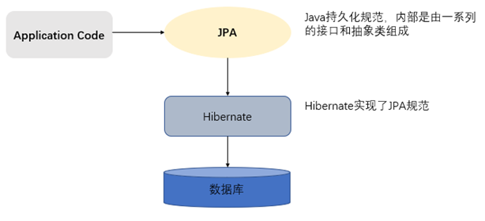

# 2- JPA篇-01

## 一、ORM思想

ORM :  （Object-Relational Mapping） 表示对象关系映射。在面向对象的软件开发中，通过ORM，就可以把对象映射到关系型数据库中。只要有一套程序能够做到建立对象与数据库的关联，操作对象就可以直接操作数据库数据，就可以说这套程序实现了ORM对象关系映射

简单的说：ORM就是建立实体类和数据库表之间的关系，从而达到操作实体类就相当于操作数据库表的目的。

```properties
	主要目的：操作实体类就相当于操作数据库表
	建立两个映射关系：
		实体类和表的映射关系
		实体类中属性和表中字段的映射关系
	不再重点关注：sql语句
	
	实现了ORM思想的框架：mybatis，hibernate
```


## 二、JPA 与 Hibernate

### 2.1、JPA 规范

​	JPA的全称是Java Persistence API， 即Java 持久化API，是SUN公司推出的一套基于ORM的规范，**内部是由一系列的接口和抽象类构成。**

​	JPA通过JDK 5.0注解描述对象－关系表的映射关系，并将运行期的实体对象持久化到数据库中。

> ##### 如同JDBC规范：本身不做活，真正干活的各大实现厂商。为什么要使用JPA规范呢？ 当我们系统使用JPA规范了，很容易在不同JPA规范实现厂商进行切换（Hibernate, toplink）,增强系统的移植性能；


### 2.2、hibernate框架介绍

​	Hibernate是一个开放源代码的对象关系映射框架，它对JDBC进行了非常轻量级的对象封装，它将POJO与数据库表建立映射关系，是一个全自动的orm框架，hibernate可以自动生成SQL语句，自动执行，使得Java程序员可以随心所欲的使用对象编程思维来操纵数据库。 


### 2.3、JPA与hibernate的关系



```properties
JPA和Hibernate的关系: JDBC和JDBC驱动的关系，JPA是规范，Hibernate除了作为ORM框架之外，它也是一种JPA实现。JPA怎么取代Hibernate呢？JDBC规范可以驱动底层数据库吗？答案是否定的，也就是说，如果使用JPA规范进行数据库操作，底层需要hibernate作为其实现类完成数据持久化工作。
```


## 三、  JPA的入门案例

### 3.1、开发包

由于JPA是sun公司制定的API规范，所以我们不需要导入额外的JPA相关的jar包，只需要导入JPA的提供商的jar包。我们选择Hibernate作为JPA的提供商，所以需要导入Hibernate的相关jar包。

下载：<https://hibernate.org/orm/releases/5.4/>   需要翻墙，否则无法打开下载连接

### 3.2、Maven导入依赖

```xml
<properties>
    <project.build.sourceEncoding>UTF-8</project.build.sourceEncoding>
    <project.hibernate.version>5.0.7.Final</project.hibernate.version>
</properties>

<dependencies>
    <!-- junit -->
    <dependency>
        <groupId>junit</groupId>
        <artifactId>junit</artifactId>
        <version>4.12</version>
        <scope>test</scope>
    </dependency>

    <!-- hibernate对jpa的支持包 -->
    <dependency>
        <groupId>org.hibernate</groupId>
        <artifactId>hibernate-entitymanager</artifactId>
        <version>${project.hibernate.version}</version>
    </dependency>

    <!-- c3p0 -->
    <dependency>
        <groupId>org.hibernate</groupId>
        <artifactId>hibernate-c3p0</artifactId>
        <version>${project.hibernate.version}</version>
    </dependency>

    <!-- log日志 -->
    <dependency>
        <groupId>log4j</groupId>
        <artifactId>log4j</artifactId>
        <version>1.2.17</version>
    </dependency>

    <!-- Mysql and MariaDB -->
    <dependency>
        <groupId>mysql</groupId>
        <artifactId>mysql-connector-java</artifactId>
        <version>5.1.6</version>
    </dependency>
</dependencies>
```

### 3.3、创建客户的数据库表和客户的实体类(映射)

- #### 创建数据库表

```sql
    /*创建客户表*/
    CREATE TABLE cst_customer (
      cust_id bigint(32) NOT NULL AUTO_INCREMENT COMMENT '客户编号(主键)',
      cust_name varchar(32) NOT NULL COMMENT '客户名称(公司名称)',
      cust_source varchar(32) DEFAULT NULL COMMENT '客户信息来源',
      cust_industry varchar(32) DEFAULT NULL COMMENT '客户所属行业',
      cust_level varchar(32) DEFAULT NULL COMMENT '客户级别',
      cust_address varchar(128) DEFAULT NULL COMMENT '客户联系地址',
      cust_phone varchar(64) DEFAULT NULL COMMENT '客户联系电话',
      PRIMARY KEY (`cust_id`)
    ) ENGINE=InnoDB AUTO_INCREMENT=1 DEFAULT CHARSET=utf8;
```

- #### 实体类

```java
/**
 * 客户的实体类
 *      配置映射关系
 *
 *
 *   1.实体类和表的映射关系
 *      @Entity:声明实体类
 *      @Table : 配置实体类和表的映射关系
 *          name : 配置数据库表的名称
 *   2.实体类中属性和表中字段的映射关系
 *
 *
 */
@Entity
@Table(name = "cst_customer")
public class Customer {

    /**
     * @Id：声明主键的配置
     * @GeneratedValue:配置主键的生成策略
     *      strategy
     *          GenerationType.IDENTITY ：自增，mysql
     *                 * 底层数据库必须支持自动增长（底层数据库支持的自动增长方式，对id自增）
     *          GenerationType.SEQUENCE : 序列，oracle
     *                  * 底层数据库必须支持序列
     *          GenerationType.TABLE : jpa提供的一种机制，通过一张数据库表的形式帮助我们完成主键自增
     *          GenerationType.AUTO ： 由程序自动的帮助我们选择主键生成策略
     * @Column:配置属性和字段的映射关系
     *      name：数据库表中字段的名称
     */
    @Id
    @GeneratedValue(strategy = GenerationType.IDENTITY)
    @Column(name = "cust_id")
    private Long custId; //客户的主键

    @Column(name = "cust_name")
    private String custName;//客户名称

    @Column(name="cust_source")
    private String custSource;//客户来源

    @Column(name="cust_level")
    private String custLevel;//客户级别

    @Column(name="cust_industry")
    private String custIndustry;//客户所属行业

    @Column(name="cust_phone")
    private String custPhone;//客户的联系方式

    @Column(name="cust_address")
    private String custAddress;//客户地址

    GET/SET ....
}
```

> ##### 常用注解说明：
>
> ```
>         @Entity
>         	作用：指定当前类是实体类。
>         @Table
>         	作用：指定实体类和表之间的对应关系。
>         	属性：
>         		name：指定数据库表的名称
>         @Id
>         	作用：指定当前字段是主键。
>         @GeneratedValue
>         	作用：指定主键的生成方式。。
>         	属性：
>         		strategy ：指定主键生成策略。
>         @Column
>         	作用：指定实体类属性和数据库表之间的对应关系
>         	属性：
>         		name：指定数据库表的列名称。
>         		unique：是否唯一  
>         		nullable：是否可以为空  
>         		inserttable：是否可以插入  
>         		updateable：是否可以更新  
>         		columnDefinition: 定义建表时创建此列的DDL  
>         		secondaryTable: 从表名。如果此列不建在主表上（默认建在主表），该属性定义该列所在从表的名字搭建开发环境[重点]
> ```

### 3.4、  配置JPA的核心配置文件

##### 	在java工程的src路径（类路径）下创建一个名为META-INF的文件夹，在此文件夹下创建一个名为persistence.xml的配置文件 !

```xml
<?xml version="1.0" encoding="UTF-8"?>
<persistence xmlns="http://java.sun.com/xml/ns/persistence" version="2.0">
    <!--需要配置persistence-unit节点
        持久化单元：
            name：持久化单元名称
            transaction-type：事务管理的方式
                    JTA：分布式事务管理  （数据库集群，必须配置分布式事务）
                    RESOURCE_LOCAL：本地事务管理 (所有的表都在本地数据库，就是本地事务)
    -->
    <persistence-unit name="myJpa" transaction-type="RESOURCE_LOCAL">
        <!--jpa的实现方式 -->
        <provider>org.hibernate.jpa.HibernatePersistenceProvider</provider>

        <properties>
            <!-- 数据库信息
                用户名，javax.persistence.jdbc.user
                密码，  javax.persistence.jdbc.password
                驱动，  javax.persistence.jdbc.driver
                数据库地址   javax.persistence.jdbc.url
            -->
            <property name="javax.persistence.jdbc.user" value="root"/>
            <property name="javax.persistence.jdbc.password" value="root"/>
            <property name="javax.persistence.jdbc.driver" value="com.mysql.jdbc.Driver"/>
            <property name="javax.persistence.jdbc.url" value="jdbc:mysql:///jpa"/>
            <!--jdbc:mysql://localhost:3306/jpa-->

            <!--配置jpa实现方(hibernate)的配置信息
                显示sql           ：   false|true
                自动创建数据库表    ：  hibernate.hbm2ddl.auto
                        create      : 程序运行时创建数据库表（如果有表，先删除表再创建）
                        update      ：程序运行时创建表（如果有表，不会创建表）
                        none        ：不会创建表
            -->
            <property name="hibernate.show_sql" value="true" />
            <property name="hibernate.hbm2ddl.auto" value="create" />
        </properties>
    </persistence-unit>
</persistence>
```

> 创建persistence.xml的配置文件，需要导入**约束**（头部）：
>
> ##### new --> edit/File/Template --> other --> jpa --> deployment ..--> persistence_2.0.xml


### 3.5、实现保存操作

```java
@Test
public void testSave(){
    //1.加载配置文件创建工厂（实体管理器工厂）对象
    EntityManagerFactory factory = Persistence.createEntityManagerFactory("myJpa");
    //2.通过实体管理器工厂获取实体管理器
    EntityManager em = factory.createEntityManager();
    //3.获取事务对象，开启事务
    EntityTransaction tx = em.getTransaction(); //获取事务对象
    tx.begin();//开启事务
    //4.完成增删改查操作：保存一个客户到数据库中
    Customer customer = new Customer();
    customer.setCustName("传智播客");
    customer.setCustIndustry("教育");
    //保存，
    em.persist(customer); //保存操作
    //5.提交事务
    tx.commit();
    //6.释放资源
    em.close();
    factory.close();
}
```

> ##### 注意：hibernate 自动创建数据库表   的各种方式！


## 四、  JPA中的主键生成策略

   * ##### GenerationType.IDENTITY ：自增，mysql

     底层数据库必须支持自动增长（底层数据库支持的自动增长方式，对id自增）

*          ##### GenerationType.SEQUENCE : 序列，oracle

           底层数据库必须支持序列

*          ##### GenerationType.TABLE : jpa提供的一种机制，通过一张数据库表的形式帮助我们完成主键自增

*          ##### GenerationType.AUTO ： 由程序自动的帮助我们选择主键生成策略


## 五、JPA的API介绍

```
jpa操作的操作步骤
		1.加载配置文件创建实体管理器工厂
			Persisitence：静态方法（根据持久化单元名称创建实体管理器工厂）
				createEntityMnagerFactory（持久化单元名称）
			作用：创建实体管理器工厂
			
		2.根据实体管理器工厂，创建实体管理器
			EntityManagerFactory ：获取EntityManager对象
			方法：createEntityManager
			* 内部维护的很多的内容
				内部维护了数据库信息，
				维护了缓存信息
				维护了所有的实体管理器对象
				再创建EntityManagerFactory的过程中会根据配置创建数据库表
			* EntityManagerFactory的创建过程比较浪费资源
			特点：线程安全的对象
				多个线程访问同一个EntityManagerFactory不会有线程安全问题
			* 如何解决EntityManagerFactory的创建过程浪费资源（耗时）的问题？
			思路：创建一个公共的EntityManagerFactory的对象
			* 静态代码块的形式创建EntityManagerFactory
			
		3.创建事务对象，开启事务
			EntityManager对象：实体类管理器
				beginTransaction : 创建事务对象
				presist ： 保存
				merge  ： 更新
				remove ： 删除
				find/getRefrence ： 根据id查询
				
			Transaction 对象 ： 事务
				begin：开启事务
				commit：提交事务
				rollback：回滚
		4.增删改查操作
		5.提交事务
		6.释放资源
```


## 六、抽取JPAUtil工具类

前面讲了，EntityManagerFactory的创建过程比较浪费资源，如何解决呢？ 我们通过一个JPAUtil工具类来具体解决：

```java
/**
 * 解决实体管理器工厂的浪费资源和耗时问题
 *      通过静态代码块的形式，当程序第一次访问此工具类时，创建一个公共的实体管理器工厂对象
 *
 * 第一次访问getEntityManager方法：经过静态代码块创建一个factory对象，再调用方法创建一个EntityManager对象
 * 第二次方法getEntityManager方法：直接通过一个已经创建好的factory对象，创建EntityManager对象
 */
public class JpaUtils {

    private static EntityManagerFactory factory;

    static  {
        //1.加载配置文件，创建entityManagerFactory
        factory = Persistence.createEntityManagerFactory("myJpa");
    }

    /**
     * 获取EntityManager对象
     */
    public static EntityManager getEntityManager() {
       return factory.createEntityManager();
    }
}
```


## 七、使用JPA完成增删改查操作

### 7.1、保存 ： 

同前

### 7.2、修改：

```java
 @Test
    public void testMerge(){  
        //定义对象
        EntityManager em=null;  
        EntityTransaction tx=null;  
        try{  
          	//获取实体管理对象
          	em=JPAUtil.getEntityManager();
          	//获取事务对象
          	tx=em.getTransaction();
          	//开启事务
          	tx.begin();
          	//执行操作
          	Customer c1 = em.find(Customer.class, 6L);
          	c1.setCustName("江苏传智学院");
         	em.clear();// 把c1对象从缓存中清除出去
          	em.merge(c1);
          	//提交事务
          	tx.commit(); 
        }catch(Exception e){
          	//回滚事务
          	tx.rollback();
          	e.printStackTrace();  
        }finally{  
        	//释放资源
        	em.close();  
        }    
    }
```

### 7.3、删除：

```JAVA
  /**
     * 删除客户的案例
     *
     */
    @Test
    public  void testRemove() {
        //1.通过工具类获取entityManager
        EntityManager entityManager = JpaUtils.getEntityManager();
        //2.开启事务
        EntityTransaction tx = entityManager.getTransaction();
        tx.begin();
        //3.增删改查 -- 删除客户

        //i 根据id查询客户
        Customer customer = entityManager.find(Customer.class,1l);
        //ii 调用remove方法完成删除操作
        entityManager.remove(customer);

        //4.提交事务
        tx.commit();
        //5.释放资源
        entityManager.close();
    }
```

> #### 问题：为什么更新、删除需要先查询而后再执行更新、删除操作呢？
>
> ##### 1、hibernate是面向对象，不像SQL那样面向过程；
>
> ##### 2、hibernate的缓存策略有关！？？？


### 7.4、查询：

```JAVA
/**
     * 根据id查询客户
     *  使用find方法查询：
     *      1.查询的对象就是当前客户对象本身
     *      2.在调用find方法的时候，就会发送sql语句查询数据库
     *
     *  立即加载
     *
     */
@Test
public  void testFind() {
    //1.通过工具类获取entityManager
    EntityManager entityManager = JpaUtils.getEntityManager();
    //2.开启事务
    EntityTransaction tx = entityManager.getTransaction();
    tx.begin();
    //3.增删改查 -- 根据id查询客户
    /**
         * find : 根据id查询数据
         *      class：查询数据的结果需要包装的实体类类型的字节码
         *      id：查询的主键的取值
         */
    Customer customer = entityManager.find(Customer.class, 1l);
    // System.out.print(customer);
    //4.提交事务
    tx.commit();
    //5.释放资源
    entityManager.close();
}

/**
  * 根据id查询客户
  *   getReference方法
  *      1.获取的对象是一个动态代理对象
  *      2.调用getReference方法不会立即发送sql语句查询数据库
  *        * 当调用查询结果对象的时候，才会发送查询的sql语句：什么时候用，什么时候发送sql语句查询数据库
  *
  * 延迟加载（懒加载）
  *      * 得到的是一个动态代理对象
  *      * 什么时候用，什么使用才会查询
  */
@Test
public  void testReference() {
    //1.通过工具类获取entityManager
    EntityManager entityManager = JpaUtils.getEntityManager();
    //2.开启事务
    EntityTransaction tx = entityManager.getTransaction();
    tx.begin();
    //3.增删改查 -- 根据id查询客户
    /**
         * getReference : 根据id查询数据
         *      class：查询数据的结果需要包装的实体类类型的字节码
         *      id：查询的主键的取值
         */
    Customer customer = entityManager.getReference(Customer.class, 1l);
    System.out.print(customer);
    //4.提交事务
    tx.commit();
    //5.释放资源
    entityManager.close();
}
```

> ##### 一般我们使用延迟加载，因为那样，不会浪费对一次数据库查询的资源；


### 7.5、JPA中的复杂查询

##### JPQL全称Java Persistence Query Language。

​	基于首次在EJB2.0中引入的EJB查询语言(EJB QL),Java持久化查询语言(JPQL)是一种可移植的查询语言，旨在以面向对象表达式语言的表达式，将SQL语法和简单查询语义绑定在一起·使用这种语言编写的查询是可移植的，可以被编译成所有主流数据库服务器上的SQL。

​	其特征与原生SQL语句类似，并且完全面向对象，通过类名和属性访问，而不是表名和表的属性。

##### SQL：Select * from cts_customer;

##### JPQL：from customer;  不支持 *  具体参考代码

```java
  /**
     * 查询全部
     *      jqpl：from cn.itcast.domain.Customer
     *      sql：SELECT * FROM cst_customer
     */
    @Test
    public void testFindAll() {
        //1.获取entityManager对象
        EntityManager em = JpaUtils.getEntityManager();
        //2.开启事务
        EntityTransaction tx = em.getTransaction();
        tx.begin();
        //3.查询全部
        String jpql = "from Customer ";
        Query query = em.createQuery(jpql);//创建Query查询对象，query对象才是执行jqpl的对象

        //发送查询，并封装结果集
        List list = query.getResultList();

        for (Object obj : list) {
            System.out.print(obj);
        }

        //4.提交事务
        tx.commit();
        //5.释放资源
        em.close();
    }


    /**
     * 排序查询： 倒序查询全部客户（根据id倒序）
     *      sql：SELECT * FROM cst_customer ORDER BY cust_id DESC
     *      jpql：from Customer order by custId desc
     *
     * 进行jpql查询
     *      1.创建query查询对象
     *      2.对参数进行赋值
     *      3.查询，并得到返回结果
     */
    @Test
    public void testOrders() {
        //1.获取entityManager对象
        EntityManager em = JpaUtils.getEntityManager();
        //2.开启事务
        EntityTransaction tx = em.getTransaction();
        tx.begin();
        //3.查询全部
        String jpql = "from Customer order by custId desc";
        Query query = em.createQuery(jpql);//创建Query查询对象，query对象才是执行jqpl的对象

        //发送查询，并封装结果集
        List list = query.getResultList();

        for (Object obj : list) {
            System.out.println(obj);
        }

        //4.提交事务
        tx.commit();
        //5.释放资源
        em.close();
    }


    /**
     * 使用jpql查询，统计客户的总数
     *      sql：SELECT COUNT(cust_id) FROM cst_customer
     *      jpql：select count(custId) from Customer
     */
    @Test
    public void testCount() {
        //1.获取entityManager对象
        EntityManager em = JpaUtils.getEntityManager();
        //2.开启事务
        EntityTransaction tx = em.getTransaction();
        tx.begin();
        //3.查询全部
        //i.根据jpql语句创建Query查询对象
        String jpql = "select count(custId) from Customer";
        Query query = em.createQuery(jpql);
        //ii.对参数赋值
        //iii.发送查询，并封装结果

        /**
         * getResultList ： 直接将查询结果封装为list集合
         * getSingleResult : 得到唯一的结果集
         */
        Object result = query.getSingleResult();

        System.out.println(result);

        //4.提交事务
        tx.commit();
        //5.释放资源
        em.close();
    }


    /**
     * 分页查询
     *      sql：select * from cst_customer limit 0,2
     *      jqpl : from Customer
     */
    @Test
    public void testPaged() {
        //1.获取entityManager对象
        EntityManager em = JpaUtils.getEntityManager();
        //2.开启事务
        EntityTransaction tx = em.getTransaction();
        tx.begin();
        //3.查询全部
        //i.根据jpql语句创建Query查询对象
        String jpql = "from Customer";
        Query query = em.createQuery(jpql);
        //ii.对参数赋值 -- 分页参数
        //起始索引
        query.setFirstResult(0);
        //每页查询的条数
        query.setMaxResults(2);

        //iii.发送查询，并封装结果

        /**
         * getResultList ： 直接将查询结果封装为list集合
         * getSingleResult : 得到唯一的结果集
         */
        List list = query.getResultList();

        for(Object obj : list) {
            System.out.println(obj);
        }

        //4.提交事务
        tx.commit();
        //5.释放资源
        em.close();
    }


    /**
     * 条件查询
     *     案例：查询客户名称以‘传智播客’开头的客户
     *          sql：SELECT * FROM cst_customer WHERE cust_name LIKE  ?
     *          jpql : from Customer where custName like ?
     */
    @Test
    public void testCondition() {
        //1.获取entityManager对象
        EntityManager em = JpaUtils.getEntityManager();
        //2.开启事务
        EntityTransaction tx = em.getTransaction();
        tx.begin();
        //3.查询全部
        //i.根据jpql语句创建Query查询对象
        String jpql = "from Customer where custName like ? ";
        Query query = em.createQuery(jpql);
        //ii.对参数赋值 -- 占位符参数
        //第一个参数：占位符的索引位置（从1开始），第二个参数：取值
        query.setParameter(1,"传智播客%");

        //iii.发送查询，并封装结果

        /**
         * getResultList ： 直接将查询结果封装为list集合
         * getSingleResult : 得到唯一的结果集
         */
        List list = query.getResultList();

        for(Object obj : list) {
            System.out.println(obj);
        }

        //4.提交事务
        tx.commit();
        //5.释放资源
        em.close();
    }
```


### 八、Hibernate 深入！（待续）


