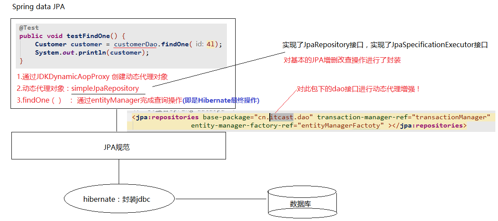

# 2 - JPA篇-02

## 一、Spring Data JPA的概述、

### 1.1、概述

##### 官网：<https://spring.io/projects/spring-data-jpa> 

​	Spring Data JPA 是 Spring 基于 ORM 框架、JPA 规范的基础上封装的一套JPA应用框架，可使开发者用极简的代码即可实现对数据库的访问和操作。它提供了包括增删改查等在内的常用功能，且易于扩展！学习并使用 Spring Data JPA 可以极大提高开发效率！

​	Spring Data JPA 让我们解脱了DAO层的操作，基本上所有CRUD都可以依赖于它来实现,在实际的工作工程中，推荐使用Spring Data JPA + ORM（如：hibernate）完成操作，这样在切换不同的ORM框架时提供了极大的方便，同时也使数据库层操作更加简单，方便解耦。

### 1.2、特性 

- Sophisticated support to build repositories based on Spring and JPA
- Support for [Querydsl](http://www.querydsl.com/) predicates and thus type-safe JPA queries
- Transparent auditing of domain class
- Pagination support, dynamic query execution, ability to integrate custom data access code
- Validation of `@Query` annotated queries at bootstrap time
- Support for XML based entity mapping
- JavaConfig based repository configuration by introducing `@EnableJpaRepositories`.

### 1.3、Spring Data JPA 与 JPA和hibernate之间的关系

- ##### Spring Data JPA： 是JPA规范再次简化封装，让开发人员更简洁实用JPA规范；

- ##### Hibernate 是ORM框架，是依据JPA规范来写的一个框架；


## 二、 Spring Data JPA的快速入门

### 2.1、引入Spring Data JPA的坐标

```xml
<properties>
        <spring.version>4.2.4.RELEASE</spring.version>
        <hibernate.version>5.0.7.Final</hibernate.version>
        <slf4j.version>1.6.6</slf4j.version>
        <log4j.version>1.2.12</log4j.version>
        <c3p0.version>0.9.1.2</c3p0.version>
        <mysql.version>5.1.6</mysql.version>
    </properties>

    <dependencies>
        <!-- junit单元测试 -->
        <dependency>
            <groupId>junit</groupId>
            <artifactId>junit</artifactId>
            <version>4.9</version>
            <scope>test</scope>
        </dependency>

        <!-- spring beg -->
        <dependency>
            <groupId>org.aspectj</groupId>
            <artifactId>aspectjweaver</artifactId>
            <version>1.6.8</version>
        </dependency>

        <dependency>
            <groupId>org.springframework</groupId>
            <artifactId>spring-aop</artifactId>
            <version>${spring.version}</version>
        </dependency>

        <dependency>
            <groupId>org.springframework</groupId>
            <artifactId>spring-context</artifactId>
            <version>${spring.version}</version>
        </dependency>

        <dependency>
            <groupId>org.springframework</groupId>
            <artifactId>spring-context-support</artifactId>
            <version>${spring.version}</version>
        </dependency>

        <dependency>
            <groupId>org.springframework</groupId>
            <artifactId>spring-orm</artifactId>
            <version>${spring.version}</version>
        </dependency>

        <dependency>
            <groupId>org.springframework</groupId>
            <artifactId>spring-beans</artifactId>
            <version>${spring.version}</version>
        </dependency>

        <dependency>
            <groupId>org.springframework</groupId>
            <artifactId>spring-core</artifactId>
            <version>${spring.version}</version>
        </dependency>

        <!-- spring end -->

        <!-- hibernate beg -->
        <dependency>
            <groupId>org.hibernate</groupId>
            <artifactId>hibernate-core</artifactId>
            <version>${hibernate.version}</version>
        </dependency>
        <dependency>
            <groupId>org.hibernate</groupId>
            <artifactId>hibernate-entitymanager</artifactId>
            <version>${hibernate.version}</version>
        </dependency>
        <dependency>
            <groupId>org.hibernate</groupId>
            <artifactId>hibernate-validator</artifactId>
            <version>5.2.1.Final</version>
        </dependency>
        <!-- hibernate end -->

        <!-- c3p0 beg -->
        <dependency>
            <groupId>c3p0</groupId>
            <artifactId>c3p0</artifactId>
            <version>${c3p0.version}</version>
        </dependency>
        <!-- c3p0 end -->

        <!-- log end -->
        <dependency>
            <groupId>log4j</groupId>
            <artifactId>log4j</artifactId>
            <version>${log4j.version}</version>
        </dependency>

        <dependency>
            <groupId>org.slf4j</groupId>
            <artifactId>slf4j-api</artifactId>
            <version>${slf4j.version}</version>
        </dependency>

        <dependency>
            <groupId>org.slf4j</groupId>
            <artifactId>slf4j-log4j12</artifactId>
            <version>${slf4j.version}</version>
        </dependency>
        <!-- log end -->


        <dependency>
            <groupId>mysql</groupId>
            <artifactId>mysql-connector-java</artifactId>
            <version>${mysql.version}</version>
        </dependency>

        <dependency>
            <groupId>org.springframework.data</groupId>
            <artifactId>spring-data-jpa</artifactId>
            <version>1.9.0.RELEASE</version>
        </dependency>

        <dependency>
            <groupId>org.springframework</groupId>
            <artifactId>spring-test</artifactId>
            <version>4.2.4.RELEASE</version>
        </dependency>

        <!-- el beg 使用spring data jpa 必须引入 -->
        <dependency>
            <groupId>javax.el</groupId>
            <artifactId>javax.el-api</artifactId>
            <version>2.2.4</version>
        </dependency>

        <dependency>
            <groupId>org.glassfish.web</groupId>
            <artifactId>javax.el</artifactId>
            <version>2.2.4</version>
        </dependency>
        <!-- el end -->
    </dependencies>
```

### 2.2、整合Spring Data JPA与Spring

```xml
<?xml version="1.0" encoding="UTF-8"?>
<beans xmlns="http://www.springframework.org/schema/beans"
	xmlns:xsi="http://www.w3.org/2001/XMLSchema-instance" xmlns:aop="http://www.springframework.org/schema/aop"
	xmlns:context="http://www.springframework.org/schema/context"
	xmlns:jdbc="http://www.springframework.org/schema/jdbc" xmlns:tx="http://www.springframework.org/schema/tx"
	xmlns:jpa="http://www.springframework.org/schema/data/jpa" xmlns:task="http://www.springframework.org/schema/task"
	xsi:schemaLocation="
		http://www.springframework.org/schema/beans http://www.springframework.org/schema/beans/spring-beans.xsd
		http://www.springframework.org/schema/aop http://www.springframework.org/schema/aop/spring-aop.xsd
		http://www.springframework.org/schema/context http://www.springframework.org/schema/context/spring-context.xsd
		http://www.springframework.org/schema/jdbc http://www.springframework.org/schema/jdbc/spring-jdbc.xsd
		http://www.springframework.org/schema/tx http://www.springframework.org/schema/tx/spring-tx.xsd
		http://www.springframework.org/schema/data/jpa 
		http://www.springframework.org/schema/data/jpa/spring-jpa.xsd">
	
	<!-- 1.dataSource 配置数据库连接池-->
	<bean id="dataSource" class="com.mchange.v2.c3p0.ComboPooledDataSource">
		<property name="driverClass" value="com.mysql.jdbc.Driver" />
		<property name="jdbcUrl" value="jdbc:mysql://localhost:3306/jpa" />
		<property name="user" value="root" />
		<property name="password" value="111111" />
	</bean>
	
	<!-- 2.配置entityManagerFactory -->
	<bean id="entityManagerFactory" class="org.springframework.orm.jpa.LocalContainerEntityManagerFactoryBean">
		<property name="dataSource" ref="dataSource" />
		<property name="packagesToScan" value="cn.itcast.entity" />
		<property name="persistenceProvider">
			<bean class="org.hibernate.jpa.HibernatePersistenceProvider" />
		</property>
		<!--JPA的供应商适配器-->
		<property name="jpaVendorAdapter">
			<bean class="org.springframework.orm.jpa.vendor.HibernateJpaVendorAdapter">
				<property name="generateDdl" value="false" />
				<property name="database" value="MYSQL" />
				<property name="databasePlatform" value="org.hibernate.dialect.MySQLDialect" />
				<property name="showSql" value="true" />
			</bean>
		</property>
		<property name="jpaDialect">
			<bean class="org.springframework.orm.jpa.vendor.HibernateJpaDialect" />
		</property>
	</bean>
    
	
	<!-- 3.事务管理器-->
	<!-- JPA事务管理器  -->
	<bean id="transactionManager" class="org.springframework.orm.jpa.JpaTransactionManager">
		<property name="entityManagerFactory" ref="entityManagerFactory" />
	</bean>
	
	<!-- 整合spring data jpa-->
	<jpa:repositories base-package="cn.itcast.dao"
		transaction-manager-ref="transactionManager"
		entity-manager-factory-ref="entityManagerFactory"></jpa:repositories>
		
	<!-- 4.txAdvice-->
	<tx:advice id="txAdvice" transaction-manager="transactionManager">
		<tx:attributes>
			<tx:method name="save*" propagation="REQUIRED"/>
			<tx:method name="insert*" propagation="REQUIRED"/>
			<tx:method name="update*" propagation="REQUIRED"/>
			<tx:method name="delete*" propagation="REQUIRED"/>
			<tx:method name="get*" read-only="true"/>
			<tx:method name="find*" read-only="true"/>
			<tx:method name="*" propagation="REQUIRED"/>
		</tx:attributes>
	</tx:advice>
	
	<!-- 5.aop-->
	<aop:config>
		<aop:pointcut id="pointcut" expression="execution(* cn.itcast.service.*.*(..))" />
		<aop:advisor advice-ref="txAdvice" pointcut-ref="pointcut" />
	</aop:config>
	
	<context:component-scan base-package="cn.itcast"></context:component-scan>
		
	<!--组装其它 配置文件-->
</beans>
```

### 2.3、domain : Customer 参考上节

### 2.4、Spring Data JPA规范的Dao层接口 

```java
/**
 * 符合SpringDataJpa的dao层接口规范
 *      JpaRepository<操作的实体类类型，实体类中主键属性的类型>
 *          * 封装了基本CRUD操作
 *      JpaSpecificationExecutor<操作的实体类类型>
 *          * 封装了复杂查询（分页）
 */
public interface CustomerDao extends JpaRepository<Customer,Long> ,JpaSpecificationExecutor<Customer> {
	// 我们定义的dao没用任何方法，那是否就没有方法呢？ 答案是否定的， 继承的两个接口已经包含所有的基本dao操作！！！
}
```

```java
@RunWith(SpringJUnit4ClassRunner.class)
@ContextConfiguration(locations = "classpath:applicationContext.xml")
public class CustomerDaoTest {

    @Autowired
    private CustomerDao customerDao;

    @Test
    public void testFindOne(){
        Customer one = customerDao.findOne(3l);
        System.out.println(one);
    }

    /**
     * 保存
     */
    @Test
    public void  testSave(){
        Customer customer  = new Customer();
        customer.setCustName("黑马程序员");
        customer.setCustLevel("vip");
        customer.setCustIndustry("it教育");
        customerDao.save(customer);
    }


    /**
     * 更新
     */
    @Test
    public void  testUpdate(){
        Customer customer  = new Customer();
        customer.setCustName("new黑马程序员");
        customer.setCustLevel("vip");
        customer.setCustIndustry("it教育");
        customer.setCustId(5L);
        customerDao.save(customer);
    }

    @Test
    public void testDelete () {
        customerDao.delete(3l);
    }

    /**
     * 查询所有
     */
    @Test
    public void testFindAll() {
        List<Customer> list = customerDao.findAll();
        for(Customer customer : list) {
            System.out.println(customer);
        }
    }

    /**
     * 测试统计查询：查询客户的总数量
     *      count:统计总条数
     */
    @Test
    public void testCount() {
        long count = customerDao.count();//查询全部的客户数量
        System.out.println(count);
    }

    /**
     * 测试：判断id为4的客户是否存在
     *      1. 可以查询以下id为4的客户
     *          如果值为空，代表不存在，如果不为空，代表存在
     *      2. 判断数据库中id为4的客户的数量
     *          如果数量为0，代表不存在，如果大于0，代表存在
     */
    @Test
    public void  testExists() {
        boolean exists = customerDao.exists(4l);
        System.out.println("id为4的客户 是否存在："+exists);
    }


    /**
     * 根据id从数据库查询
     *      @Transactional : 保证getOne正常运行
     *
     *  findOne：
     *      em.find()           :立即加载
     *  getOne：
     *      em.getReference     :延迟加载
     *      * 返回的是一个客户的动态代理对象
     *      * 什么时候用，什么时候查询
     */
    @Test
    @Transactional
    public void  testGetOne() {
        Customer customer = customerDao.getOne(4l);
        System.out.println(customer);
    }
}
```


## 三、Spring Data JPA的内部原理剖析



 


## 四、 Spring Data JPA的查询方式

### 4.1、使用Spring Data JPA中接口定义的方法进行查询

```java
 /**
     * 测试统计查询：查询客户的总数量
     *      count:统计总条数
     */
    @Test
    public void testCount() {
        long count = customerDao.count();//查询全部的客户数量
        System.out.println(count);
    }

    /**
     * 测试：判断id为4的客户是否存在
     *      1. 可以查询以下id为4的客户
     *          如果值为空，代表不存在，如果不为空，代表存在
     *      2. 判断数据库中id为4的客户的数量
     *          如果数量为0，代表不存在，如果大于0，代表存在
     */
    @Test
    public void  testExists() {
        boolean exists = customerDao.exists(4l);
        System.out.println("id为4的客户 是否存在："+exists);
    }


    /**
     * 根据id从数据库查询
     *      @Transactional : 保证getOne正常运行
     *
     *  findOne：
     *      em.find()           :立即加载
     *  getOne：
     *      em.getReference     :延迟加载
     *      * 返回的是一个客户的动态代理对象
     *      * 什么时候用，什么时候查询
     */
    @Test
    @Transactional
    public void  testGetOne() {
        Customer customer = customerDao.getOne(4l);
        System.out.println(customer);
    }
    
    .... 其他不罗列了！
```


### 4.2、使用JPQL的方式查询

```java
public interface CustomerDao extends JpaRepository<Customer,Long> ,JpaSpecificationExecutor<Customer> {

    /**
     * 案例：根据客户名称查询客户
     *      使用jpql的形式查询
     *  jpql：from Customer where custName = ?
     *
     *  配置jpql语句，使用的@Query注解
     */
    @Query(value="from Customer where custName = ?")
    public Customer findJpql(String custName);


    /**
     * 案例：根据客户名称和客户id查询客户
     *      jpql： from Customer where custName = ? and custId = ?
     *
     *  对于多个占位符参数
     *      赋值的时候，默认的情况下，占位符的位置需要和方法参数中的位置保持一致
     *
     *  可以指定占位符参数的位置
     *      ? 索引的方式，指定此占位的取值来源
     */
    @Query(value = "from Customer where custName = ?2 and custId = ?1")
    public Customer findCustNameAndId(Long id, String name);
    
    /**
     * 使用jpql完成更新操作
     *      案例 ： 根据id更新，客户的名称
     *          更新4号客户的名称，将名称改为“黑马程序员”
     *
     *  sql  ：update cst_customer set cust_name = ? where cust_id = ?
     *  jpql : update Customer set custName = ? where custId = ?
     *
     *  @Query : 代表的是进行查询
     *      * 声明此方法是用来进行更新操作
     *  @Modifying
     *      * 当前执行的是一个更新操作
     *
     */
    @Query(value = " update Customer set custName = ?2 where custId = ?1 ")
    @Modifying
    public void updateCustomer(long custId, String custName);
```

> #### 注意：
>
> ```java
>  /**
>      * 测试jpql的更新操作
>      *  * springDataJpa中使用jpql完成 更新/删除操作
>      *         * 需要手动添加事务的支持
>      *         * 默认会执行结束之后，回滚事务
>      *   @Rollback : 设置是否自动回滚
>      *          false | true
>      */
>     @Test
>     @Transactional //添加事务的支持
>     @Rollback(value = false)
>     public void testUpdateCustomer() {
>         customerDao.updateCustomer(4l,"黑马程序员");
>     }
> ```

### 4.3、使用sql的形式查询

```java
    /**
     * 使用sql的形式查询：
     *     查询全部的客户
     *  sql ： select * from cst_customer;
     *  Query : 配置sql查询
     *      value ： sql语句
     *      nativeQuery ： 查询方式
     *          true ： sql查询
     *          false：jpql查询
     *
     */
    //@Query(value = " select * from cst_customer" ,nativeQuery = true)
    @Query(value="select * from cst_customer where cust_name like ?1",nativeQuery = true)
    public List<Object [] > findSql(String name);
```


### 4.4、方法命名规则查询

```java
    /**
     * 方法名的约定：
     *      findBy : 查询
     *            对象中的属性名（首字母大写） ： 查询的条件
     *            CustName
     *            * 默认情况 ： 使用 等于的方式查询
     *                  特殊的查询方式
     *
     *  findByCustName   --   根据客户名称查询
     *
     *  再springdataJpa的运行阶段
     *          会根据方法名称进行解析  findBy    from  xxx(实体类)
     *                                      属性名称      where  custName =
     *
     *      1.findBy  + 属性名称 （根据属性名称进行完成匹配的查询=）
     *      2.findBy  + 属性名称 + “查询方式（Like | isnull）”
     *          findByCustNameLike
     *      3.多条件查询
     *          findBy + 属性名 + “查询方式”   + “多条件的连接符（and|or）”  + 属性名 + “查询方式”
     */
    public Customer findByCustName(String custName);


    public List<Customer> findByCustNameLike(String custName);

    //使用客户名称模糊匹配和客户所属行业精准匹配的查询
    public Customer findByCustNameLikeAndCustIndustry(String custName, String custIndustry);
}
```

| **Keyword**       | **Sample**                                 | **JPQL**                                                     |
| ----------------- | ------------------------------------------ | ------------------------------------------------------------ |
| And               | findByLastnameAndFirstname                 | …   where x.lastname = ?1 and x.firstname = ?2               |
| Or                | findByLastnameOrFirstname                  | …   where x.lastname = ?1 or x.firstname = ?2                |
| Is,Equals         | findByFirstnameIs,   findByFirstnameEquals | …   where x.firstname = ?1                                   |
| Between           | findByStartDateBetween                     | …   where x.startDate between ?1 and ?2                      |
| LessThan          | findByAgeLessThan                          | …   where x.age < ?1                                         |
| LessThanEqual     | findByAgeLessThanEqual                     | …   where x.age ⇐ ?1                                         |
| GreaterThan       | findByAgeGreaterThan                       | …   where x.age > ?1                                         |
| GreaterThanEqual  | findByAgeGreaterThanEqual                  | …   where x.age >= ?1                                        |
| After             | findByStartDateAfter                       | …   where x.startDate > ?1                                   |
| Before            | findByStartDateBefore                      | …   where x.startDate < ?1                                   |
| IsNull            | findByAgeIsNull                            | …   where x.age is null                                      |
| IsNotNull,NotNull | findByAge(Is)NotNull                       | …   where x.age not null                                     |
| Like              | findByFirstnameLike                        | …   where x.firstname like ?1                                |
| NotLike           | findByFirstnameNotLike                     | … where   x.firstname not like ?1                            |
| StartingWith      | findByFirstnameStartingWith                | …   where x.firstname like ?1 (parameter bound with appended %) |
| EndingWith        | findByFirstnameEndingWith                  | …   where x.firstname like ?1 (parameter bound with prepended %) |
| Containing        | findByFirstnameContaining                  | …   where x.firstname like ?1 (parameter bound wrapped in %) |
| OrderBy           | findByAgeOrderByLastnameDesc               | …   where x.age = ?1 order by x.lastname desc                |
| Not               | findByLastnameNot                          | …   where x.lastname <> ?1                                   |
| In                | findByAgeIn(Collection ages)               | …   where x.age in ?1                                        |
| NotIn             | findByAgeNotIn(Collection age)             | …   where x.age not in ?1                                    |
| TRUE              | findByActiveTrue()                         | …   where x.active = true                                    |
| FALSE             | findByActiveFalse()                        | …   where x.active = false                                   |
| IgnoreCase        | findByFirstnameIgnoreCase                  | …   where UPPER(x.firstame) = UPPER(?1)                      |


