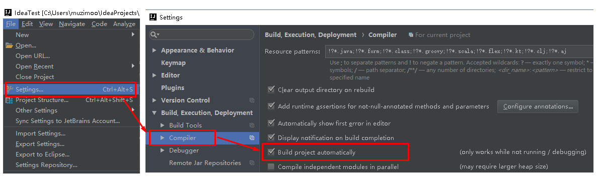
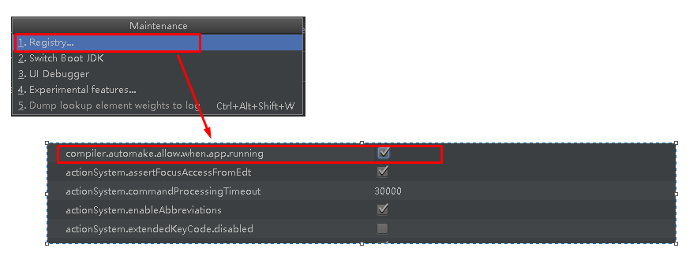

# 3 - SpringBoot

## 一、SpringBoot的概述

### 1.1 SpringBoot解决上述Spring的缺点

​	SpringBoot对上述Spring的缺点（**配置繁琐，依赖管理不友好**）进行的改善和优化，基于约定优于配置的思想，可以让开发人员不必在配置与逻辑业务之间进行思维的切换，全身心的投入到逻辑业务的代码编写中，从而大大提高了开发的效率，一定程度上缩短了项目周期。

### 1.2 SpringBoot的特点

- 为基于Spring的开发提供更快的入门体验
- 开箱即用，没有代码生成，也无需XML配置。同时也可以修改默认值来满足特定的需求
- 提供了一些大型项目中常见的非功能性特性，如嵌入式服务器、安全、指标，健康检测、外部配置等
- SpringBoot不是对Spring功能上的增强，而是提供了一种快速使用Spring的方式

### 1.3 SpringBoot的核心功能

- ##### 起步依赖

  起步依赖本质上是一个Maven项目对象模型（Project Object Model，POM），定义了对其他库的传递依赖，这些东西加在一起即支持某项功能。

  简单的说，起步依赖就是将具备某种功能的坐标打包到一起，并提供一些默认的功能。

- ##### 自动配置

  Spring Boot的自动配置是一个运行时（更准确地说，是应用程序启动时）的过程，考虑了众多因素，才决定Spring配置应该用哪个，不该用哪个。该过程是Spring自动完成的。

  

## 二、SpringBoot快速入门

### 2.1、步骤：

- ##### 创建Maven工程

- ##### 添加SpringBoot的起步依赖

  1) SpringBoot要求，项目要继承SpringBoot的起步依赖spring-boot-starter-parent

  ```xml
  <parent>
      <groupId>org.springframework.boot</groupId>
      <artifactId>spring-boot-starter-parent</artifactId>
      <version>2.0.1.RELEASE</version>
  </parent>
  ```

  2) SpringBoot要集成SpringMVC进行Controller的开发，所以项目要导入web的启动依赖

  ```xml
  <dependencies>
      <dependency>
          <groupId>org.springframework.boot</groupId>
          <artifactId>spring-boot-starter-web</artifactId>
      </dependency>
  </dependencies>
  ```

- ##### 编写SpringBoot引导类

  ```java
  @SpringBootApplication
  public class MySpringBootApplication {
      public static void main(String[] args) {
          SpringApplication.run(MySpringBootApplication.class);
      }
  }
  ```

- ##### 编写Controller

  ```java
  @Controller
  public class QuickStartController {
      @RequestMapping("/quick")
      @ResponseBody
      public String quick(){
          return "springboot 访问成功!";
      }
  }
  ```

- ##### 测试

  ```properties
  异常:This application has no explicit mapping for /error, so you are seeing this as a fallback.
  
  原因1: 
  Application启动类的位置不对.要将Application类放在最外侧,即包含所有子包
  spring-boot会自动加载启动类所在包下及其子包下的所有组件
  
  原因2:
  在springboot的配置文件:application.yml或application.properties中关于视图解析器的配置问题：
  当pom文件下的spring-boot-starter-paren版本高时使用：spring.mvc.view.prefix/spring.mvc.view.suffix
  当pom文件下的spring-boot-starter-paren版本低时使用:spring.view.prefix/spring.view.suffix
  
  原因3:
  控制器的URL路径书写问题：
  @RequestMapping(“xxxxxxxxxxxxxx”) ，实际访问的路径与”xxx”不符合
  ```


### 2.2、快速入门解析

- #### SpringBoot代码解析

  - @SpringBootApplication：标注SpringBoot的启动类，该注解具备多种功能（后面详细剖析）
  - SpringApplication.run(MySpringBootApplication.class) 代表运行SpringBoot的启动类，参数为SpringBoot启动类的字节码对象

  ```java
  @SpringBootApplication
  class BootBean{    }
  
  public class MySpringBootApplication {
      public static void main(String[] args) {
          SpringApplication.run(BootBean.class);
      }
  }
  ```

  > ##### 上面也是正常一个SpringBoot引导方式，但一般不这样设置！

- #### SpringBoot工程热部署

  引入下面依赖：

  ```
  <!--热部署配置-->
  <dependency>
      <groupId>org.springframework.boot</groupId>
      <artifactId>spring-boot-devtools</artifactId>
  </dependency>
  ```

  若是eclipse 则会直接自动热部署；若是idea，则需要对idea进行设置：

  1） Intellij IEDA默认情况下不会自动编译，需要对IDEA进行自动编译的设置，如下：

  

  2）然后 Shift+Ctrl+Alt+/，选择Registry：

  

  

### 2.3、使用idea快速创建SpringBoot项目


## 三、SpringBoot原理分析

### 3.1 起步依赖原理分析

- #### 分析spring-boot-starter-parent:

  ##### 发现起步依赖会去读取配置相关信息，同时又再次依赖了spring-boot-starter-dependencies！

```xml
<?xml version="1.0" encoding="utf-8"?>
<project xmlns="http://maven.apache.org/POM/4.0.0" xmlns:xsi="http://www.w3.org/2001/XMLSchema-instance" xsi:schemaLocation="http://maven.apache.org/POM/4.0.0 http://maven.apache.org/xsd/maven-4.0.0.xsd">
    <modelVersion>4.0.0</modelVersion>
    <parent>
        <groupId>org.springframework.boot</groupId>
        <artifactId>spring-boot-dependencies</artifactId>
        <version>2.0.1.RELEASE</version>
        <relativePath>../../spring-boot-dependencies</relativePath>
    </parent>
	....
    <properties>
        <project.reporting.outputEncoding>UTF-8</project.reporting.outputEncoding>
        <java.version>1.8</java.version>
        ...
    </properties>
    <build>
        <resources>
            <resource>
                <filtering>true</filtering>
                <directory>${basedir}/src/main/resources</directory>
                <includes>
                    <include>**/application*.yml</include>
                    <include>**/application*.yaml</include>
                    <include>**/application*.properties</include>
                </includes>
            </resource>
            <resource>
                <directory>${basedir}/src/main/resources</directory>
                <excludes>
                    <exclude>**/application*.yml</exclude>
                    <exclude>**/application*.yaml</exclude>
                    <exclude>**/application*.properties</exclude>
                </excludes>
            </resource>
        </resources>
        ....
    </build>
</project>
```

- #### spring-boot-starter-dependencies的pom.xml

```xml
<properties>
  	<activemq.version>5.15.3</activemq.version>
  	<antlr2.version>2.7.7</antlr2.version>
  	<appengine-sdk.version>1.9.63</appengine-sdk.version>
  	<artemis.version>2.4.0</artemis.version>
  	<aspectj.version>1.8.13</aspectj.version>
  	<assertj.version>3.9.1</assertj.version>
  	<atomikos.version>4.0.6</atomikos.version>
  	<bitronix.version>2.1.4</bitronix.version>
  	<build-helper-maven-plugin.version>3.0.0</build-helper-maven-plugin.version>
  	<byte-buddy.version>1.7.11</byte-buddy.version>
  	... ... ...
</properties>
<dependencyManagement>
  	<dependencies>
      	<dependency>
        	<groupId>org.springframework.boot</groupId>
        	<artifactId>spring-boot</artifactId>
        	<version>2.0.1.RELEASE</version>
      	</dependency>
      	<dependency>
        	<groupId>org.springframework.boot</groupId>
        	<artifactId>spring-boot-test</artifactId>
        	<version>2.0.1.RELEASE</version>
      	</dependency>
      	... ... ...
	</dependencies>
</dependencyManagement>
<build>
  	<pluginManagement>
    	<plugins>
      		<plugin>
        		<groupId>org.jetbrains.kotlin</groupId>
        		<artifactId>kotlin-maven-plugin</artifactId>
        		<version>${kotlin.version}</version>
      		</plugin>
      		<plugin>
        		<groupId>org.jooq</groupId>
        		<artifactId>jooq-codegen-maven</artifactId>
        		<version>${jooq.version}</version>
      		</plugin>
      		<plugin>
        		<groupId>org.springframework.boot</groupId>
        		<artifactId>spring-boot-maven-plugin</artifactId>
        		<version>2.0.1.RELEASE</version>
      		</plugin>
          	... ... ...
    	</plugins>
  	</pluginManagement>
</build>
```

从上面的spring-boot-starter-dependencies的pom.xml中我们可以发现，一部分坐标的版本、依赖管理、插件管理已经定义好，所以我们的SpringBoot工程继承spring-boot-starter-parent后已经具备版本锁定等配置了。所以起步依赖的作用就是进行依赖的传递。


### 3.2 分析spring-boot-starter-web

```xml
<?xml version="1.0" encoding="UTF-8"?>
<project xsi:schemaLocation="http://maven.apache.org/POM/4.0.0 http://maven.apache.org/xsd/maven-4.0.0.xsd" xmlns="http://maven.apache.org/POM/4.0.0"
    xmlns:xsi="http://www.w3.org/2001/XMLSchema-instance">
  	<modelVersion>4.0.0</modelVersion>
  	<parent>
    	<groupId>org.springframework.boot</groupId>
    	<artifactId>spring-boot-starters</artifactId>
    	<version>2.0.1.RELEASE</version>
  	</parent>
  	<groupId>org.springframework.boot</groupId>
  	<artifactId>spring-boot-starter-web</artifactId>
  	<version>2.0.1.RELEASE</version>
  	<name>Spring Boot Web Starter</name>
  
  	<dependencies>
    	<dependency>
      		<groupId>org.springframework.boot</groupId>
      		<artifactId>spring-boot-starter</artifactId>
      		<version>2.0.1.RELEASE</version>
      		<scope>compile</scope>
    	</dependency>
    	<dependency>
      		<groupId>org.springframework.boot</groupId>
      		<artifactId>spring-boot-starter-json</artifactId>
      		<version>2.0.1.RELEASE</version>
      		<scope>compile</scope>
    	</dependency>
    	<dependency>
      		<groupId>org.springframework.boot</groupId>
      		<artifactId>spring-boot-starter-tomcat</artifactId>
      		<version>2.0.1.RELEASE</version>
      		<scope>compile</scope>
    	</dependency>
    	<dependency>
      		<groupId>org.hibernate.validator</groupId>
      		<artifactId>hibernate-validator</artifactId>
      		<version>6.0.9.Final</version>
      		<scope>compile</scope>
    	</dependency>
    	<dependency>
      		<groupId>org.springframework</groupId>
      		<artifactId>spring-web</artifactId>
      		<version>5.0.5.RELEASE</version>
      		<scope>compile</scope>
    	</dependency>
    	<dependency>
      		<groupId>org.springframework</groupId>
      		<artifactId>spring-webmvc</artifactId>
      		<version>5.0.5.RELEASE</version>
      		<scope>compile</scope>
    	</dependency>
  	</dependencies>
</project>
```

从上面的spring-boot-starter-web的pom.xml中我们可以发现，spring-boot-starter-web就是将web开发要使用的spring-web、spring-webmvc、spring-boot-starter-tomcat等坐标进行了“打包”，这样我们的工程只要引入spring-boot-starter-web起步依赖的坐标就可以进行web开发了，同样体现了依赖传递的作用。


### 3.3、自动配置原理解析

- #### @SpringBootApplication

```
@SpringBootApplication
public class MySpringBootApplication {
    public static void main(String[] args) {
        SpringApplication.run(MySpringBootApplication.class);
    }
}
```

```java
@Target({ElementType.TYPE})
@Retention(RetentionPolicy.RUNTIME)
@Documented
@Inherited
@SpringBootConfiguration
@EnableAutoConfiguration
@ComponentScan(
    excludeFilters = {@Filter(
        type = FilterType.CUSTOM,
        classes = {TypeExcludeFilter.class}
    ), @Filter(
        type = FilterType.CUSTOM,
        classes = {AutoConfigurationExcludeFilter.class}
    )}
)
public @interface SpringBootApplication {
    @AliasFor(
        annotation = EnableAutoConfiguration.class
    )
    Class<?>[] exclude() default {};
    ....
}
```

- #### @SpringBootConfiguration: 即是一个@Configuration

```java
@Target({ElementType.TYPE})
@Retention(RetentionPolicy.RUNTIME)
@Documented
@Configuration
public @interface SpringBootConfiguration {
}
```

- #### @EnableAutoConfiguration： 重点，如何实现自动配置

```java
@Target({ElementType.TYPE})
@Retention(RetentionPolicy.RUNTIME)
@Documented
@Inherited
@AutoConfigurationPackage
@Import({AutoConfigurationImportSelector.class})
public @interface EnableAutoConfiguration {
    String ENABLED_OVERRIDE_PROPERTY = "spring.boot.enableautoconfiguration";

    Class<?>[] exclude() default {};

    String[] excludeName() default {};
}
```

##### 注解直接关联了AutoConfigurationImportSelector.class，也就是该类的功能，注解也全部拥有；

- #### AutoConfigurationImportSelector.class

```java
public class AutoConfigurationImportSelector implements DeferredImportSelector, BeanClassLoaderAware, ResourceLoaderAware, BeanFactoryAware, EnvironmentAware, Ordered {
 ...

    public String[] selectImports(AnnotationMetadata annotationMetadata) {
        if (!this.isEnabled(annotationMetadata)) {
            return NO_IMPORTS;
        } else {
           ...
            List<String> configurations = this.getCandidateConfigurations(annotationMetadata, attributes);
           ...
        }
    }
    
    ....
        
    protected List<String> getCandidateConfigurations(AnnotationMetadata metadata, AnnotationAttributes attributes) {
        List<String> configurations = SpringFactoriesLoader.loadFactoryNames(this.getSpringFactoriesLoaderFactoryClass(), this.getBeanClassLoader());
        Assert.notEmpty(configurations, "No auto configuration classes found in META-INF/spring.factories. If you are using a custom packaging, make sure that file is correct.");
        return configurations;
    }

    .....
}
```

由此可以看出， META-INF/spring.factories 装配了如何实现自动配置的方式！

- ##### org\springframework\boot\spring-boot-autoconfigure\2.0.1.RELEASE\spring-boot-autoconfigure-2.0.1.RELEASE.jar 包下的META-INF/spring.factories

```properties
# Initializers
org.springframework.context.ApplicationContextInitializer=\
org.springframework.boot.autoconfigure.SharedMetadataReaderFactoryContextInitializer,\
org.springframework.boot.autoconfigure.logging.ConditionEvaluationReportLoggingListener

# Application Listeners
org.springframework.context.ApplicationListener=\
org.springframework.boot.autoconfigure.BackgroundPreinitializer

# Auto Configuration Import Listeners
org.springframework.boot.autoconfigure.AutoConfigurationImportListener=\
org.springframework.boot.autoconfigure.condition.ConditionEvaluationReportAutoConfigurationImportListener

# Auto Configuration Import Filters
org.springframework.boot.autoconfigure.AutoConfigurationImportFilter=\
org.springframework.boot.autoconfigure.condition.OnClassCondition

# Auto Configure
org.springframework.boot.autoconfigure.EnableAutoConfiguration=\
org.springframework.boot.autoconfigure.admin.SpringApplicationAdminJmxAutoConfiguration,\
org.springframework.boot.autoconfigure.aop.AopAutoConfiguration,\
org.springframework.boot.autoconfigure.amqp.RabbitAutoConfiguration,\
,....\
org.springframework.boot.autoconfigure.web.servlet.DispatcherServletAutoConfiguration,\
org.springframework.boot.autoconfigure.web.servlet.ServletWebServerFactoryAutoConfiguration,\
org.springframework.boot.autoconfigure.web.servlet.error.ErrorMvcAutoConfiguration,\
org.springframework.boot.autoconfigure.web.servlet.HttpEncodingAutoConfiguration,\
org.springframework.boot.autoconfigure.web.servlet.MultipartAutoConfiguration,\
org.springframework.boot.autoconfigure.web.servlet.WebMvcAutoConfiguration,\
org.springframework.boot.autoconfigure.websocket.reactive.WebSocketReactiveAutoConfiguration,\
org.springframework.boot.autoconfigure.websocket.servlet.WebSocketServletAutoConfiguration,\
org.springframework.boot.autoconfigure.websocket.servlet.WebSocketMessagingAutoConfiguration,\
org.springframework.boot.autoconfigure.webservices.WebServicesAutoConfiguration
```

上面配置文件存在大量的以Configuration为结尾的类名称，这些类就是存有自动配置信息的类，而SpringApplication在获取这些类名后再加载

我们以ServletWebServerFactoryAutoConfiguration为例来分析源码：

```java
@Configuration
@AutoConfigureOrder(Ordered.HIGHEST_PRECEDENCE)
@ConditionalOnClass(ServletRequest.class)
@ConditionalOnWebApplication(type = Type.SERVLET)
@EnableConfigurationProperties(ServerProperties.class)
@Import({ ServletWebServerFactoryAutoConfiguration.BeanPostProcessorsRegistrar.class,
		ServletWebServerFactoryConfiguration.EmbeddedTomcat.class,
		ServletWebServerFactoryConfiguration.EmbeddedJetty.class,
		ServletWebServerFactoryConfiguration.EmbeddedUndertow.class })
public class ServletWebServerFactoryAutoConfiguration {
	... ... ...
}
```

其中，

@EnableConfigurationProperties(ServerProperties.class) 代表加载ServerProperties服务器配置属性类

进入ServerProperties.class源码如下：

```java
@ConfigurationProperties(prefix = "server", ignoreUnknownFields = true)
public class ServerProperties {

	/**
	 * Server HTTP port.
	 */
	private Integer port;

	/**
	 * Network address to which the server should bind.
	 */
	private InetAddress address;
  
  	... ... ...
  
}
```

其中，

prefix = "server" 表示SpringBoot配置文件中的前缀，SpringBoot会将配置文件中以server开始的属性映射到该类的字段中。

##### 系统默认会读取：spring-boot-autoconfigure/META-INF/spring-configuration-metadata.json 。 若我们配置了application.properties/application.yml则会覆盖默认的信息！（为什么呢？因为spring-boot-starter-parent起步依赖就会优先读取自己配置的application*.properties/application\*.yml数据信息！！！）

因此，我们可以配置一个文件在resources目录： application.properties

```properties
# 服务端口
server.port=8081
# 服务名称
server.servlet.context-path=/demo
```

> ##### localhost:8081/demo/quick 进行访问！


## 四、SpringBoot的配置文件

### 4.1、SpringBoot配置文件类型

- properties文件的格式 （前面有学习了！）
- yml文件格式 （新知识点，重点）

> ##### 由于先加载yml, 后加载properties, properties会覆盖yml中的内。

### 4.2、 yml配置文件简介

​	YML文件格式是YAML (YAML Aint Markup Language)编写的文件格式，YAML是一种直观的能够被电脑识别的的数据数据序列化格式，并且容易被人类阅读，容易和脚本语言交互的，可以被支持YAML库的不同的编程语言程序导入，比如： C/C++, Ruby, Python, Java, Perl, C#, PHP等。YML文件是以数据为核心的，比传统的xml方式更加简洁。

YML文件的扩展名可以使用.yml或者.yaml。

### 4.3、yml配置文件的语法

```yaml
# 普通数据的配置
name: zhangsan

# 对象的配置, 缩进的方式
person:
  name: zhangsan
  age: 18
  address: beijing

server:
  port: 8082

# 行内对象，类似json
person1: {name: zhangsan,age: 18,address: beijing}

# map 同对象配置

# 配置数组（List、Set）数据 -- 普通字符串
city:
  - beijing
  - tianjin
  - chongqing
  - shanghai

#或者
city: [beijing,tianjin,shanghai,chongqing]

# 数组 --- 对象集合
students:
  - name: tom
    age: 18
    addr: beijing
  - name: wudong
    age: 24
    addr: shanghai
```


### 4.4、读取配置信息

两种方式：

- #### 使用注解@Value映射

  ```JAVA
  @Controller
  public class Quick2Controller {
  
      @Value("${name}")
      private String name;
  
      @Value("${person.address}")
      private String address;
  
      @RequestMapping("/quick2")
      @ResponseBody
      public String quick2(){
  
          return "获取配置信息："+ name;
      }
  }
  ```

- #### 使用注解@ConfigurationProperties映射

  ```java
  @Controller
  @PropertySource("application.yml")
  @ConfigurationProperties(prefix = "person")
  public class Quick3Controller {
  
      private String name;
      private String address;
  
      public void setAddress(String address) {
          this.address = address;
      }
  
      public void setName(String name) {
          this.name = name;
      }
  
      @RequestMapping("/quick3")
      @ResponseBody
      public String quick3(){
  
          return "获取配置信息name="+ name +", address="+address;
      }
  }
  ```

  > #### 注意：
  >
  > ##### 1、使用@ConfigurationProperties方式可以进行配置文件与实体字段的自动映射，但需要字段必须提供set方法才可以，而使用@Value注解修饰的字段不需要提供set方法
  >
  > ##### 2、spring boot configuration annotation processor not found in classpath问题解决
  >
  > - 配置@PropertySource 注解: 参考上面
  >
  >   @PropertySource("classpath:config/application.yml") 另外一种方式
  >
  > - 直接根据提示，在pom.xml配置：configuration执行器 （推荐： 在yml配置就不会提示can`t resovle configation ... ）
  >
  >   ```
  >   <!--配置执行器-->
  >           <dependency>
  >               <groupId>org.springframework.boot</groupId>
  >               <artifactId>spring-boot-configuration-processor</artifactId>
  >               <optional>true</optional>
  >           </dependency>
  >   ```


## 五、SpringBoot与整合其他技术

### 5.1、与Mybatis整合

```xml
<!--mybatis起步依赖-->
        <dependency>
            <groupId>org.mybatis.spring.boot</groupId>
            <artifactId>mybatis-spring-boot-starter</artifactId>
            <version>1.1.1</version>
        </dependency>

        <!-- MySQL连接驱动 -->
        <dependency>
            <groupId>mysql</groupId>
            <artifactId>mysql-connector-java</artifactId>
        </dependency>
```

- #### application.properties配置

```xml
#DB Configuration:
spring.datasource.driverClassName=com.mysql.jdbc.Driver
spring.datasource.url=jdbc:mysql://127.0.0.1:3306/pinyougoudb?useUnicode=true&characterEncoding=utf8
spring.datasource.username=root
spring.datasource.password=root

#spring集成Mybatis环境
#pojo别名扫描包
mybatis.type-aliases-package=com.itcast.domain
#加载Mybatis映射文件
mybatis.mapper-locations=classpath:mapper/*Mapper.xml
```

- #### userMapper接口

```java
@Mapper
public interface UserMapper {
    public List<User> queryUserList();
}
```

- #### userMapper.xml

```xml
<?xml version="1.0" encoding="utf-8" ?>
<!DOCTYPE mapper PUBLIC "-//mybatis.org//DTD Mapper 3.0//EN"
        "http://mybatis.org/dtd/mybatis-3-mapper.dtd" >
<mapper namespace="com.itcast.mapper.UserMapper">
    <select id="queryUserList" resultType="user">
        select * from tb_user
    </select>
</mapper>
```

- #### 测试

```java
@RunWith(SpringRunner.class)
@SpringBootTest(classes = MySpringBootApplication.class)
public class MybatisTest {

    @Autowired
    private UserMapper userMapper;

    @Test
    public void test(){
        List<User> users = userMapper.queryUserList();
        System.out.println(users);
    }
}
```


### 5.2、与junit整合

```XML
<!--测试的起步依赖-->
        <dependency>
            <groupId>org.springframework.boot</groupId>
            <artifactId>spring-boot-starter-test</artifactId>
            <scope>test</scope>
        </dependency>
```

```java
@RunWith(SpringRunner.class)
@SpringBootTest(classes = MySpringBootApplication.class)
public class MybatisTest {

    @Autowired
    private UserMapper userMapper;

    @Test
    public void test(){
        List<User> users = userMapper.queryUserList();
        System.out.println(users);
    }
}
```


### 5.3、整合Spring Data JPA

- #### 依赖

```
<!-- springBoot JPA的起步依赖 -->
		<dependency>
			<groupId>org.springframework.boot</groupId>
			<artifactId>spring-boot-starter-data-jpa</artifactId>
		</dependency>

		<!-- MySQL连接驱动 -->
		<dependency>
			<groupId>mysql</groupId>
			<artifactId>mysql-connector-java</artifactId>
		</dependency>
		
```

- #### application.properties配置

```properties
#DB Configuration:
spring.datasource.driverClassName=com.mysql.jdbc.Driver
spring.datasource.url=jdbc:mysql://127.0.0.1:3306/test?useUnicode=true&characterEncoding=utf8
spring.datasource.username=root
spring.datasource.password=root

#JPA Configuration:
spring.jpa.database=MySQL
spring.jpa.show-sql=true
spring.jpa.generate-ddl=true
spring.jpa.hibernate.ddl-auto=update
spring.jpa.hibernate.naming_strategy=org.hibernate.cfg.ImprovedNamingStrategy
```

- #### 实体类

```
@Entity
public class User {
    // 主键
    @Id
    @GeneratedValue(strategy = GenerationType.IDENTITY)
    private Long id;
    // 用户名
    private String username;
    // 密码
    private String password;
    // 姓名
    private String name;
 
    //此处省略setter和getter方法... ...
}
```

- #### 编写UserRepository

```java
public interface UserRepository extends JpaRepository<User,Long>,JpaSpecificationExecutor<User>{

}
```

- #### 测试

```java
@RunWith(SpringRunner.class)
@SpringBootTest(classes = SpringbootJpaApplication.class)
public class JpaTest {

    @Autowired
    private UserRepository userRepository;

    @Test
    public void test(){
        List<User> users = userRepository.findAll();
        System.out.println(users);
    }
}
```

> #### [mysql运行报The server time zone value 'Öйú±ê׼ʱ¼ä' is unrecognized or represents more than one time zone的解决方法]
>
> ```properties
> # 解决方法 1: url中设置一个serverTimezone=GMT%2B8
> spring.datasource.driverClassName=com.mysql.cj.jdbc.Driver
> spring.datasource.url=jdbc:mysql://127.0.0.1:3306/pinyougoudb?serverTimezone=GMT%2B8&useUnicode=true&characterEncoding=utf8
> spring.datasource.username=root
> spring.datasource.password=root
> 
> # 解决方法2：mysql安装时是默认美国时间, 将时间设置为‘+8:00’
> mysql> show variables like '%time_zone%';
> +------------------+--------+
> | Variable_name    | Value  |
> +------------------+--------+
> | system_time_zone |        |
> | time_zone        | SYSTEM |
> +------------------+--------+
> mysql> set global time_zone='+8:00';
> ```


### 5.4、整合Redis

- #### 依赖

```xml
<!-- 配置使用redis启动器 -->
		<dependency>
			<groupId>org.springframework.boot</groupId>
			<artifactId>spring-boot-starter-data-redis</artifactId>
		</dependency>
```

- #### application.properties配置

```properties
#DB Configuration:
spring.datasource.driverClassName=com.mysql.cj.jdbc.Driver
spring.datasource.url=jdbc:mysql://127.0.0.1:3306/pinyougoudb?useUnicode=true&characterEncoding=utf8
spring.datasource.username=root
spring.datasource.password=root

#JPA Configuration:
spring.jpa.database=MySQL
spring.jpa.show-sql=true
spring.jpa.generate-ddl=true
spring.jpa.hibernate.ddl-auto=update
spring.jpa.hibernate.naming_strategy=org.hibernate.cfg.ImprovedNamingStrategy

#Redis
spring.redis.host=127.0.0.1
spring.redis.port=6379
```

- #### 测试

```java
@RunWith(SpringRunner.class)
@SpringBootTest(classes = SpringbootJpaApplication.class)
public class RedisTest {

    @Autowired
    private UserRepository userRepository;

    @Autowired
    private RedisTemplate<String,String> redisTemplate;

    @Test
    public void test() throws JsonProcessingException {
        // 1. 先从redis 获取数据. json字符串格式
        String userListJson = redisTemplate.boundValueOps("user.findAll").get();
        List<User> users = null;
        if(null == userListJson){
            users = userRepository.findAll();
            ObjectMapper mapper = new ObjectMapper();
            String json = mapper.writeValueAsString(users);
            redisTemplate.boundValueOps("user.findAll").set(json);
            System.out.println(" mysql =========");
            System.out.println(json);
        }else{
            System.out.println(" redis =========");
            System.out.println(userListJson);
        }
    }
}
```