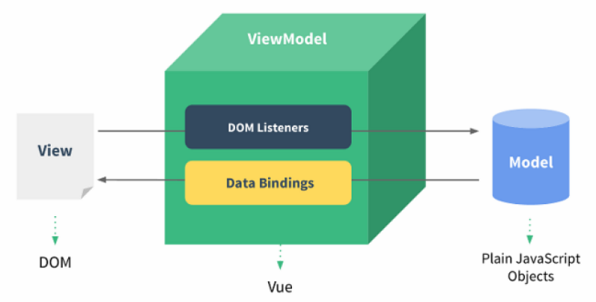

# 4 - Vue

Vue与anglarJS类似！ 只是语法有所区别！

## 一、VueJS 概述与快速入门

### 1.1 VueJS介绍 

Vue.js是一个构建数据驱动的 web 界面的渐进式框架。Vue.js 的目标是通过尽可能简单的 API 实现响应的数据绑 定和组合的视图组件。它不仅易于上手，还便于与第三方库或既有项目整合。

官网:https://cn.vuejs.org/

### 1.2 MVVM模式

MVVM是Model-View-ViewModel的简写。它本质上就是MVC 的改进版。MVVM 就是将其中的View 的状态和行为
抽象化，让我们将视图 UI 和业务逻辑分开
MVVM模式和MVC模式一样，主要目的是分离视图（View）和模型（Model）
Vue.js 是一个提供了 MVVM 风格的双向数据绑定的 Javascript 库，专注于View 层。它的核心是 MVVM 中的 VM，
也就是 ViewModel。 ViewModel负责连接 View 和 Model，保证视图和数据的一致性，这种轻量级的架构让前端
开发更加高效、便捷。



MVVM: 实现数据与视图分离，达到解耦！  Vue.js 、anglarJS都是MVVM模式！

> #### MVC，MVP，MVVM对比：
>
> 

### 1.3、快速入门

```html
<!DOCTYPE html>
<html>
	<head>
		<meta charset="utf-8" />
		<title>快速入门</title>
		<script src="js/vuejs-2.5.16.js"></script>
	</head>
	<body>
		<div id="app">
			{{message}}<!--Vue的插值表达式，把data中定义的数据显示到此处-->

			<!-- 三元运算符 -->
			{{ false ? "OK" : "No" }}

			<!-- 数学运算-->
			{{number*3.14}}

			<!--插值表达式不支持
			{{var a = 1;}}
			{{if(a = 10){}}}
			-->

		</div>
	</body>
	<script>
		//view model
		//创建Vue对象
		var VM = new Vue({
			el:"#app",//由vue接管id为app区域
			data:{
			    message:"Hello Vue!  EESY",//注意：此处不要加分号
				number:100
			}
		});
	</script>
</html>
```

> 入门程序步骤：
>
> 1、编写html，引入vue.min.js
>
> 2、编写视图部分的代码（用户界面，只负责展示）
>
> 3、编写VM （ viewModel ) 及Model
>
> 4、刷新页面运行程序，vue.js(VM) 部分实现了model中的数据在view中的展示；


## 二、VueJS 常用系统指令

### 2.1 v-on

可以用  v-on 指令监听 DOM 事件，并在触发时运行一些 JavaScript 代码

- #### v-on:click

  ```html
  <html>
      <body>
          <div id="app">
              {{message}}  
              <button v-on:click="fun1('Vue v-on')">vue的onclick</button>
          </div>
      </body>
      <script>
          //view model
          new Vue({
              el:"#app",
              data:{
                  message:"Hello Vue!"
              },
              methods:{
                  fun1:function(msg){
                      alert("Hello");
                      this.message = msg;
                  }
              }
          });
      </script>
  </html> 
  ```

- #### v-on:keydown

  ```html
  <body>
      <div id="app">
          Vue:<input type="text" v-on:keydown="fun($event)">
          <hr/>
          传统JS：<input type="text"  onkeydown="showKeyCode()"/>
      </div>
  </body>
  <script>
      //view model
      new Vue({
          el:"#app",
          methods:{
              /* $event 它是vue中的事件对象  和我们传统js的event对象是一样的  */
              fun:function(event){
                  var keyCode = event.keyCode;
                  if(keyCode < 48  || keyCode > 57){
                      //不让键盘的按键起作用
                      event.preventDefault();
                  }
              }
          }
      });
  
  
      //传统js的键盘按下事件
      function showKeyCode(){
          //event对象和我们的document对象以及window对象是一样的，可以不用定义直接使用
          var keyCode = event.keyCode;
          if(keyCode < 48  || keyCode > 57){
              //不让键盘的按键起作用
              // event.preventDefault();
              alert(keyCode);
              if(event.keyCode == 13){
                  alert("你按的是回车");
              }
          }
  
      }
  </script>
  ```

- #### v-on:mouseover

  ```html
  <body>
      <div id="app">
          <div @mouseover="fun1" id="div">
              <textarea @mouseover="fun2($event)">这是一个文件域</textarea>
          </div>
  
          <!--<div onmouseover="divmouseover()" id="div">
  <textarea onmouseover="textareamouseover()">这是一个文件域</textarea>
  </div>-->
      </div>
  </body>
  <script>
      //view model
      /**
  		 * @事件名称  就是  v-on:事件名称的简写方式
  		 * @mouseover它就等同于v-on:mouseover
           */
      new Vue({
          el:"#app",
          methods:{
              fun1:function(){
                  alert("鼠标悬停在div上了");
              },
              fun2:function(event){
                  alert("鼠标悬停在textarea上了");
                  event.stopPropagation(); // 防止事件冒泡，没有则会event穿透，执行fun1
              }
          }
      });
  
  
      //传统的js方式
      function divmouseover(){
          alert("鼠标移动到了div上了");
      }
  
      function textareamouseover(){
          alert("鼠标移动到了textarea上了");
          event.stopPropagation();
      }
  </script>
  ```

- #### 事件修饰符

  Vue.js 为 v-on 提供了事件修饰符来处理 DOM 事件细节，如：event.preventDefault() 或
  event.stopPropagation()。
  Vue.js通过由点(.)表示的指令后缀来调用修饰符。

  ##### .stop

  ##### .prevent

  ##### .capture

  ##### .self

  ##### .once

  ```html
  <body>
      <div id="app">
          <form @submit.prevent action="http://www.itheima.com" method="post" >
              <input type="text" name="username"/>
              <input type="password" name="password">
              <input type="submit" value="提交">
          </form>
          <hr/>
          <form action="http://www.itheima.com" method="post" onsubmit="return checkForm()">
              <input type="submit" value="提交">
          </form>
          <hr/>
          <div @mouseover="fun1" id="div">
              <textarea @mouseover.stop="fun2($event)">这是一个文件域</textarea>
          </div>
      </div>
  </body>
  <script>
      //view model
      new Vue({
          el:"#app",
          methods:{
              fun1:function(){
                  alert("鼠标悬停在div上了");
              },
              fun2:function(event){
                  alert("鼠标悬停在textarea上了");
              },
          }
      });
  
      //传统js方式
      function checkForm(){
          alert(1);
          //表单验证必须有一个明确的boolean类型返回值
          //在应用验证方法时必须加上 return  方法名称
          return true;
      }
  </script>
  ```

- ####  按键修饰符

  ```html
  <!-- 只有在 keyCode 是 13 时调用 vm.submit() -->
  <input v-on:keyup.13="submit">
  ```

  - 记住所有的 keyCode 比较困难，所以 Vue 为最常用的按键提供了别名：

  - - enter  
    - tab  
    - delete (捕获 “删除” 和 “退格” 键)  
    - esc  
    - space  
    - up  
    - down  
    - left  
    - right

  ```html
  <body>
      <div id="app">
          Vue:<input type="text" @keydown.enter="fun1">
      </div>
  </body>
  <script>
      //view model
      new Vue({
          el:"#app",
          methods:{
              fun1:function(){
                  alert("按下的是回车");
              }
          }
      });
  </script>
  ```

  

### 2.2 v-text与v-html

 v-text 将一个变量的值渲染到指定的元素中,它可以解决插值表达式闪烁的问题！

因为若没有使用v-text, {{}}插值表达式在没有拿到数据前也会保持原样显示在前端界面，这样就不是很友好！

```html
<body>
    <div id="app">
        <div v-text="message"></div>
        <div v-html="message"></div>
        <!--传统-->
        <div id="div1"></div>
        <div id="div2"></div>
    </div>
</body>
<script>
    //view model
    new Vue({
        el:"#app",
        data:{
            message:"<h1>Hello Vue</h1>"
        }
    });

    //传统js的innerText和innerHTML
    window.onload = function(){
        document.getElementById("div1").innerHTML="<h1>Hello</h1>";
        document.getElementById("div2").innerText="<h1>Hello</h1>";
    }
</script>
```

### 2.3 v-bind

插值语法不能作用在 HTML 特性上，遇到这种情况应该使用 v-bind指令!

```html
<body>
    <div id="app">
        <font size="5" v-bind:color="ys1">传智播客</font>
        <font size="5" :color="ys2">黑马程序员</font>
    </div>
</body>
<script>
    //view model
    //插值表达式不能用于html标签的属性取值
    //要想给html标签的属性设置变量的值，需要使用v-bind
    //v-bind也可以简化写法   直接使用:
    new Vue({
        el:"#app",
        data:{
            ys1:"red",
            ys2:"green"
        }
    })
</script>
```

> ```html
> <!-- 完整语法 -->
> <a v-bind:href="url">...</a>
> <!-- 缩写 -->
> <a :href="url">...</a>
> ```

### 2.4 v-model

```html
<body>
    <div id="app">
        <form action="" method="post">
            用户名：<input type="text" name="username" v-model="user.username"><br/>
            密码：<input type="text" name="password" v-model="user.password"><br/>
            <INPUT type="button" value="获取数据" @click="fun1">
                </form>
            </div>
        </body>
    <script>
        //view model
        new Vue({
            el:"#app",
            data:{
                user:{
                    username:"",
                    password:""
                }
            },
            methods:{
                fun1:function () {
                    alert(this.user.username+" "+this.user.password);
                    this.user.username="tom";
                    this.user.password="123456";
                }
            }
        })
    </script>
```

- 在表单控件或者组件上创建双向绑定

- v-model仅能在如下元素中使用：

  ```
  input
  select
  textarea
  components（Vue中的组件）
  ```

### 2.5 v-for

- ##### 操作array

  ```html
  <body>
      <div id="app">
          <ul>
              <li v-for="(item,index) in arr ">{{item}}={{index}} </li>
          </ul>
      </div>
  </body>
  <script>
      //view model
      new Vue({
          el:"#app",
          data:{
              arr:[1,2,3,4,5]
          }
      })
  </script>
  ```

- ##### 操作对象

  ```html
  <body>
      <div id="app">
          <ul>
              <li v-for="(value,key) in product ">{{key}}===={{value}} </li>
          </ul>
      </div>
  </body>
  <script>
      //view model
      new Vue({
          el:"#app",
          data:{
              product:{
                  id:1,
                  name:"笔记本电脑",
                  price:5000
              }
          }
      })
  </script>
  ```

  > ##### 注意：key-value对应的位置！ 一般v-for: value在前代表值。那么显示时就要注意了！

- ##### 操作对象数组

  ```html
  <body>
      <div id="app">
          <table border="1">
              <tr>
                  <td>序号</td>
                  <td>编号</td>
                  <td>名称</td>
                  <td>价格</td>
              </tr>
              <tr v-for="(product,index) in products ">
                  <td>{{index}}</td>
                  <td>{{product.id}}</td>
                  <td>{{product.name}}</td>
                  <td>{{product.price}}</td>
              </tr>
          </table>
      </div>
  </body>
  <script>
      //view model
      new Vue({
          el:"#app",
          data:{
              products:[
                  { id:1,name:"笔记本电脑",price:5000 },
                  { id:2,name:"手机",price:3000 },
                  { id:3,name:"电视",price:4000 }
              ]
          }
      })
  </script>
  ```

### 2.6 v-if与v-show (差不多效果)

v-if是根据表达式的值来决定是否渲染元素
v-show是根据表达式的值来切换元素的display css属性

```html
<body>
    <div id="app">
        <span v-if="flag">传智播客</span>
        <span v-show="flag">itcast</span>
        <button @click="toggle">切换</button>
    </div>
</body>
<script>
    //view model
    new Vue({
        el:"#app",
        data:{
            flag:false
        },
        methods:{
            toggle:function(){
                this.flag = !this.flag;
            }
        }
    })
</script>
```

> **相比之下， `v-show` 简单得多——元素始终被编译并保留，只是简单地基于 CSS 切换。**
>
> **一般来说， `v-if` 有更高的切换消耗而 `v-show` 有更高的初始渲染消耗。因此，如果需要频繁切换使用 `v-show` 较好，如果在运行时条件不大可能改变则使用 `v-if` 较好。**


## 三、VueJS生命周期

```html
<body>
    <div id="app">
        {{message}}
        <!--<input type="button" value="改变" v-on:click="fun1">-->
        <!--<button v-on:click="fun1('5555555555')">改变值</button>-->
    </div>
</body>
<script>
    var vm = new Vue({
        el: "#app",
        data: {
            message: 'hello world11111'
        },
        beforeCreate: function() {
            console.log(this);
            showData('创建vue实例前', this);
        },
        created: function() {
            showData('创建vue实例后', this);
        },
        beforeMount: function() {
            showData('挂载到dom前', this);
        },
        mounted: function() {
            showData('挂载到dom后', this);
        },
        beforeUpdate: function() {
            showData('数据变化更新前', this);
        },
        updated: function() {
            showData('数据变化更新后', this);
        },
        beforeDestroy: function() {
            vm.test = "3333";
            showData('vue实例销毁前', this);
        },
        destroyed: function() {
            showData('vue实例销毁后', this);
        }
    });

    function realDom() {
        console.log('真实dom结构：' + document.getElementById('app').innerHTML);
    }

    function showData(process, obj) {
        console.log(process);
        console.log('data 数据：' + obj.message)
        console.log('挂载的对象：')
        console.log(obj.$el)
        realDom();
        console.log('------------------')
        console.log('------------------')
    }
    // vm.message = "good...";
    vm.$destroy();
</script>
```

> vue对象初始化过程中，会执行到beforeCreate,created,beforeMount,mounted 这几个钩子的内容
>
> - beforeCreate ：数据还没有监听，没有绑定到vue对象实例，同时也没有挂载对象
> - created ：数据已经绑定到了对象实例，但是还没有挂载对象
> - beforeMount: 模板已经编译好了，根据数据和模板已经生成了对应的元素对象，将数据对象关联到了对象的el属性，el属性是一个HTMLElement对象，也就是这个阶段，vue实例通过原生的createElement等方法来创建这个html片段，准备注入到我们vue实例指明的el属性所对应的挂载点
> - mounted:将el的内容挂载到了el，相当于我们在jquery执行了(el).html(el),生成页面上真正的dom，上面我们就会发现dom的元素和我们el的元素是一致的。在此之后，我们能够用方法来获取到el元素下的dom对象，并进 行各种操作当我们的data发生改变时，会调用beforeUpdate和updated方
> - beforeUpdate ：数据更新到dom之前，我们可以看到$el对象已经修改，但是我们页面上dom的数据还没有发生改变
> - updated: dom结构会通过虚拟dom的原则，找到需要更新页面dom结构的最小路径，将改变更新到dom上面，完成更新
> - beforeDestroy,destroed :实例的销毁，vue实例还是存在的，只是解绑了事件的监听还有watcher对象数据与view的绑定，即数据驱动


## 四、VueJS ajax

### 4.1 vue-resource

vue-resource是Vue.js的插件提供了使用XMLHttpRequest或JSONP进行Web请求和处理响应的服务。 当vue更新
到2.0之后，作者就宣告不再对vue-resource更新，而是推荐的axios，在这里大家了解一下vue-resource就可以。
vue-resource的github: https://github.com/pagekit/vue-resource

### 4.2 axios

Axios 是一个基于 promise 的 HTTP 库，可以用在浏览器和 node.js 中
axios的github:https://github.com/axios/axios

- ##### 引入axios

  - 专业js开发：使用ES6引入----- node.js (大前端)

  - 业务功能开发：直接标签导入即可（或者下载后，直接拿axios.min.js导入）

    ```html
    <script src="https://unpkg.com/axios/dist/axios.min.js"></script>
    ```

- ##### get请求

  ```html
  <body>
  <div id="app">
      {{message}}
      <button v-on:click="fun1">axios请求</button>
  </div>
  </body>
  <script>
      //view model
      new Vue({
          el: "#app",
          data: {
              message: "Hello Vue!"
          },
          methods: {
              fun1: function () {
                  // Make a request for a user with a given ID
                  axios.get('/user?ID=12345')
                      .then(function (response) {
                          // handle success
                          console.log(response);
                      })
                      .catch(function (error) {
                          // handle error
                          console.log(error);
                      })
                      .then(function () {
                          // always executed
                      });
              }
          }
      });
  </script>
  ```

- ##### post请求

  ```js
  axios.post('/user',{
      firstName:'Fred',
      lastName:'Flintstone'
  }).then(function(res){
      console.log(res);
  }).catch(function(err){
      console.log(err);
  });
  ```


## 五、综合案例


## 六、补充：一般性web项目（非maven方式）

- #### IDEA 运行web项目：

> 在idea中配置的tomcat，在运行时idea不会把项目放到该路径下，而是复制一份足够的配置文件，到 `${user.home}/.IntelliJIdea/system/tomcat` 目录下： 
>
> ##### 	里面会有不同项目对应的配置！
>
> 也就是说每个项目都有属于自己的一份tomcat配置，互不干扰。
>
> 每个项目的配置文件夹中有一个 `/conf/Catalina/localhost/ROOT.xml` 文件，内容如下：
>
> ```xml
> <?xml version="1.0" encoding="UTF-8"?>
> <Context path="" docBase="E:\ideaProjects\vue\out\artifacts\vue_war_exploded" />
> ```
>
> ##### 总结：相当于idea只是借了本地tomcat一个壳，即运行环境。所有项目配置各自用各自的配置替换原有的配置，最后通过 `/conf/Catalina/localhost/ROOT.xml` 映射到具体的项目位置！


## 


