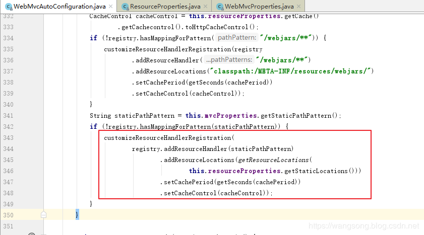

# Spring Boot 中的静态资源到底要放在哪里？

https://www.cnblogs.com/lenve/p/10653003.html

当我们使用 SpringMVC 框架时，静态资源会被拦截，需要添加额外配置，之前老有小伙伴在微信上问松哥Spring Boot 中的静态资源加载问题：“松哥，我的HTML页面好像没有样式？”，今天我就通过一篇文章，来和大伙仔细聊一聊这个问题。

## SSM 中的配置

要讲 Spring Boot 中的问题，我们得先回到 SSM 环境搭建中，一般来说，我们可以通过 `<mvc:resources />` 节点来配置不拦截静态资源，如下：

```
<mvc:resources mapping="/js/**" location="/js/"/>
<mvc:resources mapping="/css/**" location="/css/"/>
<mvc:resources mapping="/html/**" location="/html/"/>
```

由于这是一种Ant风格的路径匹配符，`/**` 表示可以匹配任意层级的路径，因此上面的代码也可以像下面这样简写：

```
<mvc:resources mapping="/**" location="/"/>
```

这种配置是在 XML 中的配置，大家知道，SpringMVC 的配置除了在XML中配置，也可以在 Java 代码中配置，如果在Java代码中配置的话，我们只需要自定义一个类，继承自WebMvcConfigurationSupport即可：

```
@Configuration
@ComponentScan(basePackages = "org.sang.javassm")
public class SpringMVCConfig extends WebMvcConfigurationSupport {
    @Override
    protected void addResourceHandlers(ResourceHandlerRegistry registry) {
        registry.addResourceHandler("/**").addResourceLocations("/");
    }
}
```

重写 WebMvcConfigurationSupport 类中的addResourceHandlers方法，在该方法中配置静态资源位置即可，这里的含义和上面 xml 配置的含义一致，因此无需多说。
这是我们传统的解决方案，在Spring Boot 中，其实配置方式和这个一脉相承，只是有一些自动化的配置了。

## Spring Boot 中的配置

在 Spring Boot 中，如果我们是从 `https://start.spring.io` 这个网站上创建的项目，或者使用 IntelliJ IDEA 中的 Spring Boot 初始化工具创建的项目，默认都会存在 resources/static 目录，很多小伙伴也知道静态资源只要放到这个目录下，就可以直接访问，除了这里还有没有其他可以放静态资源的位置呢？为什么放在这里就能直接访问了呢？这就是本文要讨论的问题了。

### 整体规划

首先，在 Spring Boot 中，默认情况下，一共有5个位置可以放静态资源，五个路径分别是如下5个：

1. classpath:/META-INF/resources/
2. classpath:/resources/
3. classpath:/static/
4. classpath:/public/
5. /

前四个目录好理解，分别对应了resources目录下不同的目录，第5个 `/` 是啥意思呢？我们知道，在 Spring Boot 项目中，默认是没有 webapp 这个目录的，当然我们也可以自己添加（例如在需要使用JSP的时候），这里第5个 `/` 其实就是表示 webapp 目录中的静态资源也不被拦截。如果同一个文件分别出现在五个目录下，那么优先级也是按照上面列出的顺序。

不过，虽然有5个存储目录，除了第5个用的比较少之外，其他四个，系统默认创建了 `classpath:/static/` ， 正常情况下，我们只需要将我们的静态资源放到这个目录下即可，也不需要额外去创建其他静态资源目录，例如我在 `classpath:/static/`目录下放了一张名为1.png 的图片，那么我的访问路径是：

```
http://localhost:8080/1.png  
```

这里大家注意，请求地址中并不需要 static，如果加上了static反而多此一举会报404错误。很多人会觉得奇怪，为什么不需要添加 static呢？资源明明放在 static 目录下。其实这个效果很好实现，例如在SSM配置中，我们的静态资源拦截配置如果是下面这样：

```
<mvc:resources mapping="/**" location="/static/"/>
```

如果我们是这样配置的话，请求地址如果是 `http://localhost:8080/1.png` 实际上系统会去 `/static/1.png` 目录下查找相关的文件。

所以我们理所当然的猜测，在 Spring Boot 中可能也是类似的配置。

### 源码解读

胡适之先生说：“大胆猜想，小心求证”，我们这里就通过源码解读来看看 Spring Boot 中的静态资源到底是怎么配置的。

首先我们在 WebMvcAutoConfiguration 类中看到了 SpringMVC 自动化配置的相关的内容，找到了静态资源拦截的配置，如下：



可以看到这里静态资源的定义和我们前面提到的Java配置SSM中的配置非常相似，其中，this.mvcProperties.getStaticPathPattern() 方法对应的值是 “/**”，this.resourceProperties.getStaticLocations()方法返回了四个位置，分别是："classpath:/META-INF/resources/", "classpath:/resources/","classpath:/static/", "classpath:/public/"，然后在getResourceLocations方法中，又添加了“/”，因此这里返回值一共有5个。其中，/表示webapp目录，即webapp中的静态文件也可以直接访问。静态资源的匹配路径按照定义路径优先级依次降低。因此这里的配置和我们前面提到的如出一辙。这样大伙就知道了为什么Spring Boot 中支持5个静态资源位置，同时也明白了为什么静态资源请求路径中不需要`/static`，因为在路径映射中已经自动的添加上了`/static`了。

### 自定义配置

当然，这个是系统默认配置，如果我们并不想将资源放在系统默认的这五个位置上，也可以自定义静态资源位置和映射，自定义的方式也有两种，可以通过 application.properties 来定义，也可以在 Java 代码中来定义，下面分别来看。

#### application.properties

在配置文件中定义的方式比较简单，如下：

```properties
# 表示定义资源位置
spring.resources.static-locations=classpath:/
# 表示定义请求 URL 规则
spring.mvc.static-path-pattern=/**
```

第一行配置表示定义资源位置，第二行配置表示定义请求 URL 规则。以上文的配置为例，如果我们这样定义了，表示可以将静态资源放在 resources目录下的任意地方，我们访问的时候当然也需要写完整的路径，例如在resources/static目录下有一张名为1.png 的图片，那么访问路径就是 `http://localhost:8080/static/1.png` ,注意此时的static不能省略。

> application.yml配置如下：
>
> ```yaml
> spring:
>   resources:
>     static-locations: classpath:/
>   mvc:
>     static-path-pattern: /security/**
> ```
>
> 那么访问static/1.png 的全url: localhost:8080/security/static/1.png
>
> 若上面两项都不配置，则是 localhost:8080/1.png 即可访问！！！


#### Java 代码定义

当然，在Spring Boot中我们也可以通过 Java代码来自定义，方式和 Java 配置的 SSM 比较类似，如下：

```
@Configuration
public class WebMVCConfig implements WebMvcConfigurer {
    @Override
    public void addResourceHandlers(ResourceHandlerRegistry registry) {
        registry.addResourceHandler("/**").addResourceLocations("classpath:/aaa/");
    }
}
```

这里代码基本和前面一致，比较简单，不再赘述。

## 总结

这里需要提醒大家的是，松哥见到有很多人用了 Thymeleaf 之后，会将静态资源也放在 resources/templates 目录下，注意，templates 目录并不是静态资源目录，它是一个放页面模板的位置（你看到的 Thymeleaf 模板虽然后缀为 .html，其实并不是静态资源）。好了，通过上面的讲解，相信大家对 Spring Boot 中静态资源的位置有一个深刻了解了，应该不会再在项目中出错了吧！