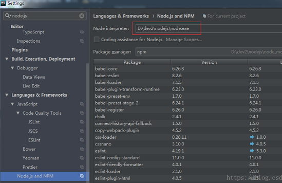
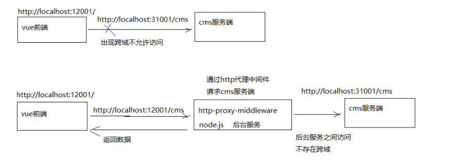

# 02 - CMS前端开发

## 一、VUE

参考vue!

## 二、Webpack


## 三、CMS 前端工程创建

### 3.1  导入系统管理前端工程

### 3.2  单页面应用介绍

```properties
单页Web应用（single page web application，SPA）:就是只有一张Web页面的应用。单页应用程序 (SPA) 是加载单个HTML 页面并在用户与应用程序交互时动态更新该页面的Web应用程序。 [1]  浏览器一开始会加载必需的HTML、CSS和JavaScript，所有的操作都在这张页面上完成，都由JavaScript来控制。因此，对单页应用来说模块化的开发和设计显得相当重要。
```

单页面应用的优缺点：
优点：
1、用户操作体验好，用户不用刷新页面，整个交互过程都是通过Ajax来操作。
2、适合前后端分离开发，服务端提供http接口，前端请求http接口获取数据，使用JS进行客户端渲染。
缺点：
1、首页加载慢
单页面应用会将js、 css打包成一个文件，在加载页面显示的时候加载打包文件，如果打包文件较大或者网速慢则
用户体验不好。
2、SEO不友好
SEO（Search Engine Optimization）为搜索引擎优化。它是一种利用搜索引擎的搜索规则来提高网站在搜索引擎
排名的方法。目前各家搜索引擎对JS支持不好，所以使用单页面应用将大大减少搜索引擎对网站的收录。
总结：
本项目的门户、课程介绍不采用单页面应用架构去开发，对于需要用户登录的管理系统采用单页面开发。

> #### webstorm 启动项目：Error: Please specify Node.js interpreter
>
> 原因：在webstorm中没有配置nodejs环境！
>
> 
>
> 最后一步，非常重要，重启webstorm！！ 


## 四、CMS 前端页面查询开发

### 4.1、页面原型

- 页面创建

- 页面路由

- Table组件

  ##### Element-UI介绍

  本项目使用Element-UI来构建界面，Element是一套为开发者、设计师和产品经理准备的基于 Vue 2.0 的桌面端组件库。
  Element-UI官方站点：http://element.eleme.io/#/zh-CN/component/installation

### 4.2、Api 调用

- ##### cms.js

```
import http from './../../../base/api/public'
import querystring from 'querystring'
let sysConfig = require('@/../config/sysConfig')
let apiUrl = sysConfig.xcApiUrlPre;

//页面查询
export const page_list = (page,size,params) =>{
  //请求服务端的页面查询接口
  return http.requestQuickGet('http://localhost:31001/cms/page/list/'+page+'/'+size);
  // return http.requestQuickGet(apiUrl+'/cms/page/list/'+page+'/'+size);
};
```

- ##### page-list.vue

```js
<script>
  /*编写页面静态部分，即model及vm部分。*/
  import * as cmsApi from '../api/cms'
  export default {
    data() {
      return {
        list: [],
        total:0,
        params:{
          page:1,
          size:10
        }
      }
    },
    methods:{
      query:function(){
        // alert('查询');
        //调用服务端的接口
        cmsApi.page_list(this.params.page,this.params.size).then((res)=>{
          //将res结果数据赋值给数据模型对象
          this.list = res.queryResult.list;
          this.total = res.queryResult.total;
        })

      },
      changePage:function(page){//形参就是当前页码
        //调用query方法
        // alert(page);
        this.params.page = page;
        this.query()
      }
    },
    mounted(){
      //当DOM元素渲染完成后调用query
      this.query()
    }
  }
</script>
```


### 4.3、 跨域问题解决

```
'http://localhost:31001/cms/page/list/1/10' from origin 'http://localhost:11000' has been blocked by CORS policy: No 'Access-Control-Allow-Origin' header is present on the requested resource.
```

原因：浏览器的同源策略不允许跨域访问，所谓同源策略是指协议、域名、端口相同。
解决：采用proxyTable解决。

proxyTable是什么？
vue-cli提供的解决vue开发环境下跨域问题的方法，proxyTable的底层使用了http-proxy-
middleware（https://github.com/chimurai/http-proxy-middleware），它是 http代理中间件，它依赖node.js，



在config/index.js

```JS
'use strict'
// Template version: 1.2.4
// see http://vuejs-templates.github.io/webpack for documentation.

const path = require('path')
var proxyConfig = require('./proxyConfig')
let sysConfig = require('./sysConfig')
let xcApiUrl = sysConfig.xcApiUrl
module.exports = {
  dev: {

    // Paths
    assetsSubDirectory: 'static',
    assetsPublicPath: '/',
    //proxyTable: proxyConfig.proxyList,
    proxyTable: {
      '/banner': {
        // target: 'http://localhost:3000/mock/11'
        target: 'http://127.0.0.1:7777'

      },
      '/api/cms': {
        target: 'http://localhost:31001',
        pathRewrite: {
          '^/api': ''
        }
        //target: 'http://127.0.0.1:50201'

      }
    ...
  }
}
```


### 4.4、进入页面立即查询

使用vue的生命周期的钩子方法来实现（也就是回调方法）

通常使用最多的是created和mounted两个钩子：

- created：vue实例已创建但是DOM元素还没有渲染生成。
- mounted：DOM元素渲染生成完成后调用。

本例子在两个方法的任意一个都满足需求：如

```JS
mounted(){
    //当DOM元素渲染完成后调用query
    this.query()
}
```


