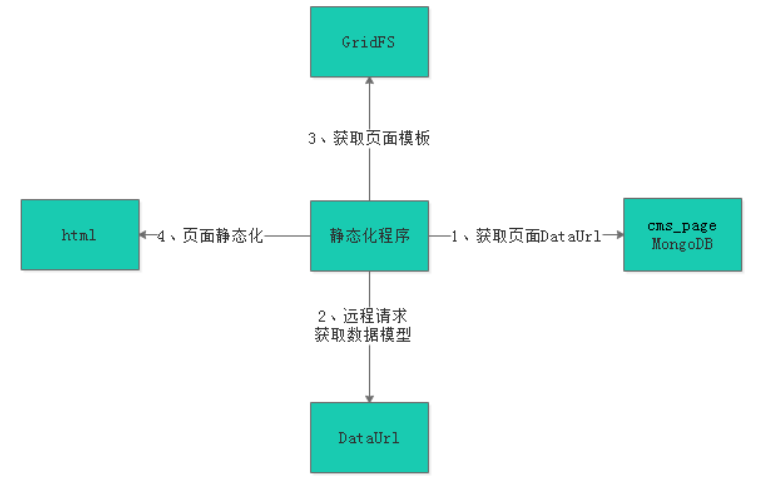
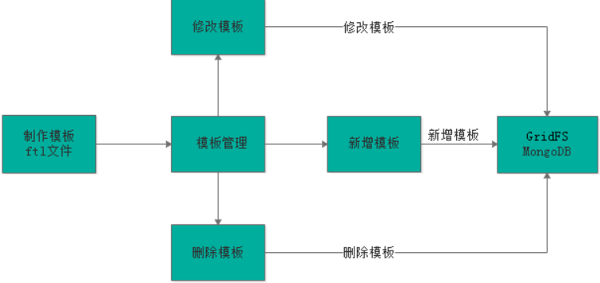

# 04 - 页面静态化

## 一 、Freemarker 

参考讲义及前面笔记！

## 二、cms页面静态化

### 2.1、页面静态化流程

​	通过上边对FreeMarker的研究我们得出：模板+数据模型=输出，页面静态化需要准备数据模型和模板，先知道数据模型的结构才可以编写模板，因为在模板中要引用数据模型中的数据，本节将系统讲解CMS页面数据模型获取、模板管理及静态化的过程。

##### 页面静态化流程如下图：

1、静态化程序首先读取页面获取DataUrl。
2、静态化程序远程请求DataUrl得到数据模型。
3、获取页面模板。
4、执行页面静态化。



如何获取页面的数据模型？

### 2.2、数据模型

在cms_Page 获取dataUrl字段

```
{ 
    "_id" : ObjectId("5aed94530e66185b64804c11"), 
    "_class" : "com.xuecheng.framework.domain.cms.CmsPage", 
    "siteId" : "5a751fab6abb5044e0d19ea1", 
    "pageName" : "preview_4028e581617f945f01617f9dabc40000.html", 
    "pageAliase" : "课程预览页面", 
    "pageWebPath" : "/coursepre/", 
    "pagePhysicalPath" : "F:\\\\develop\\\\xc_portal_static\\\\course\\\\preview\\\\", 
    "pageType" : "1", 
    "pageCreateTime" : ISODate("2018-05-05T11:24:03.619+0000"), 
    "templateId" : "5aec5dd70e661808240ab7a6", 
    "htmlFileId" : "5aed94530e66185b64804c12", 
    "dataUrl" : "http://localhost:40200/portalview/course/get/4028e581617f945f01617f9dabc40000"
}
```

这个dataUrl由负责该页面开发程序员提供；

通过这个url, 通过后台程序远程调用，获取模型数据。

- ##### 后台如何远程调用url呢？ 通过RestTemplate这个api即可远程调用；

  ```java
  @RequestMapping("/freemarker")
  @Controller
  public class FreemarkerController {
  
      @Autowired
      RestTemplate restTemplate;
  
      @RequestMapping("/banner")
      public String index_banner(Map<String, Object> map){
          //使用restTemplate请求轮播图的模型数据
          ResponseEntity<Map> forEntity = restTemplate.getForEntity("http://localhost:31001/cms/config/getmodel/5a791725dd573c3574ee334f", Map.class);
          Map body = forEntity.getBody();
          //设置模型数据
          map.putAll(body);
          return "index_banner";
      }
  }
  ```

- ##### 页面开发程序员，如何提供dataUrl？ 其实际是在cms-manage工程，提供一个api到cms_config 数据库去取数据模型： 主键_id 即是url最后的id值

  ```
  { 
      "_id" : ObjectId("5a791725dd573c3574ee333f"), 
      "_class" : "com.xuecheng.framework.domain.cms.CmsConfig", 
      "name" : "轮播图", 
      "model" : [
          {
              "key" : "banner1", 
              "name" : "轮播图1地址", 
              "value" : "http://192.168.101.64/group1/M00/00/01/wKhlQFp5wnCAG-kAAATMXxpSaMg864.png"
          }, 
          {
              "key" : "banner2", 
              "name" : "轮播图2地址", 
              "value" : "http://192.168.101.64/group1/M00/00/01/wKhlQVp5wqyALcrGAAGUeHA3nvU867.jpg"
          }, 
          {
              "key" : "banner3", 
              "name" : "轮播图3地址", 
              "value" : "http://192.168.101.64/group1/M00/00/01/wKhlQFp5wtWAWNY2AAIkOHlpWcs395.jpg"
          }
      ]
  }
  ```


### 2.3、  模板管理

#### 2.3.1、模板管理业务流程

##### CMS提供模板管理功能，业务流程如下：



（模板管理功能后台界面管理，课程讲义没有额外增加，其操作同页面管理，自行完成）

1、要增加新模板首先需要制作模板，模板的内容就是Freemarker ftl模板内容。
2、通过模板管理模块功能新增模板、修改模板、删除模板。
3、模板信息存储在MongoDB数据库，其中模板信息存储在cms_template集合中，模板文件存储在GridFS文件系
统中。

##### cms_template集合：

```
{ 
    "_id" : ObjectId("5a925be7b00ffc4b3c1578b5"), 
    "_class" : "com.xuecheng.framework.domain.cms.CmsTemplate", 
    "siteId" : "5a751fab6abb5044e0d19ea1", 
    "templateName" : "课程详情页面", 
    "templateParameter" : "courseid", 
    "templateFileId" : "5ad8a51f68db5240b42e5fea"
}
```

##### 最终模板信息保存在cms_template数据表中；

#### 2.3.2、第一步：创建模板 （页面原型+freemarker共同完成）

依据模型数据，使用freemarker语句，将页面原型的相应数据全部替换，即得到模板！

#### 2.3.3、第二步：将模板保存到GridFS

##### 1)  GridFS介绍

- GridFS是MongoDB提供的用于持久化存储文件的模块，CMS使用MongoDB存储数据，使用GridFS可以快速集成开发。

- 它的工作原理是：

  在GridFS存储文件是将文件分块存储，文件会按照256KB的大小分割成多个块进行存储，GridFS使用两个集合（collection）存储文件，一个集合是chunks, 用于存储文件的二进制数据；一个集合是files，用于存储文件的元数据信息（文件名称、块大小、上传时间等信息）。从GridFS中读取文件要对文件的各各块进行组装、合并。

详细参考：https://docs.mongodb.com/manual/core/gridfs/

