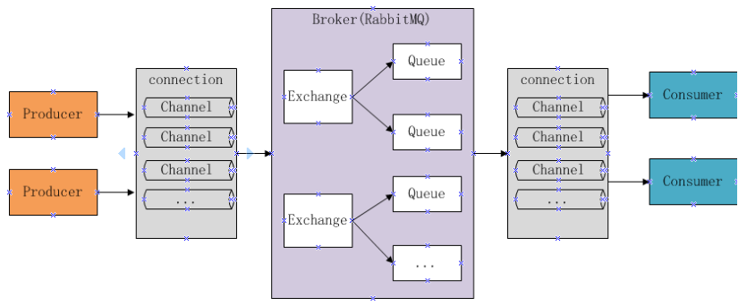
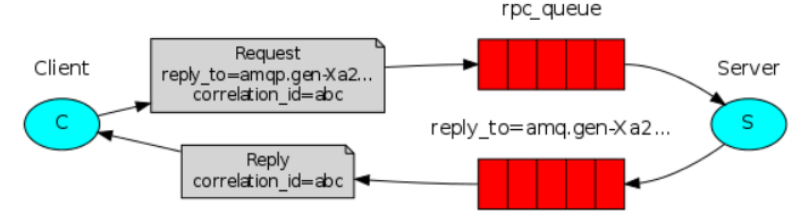

# 05 - RabbitMQ

## 一、RabbitMQ概述

### 1.1、RabbitMQ介绍

MQ全称为Message Queue，即消息队列， RabbitMQ是由erlang语言开发，基于AMQP（Advanced Message
Queue 高级消息队列协议）协议实现的消息队列，它是一种应用程序之间的通信方法，消息队列在分布式系统开
发中应用非常广泛。RabbitMQ官方地址：http://www.rabbitmq.com/

##### 开发中消息队列通常有如下应用场景：

1、任务异步处理。
将不需要同步处理的并且耗时长的操作由消息队列通知消息接收方进行异步处理。提高了应用程序的响应时间。
2、应用程序解耦合
MQ相当于一个中介，生产方通过MQ与消费方交互，它将应用程序进行解耦合。

##### 市场上还有哪些消息队列？

ActiveMQ，RabbitMQ，ZeroMQ，Kafka，MetaMQ，RocketMQ、Redis。

> 区别：ActiveMQ，RabbitMQ，ZeroMQ，Kafka、RocketMQ

##### 为什么使用RabbitMQ呢？

1、使得简单，功能强大。
2、基于AMQP协议。
3、社区活跃，文档完善。
4、高并发性能好，这主要得益于Erlang语言。
5、Spring Boot默认已集成RabbitMQ


### 1.2 、其它相关知识

- #### AMQP是什么 ？

```

```

- #### JMS是什么 ？

```

```

#### 总结：

JMS是java提供的一套消息服务API标准，其目的是为所有的java应用程序提供统一的消息通信的标准，类似java的
jdbc，只要遵循jms标准的应用程序之间都可以进行消息通信。它和AMQP有什么 不同，jms是java语言专属的消
息服务标准，它是在api层定义标准，并且只能用于java应用；而AMQP是在协议层定义的标准，是跨语言的 。


### 1.3、RabbitMQ 的工作原理



##### 组成部分说明如下：

- Broker ：消息队列服务进程，此进程包括两个部分：Exchange和Queue。
- Exchange ：消息队列交换机，按一定的规则将消息路由转发到某个队列，对消息进行过虑。
- Queue ：消息队列，存储消息的队列，消息到达队列并转发给指定的消费方。
- Producer ：消息生产者，即生产方客户端，生产方客户端将消息发送到MQ。
- Consumer ：消息消费者，即消费方客户端，接收MQ转发的消息。
- Connection：代表连接
- Channel：通道，即会话

在Producer, Consumer中都需要建立连接，开通道；

在对应模式下，还要Channel申明 exchange, 绑定Queue等信息；

##### 消息发布接收流程：

-----发送消息-----
1、生产者和Broker建立TCP连接。
2、生产者和Broker建立通道。
3、生产者通过通道消息发送给Broker，由Exchange将消息进行转发。
4、Exchange将消息转发到指定的Queue（队列）
----接收消息-----
1、消费者和Broker建立TCP连接
2、消费者和Broker建立通道
3、消费者监听指定的Queue（队列）
4、当有消息到达Queue时Broker默认将消息推送给消费者。
5、消费者接收到消息。


## 二、Rabbit下载安装

### 2.1、安装

RabbitMQ由Erlang语言开发，Erlang语言用于并发及分布式系统的开发，在电信领域应用广泛，OTP（Open
Telecom Platform）作为Erlang语言的一部分，包含了很多基于Erlang开发的中间件及工具库，安装RabbitMQ需
要安装Erlang/OTP，并保持版本匹配，如下图：
RabbitMQ的下载地址：http://www.rabbitmq.com/download.html

本项目使用Erlang/OTP 20.3版本和RabbitMQ3.7.3版本.

##### 1）下载erlang

地址如下：
http://erlang.org/download/otp_win64_20.3.exe
或去老师提供的软件包中找到 otp_win64_20.3.exe，以管理员方式运行此文件，安装。
erlang安装完成需要配置erlang环境变量： ERLANG_HOME=D:\Program Files\erl9.3 在path中添
加%ERLANG_HOME%\bin;

##### 2）安装RabbitMQ

https://github.com/rabbitmq/rabbitmq-server/releases/tag/v3.7.3
或去老师提供的软件包中找到 rabbitmq-server-3.7.3.exe，以管理员方式运行此文件，安装。

### 2.2、启动

安装成功后会自动创建RabbitMQ服务并且启动。

##### 1）从开始菜单启动RabbitMQ

完成在开始菜单找到RabbitMQ的菜单：

RabbitMQ Service-install :安装服务
RabbitMQ Service-remove 删除服务
RabbitMQ Service-start 启动
RabbitMQ Service-stop 启动

##### 2）安装并运行服务： 若没有上面的菜单

rabbitmq-service.bat install 安装服务 rabbitmq-service.bat stop 停止服务 rabbitmq-service.bat start 启动服务

##### 3）安装管理插件：用于管理RabbitMQ

安装rabbitMQ的管理插件，方便在浏览器端管理RabbitMQ
管理员身份运行 rabbitmq-plugins.bat enable rabbitmq_management

>##### 若安装插件后，无效！需要重启RabbitMQ!

##### 4)  启动成功 登录RabbitMQ

进入浏览器，输入：http://localhost:15672

账号：guest  密码：guest


## 三、快速入门

- 创建生产者工程和消费者工程，分别加入RabbitMQ java client的依赖。

```xml
<dependencies>
    <dependency>
        <groupId>com.rabbitmq</groupId>
        <artifactId>amqp-client</artifactId>
        <version>4.0.3</version><!--此版本与spring boot 1.5.9版本匹配-->
    </dependency>

    <dependency>
        <groupId>org.springframework.boot</groupId>
        <artifactId>spring-boot-starter-logging</artifactId>
    </dependency>
</dependencies>
```

- test-rabbitmq-producer：生产者工程

```java
public class Producer01 {

    //队列
    private static final String QUEUE = "helloworld";

    public static void main(String[] args) {
        //通过连接工厂创建新的连接和mq建立连接
        ConnectionFactory connectionFactory = new ConnectionFactory();
        connectionFactory.setHost("127.0.0.1");
        connectionFactory.setPort(5672);//端口
        connectionFactory.setUsername("guest");
        connectionFactory.setPassword("guest");
        //设置虚拟机，一个mq服务可以设置多个虚拟机，每个虚拟机就相当于一个独立的mq
        connectionFactory.setVirtualHost("/");

        Connection connection = null;
        Channel channel = null;
        try {
            //建立新连接
            connection = connectionFactory.newConnection();
            //创建会话通道,生产者和mq服务所有通信都在channel通道中完成
            channel = connection.createChannel();
            //声明队列，如果队列在mq 中没有则要创建
            //参数：String queue, boolean durable, boolean exclusive, boolean autoDelete, Map<String, Object> arguments
            /**
             * 参数明细
             * 1、queue 队列名称
             * 2、durable 是否持久化，如果持久化，mq重启后队列还在
             * 3、exclusive 是否独占连接，队列只允许在该连接中访问，如果connection连接关闭队列则自动删除,如果将此参数设置true可用于临时队列的创建
             * 4、autoDelete 自动删除，队列不再使用时是否自动删除此队列，如果将此参数和exclusive参数设置为true就可以实现临时队列（队列不用了就自动删除）
             * 5、arguments 参数，可以设置一个队列的扩展参数，比如：可设置存活时间
             */
            channel.queueDeclare(QUEUE,true,false,false,null);
            //发送消息
            //参数：String exchange, String routingKey, BasicProperties props, byte[] body
            /**
             * 参数明细：
             * 1、exchange，交换机，如果不指定将使用mq的默认交换机（设置为""）
             * 2、routingKey，路由key，交换机根据路由key来将消息转发到指定的队列，如果使用默认交换机，routingKey设置为队列的名称
             * 3、props，消息的属性
             * 4、body，消息内容
             */
            //消息内容
            String message = "hello world 黑马程序员";
            channel.basicPublish("",QUEUE,null,message.getBytes());
            System.out.println("send to mq "+message);
        } catch (Exception e) {
            e.printStackTrace();
        } finally {
            //关闭连接
            //先关闭通道
            try {
                assert channel != null;
                channel.close();
            } catch (IOException | TimeoutException e) {
                e.printStackTrace();
            }
            try {
                connection.close();
            } catch (IOException e) {
                e.printStackTrace();
            }
        }
    }
}
```

- test-rabbitmq-consumer：消费者工程

```java
public class Consumer01 {

    //队列
    private static final String QUEUE = "helloworld";

    public static void main(String[] args) throws IOException, TimeoutException {
        //通过连接工厂创建新的连接和mq建立连接
        ConnectionFactory connectionFactory = new ConnectionFactory();
        connectionFactory.setHost("127.0.0.1");
        connectionFactory.setPort(5672);//端口
        connectionFactory.setUsername("guest");
        connectionFactory.setPassword("guest");
        //设置虚拟机，一个mq服务可以设置多个虚拟机，每个虚拟机就相当于一个独立的mq
        connectionFactory.setVirtualHost("/");

        //建立新连接
        Connection connection = connectionFactory.newConnection();
        //创建会话通道,生产者和mq服务所有通信都在channel通道中完成
        Channel channel = connection.createChannel();

        //监听队列
        //声明队列，如果队列在mq 中没有则要创建
        //参数：String queue, boolean durable, boolean exclusive, boolean autoDelete, Map<String, Object> arguments
        /**
         * 参数明细
         * 1、queue 队列名称
         * 2、durable 是否持久化，如果持久化，mq重启后队列还在
         * 3、exclusive 是否独占连接，队列只允许在该连接中访问，如果connection连接关闭队列则自动删除,如果将此参数设置true可用于临时队列的创建
         * 4、autoDelete 自动删除，队列不再使用时是否自动删除此队列，如果将此参数和exclusive参数设置为true就可以实现临时队列（队列不用了就自动删除）
         * 5、arguments 参数，可以设置一个队列的扩展参数，比如：可设置存活时间
         */
        channel.queueDeclare(QUEUE,true,false,false,null);

        //实现消费方法
        DefaultConsumer defaultConsumer = new DefaultConsumer(channel){

            /**
             * 111 当接收到消息后此方法将被调用 111
             * @param consumerTag  消费者标签，用来标识消费者的，在监听队列时设置channel.basicConsume 222
             * @param envelope 信封，通过envelope
             * @param properties 消息属性
             * @param body 消息内容
             */
            @Override
            public void handleDelivery(String consumerTag, Envelope envelope, AMQP.BasicProperties properties, byte[] body) throws IOException {
                //消息id，mq在channel中用来标识消息的id，可用于确认消息已接收
                long deliveryTag1 = envelope.getDeliveryTag();
                //交换机
                String exchange1 = envelope.getExchange();

                //消息内容
                String message= new String(body,"utf-8");
                System.out.println("receive message:"+message);
            }
        };

        //监听队列
        //参数：String queue, boolean autoAck, Consumer callback
        /**
         * 参数明细：
         * 1、queue 队列名称
         * 2、autoAck 自动回复，当消费者接收到消息后要告诉mq消息已接收，如果将此参数设置为tru表示会自动回复mq，如果设置为false要通过编程实现回复
         * 3、callback，消费方法，当消费者接收到消息要执行的方法
         */
        channel.basicConsume(QUEUE,true,defaultConsumer);
    }
}
```


## 四、工作模式

RabbitMQ有以下几种工作模式 ：
1、Work queues
2、Publish/Subscribe
3、Routing
4、Topics
5、Header
6、RPC

### 4.1、Work queues： 工作队列模式

结果：
1、一条消息只会被一个消费者接收；
2、rabbit采用轮询的方式将消息是平均发送给消费者的；
3、消费者在处理完某条消息后，才会收到下一条消息。

### 4.2、Publish/subscribe： 发布订阅模式：

1、每个消费者监听自己的队列。
2、生产者将消息发给broker，由交换机将消息转发到绑定此交换机的每个队列，每个绑定交换机的队列都将接收
到消息

```java
public class Producer02_publish {
    //队列名称
    private static final String QUEUE_INFORM_EMAIL = "queue_inform_email";
    private static final String QUEUE_INFORM_SMS = "queue_inform_sms";
    private static final String EXCHANGE_FANOUT_INFORM="exchange_fanout_inform";

    public static void main(String[] args) {
        //通过连接工厂创建新的连接和mq建立连接
        ConnectionFactory connectionFactory = new ConnectionFactory();
        connectionFactory.setHost("127.0.0.1");
        connectionFactory.setPort(5672);//端口
        connectionFactory.setUsername("guest");
        connectionFactory.setPassword("guest");
        //设置虚拟机，一个mq服务可以设置多个虚拟机，每个虚拟机就相当于一个独立的mq
        connectionFactory.setVirtualHost("/");

        Connection connection = null;
        Channel channel = null;
        try {
            //建立新连接
            connection = connectionFactory.newConnection();
            //创建会话通道,生产者和mq服务所有通信都在channel通道中完成
            channel = connection.createChannel();
            //声明队列，如果队列在mq 中没有则要创建
            //参数：String queue, boolean durable, boolean exclusive, boolean autoDelete, Map<String, Object> arguments
            /**
             * 参数明细
             * 1、queue 队列名称
             * 2、durable 是否持久化，如果持久化，mq重启后队列还在
             * 3、exclusive 是否独占连接，队列只允许在该连接中访问，如果connection连接关闭队列则自动删除,如果将此参数设置true可用于临时队列的创建
             * 4、autoDelete 自动删除，队列不再使用时是否自动删除此队列，如果将此参数和exclusive参数设置为true就可以实现临时队列（队列不用了就自动删除）
             * 5、arguments 参数，可以设置一个队列的扩展参数，比如：可设置存活时间
             */
            channel.queueDeclare(QUEUE_INFORM_EMAIL,true,false,false,null);
            channel.queueDeclare(QUEUE_INFORM_SMS,true,false,false,null);
            //声明一个交换机
            //参数：String exchange, String type
            /**
             * 参数明细：
             * param1、交换机的名称
             * param2、交换机的类型
             * fanout：对应的rabbitmq的工作模式是 publish/subscribe
             * direct：对应的Routing	工作模式
             * topic：对应的Topics工作模式
             * headers： 对应的headers工作模式
             */
            channel.exchangeDeclare(EXCHANGE_FANOUT_INFORM, BuiltinExchangeType.FANOUT);
            //进行交换机和队列绑定
            //参数：String queue, String exchange, String routingKey
            /**
             * 参数明细：
             * 1、queue 队列名称
             * 2、exchange 交换机名称
             * 3、routingKey 路由key，作用是交换机根据路由key的值将消息转发到指定的队列中，在发布订阅模式中调协为空字符串
             */
            channel.queueBind(QUEUE_INFORM_EMAIL,EXCHANGE_FANOUT_INFORM,"");
            channel.queueBind(QUEUE_INFORM_SMS,EXCHANGE_FANOUT_INFORM,"");
            //发送消息
            //参数：String exchange, String routingKey, BasicProperties props, byte[] body
            /**
             * 参数明细：
             * 1、exchange，交换机，如果不指定将使用mq的默认交换机（设置为""）
             * 2、routingKey，路由key，交换机根据路由key来将消息转发到指定的队列，如果使用默认交换机，routingKey设置为队列的名称
             * 3、props，消息的属性
             * 4、body，消息内容
             */
            for(int i=0;i<5;i++){
                //消息内容
                String message = "send inform message to user";
                channel.basicPublish(EXCHANGE_FANOUT_INFORM,"",null,message.getBytes());
                System.out.println("send to mq "+message);
            }

        } catch (Exception e) {
            e.printStackTrace();
        } finally {
            //关闭连接
            //先关闭通道
            try {
                channel.close();
            } catch (IOException e) {
                e.printStackTrace();
            } catch (TimeoutException e) {
                e.printStackTrace();
            }
            try {
                connection.close();
            } catch (IOException e) {
                e.printStackTrace();
            }
        }
    }
}
```

```java
public class Consumer02_subscribe_email {
    //队列名称
    private static final String QUEUE_INFORM_EMAIL = "queue_inform_email";
    private static final String EXCHANGE_FANOUT_INFORM="exchange_fanout_inform";


    public static void main(String[] args) throws IOException, TimeoutException {
        //通过连接工厂创建新的连接和mq建立连接
        ConnectionFactory connectionFactory = new ConnectionFactory();
        connectionFactory.setHost("127.0.0.1");
        connectionFactory.setPort(5672);//端口
        connectionFactory.setUsername("guest");
        connectionFactory.setPassword("guest");
        //设置虚拟机，一个mq服务可以设置多个虚拟机，每个虚拟机就相当于一个独立的mq
        connectionFactory.setVirtualHost("/");

        //建立新连接
        Connection connection = connectionFactory.newConnection();
        //创建会话通道,生产者和mq服务所有通信都在channel通道中完成
        Channel channel = connection.createChannel();

        /**
         * 参数明细
         * 1、queue 队列名称
         * 2、durable 是否持久化，如果持久化，mq重启后队列还在
         * 3、exclusive 是否独占连接，队列只允许在该连接中访问，如果connection连接关闭队列则自动删除,如果将此参数设置true可用于临时队列的创建
         * 4、autoDelete 自动删除，队列不再使用时是否自动删除此队列，如果将此参数和exclusive参数设置为true就可以实现临时队列（队列不用了就自动删除）
         * 5、arguments 参数，可以设置一个队列的扩展参数，比如：可设置存活时间
         */
        channel.queueDeclare(QUEUE_INFORM_EMAIL,true,false,false,null);
        //声明一个交换机
        //参数：String exchange, String type
        /**
         * 参数明细：
         * 1、交换机的名称
         * 2、交换机的类型
         * fanout：对应的rabbitmq的工作模式是 publish/subscribe
         * direct：对应的Routing	工作模式
         * topic：对应的Topics工作模式
         * headers： 对应的headers工作模式
         */
        channel.exchangeDeclare(EXCHANGE_FANOUT_INFORM, BuiltinExchangeType.FANOUT);
        //进行交换机和队列绑定
        //参数：String queue, String exchange, String routingKey
        /**
         * 参数明细：
         * 1、queue 队列名称
         * 2、exchange 交换机名称
         * 3、routingKey 路由key，作用是交换机根据路由key的值将消息转发到指定的队列中，在发布订阅模式中调协为空字符串
         */
        channel.queueBind(QUEUE_INFORM_EMAIL, EXCHANGE_FANOUT_INFORM, "");

        //实现消费方法
        DefaultConsumer defaultConsumer = new DefaultConsumer(channel){

            /**
             * 当接收到消息后此方法将被调用
             * @param consumerTag  消费者标签，用来标识消费者的，在监听队列时设置channel.basicConsume
             * @param envelope 信封，通过envelope
             * @param properties 消息属性
             * @param body 消息内容
             * @throws IOException
             */
            @Override
            public void handleDelivery(String consumerTag, Envelope envelope, AMQP.BasicProperties properties, byte[] body) throws IOException {
                //交换机
                String exchange = envelope.getExchange();
                //消息id，mq在channel中用来标识消息的id，可用于确认消息已接收
                long deliveryTag = envelope.getDeliveryTag();
                //消息内容
                String message= new String(body,"utf-8");
                System.out.println("receive message:"+message);
            }
        };

        //监听队列
        //参数：String queue, boolean autoAck, Consumer callback
        /**
         * 参数明细：
         * 1、queue 队列名称
         * 2、autoAck 自动回复，当消费者接收到消息后要告诉mq消息已接收，如果将此参数设置为tru表示会自动回复mq，如果设置为false要通过编程实现回复
         * 3、callback，消费方法，当消费者接收到消息要执行的方法
         */
        channel.basicConsume(QUEUE_INFORM_EMAIL,true,defaultConsumer);

    }
}
```

### 4.3、 Routing： 路由模式

包含了发布订阅模式！

1、每个消费者监听自己的队列，并且设置routingkey。
2、生产者将消息发给交换机，由交换机根据routingkey来转发消息到指定的队列。

```java
public class Producer03_routing {
    //队列名称
    private static final String QUEUE_INFORM_EMAIL = "queue_inform_email";
    private static final String QUEUE_INFORM_SMS = "queue_inform_sms";
    private static final String EXCHANGE_ROUTING_INFORM="exchange_routing_inform";
    private static final String ROUTINGKEY_EMAIL="inform_email";
    private static final String ROUTINGKEY_SMS="inform_sms";
    public static void main(String[] args) {
        //通过连接工厂创建新的连接和mq建立连接
        ConnectionFactory connectionFactory = new ConnectionFactory();
        connectionFactory.setHost("127.0.0.1");
        connectionFactory.setPort(5672);//端口
        connectionFactory.setUsername("guest");
        connectionFactory.setPassword("guest");
        //设置虚拟机，一个mq服务可以设置多个虚拟机，每个虚拟机就相当于一个独立的mq
        connectionFactory.setVirtualHost("/");

        Connection connection = null;
        Channel channel = null;
        try {
            //建立新连接
            connection = connectionFactory.newConnection();
            //创建会话通道,生产者和mq服务所有通信都在channel通道中完成
            channel = connection.createChannel();
            //声明队列，如果队列在mq 中没有则要创建
            //参数：String queue, boolean durable, boolean exclusive, boolean autoDelete, Map<String, Object> arguments
            /**
             * 参数明细
             * 1、queue 队列名称
             * 2、durable 是否持久化，如果持久化，mq重启后队列还在
             * 3、exclusive 是否独占连接，队列只允许在该连接中访问，如果connection连接关闭队列则自动删除,如果将此参数设置true可用于临时队列的创建
             * 4、autoDelete 自动删除，队列不再使用时是否自动删除此队列，如果将此参数和exclusive参数设置为true就可以实现临时队列（队列不用了就自动删除）
             * 5、arguments 参数，可以设置一个队列的扩展参数，比如：可设置存活时间
             */
            channel.queueDeclare(QUEUE_INFORM_EMAIL,true,false,false,null);
            channel.queueDeclare(QUEUE_INFORM_SMS,true,false,false,null);
            //声明一个交换机
            //参数：String exchange, String type
            /**
             * 参数明细：
             * 1、交换机的名称
             * 2、交换机的类型
             * fanout：对应的rabbitmq的工作模式是 publish/subscribe
             * direct：对应的Routing	工作模式
             * topic：对应的Topics工作模式
             * headers： 对应的headers工作模式
             */
            channel.exchangeDeclare(EXCHANGE_ROUTING_INFORM, BuiltinExchangeType.DIRECT);
            //进行交换机和队列绑定
            //参数：String queue, String exchange, String routingKey
            /**
             * 参数明细：
             * 1、queue 队列名称
             * 2、exchange 交换机名称
             * 3、routingKey 路由key，作用是交换机根据路由key的值将消息转发到指定的队列中，在发布订阅模式中调协为空字符串
             */
            channel.queueBind(QUEUE_INFORM_EMAIL,EXCHANGE_ROUTING_INFORM,ROUTINGKEY_EMAIL);
            channel.queueBind(QUEUE_INFORM_EMAIL,EXCHANGE_ROUTING_INFORM,"inform");
            channel.queueBind(QUEUE_INFORM_SMS,EXCHANGE_ROUTING_INFORM,ROUTINGKEY_SMS);
            channel.queueBind(QUEUE_INFORM_SMS,EXCHANGE_ROUTING_INFORM,"inform");
            //发送消息
            //参数：String exchange, String routingKey, BasicProperties props, byte[] body
            /**
             * 参数明细：
             * 1、exchange，交换机，如果不指定将使用mq的默认交换机（设置为""）
             * 2、routingKey，路由key，交换机根据路由key来将消息转发到指定的队列，如果使用默认交换机，routingKey设置为队列的名称
             * 3、props，消息的属性
             * 4、body，消息内容
             */
           /* for(int i=0;i<5;i++){
                //发送消息的时候指定routingKey
                String message = "send email inform message to user";
                channel.basicPublish(EXCHANGE_ROUTING_INFORM,ROUTINGKEY_EMAIL,null,message.getBytes());
                System.out.println("send to mq "+message);
            }
            for(int i=0;i<5;i++){
                //发送消息的时候指定routingKey
                String message = "send sms inform message to user";
                channel.basicPublish(EXCHANGE_ROUTING_INFORM,ROUTINGKEY_SMS,null,message.getBytes());
                System.out.println("send to mq "+message);
            }*/
            for(int i=0;i<5;i++){
                //发送消息的时候指定routingKey
                String message = "send inform message to user";
                channel.basicPublish(EXCHANGE_ROUTING_INFORM,"inform",null,message.getBytes());
                System.out.println("send to mq "+message);
            }

        } catch (Exception e) {
            e.printStackTrace();
        } finally {
            //关闭连接
            //先关闭通道
            try {
                channel.close();
            } catch (IOException e) {
                e.printStackTrace();
            } catch (TimeoutException e) {
                e.printStackTrace();
            }
            try {
                connection.close();
            } catch (IOException e) {
                e.printStackTrace();
            }
        }
    }
}
```

### 4.4 、Topics： 通配符模式

类似routing模式，routing是指定routingKey. 而通配符 就是一个泛指的routingKey. 即一个通配符routingKey，将对应多个queue. 

```java
private static final String QUEUE_INFORM_EMAIL = "queue_inform_email";
private static final String QUEUE_INFORM_SMS = "queue_inform_sms";
private static final String EXCHANGE_TOPICS_INFORM="exchange_topics_inform";

// inform.email  匹配接收邮件
private static final String ROUTINGKEY_EMAIL="inform.#.email.#";
// inform.sms  匹配接收短信
private static final String ROUTINGKEY_SMS="inform.#.sms.#";
//  inform.email.sms 匹配接收邮件短信 （两者都匹配）
```


###  4.5、Header 模式

header模式与routing不同的地方在于，header模式取消routingkey，使用header中的 key/value（键值对）匹配
队列。

##### 案例：

根据用户的通知设置去通知用户，设置接收Email的用户只接收Email，设置接收sms的用户只接收sms，设置两种
通知类型都接收的则两种通知都有效。

- ##### 绑定队列：不在需要routingKey

```java
Map<String, Object> headers_email = new Hashtable<String, Object>();
headers_email.put("inform_type", "email");
Map<String, Object> headers_sms = new Hashtable<String, Object>();
headers_sms.put("inform_type", "sms");
channel.queueBind(QUEUE_INFORM_EMAIL,EXCHANGE_HEADERS_INFORM,"",headers_email);
channel.queueBind(QUEUE_INFORM_SMS,EXCHANGE_HEADERS_INFORM,"",headers_sms);
```

- ##### 发通知

```
String message = "email inform to user"+i;
Map<String,Object> headers =  new Hashtable<String, Object>();
headers.put("inform_type", "email");//匹配email通知消费者绑定的header
//headers.put("inform_type", "sms");//匹配sms通知消费者绑定的header
AMQP.BasicProperties.Builder properties = new AMQP.BasicProperties.Builder();
properties.headers(headers);
//Email通知
channel.basicPublish(EXCHANGE_HEADERS_INFORM, "", properties.build(), message.getBytes())
```


### 4.6、 RPC

RPC即客户端远程调用服务端的方法 ，使用MQ可以实现RPC的异步调用，基于Direct交换机实现，流程如下：
1、客户端即是生产者就是消费者，向RPC请求队列发送RPC调用消息，同时监听RPC响应队列。
2、服务端监听RPC请求队列的消息，收到消息后执行服务端的方法，得到方法返回的结果
3、服务端将RPC方法 的结果发送到RPC响应队列
4、客户端（RPC调用方）监听RPC响应队列，接收到RPC调用结果。




## 五、Springboot 集成RabbitMQ (重点)


