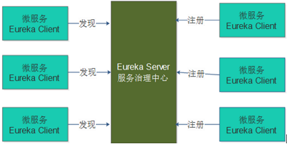
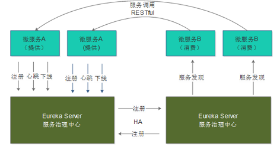
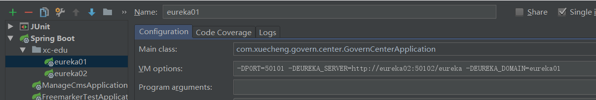
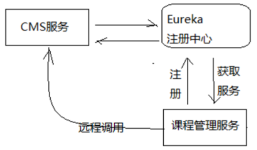
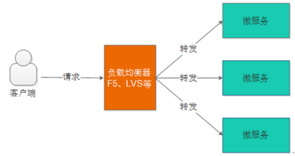
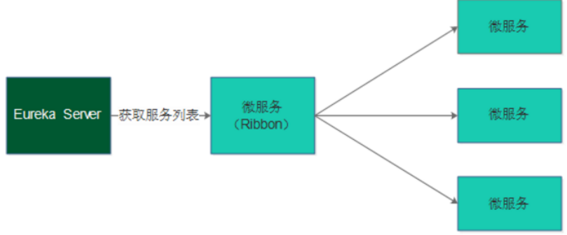

# 09 - 课程预览 Eureka Feign

## 一、 Eureka 注册中心

### 1.1 需求分析

- 后端服务是由多个微服务组成，但是我们有时需要微服务间相互调用。 如何实现微服务相互调用呢？
- 前面设计，每个微服务都对外暴露了api接口。 我们直接调用对应接口即可，但是前提是需要对应微服务的ip。
- 按传统方式，微服务间相互配置被调用者的ip即可，但是此方式繁琐，不利于维护。 同时，当集群搭建时，又如何确定对应ip下的微服务是否存活呢？ 

#### 这一系列问题，该如何解决？

在电商项目一章，我们使用zookeeper来管理服务提供者。 由此在这里也类似，由于是spring-boot微服务项目，spring有一个spring-cloud框架专业为微服务提供各种技术解决方案。 

- ##### spring-cloud Eureka （ 注册中心） 就是本次问题的解决方案者。

  在前后端分离架构中，服务层被拆分成了很多的微服务，微服务的信息如何管理？Spring Cloud中提供服务注册中心来管理微服务信息。

  为什么 要用注册中心？

  1、微服务数量众多，要进行远程调用就需要知道服务端的ip地址和端口，注册中心帮助我们管理这些服务的ip和端口。

  2、微服务会实时上报自己的状态，注册中心统一管理这些微服务的状态，将存在问题的服务踢出服务列表，客户端获取到可用的服务进行调用。


### 1.2、Eureka介绍

Spring Cloud Eureka 是对Netflix公司的Eureka的二次封装，它实现了服务治理的功能，Spring Cloud Eureka提
供服务端与客户端，服务端即是Eureka服务注册中心，客户端完成微服务向Eureka服务的注册与发现。服务端和
客户端均采用Java语言编写。下图显示了Eureka Server与Eureka Client的关系：




1、Eureka Server是服务端，负责管理各各微服务结点的信息和状态。

2 、在微服务上部署Eureka Client程序，远程访问Eureka Server将自己注册在Eureka Server。

3、微服务需要调用另一个微服务时从Eureka Server中获取服务调用地址，进行远程调用。


### 1.3、Eureka Server搭建

##### 依赖

```xml
<dependencies>
    <!‐‐ 导入Eureka服务的依赖 ‐‐>
    <dependency>
         <groupId>org.springframework.cloud</groupId>
         <artifactId>spring‐cloud‐starter‐netflix‐eureka‐server</artifactId>
    </dependency>
</dependencies>
```

分单机，高可用两种方式！

#### 1.3.1、单机搭建 （了解）

##### application.yml

```yaml
server:
  port: 50101  #服务端口
spring:
  application:
    name: xc-govern-center #指定服务名
eureka:
  client:
    registerWithEureka: false #服务注册，是否将自己注册到Eureka服务中  ,单机环境false
    fetchRegistry: false #服务发现，是否从Eureka中获取注册信息  ,单机环境false
    serviceUrl: #Eureka客户端与Eureka服务端的交互地址，高可用状态配置对方的地址，单机状态配置自己（如果不配置则默认本机8761端口）
      defaultZone: http://localhost:50101/eureka/
  server:
    enable-self-preservation: false #是否开启自我保护模式
    eviction-interval-timer-in-ms: 60000 #服务注册表清理间隔(清除没有上报心跳服务)（单位毫秒，默认是60*1000）
```

##### 启动类 : 除了@SpringBootApplication， 还需@EnableEurekaServer标注是一个Eureka

```java
@EnableEurekaServer //标识此工程是一个EurekaServer
@SpringBootApplication
public class GovernCenterApplication {
    public static void main(String[] args) {
        SpringApplication.run(GovernCenterApplication.class,args);
    }
}
```

> ##### 启动后，查看spring-Eureka
>
> ```shell
> 界面红色提示信息：
> THE SELF PRESERVATION MODE IS TURNED OFF.THIS MAY NOT PROTECT INSTANCE EXPIRY IN CASE OF
> NETWORK/OTHER PROBLEMS.
> 自我保护模式被关闭。在网络或其他问题的情况下可能不会保护实例失效。
> ```
>
> Eureka Server有一种自我保护模式，当微服务不再向Eureka Server上报状态，Eureka Server会从服务列表将此服务删除，如果出现网络异常情况（微服务正常），此时Eureka server进入自保护模式，不再将微服务从服务列表删除。
> 在开发阶段建议关闭自保护模式。


#### 1.3.2、高可用方式

Eureka Server 高可用环境需要部署两个Eureka server，它们互相向对方注册。如果在本机启动两个Eureka需要
注意两个Eureka Server的端口要设置不一样，这里我们部署一个Eureka Server工程，将端口可配置，制作两个
Eureka Server启动脚本，启动不同的端口，如下图：



1、在实际使用时Eureka Server至少部署两台服务器，实现高可用。
2、两台Eureka Server互相注册。
3、微服务需要连接两台Eureka Server注册，当其中一台Eureka死掉也不会影响服务的注册与发现。
4、微服务会定时向Eureka server发送心跳，报告自己的状态。
5、微服务从注册中心获取服务地址以RESTful方式发起远程调用。


- 本机同时配置两台Eureka-server，需要修改 本机的host文件

  ```
  # 打开 windows/system32/driver/etc/host
  127.0.0.1 eureka01
  127.0.0.1 eureka02
  ```

- idea同时开启两个同一工程，并传参数 （传参数实际是在vm option设置即可！）

  

  ```shell
  # eureka01
  -DPORT=50101 -DEUREKA_SERVER=http://eureka02:50102/eureka -DEUREKA_DOMAIN=eureka01
  
  # eureka02
  -DPORT=50102 -DEUREKA_SERVER=http://eureka01:50101/eureka -DEUREKA_DOMAIN=eureka02
  ```

- application.yml

  ```yaml
  server:
    port: ${PORT:50101} #服务端口
  spring:
    application:
      name: xc-govern-center #指定服务名
  eureka:
    client:
      registerWithEureka: true #服务注册，是否将自己注册到Eureka服务中  ,单机环境false
      fetchRegistry: true #服务发现，是否从Eureka中获取注册信息  ,单机环境false
      serviceUrl: # 配置上报Eureka服务地址,高可用状态配置对方的地址，单机状态配置自己（如果不配置则默认本机8761端口）
        defaultZone: ${EUREKA_SERVER:http://eureka02:50102/eureka/}
    server:
      enable-self-preservation: false #是否开启自我保护模式
      eviction-interval-timer-in-ms: 60000 #服务注册表清理间隔(清除没有上报心跳服务)（单位毫秒，默认是60*1000）
    instance:
      hostname: ${EUREKA_DOMAIN:eureka01}
  ```

  

### 1.4、服务注册：即开启eureka客户端

这个服务注册，相当于是在各个微服务设置eureka-client。

##### application.yml 添加如下：

```yaml
eureka:
  client:
    registerWithEureka: true #服务注册开关
    fetchRegistry: true #服务发现开关
    serviceUrl: #Eureka客户端与Eureka服务端进行交互的地址，多个中间用逗号分隔
      defaultZone: ${EUREKA_SERVER:http://localhost:50101/eureka/,http://localhost:50102/eureka/}
  instance:
    prefer-ip-address:  true  #将自己的ip地址注册到Eureka服务中
    ip-address: ${IP_ADDRESS:127.0.0.1}
    instance-id: ${spring.application.name}:${server.port} #指定实例id
```

##### 当然依赖添加：导入eureka-client

```xml
<!-- 导入Eureka客户端的依赖 -->
<dependency>
    <groupId>org.springframework.cloud</groupId>
    <artifactId>spring-cloud-starter-netflix-eureka-client</artifactId>
</dependency>
```

##### 启动类：添加@EnableDiscoveryClient 要能被发现

```java
@EnableDiscoveryClient
@SpringBootApplication
@EntityScan("com.xuecheng.framework.domain.cms")//扫描实体类
@ComponentScan(basePackages={"com.xuecheng.api"})//扫描接口
@ComponentScan(basePackages={"com.xuecheng.framework"})//扫描common的所有类
@ComponentScan(basePackages={"com.xuecheng.manage_cms"})//扫描本项目下的所有类
public class ManageCmsApplication {
    public static void main(String[] args) {
        SpringApplication.run(ManageCmsApplication.class,args);
    }

    @Bean
    public RestTemplate restTemplate() {
        return new RestTemplate(new OkHttp3ClientHttpRequestFactory());
    }
}
```

> ###### 在这里，也可以像配置eureka-server一样在idea vm options设置参数，同时开启cms 两个微服务。然后在后面的远程调用，看到Ribbon的客户端负载均衡作用；


## 二、Feign 远程调用

在前后端分离架构中，服务层被拆分成了很多的微服务，服务与服务之间难免发生交互，比如：课程发布需要调用
CMS服务生成课程静态化页面，本节研究微服务远程调用所使用的技术。

下图是课程管理服务远程调用CMS服务的流程图：



### 2.1 Ribbon

Ribbon是Netflix公司开源的一个负载均衡的项目（https://github.com/Netflix/ribbon），它是一个基于 HTTP、
TCP的客户端负载均衡器。

(这里的客户端负载均衡也是一个相对概念，因为这里的客户端就是一个服务。微服务作为客户端！)

#### - 1、什么是负载均衡？

负载均衡是微服务架构中必须使用的技术，通过负载均衡来实现系统的高可用、集群扩容等功能。负载均衡可通过
硬件设备及软件来实现，硬件比如：F5、Array等，软件比如：LVS、Nginx等。



#### - 2、什么是客户端负载均衡？

上图是服务端负载均衡，客户端负载均衡与服务端负载均衡的区别在于客户端要维护一份服务列表，Ribbon从
Eureka Server获取服务列表，Ribbon根据负载均衡算法直接请求到具体的微服务，中间省去了负载均衡服务。

##### 也就是说，微服务这个客户端本身就起到了一个负载均衡作用！



#### -  3、Ribbon测试

Spring Cloud引入Ribbon配合 restTemplate 实现客户端负载均衡。Java中远程调用的技术有很多，如：
webservice、socket、rmi、Apache HttpClient、OkHttp等，互联网项目使用基于http的客户端较多，本项目使
用OkHttp。

- ##### 依赖

```xml
<dependency>
    <groupId>org.springframework.cloud</groupId>
    <artifactId>spring‐cloud‐starter‐ribbon</artifactId>
</dependency>
<dependency>
    <groupId>com.squareup.okhttp3</groupId>
    <artifactId>okhttp</artifactId>
</dependency>
```

- ##### ribbon配置

```yaml
ribbon:
  MaxAutoRetries: 2 #最大重试次数，当Eureka中可以找到服务，但是服务连不上时将会重试
  MaxAutoRetriesNextServer: 3 #切换实例的重试次数
  OkToRetryOnAllOperations: false  #对所有操作请求都进行重试，如果是get则可以，如果是post，put等操作
没有实现幂等的情况下是很危险的,所以设置为false
  ConnectTimeout: 5000  #请求连接的超时时间
  ReadTimeout: 6000 #请求处理的超时时间
```

> ##### 上面的设置：idea会报 Cannot resolve configuration property 'ribbon.ReadTimeout。
>
> 解答： ribbon 根本没有了这些属性！ 那会去替代 ribbon重连呢？ spring-retry???
>
> 问题待解决！ **不是所有的属性 idea都会有提示，只要配置就好了！**
>
> https://www.jb51.net/article/152173.htm


- ##### RestTemplate : 需要配置@LoadBalanced 才能实现负载均衡

```java
@Bean
@LoadBalanced
public RestTemplate restTemplate() {
    return new RestTemplate(new OkHttp3ClientHttpRequestFactory());
}

//负载均衡调用
@Test
public void testRibbon() {
    //服务id
    String serviceId = "XC‐SERVICE‐MANAGE‐CMS";
    for(int i=0;i<10;i++){
        //通过服务id调用
        ResponseEntity<CmsPage> forEntity = restTemplate.getForEntity("http://" + serviceId
                                                                      + "/cms/page/get/5a754adf6abb500ad05688d9", CmsPage.class);
        CmsPage cmsPage = forEntity.getBody();
        System.out.println(cmsPage);
    }
}
```

> 这里restTemplate负责远程调用，ribbon 起到两个作用：
>
> 1、从eureka-server取调用者ip; 
>
> 2 、给restTemplate配置负载均衡功效；

- ##### ribbon测试  ： 通过断点下面的方法即可查看负载均衡的效果

```java
/*
添加@LoadBalanced注解后，restTemplate会走LoadBalancerInterceptor拦截器，此拦截器中会通过
RibbonLoadBalancerClient查询服务地址，可以在此类打断点观察每次调用的服务地址和端口，两个cms服务会轮
流被调用。 ---
*/
public <T> T execute(String serviceId, LoadBalancerRequest<T> request) throws IOException {
    ILoadBalancer loadBalancer = this.getLoadBalancer(serviceId);
    Server server = this.getServer(loadBalancer);
    if (server == null) {
        throw new IllegalStateException("No instances available for " + serviceId);
    } else {
        RibbonLoadBalancerClient.RibbonServer ribbonServer = new RibbonLoadBalancerClient.RibbonServer(serviceId, server, this.isSecure(server, serviceId), this.serverIntrospector(serviceId).getMetadata(server));
        return this.execute(serviceId, ribbonServer, request);
    }
}
```

> ##### 这里若要了解注解原理实现： 
>
> 我们可以通过调用，逐步跟踪来查看注解实现原理！


### 补充下：Rest知识点

```
一、REST来源
REST：是一组架构约束条件和原则，REST是Roy Thomas Fielding在他2000年的博士论文中提出的。 

二、什么是REST
REST（Representational State Transfer）：表现层状态转移，一种软件架构风格，不是标准。既然不是标准，我可以遵守，也可以不遵守！！！ （表述性状态转移）

什么是表现层状态转移：
 Representational （表现层） 
 State Transfer（状态转移）：通过HTTP动词实现。
	**总结：URL定位资源，HTTP动词（GET，POST，PUT，DELETE）描述操作。**

三、什么是RESTful
 基于REST构建的API就是Restful风格。
```

> 参考：[rest](补充知识点：Rest.md)


### 2.2、Feign

#### - 1、Feign介绍

Feign是Netflix公司开源的轻量级rest客户端，使用Feign可以非常方便的实现Http 客户端。Spring Cloud引入
Feign并且集成了Ribbon实现客户端负载均衡调用。

为什么有了ribbon，还要feign呢？

```
1. Ribbon 本身不去请求，上例也是借助spring RestTemplate 完成http请求；
2. RestTemplate还需要组装请求url,步骤显得有些繁琐；
```

有了feign，远程调用其他微服务就如同调用本地方法一样轻松简单；

#### - 2、Feign测试

##### 1 ) 在客户端添加依赖

```xml
<dependency>
<groupId>org.springframework.cloud</groupId>    
<artifactId>spring‐cloud‐starter‐openfeign</artifactId>    
</dependency>
<dependency>
    <groupId>com.netflix.feign</groupId>
    <artifactId>feign‐okhttp</artifactId>
</dependency>
```

##### 2) 定义FeignClient接口

```java
@FeignClient(value = "XC_SERVICE_MANAGE_CMS")
public interface CmsPageClient {
    @GetMapping("/cms/page/get/{id}")
    public CmsPage findById(@PathVariable("id") String id);
}
```

> 特别注意：feign远程调用只是部分遵循spring 设计， 所以注意一下
>
> 1. ##### 在引用注解时，一定要标注name属性；
>
> 2. ##### 在model数据，一定要有一个无参数构造器；

##### 3) 启动类 ： @EnableFeignClients

```java
@EnableFeignClients
@EnableDiscoveryClient
@SpringBootApplication
@EntityScan("com.xuecheng.framework.domain.course")//扫描实体类
@ComponentScan(basePackages={"com.xuecheng.api"})//扫描接口
@ComponentScan(basePackages={"com.xuecheng.manage_course"})
@ComponentScan(basePackages={"com.xuecheng.framework"})//扫描common下的所有类
public class ManageCourseApplication {
    public static void main(String[] args) throws Exception {
        SpringApplication.run(ManageCourseApplication.class, args);
    }
}

```

##### 4) 测试

```java
@RunWith(SpringRunner.class)
@SpringBootTest
public class FeignTest {
    @Autowired
    CmsPageClient cmsPageClient;  // feign自动生成一个proxy来实现远程调用cms的微服务
    @Test
    public void testFeign() {
        //通过服务id调用cms的查询页面接口
        CmsPage cmsPage = cmsPageClient.findById("5a754adf6abb500ad05688d9");
        System.out.println(cmsPage);
    }
}
```


## 三、课程预览技术方案

### 3.1、 技术需求

​	课程详情页面是向用户展示课程信息的窗口，课程相当于网站的商品，本页面的访问量会非常大。此页面的内容设计不仅要展示出课程核心重要的内容而且用户访问页面的速度要有保证，有统计显示打开一个页面超过4秒用户就走掉了，所以本页面的性能要求是本页面的重要需求。
	本页面另一个需求就是SEO，要非常有利于爬虫抓取页面上信息，并且生成页面快照，利于用户通过搜索引擎搜索课程信息。

### 3.2、解决方案

前面我们讲过cms页面管理，使用的是单页面应用技术 （使用vue.js生成页面）。这种方式很不友好SEO。 所以不采取。

##### 方案1：采用传统的JavaEE Servlet/jsp的方式在Tomcat完成页面渲染，相比不加缓存速度会有提升。

​	优点：使用redis作为缓存，速度有提升。
	缺点：采用Servlet/jsp动态页面渲染技术，服务器使用Tomcat，面对高并发量的访问存在性能瓶颈。

##### 方案2：对于不会频繁改变的信息可以采用页面静态化的技术，提前让页面生成html静态页面存储在nginx服务器，用户直接访问nginx即可，对于一些动态信息可以访问服务端获取json数据在页面渲染。

​	优点：使用Nginx作为web服务器，并且直接访问html页面，性能出色。
	缺点：需要维护大量的静态页面，增加了维护的难度。

##### 【 选择方案2作为课程详情页面的技术解决方案，将课程详情页面生成Html静态化页面，并发布到Nginx上。】


## 四、 课程详情页面静态化

### 4.1、静态页面测试

##### 第一步：页面拆分 ： 将页面按内容模块进行拆分

将页面拆分成如下页面：
1、页头
本页头文件和门户使用的页头为同一个文件。
参考：代码\页面与模板\include\header.html
2、页面尾
本页尾文件和门户使用的页尾为同一个文件。
参考：代码\页面与模板\include\footer.html
3、课程详情主页面
每个课程对应一个文件，命名规则为：课程id.html（课程id动态变化）
模板页面参考：\代码\页面与模板\course\detail\course_main_template.html
4、教育机构页面
每个教育机构对应一个文件，文件的命名规则为：company_info_公司id.html（公司id动态变化）
参考：代码\页面与模板\company\company_info_template.html
5、老师信息页面
每个教师信息对应一个文件，文件的命名规则为：teacher_info_教师id.html（教师id动态变化）参考：代码 \页面与模板\teacher\teacher_info_template01.html
6、课程统计页面
每个课程对应一个文件，文件的命名规则为：course_stat_课程id.json（课程id动态变化）
参考：\代码\页面与模板\stat\course\course_stat_template.json
7、教育机构统计页面
每个教育机构对应一个文件，文件的命名规则为：company_stat_公司id.json（公司id动态变化）
参考：\代码\页面与模板\stat\company\company_stat_template.json

##### 第二步：静态页面测试

- ##### 页面加载思路 ： 访问下面路径

  ```
  静态页面目录\static\course\detail\course_main_template.html
  ```

  1、主页面
  我们需要在主页面中通过SSI加载：页头、页尾、教育机构、教师信息
  2、异步加载课程统计与教育机构统计信息
  课程统计信息（json）、教育机构统计信息（json）
  3、马上学习按钮事件
  用户点击“马上学习”会根据课程收费情况、课程购买情况执行下一步操作。

- #####  静态资源虚拟主机 ： nginx.conf 添加配置

  1、配置静态资源虚拟主机 

  ```properties
  	#学成网静态资源
  	server {
  		listen   91;
  		server_name 127.0.0.1;
  		
  		#公司信息 
  		location /static/company/ {
  			alias    E:/develop/xuecheng/static/company/;
  		}
  		
  		#老师信息
  		location /static/teacher/ {
  			alias    E:/develop/xuecheng/static/teacher/;
  		}
  		
  		#统计信息
  		location /static/stat/ {
  			alias  E:/develop/xuecheng/static/stat/;
  		}
  		
  		#课程详情
  		location /static/detail/ {
  			alias  E:/develop/xuecheng/static/detail/;
  		}
  	}
  ```

  2、 通过www.xuecheng.com虚拟主机转发到静态资源

  ```properties
  	#静态资源服务
  	upstream static_server_pool{
  		server 127.0.0.1:91 weight=10;
  	}
  	
  	server{
  		listen  80;
  		server_name  www.xuecheng.com;
  		ssi on;
  		ssi_silent_errors on;
  		location / {
  			alias    E:/xczx-demo/xc-ui-pc-static-portal/;
  			index    index.html;
  		}
  		
  		#通过www.xuecheng.com虚拟主机转发到静态资源
  		location /static/company/ {
  			proxy_pass http://static_server_pool;
  		}
  		
  		location /static/teacher/ {
  			proxy_pass http://static_server_pool;
  		}
  		
  		location /static/stat/ {
  			proxy_pass http://static_server_pool;
  		}
  		
  		location /static/detail/ {
  			proxy_pass http://static_server_pool;
  		}
  		
  		#静态资源，包括系统所需要的图片，js、css等静态资源    
  		location /static/img/ {
  			alias    E:/xczx-demo/xc-ui-pc-static-portal/img/;
  		}
  		
  		location /static/css/ {
  			alias   E:/xczx-demo/xc-ui-pc-static-portal/css/;
  		}
  		
  		location /static/js/ {
  			alias    E:/xczx-demo/xc-ui-pc-static-portal/js/;
  		}
  		
  		location /static/plugins/ {
  			alias    E:/xczx-demo/xc-ui-pc-static-portal/plugins/;
  			add_header Access-Control-Allow-Origin http://ucenter.xuecheng.com;
  			add_header Access-Control-Allow-Credentials true;
  			add_header Access-Control-Allow-Methods GET;
  		}
  	}
  ```

  3、门户静态资源路径： 也在www.xuecheng.com虚拟主机中配置，如上；

  > #### 特别注意：
  >
  > 1、nginx.conf 不能使用中文符号，除了注释！ 否则会导致，nginx reload 失败！
  >
  > 2、 页面拆分，再合并，使用的ssi技术；<# include .... />


## 五、 课程预览功能开发

课程预览功能将使用cms系统提供的页面预览功能，业务流程如下：
1、用户进入课程管理页面，点击课程预览，请求到课程管理服务
2、课程管理服务远程调用cms添加页面接口向cms添加课程详情页面 （feign 远程调用）
3、课程管理服务得到cms返回课程详情页面id，并拼接生成课程预览Url
4、课程管理服务将课程预览Url给前端返回
5、用户在前端页面请求课程预览Url，打开新窗口显示课程详情内容


#### 详解参考讲义！


