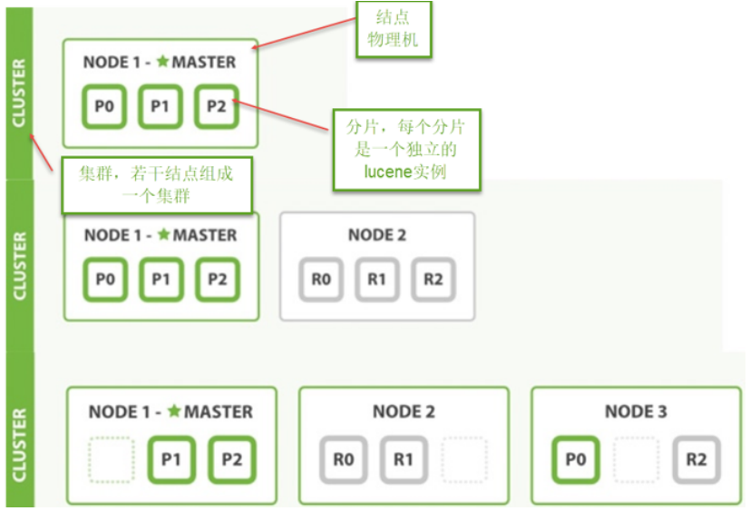

# 10 - 课程发布  &  Elasticearch

## 一、课程发布

课程发布后将生成正式的课程详情页面，课程发布后用户即可浏览课程详情页面，并开始课程的学习。
课程发布生成课程详情页面的流程与课程预览业务流程相同，如下：
1、用户进入教学管理中心，进入某个课程的管理界面
2、点击课程发布，前端请求到课程管理服务
3、课程管理服务远程调用CMS生成课程发布页面，CMS将课程详情页面发布到服务器
4、课程管理服务修改课程发布状态为 “已发布”，并向前端返回发布成功
5、用户在教学管理中心点击“课程详情页面”链接，查看课程详情页面内容


### 1.1、 CMS 一键发布接口

```java
@Data
@NoArgsConstructor//无参构造器注解
public class CmsPostPageResult extends ResponseResult  {
    String pageUrl;
    public CmsPostPageResult(ResultCode resultCode,String pageUrl) {
        super(resultCode);
        this.pageUrl = pageUrl;
    }
}

@ApiOperation("一键发布页面")
public CmsPostPageResult postPageQuick(CmsPage cmsPage);
```


## 二、Elasticearch (重点！！！！)

### 2.1  介绍

Elasticsearch是一个基于[Apache Lucene(TM)](https://link.jianshu.com?t=https://lucene.apache.org/core/)的开源搜索引擎。无论在开源还是专有领域，Lucene可以被认为是迄今为止最先进、性能最好的、功能最全的搜索引擎库。
 但是，Lucene只是一个库。想要使用它，你必须使用Java来作为开发语言并将其直接集成到你的应用中，更糟糕的是，Lucene非常复杂，你需要深入了解检索的相关知识来理解它是如何工作的。
 Elasticsearch也使用Java开发并使用Lucene作为其核心来实现所有索引和搜索的功能，但是它的目的是通过简单的RESTful API来隐藏Lucene的复杂性，从而让全文搜索变得简单。
 不过，Elasticsearch不仅仅是Lucene和全文搜索，我们还能这样去描述它：

- 分布式的实时文件存储，每个字段都被索引并可被搜索
- 分布式的实时分析搜索引擎
- 可以扩展到上百台服务器，处理PB级结构化或非结构化数据


##### 总结：

1、elasticsearch是一个基于Lucene的高扩展的分布式搜索服务器，支持开箱即用。
2、elasticsearch隐藏了Lucene的复杂性，对外提供Restful 接口来操作索引、搜索。

##### 突出优点：

1. 扩展性好，可部署上百台服务器集群，处理PB级数据。
2. 近实时的去索引数据、搜索数据。

##### es和solr选择哪个？

1. 如果你公司现在用的solr可以满足需求就不要换了。
2. 如果你公司准备进行全文检索项目的开发，建议优先考虑elasticsearch，因为像Github这样大规模的搜索都在用它。


#### 2.2、原理与应用

基于Lucene的全文检索！

倒排索引： 根据分词来查找对应的文档所在；

正排索引：先获得文档，然后查找对应的信息；

​	如计算机文档浏览，先有文档，然后一个个去查找。

#####  RESTful应用方法

- Elasticsearch提供 RESTful Api接口进行索引、搜索，并且支持多种客户端。


## 三、ElasticaSearch 安装

### 3.1、安装

安装配置：
1、新版本要求至少jdk1.8以上。
2、支持tar、zip、rpm等多种安装方式。
在windows下开发建议使用ZIP安装方式。
3、支持docker方式安装
详细参见：https://www.elastic.co/guide/en/elasticsearch/reference/current/install-elasticsearch.html
下载 ES: Elasticsearch 6.2.1
https://www.elastic.co/downloads/past-releases


### 3.2、head 插件安装

head插件是ES的一个可视化管理插件，用来监视ES的状态，并通过head客户端和ES服务进行交互，比如创建映
射、创建索引等，head的项目地址在https://github.com/mobz/elasticsearch-head  。
从ES6.0开始，head插件支持使得node.js运行。


## 四、ES快速入门

###  4.1、创建索引库

ES的索引库是一个逻辑概念，它包括了分词列表及文档列表，同一个索引库中存储了相同类型的文档。它就相当于MySQL中的表，或相当于Mongodb中的集合。

关于索引这个语：

##### 索引（名词）：ES是基于Lucene构建的一个搜索服务，它要从索引库搜索符合条件索引数据。

##### 索引（动词）：索引库刚创建起来是空的，将数据添加到索引库的过程称为索引。

下边介绍两种创建索引库的方法，它们的工作原理是相同的，都是客户端向ES服务发送命令。

##### 1）使用postman或curl这样的工具创建：

​	put http://localhost:9200/xc_course

> ##### curl 是Python 语法，有时间进入Python学习！

BODY内容，raw/json

```js
{
    "settings": {
        "index": {
            "number_of_shards": 1,
            "number_of_replicas": 0
        }
    }
}

put http://localhost:9200/xc_course/doc/1

```

> #### 查看settings : 
>
> ```shell
> GET http://localhost:9200/xc_course/_settings?pretty # pretty可以省略
> ```

##### 2）使用head插件创建

直接点击页面索引栏，新建索引即可！


### 4.2、创建映射

- ####  概念说明

  在索引中每个文档都包括了一个或多个field，创建映射就是向索引库中创建field的过程，下边是document和field与关系数据库的概念的类比：
  文档（Document）----------------Row记录
  字段（Field）-------------------Columns 列
  注意：6.0之前的版本有type（类型）概念，type相当于关系数据库的表，ES官方将在ES9.0版本中彻底删除type。
  上边讲的创建索引库相当于关系数据库中的数据库还是表？

  1. 如果相当于数据库就表示一个索引库可以创建很多不同类型的文档，这在ES中也是允许的。
  2. 如果相当于表就表示一个索引库只能存储相同类型的文档，ES官方建议 在一个索引库中只存储相同类型的文档。

- #### 创建映射

  我们要把课程信息存储到ES中，这里我们创建课程信息的映射，先来一个简单的映射，如下：
  发送：post http://localhost:9200/索引库名称 /类型名称/_mapping
  创建类型为xc_course的映射，共包括三个字段：name、description、studymondel
  由于ES6.0版本还没有将type彻底删除，所以暂时把type起一个没有特殊意义的名字。
  post 请求：http://localhost:9200/xc_course/doc/_mapping
  表示：在 xc_course索引库下的doc类型下创建映射。doc是类型名，可以自定义，在ES6.0中要弱化类型的概念，给它起一个没有具体业务意义的名称。

  ```js
  {
      "properties": {
          "name": {
              "type": "text"
          },
          "description": {
              "type": "text"
          },
          "studymodel": {
              "type": "keyword"
          }
      }
  }
  ```


### 4.3、 创建文档

ES中的文档相当于MySQL数据库表中的记录。
发送：put 或Post http://localhost:9200/xc_course/doc/id值
（如果不指定id值ES会自动生成ID）
http://localhost:9200/xc_course/doc/4028e58161bcf7f40161bcf8b77c0000

```js
{
  "name":"Bootstrap开发框架",
  "description":"Bootstrap是由Twitter推出的一个前台页面开发框架，在行业之中使用较为广泛。此开发框架包
含了大量的CSS、JS程序代码，可以帮助开发者（尤其是不擅长页面开发的程序人员）轻松的实现一个不受浏览器限制的
精美界面效果。",
  "studymodel":"201001"
}
```


### 4.4、搜索文档

1、根据课程id查询文档 ：精确搜索
发送：get http://localhost:9200/xc_course/doc/4028e58161bcf7f40161bcf8b77c0000

2、查询所有记录
发送 get http://localhost:9200/xc_course/doc/_search

3、查询名称中包括spring 关键字的的记录
发送：get http://localhost:9200/xc_course/doc/_search?q=name:bootstrap

4、查询学习模式为201001的记录
发送 get http://localhost:9200/xc_course/doc/_search?q=studymodel:201001


## 五、IK 分词器

默认是不会对中文词组进行分词的，而是一个个独立的汉字。所以有必要解决此问题 -- **IK 分词器；**

IK分词器：（Github地址：https://github.com/medcl/elasticsearch-analysis-ik）

直接解压到 ES的plugins下，重启ES.

发送：post localhost:9200/_analyze
{"text":"测试分词器，后边是测试内容：spring cloud实战","analyzer":"ik_max_word" }

```js
{
    "tokens": [
        {
            "token": "测试",
            "start_offset": 0,
            "end_offset": 2,
            "type": "CN_WORD",
            "position": 0
        },
        {
            "token": "分词器",
            "start_offset": 2,
            "end_offset": 5,
            "type": "CN_WORD",
            "position": 1
        },
        {
            "token": "分词",
            "start_offset": 2,
            "end_offset": 4,
            "type": "CN_WORD",
            "position": 2
        }
        ...
	]
}
```

#### 两种分词模式

ik分词器有两种分词模式：ik_max_word和ik_smart模式。

##### 1、ik_max_word

会将文本做最细粒度的拆分，比如会将“中华人民共和国人民大会堂”拆分为“中华人民共和国、中华人民、中华、
华人、人民共和国、人民、共和国、大会堂、大会、会堂等词语。

##### 2、ik_smart

会做最粗粒度的拆分，比如会将“中华人民共和国人民大会堂”拆分为中华人民共和国、人民大会堂。
测试两种分词模式：

####  自定义词库

在IK分词器main.dic的目录中新建一个my.dic文件（注意文件格式为utf-8（不要选择utf-8 BOM））
可以在其中自定义词汇：
比如定义：
配置文件中配置my.dic，

```xml
<?xml version="1.0" encoding="UTF-8"?>
<!DOCTYPE properties SYSTEM "http://java.sun.com/dtd/properties.dtd">
<properties>
	<comment>IK Analyzer 扩展配置</comment>
	<!--用户可以在这里配置自己的扩展字典 -->
	<entry key="ext_dict">my.dic</entry>
	 <!--用户可以在这里配置自己的扩展停止词字典-->
	<entry key="ext_stopwords"></entry>
	<!--用户可以在这里配置远程扩展字典 -->
	<!-- <entry key="remote_ext_dict">words_location</entry> -->
	<!--用户可以在这里配置远程扩展停止词字典-->
	<!-- <entry key="remote_ext_stopwords">words_location</entry> -->
</properties>
```


## 六、映射


## 七、索引管理


## 八、搜索管理

### 8.1、简单搜索

简单搜索就是通过url进行查询，以get方式请求ES。
格式：get ../_search?q=.....
q：搜索字符串。

例子：  localhost:9200?q=name:spring 搜索name中包括spring的文档。

### 8.2、DSL 搜索

DSL(Domain Specific Language)是ES提出的基于json的搜索方式，在搜索时传入特定的json格式的数据来完成不
同的搜索需求。
DSL比URI搜索方式功能强大，在项目中建议使用DSL方式来完成搜索。

- #### 1）查询所有文档

  查询所有索引库的文档。
  发送：post http://localhost:9200/_search
  查询指定索引库指定类型下的文档。（通过使用此方法）
  发送：post http://localhost:9200/xc_course/doc/_search

  - ##### 设置结果过滤

  ```js
  {
      "query": {
          "match_all": {}
      },
      "_source": [
          "name",
          "studymodel"
      ]
  }
  ```

  - ##### 查的结果

  ```js
  {
      "took": 25,
      "timed_out": false,
      "_shards": {
          "total": 1,
          "successful": 1,
          "skipped": 0,
          "failed": 0
      },
      "hits": {
          "total": 3,
          "max_score": 1,
          "hits": [
              {
                  "_index": "xc_course",
                  "_type": "doc",
                  "_id": "1",
                  "_score": 1,
                  "_source": {
                      "studymodel": "201002",
                      "name": "Bootstrap开发"
                  }
              },
         ...
              }
          ]
      }
  }
  ```

  结果说明：
  took：本次操作花费的时间，单位为毫秒。
  timed_out：请求是否超时
  _shards：说明本次操作共搜索了哪些分片
  hits：搜索命中的记录
  hits.total ： 符合条件的文档总数 hits.hits ：匹配度较高的前N个文档
  hits.max_score：文档匹配得分，这里为最高分
  _score：每个文档都有一个匹配度得分，按照降序排列。
  _source：显示了文档的原始内容

- #### 2）分页查询

  ES支持分页查询，传入两个参数：from和size。
  form：表示起始文档的下标，从0开始。
  size：查询的文档数量。
  发送：post http://localhost:9200/xc_course/doc/_search

  ```js
  {
      "from": 0,
      "size": 1,
      "query": {
          "match_all": {}
      },
      "_source": [
          "name",
          "studymodel"
      ]
  }
  ```

  ```
  SearchRequest searchRequest = new SearchRequest("xc_course"); 
  searchRequest.types("xc_course");
  SearchSourceBuilder searchSourceBuilder = new SearchSourceBuilder();
  searchSourceBuilder.query(QueryBuilders.matchAllQuery());
  //分页查询，设置起始下标，从0开始
  searchSourceBuilder.from(0);
  //每页显示个数
  searchSourceBuilder.size(10);
  //source源字段过虑
  searchSourceBuilder.fetchSource(new String[]{"name","studymodel"}, new String[]{});
  searchRequest.source(searchSourceBuilder);
  SearchResponse searchResponse = client.search(searchRequest);
  ```

- #### Term Query

  Term Query为精确查询，在搜索时会整体匹配关键字，不再将关键字分词。

  发送：post http://localhost:9200/xc_course/doc/_search

  ```js
  {
      "query": {
          "term": {
              "name": "spring"
          }
      },
      "_source": [
          "name",
          "studymodel",
          "description"
      ]
  }
  ```

  ```java
  SearchRequest searchRequest = new SearchRequest("xc_course"); 
  searchRequest.types("xc_course");
  SearchSourceBuilder searchSourceBuilder = new SearchSourceBuilder();
  searchSourceBuilder.query(QueryBuilders.termQuery("name","spring"));
  //source源字段过虑
  searchSourceBuilder.fetchSource(new String[]{"name","studymodel"}, new String[]{});
  searchRequest.source(searchSourceBuilder);
  SearchResponse searchResponse = client.search(searchRequest);
  ```

- #### 根据id精确匹配

  ES提供根据多个id值匹配的方法：
  post ： http://127.0.0.1:9200/xc_course/doc/_search

  ```js
  {
      "query": {
          "ids": {
              "type": "doc",
              "values": [
                  "3",
                  "4",
                  "100"
              ]
          }
      }
  }
  ```

  ```java
  String[] split = new String[]{"1","2"}; 
  List<String> idList = Arrays.asList(split);
  // 特别注意： 这里是termsQuery
  searchSourceBuilder.query(QueryBuilders.termsQuery("_id", idList));
  ```

- ####  match Query

  1、基本使用
  match Query即全文检索，它的搜索方式是先将搜索字符串分词，再使用各各词条从索引中搜索。
  match query与Term query区别是match query在搜索前先将搜索关键字分词，再拿各各词语去索引中搜索。
  发送：post http://localhost:9200/xc_course/doc/_search

  ```js
  {
      "query": {
          "match": {
              "description": {
                  "query": "spring开发",
                  "operator": "or"
              }
          }
      }
  }
  /*
  query：搜索的关键字，对于英文关键字如果有多个单词则中间要用半角逗号分隔，而对于中文关键字中间可以用
  逗号分隔也可以不用。
  operator：or 表示 只要有一个词在文档中出现则就符合条件，and表示每个词都在文档中出现则才符合条件。
  上边的搜索的执行过程是：
  1 、将“spring开发”分词，分为spring、开发两个词
  2、再使用spring和开发两个词去匹配索引中搜索。
  3、由于设置了operator为or，只要有一个词匹配成功则就返回该文档。
  */
  ```

  ```java
  //根据关键字搜索
  @Test
  public void testMatchQuery() throws IOException {
      SearchRequest searchRequest = new SearchRequest("xc_course");
      searchRequest.types("xc_course");
      SearchSourceBuilder searchSourceBuilder = new SearchSourceBuilder();
      //source源字段过虑
      searchSourceBuilder.fetchSource(new String[]{"name","studymodel"}, new String[]{});
      //匹配关键字
      searchSourceBuilder.query(QueryBuilders.matchQuery("description", "spring开
  发").operator(Operator.OR));
      searchRequest.source(searchSourceBuilder);
      SearchResponse searchResponse = client.search(searchRequest);
     ...
  }
  ```

  2、minimum_should_match
  上边使用的operator = or表示只要有一个词匹配上就得分，如果实现三个词至少有两个词匹配如何实现？
  使用minimum_should_match可以指定文档匹配词的占比：
  比如搜索语句如下：

  ```js
  {
      "query": {
          "match": {
              "description": {
                  "query": "spring开发框架",
                  "minimum_should_match": "80%"
              }
          }
      }
  }
  /*
  “spring开发框架”会被分为三个词：spring、开发、框架
  设置"minimum_should_match": "80%"表示，三个词在文档的匹配占比为80%，即3*0.8=2.4，向上取整得2，表
  示至少有两个词在文档中要匹配成功。
  */
  ```

  ```java
  //匹配关键字
  MatchQueryBuilder matchQueryBuilder = QueryBuilders.matchQuery("description", "前台页面开发框架 架构")
  .minimumShouldMatch("80%");//设置匹配占比
  searchSourceBuilder.query(matchQueryBuilder);
  ```

- #### multi Query

  上边学习的termQuery和matchQuery一次只能匹配一个Field，本节学习multiQuery，一次可以匹配多个字段。

  1、基本使用
  单项匹配是在一个field中去匹配，多项匹配是拿关键字去多个Field中匹配。
  例子：
  发送：post http://localhost:9200/xc_course/doc/_search
  拿关键字 “spring css”去匹配name 和description字段。

  ```js
  {
      "query": {
          "multi_match": {
              "query": "spring css",
              "minimum_should_match": "50%",
              "fields": [
                  "name",
                  "description"
              ]
          }
      }
  }
  ```

  2、提升boost

  匹配多个字段时可以提升字段的 boost（权重）来提高得分.

  ```js
  {
      "query": {
          "multi_match": {
              "query": "spring框架",
              "minimum_should_match": "50%",
              "fields": [
                  "name^10",
                  "description"
              ]
          }
      }
  }
  ```

  ```java
  MultiMatchQueryBuilder multiMatchQueryBuilder = QueryBuilders.multiMatchQuery("spring 框架",
  "name", "description")
          .minimumShouldMatch("50%");
  multiMatchQueryBuilder.field("name",10);//提升boost
  ```

- #### 布尔查询

  布尔查询对应于Lucene的BooleanQuery查询，实现将多个查询组合起来。
  三个参数：
  must：文档必须匹配must所包括的查询条件，相当于 “AND” should：文档应该匹配should所包括的查询条件其中的一个或多个，相当于 "OR" must_not：文档不能匹配must_not所包括的该查询条件，相当于“NOT”.

  分别使用 must、should、must_not测试下边的查询：
  发送：POST http://localhost:9200/xc_course/doc/_search

  ```js
  /*
  must：表示必须，多个查询条件必须都满足。（通常使用must）
  should：表示或者，多个查询条件只要有一个满足即可。
  must_not：表示非。
  */
  {
      "_source": [
          "name",
          "studymodel",
          "description"
      ],
      "from": 0,
      "size": 1,
      "query": {
          "bool": {
              "must": [
                  {
                      "multi_match": {
                          "query": "spring框架",
                          "minimum_should_match": "50%",
                          "fields": [
                              "name^10",
                              "description"
                          ]
                      }
                  },
                  {
                      "term": {
                          "studymodel": "201001"
                      }
                  }
              ]
          }
      }
  }
  ```

  ```java
  //BoolQuery ，将搜索关键字分词，拿分词去索引库搜索
  @Test
  public void testBoolQuery() throws IOException {
      //创建搜索请求对象
      SearchRequest searchRequest= new SearchRequest("xc_course");
      searchRequest.types("doc");
      //创建搜索源配置对象
      SearchSourceBuilder searchSourceBuilder = new SearchSourceBuilder();
      searchSourceBuilder.fetchSource(new String[]{"name","pic","studymodel"},new String[]{});
      //multiQuery
      String keyword = "spring开发框架";
      MultiMatchQueryBuilder multiMatchQueryBuilder = QueryBuilders.multiMatchQuery("spring框架","name", "description").minimumShouldMatch("50%");
      multiMatchQueryBuilder.field("name",10);
      //TermQuery
      TermQueryBuilder termQueryBuilder = QueryBuilders.termQuery("studymodel", "201001");
       // 布尔查询
      BoolQueryBuilder boolQueryBuilder = QueryBuilders.boolQuery();
      boolQueryBuilder.must(multiMatchQueryBuilder);
      boolQueryBuilder.must(termQueryBuilder);
      //设置布尔查询对象
      searchSourceBuilder.query(boolQueryBuilder);
      searchRequest.source(searchSourceBuilder);//设置搜索源配置
      SearchResponse searchResponse = client.search(searchRequest);
      SearchHits hits = searchResponse.getHits();
      SearchHit[] searchHits = hits.getHits();
      for(SearchHit hit:searchHits){
          Map<String, Object> sourceAsMap = hit.getSourceAsMap();
          System.out.println(sourceAsMap);
      }
  }
  ```

- #### 过虑器

  过虑是针对搜索的结果进行过虑，过虑器主要判断的是文档是否匹配，不去计算和判断文档的匹配度得分，所以过虑器性能比查询要高，且方便缓存，推荐尽量使用过虑器去实现查询或者过虑器和查询共同使用。
  过虑器在布尔查询中使用，下边是在搜索结果的基础上进行过虑：

  ```js
  {
      "_source": ["name","studymodel","description","price"],
      "query": {
          "bool": {
              "must": [
                  {
                      "multi_match": {
                          "query": "spring框架",
                          "minimum_should_match": "50%",
                          "fields": ["name^10","description"]
                      }
                  }
              ],
              "filter": [
                  {"term": {"studymodel": "201001"}},
                  {"range": {"price": {"gte": 60,"lte": 100}}}
              ]
          }
      }
  }
  /*
  range：范围过虑，保留大于等于60 并且小于等于100的记录。
  term ：项匹配过虑，保留studymodel等于"201001"的记录。
  注意：range和term一次只能对一个Field设置范围过虑。
  */
  ```

  ```java
  //布尔查询
  BoolQueryBuilder boolQueryBuilder = QueryBuilders.boolQuery();
  boolQueryBuilder.must(searchSourceBuilder.query());
  //过虑
  boolQueryBuilder.filter(QueryBuilders.termQuery("studymodel", "201001"));
  boolQueryBuilder.filter(QueryBuilders.rangeQuery("price").gte(60).lte(100));
  SearchResponse searchResponse = client.search(searchRequest);
  ```

- #### 排序

  可以在字段上添加一个或多个排序，支持在keyword、date、float等类型上添加，text类型的字段上不允许添加排序。
  发送 POST http://localhost:9200/xc_course/doc/_search
  过虑0--10元价格范围的文档，并且对结果进行排序，先按studymodel降序，再按价格升序.

  ```js
  {
      "_source": [ "name","studymodel","description","price"],
      "query": {
          "bool": {
              "filter": [{"range": {"price": {"gte": 0,"lte": 100}}}]
          }
      },
      "sort": [{"studymodel": "desc"},{"price": "asc"}] // 先studymodel， 后price
  }
  ```

  ```java
  //布尔查询
  BoolQueryBuilder boolQueryBuilder = QueryBuilders.boolQuery();
  //过虑
  boolQueryBuilder.filter(QueryBuilders.rangeQuery("price").gte(0).lte(100));
  // 排序
  searchSourceBuilder.sort(new FieldSortBuilder("studymodel").order(SortOrder.DESC));
  searchSourceBuilder.sort(new FieldSortBuilder("price").order(SortOrder.ASC));
  SearchResponse searchResponse = client.search(searchRequest);
  ```

- #### 高亮显示

  亮显示可以将搜索结果一个或多个字突出显示，以便向用户展示匹配关键字的位置。
  在搜索语句中添加highlight即可实现，如下：
  Post： http://127.0.0.1:9200/xc_course/doc/_search

  ```js
  {
      "_source": ["name","studymodel","description","price"],
      "query": {
          "bool": {
              "must": [
                  {
                      "multi_match": {
                          "query": "开发框架",
                          "minimum_should_match": "50%",
                          "fields": [ "name^10", "description"],
                          "type": "best_fields"
                      }
                  }
              ],
              "filter": [
                  {"range": {"price": {"gte": 0,"lte": 100}}}
              ]
          }
      },
      "sort": [{"price": "asc"}],
      "highlight": {
          "pre_tags": [
              "<tag>"
          ],
          "post_tags": [
              "</tag>"
          ],
          "fields": {
              "name": {},
              "description": {}
          }
      }
  }
  ```

  ```java
  //布尔查询
  BoolQueryBuilder boolQueryBuilder = QueryBuilders.boolQuery();
  boolQueryBuilder.must(searchSourceBuilder.query());
  //过虑
  boolQueryBuilder.filter(QueryBuilders.rangeQuery("price").gte(0).lte(100));
  //排序
  searchSourceBuilder.sort(new FieldSortBuilder("studymodel").order(SortOrder.DESC));
  searchSourceBuilder.sort(new FieldSortBuilder("price").order(SortOrder.ASC));
  //高亮设置
  HighlightBuilder highlightBuilder = new HighlightBuilder();
  highlightBuilder.preTags("<tag>");//设置前缀
  highlightBuilder.postTags("</tag>");//设置后缀
  // 设置高亮字段
  highlightBuilder.fields().add(new HighlightBuilder.Field("name"));
  //        highlightBuilder.fields().add(new HighlightBuilder.Field("description"));
  searchSourceBuilder.highlighter(highlightBuilder);
  SearchResponse searchResponse = client.search(searchRequest);
  ```


## 九、集群管理



从上图总结以下概念：
**1、结点**
ES集群由多个服务器组成，每个服务器即为一个Node结点(该服务只部署了一个ES进程)。
**2、分片**
当我们的文档量很大时，由于内存和硬盘的限制，同时也为了提高ES的处理能力、容错能力及高可用能力，我们将索引分成若干分片，每个分片可以放在不同的服务器，这样就实现了多个服务器共同对外提供索引及搜索服务。
一个搜索请求过来，会分别从各各分片去查询，最后将查询到的数据合并返回给用户。
**3、副本**
为了提高ES的高可用同时也为了提高搜索的吞吐量，我们将分片复制一份或多份存储在其它的服务器，这样即使当前的服务器挂掉了，拥有副本的服务器照常可以提供服务。
**4、主结点**
一个集群中会有一个或多个主结点，主结点的作用是集群管理，比如增加节点，移除节点等，主结点挂掉后ES会重新选一个主结点。
**5、结点转发**
每个结点都知道其它结点的信息，我们可以对任意一个结点发起请求，接收请求的结点会转发给其它结点查询数
据。


## 十、总结

#### 1、ES底层是基于Lucene的服务器，是一个分布式多用户能力的全文搜索引擎，并基于restful风格提供api接口；

- localhost:9200/xc_course/doc/\_search :  _search 即搜索, 完整代表搜索 xc_course索引库；_

- localhost:9200/xc_course/doc/_mapping :  这个接口创建 xc_course索引库的映射；（在这里配置分词器）

- localhost:9200/xc_course/_analyze : 分词查看（直接分词操作，确认使用分词器是否生效）

  ```shell
  POST  localhost:9200/_analyze 通过同上， 但是不容出现tye (一定要post)
  localhost:9200/xc_course/doc/_analyze  这个就是搜索了，_id = _analyze的搜索
  # 注意，直接查看分词时，配置分词器直接在json字段后，添加一个analyzer字段
  { "text": "中华人民共和国人民大会堂","analyzer":"ik_smart" }
  ```

- /_settings :  创建put /查看 get 索引库配置

  ```js
  # ES 的实时性，就是系统默认1s间隔会去刷新索引库的索引；（相当于一个近实时性） 
  {
      "settings": {
          "index": {
              "number_of_shards": 1,  // 分片
              "number_of_replicas": 0  // 主从备份
          },
          "refresh_interval": "10s" // 设置索引库更新的频率
      }
  }
  ```

- get localhost:9200/xc_course :  查看索引库整体信息

  ```js
  {
      "xc_mk": {
          "aliases": {},  // ? 
          "mappings": {}, // 查看映射 /xc_Course/_mapping, /xc_course/doc/_mapping
          "settings": {
              "index": {
                  "refresh_interval": "10s",
                  "number_of_shards": "1",
                  "provided_name": "xc_mk",
                  "creation_date": "1561788735770",
                  "number_of_replicas": "0",
                  "uuid": "teFBs8O2RhGB_zJqVcP2Bg",
                  "version": {
                      "created": "6020199"
                  }
              }
          }
      }
  }
  ```

- ##### 其他就是针对性 CRUD restful api，参考前面的讲义；

#### 2、ES是一个近实时性分布式：

分布式 ： 即是ES的集群搭建，自定将数据均分分散在各个节点。 同时主从复制也可设置；

近实时性：就是ES默认每隔1s会去刷新索引库，保证了搜索结果的实时性；

但是有个问题，当有大量数据更新到索引库时，若每隔1s去刷新索引库，每次索引量不少，而且是频繁刷新，会造成ES压力过大，此时可以设置 refresh_interval = 10s , 30s 等！（因为每次刷洗索引会消耗系统资源的！）


#### 3、ES关联SQL，如何解决冲突问题？


​	

中文api：https://github.com/zhangchichi/elasticsearch-doc-6.4/blob/master/sql-access/getting-started-with-sql.md

ES详解：https://www.jianshu.com/p/53580217a010

ES为什么是近实时性：https://blog.csdn.net/u010454030/article/details/79586072

ES原理详解：https://blog.csdn.net/hellozhxy/article/details/81198451  https://www.cnblogs.com/wenBlog/p/8489197.html

## 十一、问题

1. ####  分布式节点出现问题，如何快速定位？

2. ####  ES如何配置多个分词器？

   在_mapping中，可以直接设置分词器。而且有两种类型选项： 

   analyzer 添加索引时分词使用， search\_analyzer 搜索时分词使用；

   至于配置多个分词器，直接把对应分词器的包放入ES的plugins目录下即可。

   #####  2.1、至于如何自定义的分词器，待解决！！

3. ####  


> #### 关于新技术点： 
>
> ##### 1、快速入门学习必要的，即java常用的api；(V)
>
> ##### 2、大致浏览整体api，查看博客说明，或者有时间自己直接看官网英文版；（扩展！）
>
> ##### 3、总结必要点（解决了什么问题），汇总问题点（期待解决的问题），留于未来研究点（了解其他应用领域）；


