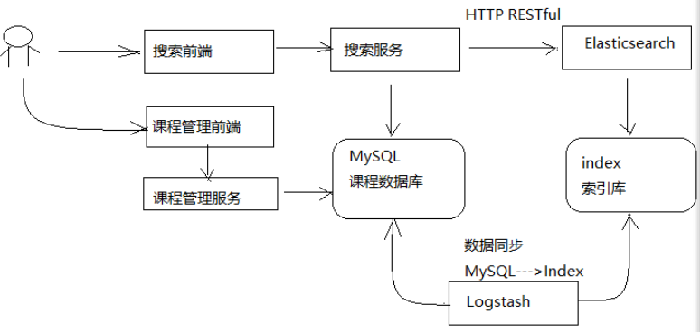

# 11 - 搜索服务

## 一、搜索流程



1、课程管理服务将数据写到MySQL数据库
2、使用Logstash将MySQL数据库中的数据写到ES的索引库。
3、用户在前端搜索课程信息，请求到搜索服务。
4、搜索服务请求ES搜索课程信息。


## 二、课程索引

### 2.1  技术方案

如何维护课程索引信息？
1、当课程向MySQL添加后同时将课程信息添加到索引库。
采用Logstach实现，Logstach会从MySQL中将数据采集到ES索引库。

2、当课程在MySQL更新信息后同时更新该课程在索引库的信息。
采用Logstach实现。（在mysql.conf配置设置了，定时配置 schedule => "* * * * *"， 每隔1分钟去扫描一次，实现增量更新，以时间戳为标准！）

3、当课程在MySQL删除后同时将该课程从索引库删除。

> 删除方案，待后续研究！

### 2.2  准备课程索引信息

课程信息分布在course_base、course_pic等不同的表中。
课程发布成功为了方便进行索引将这几张表的数据合并在一张表中，作为课程发布信息。
创建course_pub表，这张表只用作对ES对接使用。不做其他使用！（感觉数据会冗余，其实不然，因为这个表是特定使用！）

- #### 修改课程发布

  有了上面的表结构，但是数据从哪里来呢？这个就是当我们课程发布时，及时维护course_pub表的数据；

```java
@Transactional
public CoursePublishResult publish(String id) {
    //查询课程
    CourseBase courseBaseById = this.findCourseBaseById(id);

    //准备页面信息
    CmsPage cmsPage = new CmsPage();
    cmsPage.setSiteId(publish_siteId);//站点id
    cmsPage.setDataUrl(publish_dataUrlPre+id);//数据模型url
    cmsPage.setPageName(id+".html");//页面名称
    cmsPage.setPageAliase(courseBaseById.getName());//页面别名，就是课程名称
    cmsPage.setPagePhysicalPath(publish_page_physicalpath);//页面物理路径
    cmsPage.setPageWebPath(publish_page_webpath);//页面webpath
    cmsPage.setTemplateId(publish_templateId);//页面模板id
    //调用cms一键发布接口将课程详情页面发布到服务器
    CmsPostPageResult cmsPostPageResult = cmsPageClient.postPageQuick(cmsPage);
    if(!cmsPostPageResult.isSuccess()){
        return new CoursePublishResult(CommonCode.FAIL,null);
    }

    //保存课程的发布状态为“已发布”
    CourseBase courseBase = this.saveCoursePubState(id);
    if(courseBase == null){
        return new CoursePublishResult(CommonCode.FAIL,null);
    }

    //保存课程索引信息
    //先创建一个coursePub对象
    CoursePub coursePub = createCoursePub(id);
    //将coursePub对象保存到数据库
    saveCoursePub(id,coursePub);
    //缓存课程的信息
    //...
    //得到页面的url
    String pageUrl = cmsPostPageResult.getPageUrl();
    return new CoursePublishResult(CommonCode.SUCCESS,pageUrl);
}

//将coursePub对象保存到数据库
private CoursePub saveCoursePub(String id,CoursePub coursePub){

    CoursePub coursePubNew = null;
    //根据课程id查询coursePub
    Optional<CoursePub> coursePubOptional = coursePubRepository.findById(id);
    if(coursePubOptional.isPresent()){
        coursePubNew = coursePubOptional.get();
    }else{
        coursePubNew = new CoursePub();
    }

    //将coursePub对象中的信息保存到coursePubNew中
    BeanUtils.copyProperties(coursePub,coursePubNew);
    coursePubNew.setId(id);
    //时间戳,给logstach使用
    coursePubNew.setTimestamp(new Date());
    //发布时间
    SimpleDateFormat simpleDateFormat = new SimpleDateFormat("YYYY-MM-dd HH:mm:ss");
    String date = simpleDateFormat.format(new Date());
    coursePubNew.setPubTime(date);
    coursePubRepository.save(coursePubNew);
    return coursePubNew;
}

//创建coursePub对象
private CoursePub createCoursePub(String id){
    CoursePub coursePub = new CoursePub();
    //根据课程id查询course_base
    Optional<CourseBase> baseOptional = courseBaseRepository.findById(id);
    if(baseOptional.isPresent()){
        CourseBase courseBase = baseOptional.get();
        //将courseBase属性拷贝到CoursePub中
        BeanUtils.copyProperties(courseBase,coursePub);
    }

    //查询课程图片
    Optional<CoursePic> picOptional = coursePicRepository.findById(id);
    if(picOptional.isPresent()){
        CoursePic coursePic = picOptional.get();
        BeanUtils.copyProperties(coursePic, coursePub);
    }

    //课程营销信息
    Optional<CourseMarket> marketOptional = courseMarketRepository.findById(id);
    if(marketOptional.isPresent()){
        CourseMarket courseMarket = marketOptional.get();
        BeanUtils.copyProperties(courseMarket, coursePub);
    }

    //课程计划信息
    TeachplanNode teachplanNode = teachplanMapper.selectList(id);
    String jsonString = JSON.toJSONString(teachplanNode);
    //将课程计划信息json串保存到 course_pub中
    coursePub.setTeachplan(jsonString);
    return coursePub;
}
```

> ##### 上面在页面发布时，先创建CourseSub对象，然后维护到course_sub表！


## 三、ES + Logstash 创建索引

上一章节，学习了ES。前面又提到了索引对应的mysql表； 如何将mysql转化为ES xc_course索引库的对应索引呢？

当然是ES官方提供的数据采集工具：Logstash;

#### 3.1、安装Logstash

参考讲义！

#### 3.2、创建模板文件

就是mapping映射json文件！`xc_course_template.json`

#### 3.3、配置mysql.conf

```js
input {
  stdin {
  }
  jdbc {
  jdbc_connection_string => "jdbc:mysql://localhost:3306/xc_course?useUnicode=true&characterEncoding=utf-8&useSSL=true&serverTimezone=UTC"
  # the user we wish to excute our statement as
  jdbc_user => "root"
  jdbc_password => root
  # the path to our downloaded jdbc driver  
  jdbc_driver_library => "D:/maven_repository/mysql/mysql-connector-java/5.1.46/mysql-connector-java-5.1.46.jar"
  # the name of the driver class for mysql
  jdbc_driver_class => "com.mysql.jdbc.Driver"
  jdbc_paging_enabled => "true"
  jdbc_page_size => "50000"
  #要执行的sql文件
  #statement_filepath => "/conf/course.sql"
  statement => "select * from course_pub where timestamp > date_add(:sql_last_value,INTERVAL 8 HOUR)"
  #定时配置
  schedule => "* * * * *"
  record_last_run => true
  last_run_metadata_path => "D:/ES/logstash-6.2.1/config/logstash_metadata"
  }
}


output {
  elasticsearch {
  #ES的ip地址和端口
  hosts => "localhost:9200"
  #hosts => ["localhost:9200","localhost:9202","localhost:9203"]
  #ES索引库名称
  index => "xc_course"
  document_id => "%{id}"
  document_type => "doc"
  template =>"D:/ES/logstash-6.2.1/config/xc_course_template.json"
  # 下面干嘛的？？就是上面template一个字段
  template_name =>"xc_course"
  template_overwrite =>"true"
  }
  stdout {
 #日志输出
  codec => json_lines
  }
}
```


## 四、 课程搜索 （落实到业务需求）

编写搜索服务

#### 4.1、定义API接口

```

```


