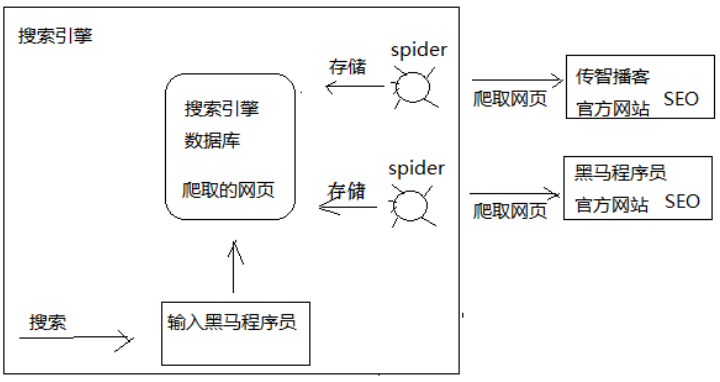

# 12 - 搜索前端 Nuxt.js

## 一、SEO

采用vue.js开发搜索界面则SEO不友好，搜索前端一定需要解决SEO的问题。

### 1.1、啥是SEO?

```properties
SEO（Search Engine Optimization）: 汉译为搜索引擎优化。是一种方式：利用搜索引擎的规则提高网站在有关搜索引擎内的自然排名。目的是：为网站提供生态式的自我营销解决方案，让其在行业内占据领先地位，获得品牌收益；SEO包含站外SEO和站内SEO两方面；为了从搜索引擎中获得更多的免费流量，从网站结构、内容建设方案、用户互动传播、页面等角度进行合理规划，还会使搜索引擎中显示的网站相关信息对用户来说更具有吸引力。
```

总结：seo是网站为了提高自已的网站排名，获得更多的流量，对网站的结构及内容进行调整优化，以便搜索引擎
（百度，google等）更好抓取到更优质的网站的内容。



从上图可以看到SEO是网站自己为了方便spider抓取网页而作出的网页内容优化，常见的SEO方法比如：
1）对url链接的规范化，多用restful风格的url，多用静态资源url；
2) 注意title、keywords的设置。
3）由于spider对javascript支持不好，对于网页跳转用href标签。

### 1.2、服务端渲染和客户端渲染

采用什么技术有利于SEO？要解答这个问题需要理解服务端渲染和客户端渲染。

#### - 什么是服务端渲染?

我们用传统的servlet开发来举例：浏览器请求servlet，servlet在服务端生成html响应给浏览器，浏览器展示html
的内容，这个过程就是服务端渲染；

##### 	服务端渲染的特点：

​	1 ）在服务端生成html网页的dom元素。
	2）客户端（浏览器）只负责显示dom元素内容。

#### - 什么是客户端渲染?

当初随着web2.0的到来，AJAX技术兴起，出现了客户端渲染：客户端（浏览器） 使用AJAX向服务端发起http请
求，获取到了想要的数据，客户端拿着数据开始渲染html网页，生成Dom元素，并最终将网页内容展示给用户。

##### 	客户端渲染的特点：

​	1）在服务端只是给客户端响应的了数据，而不是html网页
	2）客户端（浏览器）负责获取服务端的数据生成Dom元素。


两种方式各有什么优缺点？

##### 客户端渲染：

1) 缺点
不利于网站进行SEO，因为网站大量使用javascript技术，不利于spider抓取网页。

2) 优点
客户端负责渲染，用户体验性好，服务端只提供数据不用关心用户界面的内容，有利于提高服务端的开发效率。

3）适用场景
对SEO没有要求的系统，比如后台管理类的系统，如电商后台管理，用户管理等。

##### 服务端渲染：

1) 优点
有利于SEO，网站通过href的url将spider直接引到服务端，服务端提供优质的网页内容给spider。

2) 缺点
服务端完成一部分客户端的工作，通常完成一个需求需要修改客户端和服务端的代码，开发效率低，不利于系统的
稳定性。

3 ）适用场景
对SEO有要求的系统，比如：门户首页、商品详情页面等。

##### 综上所述，直接使用原始的服务端渲染肯定不现实，那有啥技术能完成前端的服务端渲染呢？ --- NUxt.js


## 二、Nuxt.js 介绍

### 2.1、介绍

移动互联网的兴起促进了web前后端分离开发模式的发展，服务端只专注业务，前端只专注用户体验，前端大量运
用的前端渲染技术，比如流行的vue.js、react框架都实现了功能强大的前端渲染。
但是，对于有SEO需求的网页如果使用前端渲染技术去开发就不利于SEO了，有没有一种即使用vue.js、react的前
端技术也实现服务端渲染的技术呢？其实，对于服务端渲染的需求，vue.js、react这样流行的前端框架提供了服务端渲染的解决方案。

react框架提供next.js实现服务端渲染。
vue.js框架提供Nuxt.js实现服务端渲染。

### 2.2、Nuxt.js 基本使用

package.json 文件用于描述应用的依赖关系和对外暴露的脚本接口。

... 其他参考讲义


### 2.3、页面布局

页面布局就是页面内容的整体结构，通过在layouts目录下添加布局文件来实现。在layouts 根目录下的所有文件都
属于个性化布局文件，可以在页面组件中利用 layout 属性来引用。

```vue
1、定义：layouts/test.vue布局文件，如下：
注意：布局文件中一定要加 <nuxt/> 组件用于显示页面内容。
<template>
  <div>
    这里是头部区域!!!
    <nuxt/>
    这里是尾部区域!!!
  </div>
</template>
<script>
  export default {
  }
</script>
<style>
</style>

2、在pages目录创建user目录，并创建index.vue页面
在 pages/user/index.vue 页面里， 可以指定页面组件使用 test 布局，代码如下：
<template>
  <div>
  测试页面
  </div>
</template>
<script>
  export default{
    layout:'test'
  }
</script>
<style>
</style>

3、测试，请求：http://localhost:10000/user，如果如下:
这里是头部区域!!!
测试页面
这里是尾部区域!!!
```


### 3.4、 路由  

（使用nuxt，就不需要单独定义router，会根据目录来实现router）

- #### 基础路由

- #### 嵌套路由


### 3.5、  获取数据

像前面是用vue. 获取数据的方式：

```js
<script>
  import * as courseApi from '../api/course';
  import utilApi from '../../../common/utils';
  let sysConfig = require('@/../config/sysConfig')
  export default {
    // 1. 数据绑定
    data() {
      return {
        page:1,
        size:7,
        total: 0,
        courses: [...]
      }
    },
    methods: {
      //2. 获取数据
      getCourse() { 
        courseApi.findCourseList(this.page,this.size,{}).then((res) => {
          console.log(res);
          if(res.success){
            this.total = res.queryResult.total;
            this.courses = res.queryResult.list;
          }
        });
      }
    },     
    mounted() {
      //3. 调用方法， （在界面刷新时）
      this.getCourse();
    }
  }
</script>
```

也就是3步走， 但是这一个客户端渲染请求！

如何查看是否服务端渲染技术？ 

```
1 直接查看源码，若能发现服务端返回的数据在页面上，就是服务端，否则客户端渲染；
2 使用alert() 函数，即客户端函数，在asyncData是无效的！
```


- #### asyncData

Nuxt.js 扩展了 Vue.js，增加了一个叫 asyncData 的方法， asyncData 方法会在组件（限于页面组件）每次加载
之前被调用。它可以在服务端或路由更新之前被调用。 在这个方法被调用的时候，第一个参数被设定为当前页面的上下文对象，你可以利用 asyncData 方法来获取数据，Nuxt.js 会将  asyncData 返回的数据融合组件  data 方法返回的数据一并返回给当前组件。

**注意：由于 asyncData 方法是在组件 初始化 前被调用的，所以在方法内是没有办法通过  this 来引用组件的实例对象。 asyncData 在data()之前 **

```js
export default{
    layout:'test',
    async asyncData(){
        console.log("请求服务端接口...")
        //alert(0)无法在服务端运行的
        //请求服务端接口..

        //先调用a方法
        var a= await new Promise(function (resolve, reject) {
            setTimeout(function () {
                //alert(1)
                console.log(1);
                resolve(1)
            },2000)
        });
        //再调用b方法
        var b = await new Promise(function (resolve, reject) {
            setTimeout(function () {
                //alert(2)
                console.log(2);
                resolve(2)
            },1000)
        });
        return {
            name:'黑马程序员'
        }
    },
    data(){
        return {
            id:'',
            name:''
        }
    },
```

- #### async /await方法

使用async 和 await配合promise也可以实现同步调用，nuxt.js中使用async/await实现同步调用效果。

代码参考上面!


## 四、 搜索前端开发

### 4.1、Nginx配置

```properties
#静态资源服务
	upstream static_server_pool{
		server 127.0.0.1:91 weight=10;
		
	}
	
	upstream search_server_pool{
		server 127.0.0.1:10000 weight=10;
	}
	
	
	server{
		listen  80;
		server_name  www.xuecheng.com;
		ssi on;
		ssi_silent_errors on;
		location / {
			alias    E:/xczx-demo/xc-ui-pc-static-portal/;
			index    index.html;
		}
		
		#通过www.xuecheng.com虚拟主机转发到静态资源
		location /static/company/ {
			proxy_pass http://static_server_pool;
		}
		
		location /static/teacher/ {
			proxy_pass http://static_server_pool;
		}
		
		location /static/stat/ {
			proxy_pass http://static_server_pool;
		}
		
		location /static/detail/ {
			proxy_pass http://static_server_pool;
		}
		
		location /static/category/ {
			proxy_pass http://static_server_pool;
		}
		
		location ^~/course/search/	{
			proxy_pass http://search_server_pool;
		}
		
		location ^~/_webpack_hmr	{
			proxy_pass http://search_server_pool/_webpack_hmr;
		}
		
		location ^~/_nuxt/	{
			proxy_pass http://search_server_pool/_nuxt/;
		}
		
		#静态资源，包括系统所需要的图片，js、css等静态资源    
		location /static/img/ {
			alias    E:/xczx-demo/xc-ui-pc-static-portal/img/;
		}
		
		location /static/css/ {
			alias   E:/xczx-demo/xc-ui-pc-static-portal/css/;
		}
		
		location /static/js/ {
			alias    E:/xczx-demo/xc-ui-pc-static-portal/js/;
		}
		
		location /static/plugins/ {
			alias    E:/xczx-demo/xc-ui-pc-static-portal/plugins/;
			add_header Access-Control-Allow-Origin http://ucenter.xuecheng.com;
			add_header Access-Control-Allow-Credentials true;
			add_header Access-Control-Allow-Methods GET;
		}
		
		
	}
	
	#学成网静态资源
	server {
		listen   91;
		server_name 127.0.0.1;
		
		#公司信息 
		location /static/company/ {
			alias    E:/xczx-demo/xc-ui-pc-static-portal/company/;
		}
		
		#老师信息
		location /static/teacher/ {
			alias    E:/xczx-demo/xc-ui-pc-static-portal/teacher/;
		}
		
		#统计信息
		location /static/stat/ {
			alias  E:/xczx-demo/xc-ui-pc-static-portal/stat/;
		}
		
		#课程详情
		location /static/detail/ {
			alias  E:/xczx-demo/xc-ui-pc-static-portal/detail/;
		}
		
		#课程详情
		location /static/category/ {
			alias  E:/xczx-demo/xc-ui-pc-static-portal/category/;
		}
	}
	
	# 搜索
	# server {
	#	listen   10000;
	#	server_name	127.0.0.1;
	#}
```

> ##### server 10000 port 不能配置；因为其是需要给服务前端使用的；
>
> ##### 问题： 那静态 资源 为什么需要 配置 port = 91 ? 
>
> 答：由于我们使用本机调试看不出效果，有时会把自己搞混淆。 至于为啥要配置91 port 静态资源库， 可以把其看成一台单独的服务器，上面放置了相关 category, detail, stat, teacher等静态资源。 这些资源并非与nginx代理服务所指的css, img 在同一服务器。此时就必须指定 端口port, 因为还有可能服务器端口受限，只开放这个 91 port。因为静态资源服务器，不需要跑动态工程，不会占用91 port。 而动态服务工程，则不然。若在nginx配置监听，那么这个端口就被nginx监听使用，而不能再作为动态服务访问端口！


### 4.2、获取全部课程

**restful get方法， 还是使用?后跟对象json数据 **

```js
// 界面调用
let course_data = await courseApi.search_course(page,2,route.query);

// api/course.js  : ** restful get方法， 还是使用?后跟对象json数据 ***
/*搜索*/
export const search_course = (page,size,params) => {
  //let loginRequest = querystring.stringify(params)
  let querys = qs.stringify(params);
  return http.requestQuickGet(apiURL+"/search/course/list/"+page+"/"+size+"?"+querys);
}
```

> #### 问题：route.query.page 怎么来的？
>
> ```js
>  async asyncData({ store, route }) {//服务端调用方法
>       //当前页码
>       let page = route.query.page;  // ? query怎么来呢？
>       if(!page){
>         page = 1;
>       }else{
>         page = Number.parseInt(page)
>       }
>      ....
>  }
> ```


