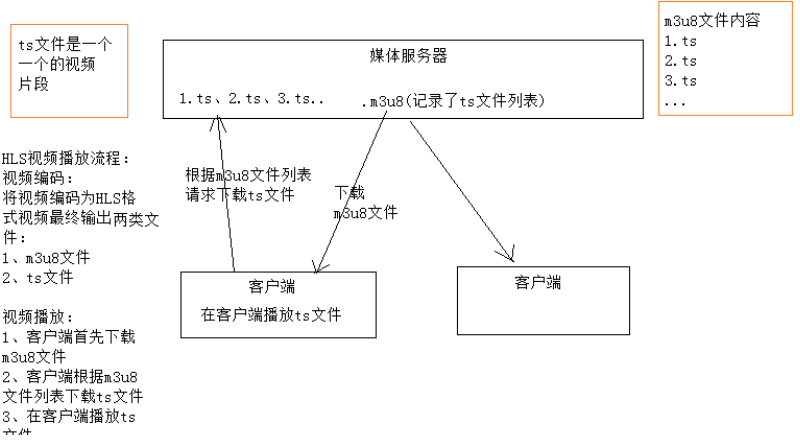
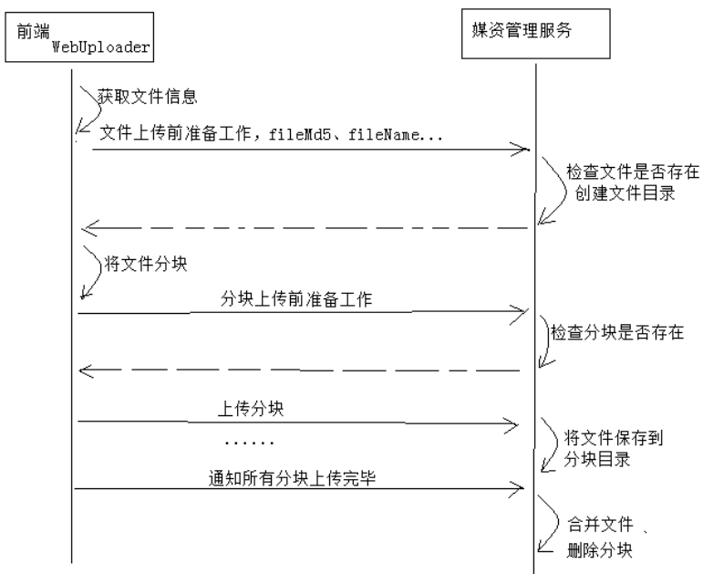

# 13 - 在线学习 HLS

## 一、 视频点播解决方案

### 1.1、 流媒体

```properties
流媒体（streaming media）是指: 将一连串的媒体数据压缩后，经过网上分段发送数据，在网上即时传输影音以供观赏的一种技术与过程，此技术使得数据包得以像流水一样发送；如果不使用此技术，就必须在使用前下载整个媒体文件。

流媒体文件一般定义在bit层次结构，因此流数据包并不一定必须按照字节对齐，虽然通常的媒体文件都是按照这种字节对齐的方式打包的。流媒体的三大操作平台是微软公司、RealNetworks、苹果公司提供的。
```

概括理解：流媒体就是将视频文件分成许多小块儿，将这些小块儿作为数据包通过网络发送出去，实现一边传输视
频 数据 包一边观看视频。

> 流媒体：边下载边播放！

- #### 流式传输

  流式传输包括如下两种方式：
  1） 顺序流式传输
  即顺序下载音、视频文件，可以实现边下载边播放，不过，用户只能观看已下载的视频内容，无法快进到未
  下载的视频部分，顺序流式传输可以使用Http服务器来实现，比如Nginx、Apache等。
  2）实时流式传输
  实时流式传输可以解决顺序流式传输无法快进的问题，它与Http流式传输不同，它必须使用流媒体服务器并
  且使用流媒体协议来传输视频，它比Http流式传输复杂。常见的实时流式传输协议有RTSP、RTMP、RSVP
  等。

### 1.2、点播方案

本项目包括点播和直播两种方式，我们先调研点播的方案，如下：
1、 播放器通过 http协议从http服务器上下载视频文件进行播放
问题：必须等到视频下载完才可以播放，不支持快进到某个时间点进行播放
2、 播放器通过rtmp协议连接媒体服务器以实时流方式播放视频
使用rtmp协议需要架设媒体服务器，造价高，对于直播多采用此方案。
3、 播放器使用HLS协议连接http服务器（Nginx、Apache等）实现近实时流方式播放视频。HLS协议规定：基于Http协议，视频封装格式为ts，视频的编码格式为H264,音频编码格式为MP3、AAC或者AC-3。

#### HLS是什么？

```
HLS (HTTP Live Streaming)是Apple的动态码率自适应技术。主要用于PC和Apple终端的音视频服务。包括一个m3u(8)的索引文件，TS媒体分片文件和key加密串文件。
```

HLS的工作方式是：将视频拆分成若干ts格式的小文件，通过m3u8格式的索引文件对这些ts小文件建立索引。一般10秒一个ts文件，播放器连接m3u8文件播放，当快进时通过m3u8即可找到对应的索引文件，并去下载对应的ts文件，从而实现快进、快退以近实时 的方式播放视频。
IOS、Android设备、及各大浏览器都支持HLS协议。




## 二、视频编码

### 2.1、  视频编码格式

首先我们要分清文件格式和编码格式：

##### 文件格式：

是指.mp4、.avi、.rmvb等 这些不同扩展名的视频文件的文件格式 ，视频文件的内容主要包括视频和音频，其文件格式是按照一 定的编码格式去编码，并且按照该文件所规定的封装格式将视频、音频、字幕等信息封装在一起，播放器会根据它们的封装格式去提取出编码，然后由播放器解码，最终播放音视频。

##### 音视频编码格式：

通过音视频的压缩技术，将视频格式转换成另一种视频格式，通过视频编码实现流媒体的传输。
比如：一个.avi的视频文件原来的编码是a，通过编码后编码格式变为b，音频原来为c，通过编码后变为d。

##### 音视频编码格式各类繁多，主要有几下几类：

MPEG系列 （由ISO[国际标准组织机构]下属的MPEG[运动图象专家组]开发 ）视频编码方面主要是Mpeg1（vcd用
的就是它）、Mpeg2（DVD使用）、Mpeg4（的DVDRIP使用的都是它的变种，如：divx，xvid等）、Mpeg4
AVC（正热门）；音频编码方面主要是MPEG Audio Layer 1/2、MPEG Audio Layer 3（大名鼎鼎的mp3）、
MPEG-2 AAC 、MPEG-4 AAC等等。注意：DVD音频没有采用Mpeg的。

H.26X系列 （由ITU[国际电传视讯联盟]主导，侧重网络传输，注意：只是视频编码） 包括H.261、H.262、
H.263、H.263+、H.263++、H.264（就是MPEG4 AVC-合作的结晶）

目前最常用的编码标准是视频H.264，音频AAC。

### 2.2、FFmpeg  的基本使用

```
FFmpeg是一套可以用来记录、转换数字音频、视频，并能将其转化为流的开源计算机程序。采用LGPL或GPL许可证。它提供了录制、转换以及流化音视频的完整解决方案。它包含了非常先进的音频/视频编解码库libavcodec，为了保证高可移植性和编解码质量，libavcodec里很多code都是从头开发的。

FFmpeg在Linux平台下开发，但它同样也可以在其它操作系统环境中编译运行，包括Windows、Mac OS X等。这个项目最早由Fabrice Bellard发起，2004年至2015年间由Michael Niedermayer主要负责维护。许多FFmpeg的开发人员都来自MPlayer项目，而且当前FFmpeg也是放在MPlayer项目组的服务器上。项目的名称来自MPEG视频编码标准，前面的"FF"代表"Fast Forward"。 
```

下载：FFmpeg https://www.ffmpeg.org/download.html#build-windows

简单的测试：
将一个.avi文件转成mp4、mp3、gif等。

比如我们将lucene.avi文件转成mp4，运行如下命令：

ffmpeg -i lucene.avi lucene.mp4

转成mp3：ffmpeg -i lucene.avi lucene.mp3

转成gif：ffmpeg -i lucene.avi lucene.gif


### 2.3、生成m3u8/ts文件

使用ffmpeg生成 m3u8的步骤如下：

> ##### 为啥两步，实际经验，分两步走，视频播放流畅！当然也可以直接avi --> ts，效果要差些！

##### 第一步：先将avi视频转成mp4

```shell
$  ffmpeg.exe -i  E:\xuecheng\develop\lucene.avi -c:v libx264 -s 1280x720 -pix_fmt yuv420p -b:a 63k -b:v 753k -r 18 E:\xuecheng\develop\lucene.mp4
```

##### 第二步：将mp4生成m3u8, 切割成多个m3u8多个文件；

```shell
$ ffmpeg -i  E:/xuecheng/develop/lucene.mp4   -hls_time 10 -hls_list_size 0  -hls_segment_filename E:/xuecheng/develop/video/lucene_%05d.ts E:/xuecheng/develop/video/lucene.m3u8
```

- ##### 码率的设置

  码率又叫比特率即每秒传输的bit数，单位为bps(Bit Per Second)，码率越大传送数据的速度越快。
  码率的计算公式是：文件大小（转成bit）/ 时长（秒）/1024 = kbps 即每秒传输千位数
  例如一个1M的视频，它的时长是10s，它的码率等于

  ```properties
  1*1024*1024*8/10/1024 = 819Kbps
  ```

> ##### 视频平均码率要求：
>
> 普清大于0.56mbps ，高清大于0.9Mbps ，超清大于2.1Mbps （1080p）


## 三、播放器

视频编码后要使用播放器对其进行解码、播放视频内容。在web应用中常用的播放器有flash播放器、H5播放器或
浏览器插件播放器，其中以flash和H5播放器最常见。
flash播放器：缺点是需要在客户机安装Adobe Flash Player播放器，优点是flash播放器已经很成熟了，并且浏览
器对flash支持也很好。
H5播放器：基于h5自带video标签进行构建，优点是大部分浏览器支持H5，不用再安装第三方的flash播放器，并
且随着前端技术的发展，h5技术会越来越成熟。
本项目采用H5播放器，使用Video.js开源播放器。
Video.js是一款基于HTML5世界的网络视频播放器。它支持HTML5和Flash视频，它支持在台式机和移动设备上播
放视频。这个项目于2010年中开始，目前已在40万网站使用。
官方地址：http://videojs.com/


## 四、媒资管理

### 4.1、 上传文件

- #### 断点续传解决方案

  通常视频文件都比较大，所以对于媒资系统上传文件的需求要满足大文件的上传要求。http协议本身对上传文件大小没有限制，但是客户的网络环境质量、电脑硬件环境等参差不齐，如果一个大文件快上传完了网断了，电断了没有上传完成，需要客户重新上传，这是致命的，所以对于大文件上传的要求最基本的是断点续传。

  ##### 什么是断点续传：

  引用百度百科：断点续传指的是在下载或上传时，将下载或上传任务（一个文件或一个压缩包）人为的划分为几个部分，每一个部分采用一个线程进行上传或下载，如果碰到网络故障，可以从已经上传或下载的部分开始继续上传下载未完成的部分，而没有必要从头开始上传下载，断点续传可以提高节省操作时间，提高用户体验性。

  ##### 上传流程如下：

  ##### 1、上传前先把文件分成块

  ##### 2、一块一块的上传，上传中断后重新上传，已上传的分块则不用再上传

  ##### 3、各分块上传完成最后合并文件

  文件下载则同理。

- #### 文件分块与合并

  文件分块的流程如下：
  1、获取源文件长度
  2、根据设定的分块文件的大小计算出块数
  3、从源文件读数据依次向每一个块文件写数据。

  ```java
  //测试文件分块方法
  @Test
  public void testChunk() throws IOException {
      File sourceFile = new File("F:/develop/ffmpeg/lucene.mp4");
      //        File sourceFile = new File("d:/logo.png");
      String chunkPath = "F:/develop/ffmpeg/chunk/";
      File chunkFolder = new File(chunkPath);
      if(!chunkFolder.exists()){
          chunkFolder.mkdirs();
      }
      //分块大小
      long chunkSize = 1024*1024*1;
      //分块数量
      long chunkNum = (long) Math.ceil(sourceFile.length() * 1.0 / chunkSize );
      if(chunkNum<=0){
          chunkNum = 1;
      }
      //缓冲区大小
      byte[] b = new byte[1024];
      //使用RandomAccessFile访问文件
      RandomAccessFile raf_read = new RandomAccessFile(sourceFile, "r");
      //分块
      for(int i=0;i<chunkNum;i++){
          //创建分块文件
          File file = new File(chunkPath+i);
          boolean newFile = file.createNewFile();
          if(newFile){
              //向分块文件中写数据
              RandomAccessFile raf_write = new RandomAccessFile(file, "rw");
              int len = ‐1;
              while((len = raf_read.read(b))!=‐1){
                  raf_write.write(b,0,len);
                  if(file.length()>chunkSize){
                      break;
                  }
              }
              raf_write.close();
          }
      }
      raf_read.close();
  }
  ```

  > #### 注意：
  >
  > 1、主要使用的API：RandomAccessFile。
  >
  > 2、分块合并时，文件名的顺序可能不一致，所以一定要对文件进行排序；
  >
  > #### 文件断点上传下载详解：


### 4.2、WebUploader介绍

如何在web页面实现断点续传？

常见的方案有：

1、通过Flash上传，比如SWFupload、Uploadify。

2 、安装浏览器插件，变相的pc客户端，用的比较少。

3、Html5

随着html5的流行，本项目采用Html5完成文件分块上传。

本项目使用WebUploader完成大文件上传功能的开发，WebUploader官网地址：
http://fexteam.gz01.bdysite.com/webuploader/

##### 使用WebUploader上传流程如下：



本项目使用如下钩子方法：

1）before-send-file
在开始对文件分块儿之前调用，可以做一些上传文件前的准备工作，比如检查文件目录是否创建完成等。

2 ）before-send
在上传文件分块之前调用此方法，可以请求服务端检查分块是否存在，如果已存在则此分块儿不再上传。(相当于断点)

3）after-send-file
在所有分块上传完成后触发，可以请求服务端合并分块文件。


