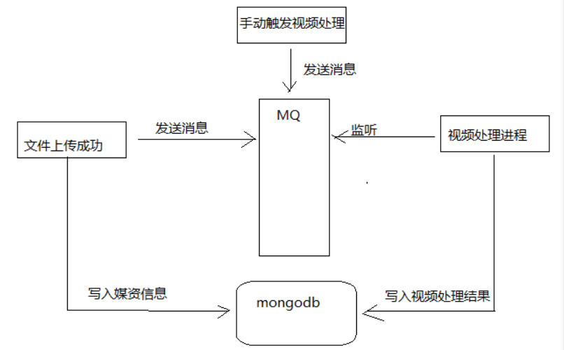

# 14 - 媒资管理

### 一、视频上传及处理流程



### 1、视频处理进程

使用java提供的： Runtime类， ProcessBuilder类来实现！

```java
@Test
public void testFFmpeg() throws IOException {
    //创建processBuilder对象
    ProcessBuilder processBuilder = new ProcessBuilder();
    //设置第三方应用程序的命令
    List<String> command = new ArrayList<>();
    command.add("D:\\Program Files\\ffmpeg-20180227-fa0c9d6-win64-static\\bin\\ffmpeg.exe");
    command.add("-i");
    command.add("E:\\ffmpeg_test\\1.avi");
    command.add("-y");//覆盖输出文件
    command.add("-c:v");
    command.add("libx264");
    command.add("-s");
    command.add("1280x720");
    command.add("-pix_fmt");
    command.add("yuv420p");
    command.add("-b:a");
    command.add("63k");
    command.add("-b:v");
    command.add("753k");
    command.add("-r");
    command.add("18");
    command.add("E:\\ffmpeg_test\\1.mp4");
    processBuilder.command(command);

    //将标准输入流和错误流合并
    processBuilder.redirectErrorStream(true);
    //启动一个进程
    Process process = processBuilder.start();

    //通过标准输入流来拿到正常和错误的信息
    InputStream inputStream = process.getInputStream();

    //转成字符流
    InputStreamReader reader = new InputStreamReader(inputStream,"gbk");
    //缓冲
    char[] chars = new char[1024];
    int len = -1;
    while ((len = reader.read(chars))!=-1){
        String string = new String(chars,0,len);
        System.out.println(string);
    }
    inputStream.close();
    reader.close();
}
```


### 2、视频处理并发设置

代码中使用@RabbitListener注解指定消费方法，默认情况是单线程监听队列，可以观察当队列有多个任务时消费
端每次只消费一个消息，单线程处理消息容易引起消息处理缓慢，消息堆积，不能最大利用硬件资源。
可以配置mq的容器工厂参数，增加并发处理数量即可实现多线程处理监听队列，实现多线程处理消息。

- ##### 在RabbitmqConfig.java中添加容器工厂配置：

  ```java
  //消费者并发数量
  public static final int DEFAULT_CONCURRENT = 10;
  @Bean("customContainerFactory")
  public SimpleRabbitListenerContainerFactory
  containerFactory(SimpleRabbitListenerContainerFactoryConfigurer configurer, 
                   ConnectionFactory connectionFactory) {
    SimpleRabbitListenerContainerFactory factory = new SimpleRabbitListenerContainerFactory();
    factory.setConcurrentConsumers(DEFAULT_CONCURRENT);
    factory.setMaxConcurrentConsumers(DEFAULT_CONCURRENT);
    configurer.configure(factory, connectionFactory);
    return factory;
  }
  ```

- ##### 在@RabbitListener注解中指定容器工厂

  ```java
  //视频处理方法
  @RabbitListener(queues = {"${xc‐service‐manage‐media.mq.queue‐media‐video‐processor}"},
                  containerFactory="customContainerFactory")
  ```


