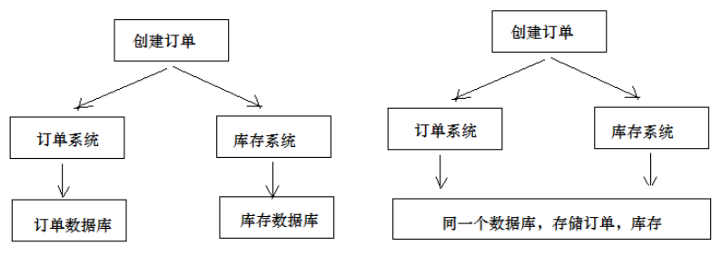
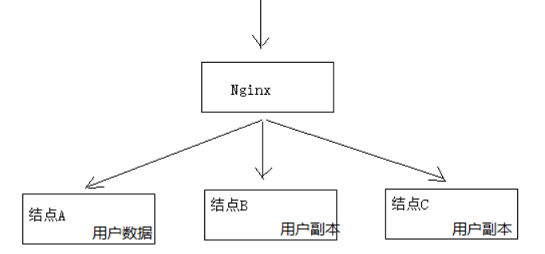
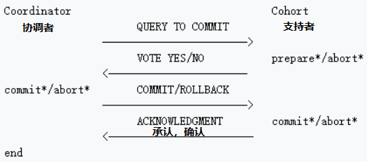

# 19 - 分布式事务

## 一、问题描述

用户支付完成会将支付状态及订单状态保存在订单数据库中，

- 由订单服务去维护订单数据库。
- 而学生选课信息在学习中心数据库，由学习服务去维护学习中心数据库的信息。

如何实现两个分布式服务（订单服务、学习服务）共同完成一件事即订单支付成功自动添加学生选课的需求，这里
的关键是如何保证两个分布式服务的事务的一致性。

```java
@Transactional
订单支付结果通知方法｛
	更新支付表中支付状态为“成功”。    
	远程调用选课接口添加选课记录。    
｝
```

上边的逻辑说明：
1、更新支付表状态为本地数据库操作。
2、远程调用选课接口为网络远程调用请求。
3、为保存事务上边两步操作由spring控制事务，当遇到Exception异常则回滚本地数据库操作。
问题如下：
1、如果更新支付表失败则抛出异常，不再执行远程调用，此设想没有问题。
2、如果更新支付表成功，网络远程调用超时会拉长本地数据库事务时间，影响数据库性能。
3、如果更新支付表成功，远程调用添加选课成功（选课数据库commit成功），最后更新支付表commit失败，此
时出现操作不一致。(开始执行的时候支付服务没有问题，远程调用选课，支付服务即等待commit。选课OK, 整体commit， 选课成功，支付服务突然此时挂了，没有commit. )
上边的问题涉及到分布式事务控制。


## 二、什么是分布式事务

- 在分布式系统中一次操作由多个系统协同完成，这种一次事务操作涉及多个系统通过网络协同完成的过程称为分布式事务。

  这里强调的是多个系统通过网络协同完成一个事务的过程，并不强调多个系统访问了不同的数据库，即使多个系统访问的是同一个数据库也是分布式事务。

  **两种： 第1、多系统多数据库；第2、多系统同一数据库；**

  

- 第3种分布式事务的表现是：一个应用程序使用了多个数据源连接了不同的数据库，当一次事务需要操作多个数据源，此时也属于分布式事务，当系统作了数据库拆分后会出现此种情况。


#### 第一种 分布式事务居多！！！！


### 2.1、分布式事务有哪些场景

1) 电商系统中的下单扣库存
电商系统中，订单系统和库存系统是两个系统，一次下单的操作由两个系统协同完成
2）金融系统中的银行卡充值
在金融系统中通过银行卡向平台充值需要通过银行系统和金融系统协同完成。
3）教育系统中下单选课业务
在线教育系统中，用户购买课程，下单支付成功后学生选课成功，此事务由订单系统和选课系统协同完成。
4） SNS系统的消息发送
在社交系统中发送站内消息同时发送手机短信，一次消息发送由站内消息系统和手机通信系统协同完成。


### 2.2、CAP 理论

如何进行分布式事务控制？CAP理论是分布式事务处理的理论基础，了解了CAP理论有助于我们研究分布式事务的
处理方案。
CAP理论是：分布式系统在设计时只能在一致性(Consistency)、可用性(Availability)、分区容忍性(Partition
Tolerance)中满足两种，无法兼顾三种。



**一致性(Consistency)：**服务A、B、C三个结点都存储了用户数据， 三个结点的数据需要保持同一时刻数据一致
性。

**可用性(Availability)：**服务A、B、C三个结点，其中一个结点宕机不影响整个集群对外提供服务，如果只有服务A结点，当服务A宕机整个系统将无法提供服务，增加服务B、C是为了保证系统的可用性。

**分区容忍性(Partition Tolerance)：**分区容忍性就是允许系统通过网络协同工作，分区容忍性要解决由于网络分区导致数据的不完整及无法访问等问题。

分布式系统不可避免的出现了多个系统通过网络协同工作的场景，结点之间难免会出现网络中断、网延延迟等现
象，这种现象一旦出现就导致数据被分散在不同的结点上，这就是网络分区。

##### 分布式系统能否兼顾C、A、P？

在保证分区容忍性的前提下一致性和可用性无法兼顾，如果要提高系统的可用性就要增加多个结点，如果要保证数
据的一致性就要实现每个结点的数据一致，结点越多可用性越好，但是数据一致性越差。
所以，在进行分布式系统设计时，同时满足“一致性”、“可用性”和“分区容忍性”三者是几乎不可能的。

##### CAP有哪些组合方式？

1、CA：放弃分区容忍性，加强一致性和可用性，关系数据库按照CA进行设计。（不适应分布式了！）

2、AP：放弃一致性，加强可用性和分区容忍性，追求最终一致性，很多NoSQL数据库按照AP进行设计。

##### 	说明：这里放弃一致性是指放弃强一致性，强一致性就是写入成功立刻要查询出最新数据。追求最终一致性是指允许暂时的数据不一致，只要最终在用户接受的时间内数据 一致即可。

​	AP 实例：银行转账，非及时到账模式。 显示24H内转账成功！

3、CP：放弃可用性，加强一致性和分区容忍性，一些强一致性要求的系统按CP进行设计，比如跨行转账，一次转账请求要等待双方银行系统都完成整个事务才算完成。

​	CP实例：手机面对面转账，增强用户体验感，使用CP;

在分布式系统设计中AP的应用较多，即保证分区容忍性和可用性，牺牲数据的强一致性（写操作后立刻读取到最
新数据），保证数据最终一致性。比如：订单退款，今日退款成功，明日账户到账，只要在预定的用户可以接受的
时间内退款事务走完即可。


###  2.3、解决方案

####  - 两阶段提交协议(2PC)

为解决分布式系统的数据一致性问题出现了两阶段提交协议（2 Phase Commitment Protocol），两阶段提交由
协调者和参与者组成，共经过两个阶段和三个操作，部分关系数据库如Oracle、MySQL支持两阶段提交协议，本节讲解关系数据库两阶段提交协议。

参考：
2PC：https://en.wikipedia.org/wiki/Two-phase_commit_protocol



##### 1）第一阶段：准备阶段（prepare）

协调者通知参与者准备提交订单，参与者开始投票。
协调者完成准备工作向协调者回应Yes。

##### 2）第二阶段：提交(commit)/回滚(rollback)阶段

协调者根据参与者的投票结果发起最终的提交指令。
如果有参与者没有准备好则发起回滚指令。


2PC的优点：实现强一致性，部分关系数据库支持（Oracle、MySQL等）。**【相当于串行，等待参与者反馈消息再提交！】**
缺点：整个事务的执行需要由协调者在多个节点之间去协调，增加了事务的执行时间，性能低下。
解决方案有：springboot+Atomikos or  Bitronix

了解：3PC主要是解决协调者与参与者通信阻塞问题而产生的，它比2PC传递的消息还要多，性能不高。

详细参考3PC：https://en.wikipedia.org/wiki/Three-phase_commit_protocol


#### - 事务补偿（TCC）（纯分布式解决方案！）

TCC事务补偿是基于2PC实现的业务层事务控制方案，它是Try、Confirm和Cancel三个单词的首字母，含义如下：

##### 1、Try 检查及预留业务资源：完成提交事务前的检查，并预留好资源。（相当于分别先搭连接！）

下单业务由订单服务和库存服务协同完成，在try阶段订单服务和库存服务完成检查和预留资源。
订单服务检查当前是否满足提交订单的条件（比如：当前存在未完成订单的不允许提交新订单）。
库存服务检查当前是否有充足的库存，并锁定资源。

##### 2、Confirm 确定执行业务操作：对try阶段预留的资源正式执行。（连接之后，再分别告知可以提交！）

订单服务和库存服务成功完成Try后开始正式执行资源操作。
订单服务向订单写一条订单信息。
库存服务减去库存。

##### 3、Cancel 取消执行业务操作：对try阶段预留的资源释放。（双方都成功，那就是成功断开try的连接；若一方失败，协调者先会通知另一方做删除操作或者还原操作，不是事务回滚，因为可能其事务已提交完了。最后再断开try的连接！）

如果订单服务和库存服务有一方出现失败则全部取消操作。
订单服务需要删除新增的订单信息。
库存服务将减去的库存再还原。


##### 优点：最终保证数据的一致性，在业务层实现事务控制，灵活性好。

##### 缺点：开发成本高，每个事务操作每个参与者都需要实现try/confirm/cancel三个接口。

注意：TCC的try/confirm/cancel接口都要实现幂等性，在为在try、confirm、cancel失败后要不断重试。
什么是幂等性？
幂等性是指同一个操作无论请求多少次，其结果都相同。
幂等操作实现方式有：

1、操作之前在业务方法进行判断如果执行过了就不再执行。

2、缓存所有请求和处理的结果，已经处理的请求则直接返回结果。

3 、在数据库表中加一个状态字段（未处理，已处理），数据操作时判断未处理时再处理。


#### - 消息队列实现最终一致

本方案是将分布式事务拆分成多个本地事务来完成，并且由消息队列异步协调完成，如下图：
下边以下单减少库存为例来说明：


1、订单服务和库存服务完成检查和预留资源。
2、订单服务在本地事务中完成添加订单表记录和添加“减少库存任务消息”。
3、由定时任务根据消息表的记录发送给MQ通知库存服务执行减库存操作。
4、库存服务执行减少库存，并且记录执行消息状态（为避免重复执行消息，在执行减库存之前查询是否执行过此
消息）。
5、库存服务向MQ发送完成减少库存的消息。
6、订单服务接收到完成库存减少的消息后删除原来添加的“减少库存任务消息”。
实现最终事务一致要求：预留资源成功理论上要求正式执行成功，如果执行失败会进行重试，要求业务执行方法实
现幂等。

##### 优点 ：

由MQ按异步的方式协调完成事务，性能较高。
不用实现try/confirm/cancel接口，开发成本比TCC低。

##### 缺点：

此方式基于关系数据库本地事务来实现，会出现频繁读写数据库记录，浪费数据库资源，另外对于高并发操作不是
最佳方案。


