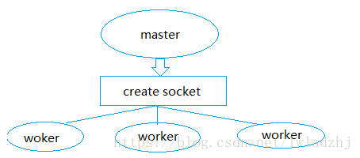

# Nginx详谈

### 一、nginx的作用

1. ##### nginx能做反向代理，那么什么是反向代理呢，举个栗子，我想在本地使用 `www.xxx.com` 的域名去访问 `www.taobao.com`。那么这个时候我们就可以通过nginx去实现。

2. ##### 再者，nginx能实现通过统一域名进入各个分支项目，nginx对请求进行分发，使访问请求达到均衡的目的，解决单台服务器压力。

3. ##### nginx可以解决跨域问题，也可作为隔离层。(服务层访问没有跨域限制！)

4. ##### 服务器 ： nginx可以作为静态页面的服务器，在前后端分离开发中比较常见，如：前台静态资源部署在nginx上，后台服务部署在tomcat服务器中 ；


### 二、nginx工作原理



nginx是支持多线程的方式的，只是我们主流的方式还是多进程的方式，也是nginx的默认方式。

- master进程主要用来管理worker进程，包含：接收来自外界的信号，向各worker进程发送信号，监控worker进程的运行状态，当worker进程退出后(异常情况下)，会自动重新启动新的worker进程。
- worker进程则是处理基本的网络事件。多个worker进程之间是对等的，他们同等竞争来自客户端的请求，各进程互相之间是独立的。一个请求，只可能在一个worker进程中处理，一个worker进程，不可能处理其它进程的请求。
- worker进程的个数是可以设置的，一般我们会设置与机器cpu核数一致。更多的worker数，只会导致进程来竞争cpu资源了，从而带来不必要的上下文切换。而且，nginx为了更好的利用多核特性，具有cpu绑定选项，我们可以将某一个进程绑定在某一个核上，这样就不会因为进程的切换带来cache的失效。 

**进程的优点：**

- 进程之间不共享资源，不需要加锁，所以省掉了锁带来的开销。
- 采用独立的进程，可以让互相之间不会影响，一个进程退出后，其它进程还在工作，服务不会中断，master进程则很快重新启动新的worker进程。

**多线程缺点**

- 多线程在多并发情况下，线程的内存占用大，线程上下文切换造成CPU大量的开销。想想apache的常用工作方式（apache也有异步非阻塞版本，但因其与自带某些模块冲突，所以不常用），每个请求会独占一个工作线程，当并发数上到几千时，就同时有几千的线程在处理请求了。这对操作系统来说，是个不小的挑战，线程带来的内存占用非常大，线程的上下文切换带来的cpu开销很大，自然性能就上不去了，而这些开销完全是没有意义的。

> ##### 上面就显然讲讲清楚，为什么要使用nginx作为静态服务器了，而不是apache 服务器；
>
> ##### 问题： 那是否多线程就没有太多意义了，用进程替换呢？ 


### 三、惊群现象

　　每个worker进程都是从master进程fork过来。在master进程里面，先建立好需要listen的socket之后，然后再fork出多个worker进程，这样每个worker进程都可以去accept这个socket(当然不是同一个socket，只是每个进程的这个socket会监控在同一个ip地址与端口，这个在网络协议里面是允许的)。一般来说，当一个请求（request）连接进来后，所有的worker进程的accept在这个socket上面的进程，都会收到通知，而**只有一个进程可以accept这个连接，其它的则accept失败。**

#### 惊群效应：

> 惊群简单来说就是多个进程或者线程在等待同一个事件，当事件发生时，所有线程和进程都会被内核唤醒。唤醒后通常只有一个进程获得了该事件并进行处理，其他进程发现获取事件失败后又继续进入了等待状态，在一定程度上降低了系统性能。 

具体来说惊群通常发生在服务器的监听等待调用上，服务器创建监听socket，后fork多个进程，在每个进程中调用accept或者epoll_wait等待终端的连接。

accept和epoll_wait在历史上都存在惊群效应，但目前都已经解决了（具体内核版本待查）。accept的惊群效应解决的比较早，至少在我测试的2.6.18的内核上没有遇到惊群问题。epoll_wait的惊群问题在这个patch [epoll: add EPOLLEXCLUSIVE flag 21 Jan 2016](https://link.jianshu.com?t=https://github.com/torvalds/linux/commit/df0108c5da561c66c333bb46bfe3c1fc65905898)已经解决了，通过添加EPOLLEXCLUSIVE标志标识在唤醒时，只唤醒一个等待进程，这个时间比较近没有找对应的内核进行验证（待后续验证）。相比而言，内核在解决accept的惊群时是作为一个问题进行了修复，即无需设置标志，而对epoll_wait则作为添加一个功能选项，这主要是因为accept等待的是一个socket，并且这个socket的连接只能被一个进程处理，内核可以很明确的进行这个预设，因此accept只唤醒一个进程才是更优的选择。而对于epoll_wait，等待的是多个socket上的事件，有连接事件，读写事件等等，这些事件可以同时被一个进程处理，也可以同时被多个进程分别处理，内核不能进行唯一进程处理的假定，因此提供一个设置标志让用户决定。

 

####  nginx如何处理惊群

前面提到内核解决epoll的惊群效应是比较晚的，因此nginx自身解决了该问题（更准确的说是避免了）。其具体思路是：**不让多个进程在同一时间监听接受连接的socket，而是让每个进程轮流监听**，这样当有连接过来的时候，就只有一个进程在监听那肯定就没有惊群的问题。具体做法是：利用一把进程间锁，每个进程中都**尝试**获得这把锁，如果获取成功将监听socket加入wait集合中，并设置超时等待连接到来，没有获得所的进程则将监听socket从wait集合去除。这里只是简单讨论nginx在处理惊群问题基本做法，实际其代码还处理了很多细节问题，例如简单的连接的负载均衡、定时事件处理等等。
 核心的代码如下

 ```c
void ngx_process_events_and_timers(ngx_cycle_t *cycle)
{
    ...
    //这里面会对监听socket处理
    //1、获得锁则加入wait集合
    //2、没有获得则去除
    if (ngx_trylock_accept_mutex(cycle) == NGX_ERROR) {
        return;
    }

    ...

    //设置网络读写事件延迟处理标志，即在释放锁后处理
    if (ngx_accept_mutex_held) {
        flags |= NGX_POST_EVENTS;
    } 

    ...

    //这里面epollwait等待网络事件
    //网络连接事件，放入ngx_posted_accept_events队列
    //网络读写事件，放入ngx_posted_events队列
    (void) ngx_process_events(cycle, timer, flags);

    ...

    //先处理网络连接事件，只有获取到锁，这里才会有连接事件
    ngx_event_process_posted(cycle, &ngx_posted_accept_events);

    //释放锁，让其他进程也能够拿到
    if (ngx_accept_mutex_held) {
        ngx_shmtx_unlock(&ngx_accept_mutex);
    }

    //处理网络读写事件
    ngx_event_process_posted(cycle, &ngx_posted_events);
}
 ```

了解了nginx的避免惊群的原理后，简单写了个例子验证了一下[https://github.com/eesly/thundering_herd_problem](https://link.jianshu.com/?t=https://github.com/eesly/thundering_herd_problem) 从下图结果上看每次只有一个进程被唤醒了wakeup .


### 四、Nginx采用异步非阻塞：

异步的概念和同步相对的，也就是不是事件之间不是同时发生的。

　　非阻塞的概念是和阻塞对应的，阻塞是事件按顺序执行，每一事件都要等待上一事件的完成，而非阻塞是如果事件没有准备好，这个事件可以直接返回，过一段时间再进行处理询问，这期间可以做其他事情。但是，多次询问也会带来额外的开销。

总的来说，Nginx采用异步非阻塞的好处在于：

1. 不需要创建线程每个请求只占用少量的内存
2. 没有上下文切换，事件处理非常轻量 

>  淘宝tengine团队说测试结果是“24G内存机器上，处理并发请求可达200万”。 


