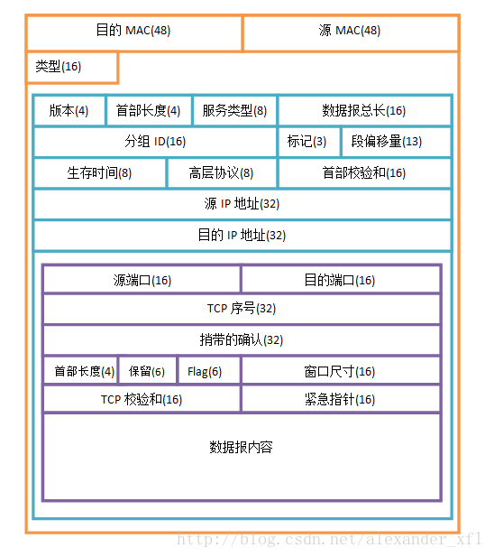

# 网络编程

网络编程知识点大，推荐几本书作为后续学习：

#### 6本经典：

分别是**《TCP/IP详解》三卷本**，**《用TCP/IP进行网际互连》三卷本**，**《TCP/IP指南》**+**《IPv6》四卷本** 其中TCP/IP详解的作者还写了另外2本经典著作，**《Unix环境高级编程》**，**《Unix网络编程：卷1,2》** 

#### 扩展阅读：

《[技术往事：改变世界的TCP/IP协议（珍贵多图、手机慎点）](http://www.52im.net/thread-520-1-1.html)》 

《[UDP中一个包的大小最大能多大？](http://www.52im.net/thread-29-1-1.html)》 

《[Java新一代网络编程模型AIO原理及Linux系统AIO介绍](http://www.52im.net/thread-306-1-1.html)》 

《[NIO框架入门(一)：服务端基于Netty4的UDP双向通信Demo演示](http://www.52im.net/thread-367-1-1.html)》 

《[NIO框架入门(二)：服务端基于MINA2的UDP双向通信Demo演示](http://www.52im.net/thread-373-1-1.html)》 

《[NIO框架入门(三)：iOS与MINA2、Netty4的跨平台UDP双向通信实战](http://www.52im.net/thread-378-1-1.html)》 

《[NIO框架入门(四)：Android与MINA2、Netty4的跨平台UDP双向通信实战](http://www.52im.net/thread-388-1-1.html)》 

《[P2P技术详解(一)：NAT详解——详细原理、P2P简介](http://www.52im.net/thread-50-1-1.html)》 

《[P2P技术详解(二)：P2P中的NAT穿越(打洞)方案详解](http://www.52im.net/thread-542-1-1.html)》 

《[P2P技术详解(三)：P2P技术之STUN、TURN、ICE详解](http://www.52im.net/thread-557-1-1.html)》 

《[通俗易懂：快速理解P2P技术中的NAT穿透原理](http://www.52im.net/thread-1055-1-1.html)》 


本节重点：学习TCP/IP 重要协议、重点HTTP协议！


### 一、计算机网络之TCP/IP协议与HTTP协议的区别

**1、 TPC/IP协议是传输层协议，主要解决数据如何在网络中传输，而HTTP是应用层协议，主要解决如何包装数据。**

**2、 术语TCP/IP代表传输控制协议/网际协议，指的是一系列协议。 为什么叫TCP/IP协议呢？ 因为里面有两个最核心的协议：TCP协议，IP协议！**

若要说区别：那么就应该是对比TCP、IP、HTTP协议之间的区别了！

 网络有一段比较容易理解的介绍：“我们在传输数据时，可以只使用（传输层）TCP/IP协议，但是那样的话，如果没有应用层，便无法识别数据内容，如果想要使传输的数据有意义，则必须使用到应用层协议，应用层协议有很多，比如HTTP、FTP、TELNET等，也可以自己定义应用层协议。WEB使用HTTP协议作应用层协议，以封装HTTP 文本信息，然后使用TCP/IP做传输层协议将它发到网络上。”

“IP”代表网际协议，TCP和UDP使用该协议从一个网络传送数据包到另一个网络。把**IP想像成一种高速公路**，它允许其它协议在上面行驶并找到到其它电脑的出口。**TCP和UDP是高速公路上的“卡车”，它们携带的货物就是像HTTP**，文件传输协议FTP这样的协议等。 

 你应该能理解，TCP和UDP是FTP，HTTP和SMTP之类使用的传输层协议。虽然TCP和UDP都是用来传输其他协议的，它们却有一个显著的不同：TCP提供有保证的数据传输，而UDP不提供。这意味着TCP有一个特殊的机制来确保数据安全的不出错的从一个端点传到另一个端点，而UDP不提供任何这样的保证。

 HTTP(超文本传输协议)是利用TCP在两台电脑(通常是Web服务器和客户端)之间传输信息的协议。客户端使用Web浏览器发起HTTP请求给Web服务器，Web服务器发送被请求的信息给客户端。


#### 二、OSI模型 vs TCP/IP 四层模型


####  OSI模型

​	即开放式通信系统互联参考模型(Open System Interconnection,OSI/RM,Open Systems Interconnection Reference Model)，是国际标准化组织(ISO)提出的一个试图使各种计算机在世界范围内互连为网络的标准框架，简称OSI。 

#### TCP/IP参考模型的层次结构 

　　TCP/IP协议栈是美国国防部高级研究计划局计算机网（Advanced Research Projects Agency Network，ARPANET）和其后继因特网使用的参考模型。ARPANET是由美国国防部（U.S．Department of Defense，DoD）赞助的研究网络。最初，它只连接了美国境内的四所大学。随后的几年中，它通过租用的电话线连接了数百所大学和政府部门。最终ARPANET发展成为全球规模最大的互连网络-因特网。最初的ARPANET于1990年永久性地关闭。　

```properties
定义：
TCP/IP协议（传输控制协议/互联网协议）不是简单的一个协议，而是一组特别的协议，包括：TCP，IP，UDP，ARP等，这些被称为子协议。在这些协议中，最重要、最著名的就是TCP和IP。因此，大部分网络管理员称整个协议族为“TCP/IP”。
```


再看《UNIX网络编程-卷1：套接字联网API》。

  TCP/IP协议族是一个四层协议系统：


1. #### 数据链路层

    1.1 作用 
      (1) 实现网卡接口的网络驱动，以处理数据在以太网线等物理媒介上的传输 
      (2) 网络驱动程序隐藏了不同物理网络的不同电气特性，为上层协议提供一个统一的接口 
    1.2 协议应用 
      ARP和RARP(Reverse Address Resolve Protocol)即逆地址解析协议，该协议实现了IP地址和物理地址(MAC地址)之间的转换

2. #### 网络层

    2.1 作用 
      网络有分局域网(LAN, Local Area Network)和广域网(WAN, Wide Area Network)。对于后者通常需要使用众多分级的路由器来连接分散的主机或者LAN，即通讯的两台主机一般不是直接连接，而是通过多个中间节点(路由器)连接的，从而形成网络拓扑连接。 
      (1) 网络层的任务之一就是选择这些中间节点，以确定两台主机间的通讯路径。 
      (2) 其次网络层对上层协议隐藏了网络拓扑连接的细节，在使得传输层看来通讯双方是直接连接的 
    2.2 协议应用 
      (1) IP协议: IP协议(Internet Protocol)是网络层最核心的协议，它根据数据包的目的IP地址来决定如何投递该数据包。若数据包不可直接发送给目标主机，那么IP协议就为它寻找一个合适的下一跳路由器，并将数据包交付给该路由器去转发，如此循环直至到达目标主机或者发送失败而丢弃该数据包。 
      (2) ICMP协议: ICMP协议(Internet Control Message Protocol，因特网控制报文协议)是IP协议的补充，用于检测网络的连接状态，如ping应用程序就是ICMP协议的使用。ICMP包发送是不可靠的，所以不能依靠接收ICMP包解决网络问题；ICMP与TCP/UDP不同，它们是传输层协议，虽然都具有类型域和代码域，但是前者和后者不同，ping用到的ICMP协议，不是端口。ICMP协议使用的是IP协议而非使用下层协议提供的的服务，所以严格来讲它并非网络层协议，而是网络层程序。

3. #### 传输层

    3.1 作用 
      传输层的作用是为应用程序提供端对端通讯的”错觉”，即为应用程序隐藏了数据包跳转的细节，负责数据包的收发、链路超时重连等。 

    3.2 协议应用 
      (1) TCP协议: TCP协议(Transmission Control Protocol, 传输控制协议)为应用程序提供可靠的、面向连接的、基于流的服务，具有超时重传、数据确认等方式来确保数据包被正确发送到目的端。因此TCP服务是可靠的，使用TCP协议通讯的双方必须先建立起TCP连接，并在系统内核中为该连接维持一些必要的数据结构，比如连接的状态，读写缓冲区，多个定时器等。当通讯结束时双方必须关闭连接以释放这些内核数据。基于流发送意思是数据是没有长度限制，它可源源不断地从通讯的一段流入另一端。 
      (2) UDP协议: UDP协议(User Datagram Protocol, 用户数据报协议)与TCP协议相反，它为应用程序提供的是不可靠的、无连接的基于数据报的服务。 
      无连接: 通讯双方不保持一个长久的联系，因此应用程序每次发送数据都要明确指定接收方的地址； 
      基于数据报的服务: 这是相对于数据流而言的，每个UDP数据报都有一个长度，接收端必须以该长度为最小单位将其内容一次性读出，否则数据将被截断。 
      UDP不具有发送时是被重发功能，所以UDP协议在内核实现中无需为应用程序的数据保存副本，当UDP数据报被成功发送之后，UDP内核缓冲区中该数据报就被丢弃了。 
      (3) SCTP协议: SCTP(Stream Control Transmission Protocol, 流控制传输协议)是为了在因特网上传输电话信号而设计的。

4. #### 应用层

    4.1 作用 
      前面所述的三层负责处理网络通讯的相关细节，这部分需要稳定高效，因此它们是在操作系统的内核空间中，而应用层是在用户空间实现的，负责处理众多业务逻辑，如文件传输、网络管理。 

    4.2 协议应用 
      应用层的协议很多，如： 
      (1) telne协议: 远程登录协议，它使我们能在本地完成远程任务 
      (2) OSPF协议: OSPF协议(Open Shorttest Path First, 开放最短路径优先)是一种动态路由更新协议，用于路由器之间的通讯，以告知对方自身的路由信息 
      (3) DNS协议: DNS协议(Domain Name Service, 域名服务)提供机器域名到IP地址的转换。如百度的机器域名是www.baidu.com，对应的IP地址是http://119.75.217.109/。 
    另外注意，ping是应用程序而非协议，它利用网络层的ICMP协议监测网络连接。 
    应用层协议可以跳过传输层直接使用网络层提供的服务，比如ping程序和OSPF协议；又可以既使用TCP服务，又可以使用UDP服务，如DNS协议。在/etc/services文件中可以看到应用程序使用的协议: 
> #### 核心协议：
>
> **一、IP协议**
>
> 网际协议IP是TCP/IP的心脏，也是网络层中最重要的协议。
>
> 【IP层】接收由更低层（[网络接口层](https://baike.baidu.com/item/%E7%BD%91%E7%BB%9C%E6%8E%A5%E5%8F%A3%E5%B1%82/8338972)，例如以太网设备驱动程序）发来的数据包，并把该[数据包](https://baike.baidu.com/item/%E6%95%B0%E6%8D%AE%E5%8C%85/489739)发送到更高层——TCP或UDP层；相反，IP层也把从TCP或UDP层接收来的数据包传送到更低层。IP数据包是不可靠的，因为IP并没有做任何事情来确认数据包是按顺序发送的或者没有被破坏。IP数据包中含有发送它的主机的地址（源地址）和接收它的主机的地址（目的地址）。
>
> 高层的TCP和UDP服务在接收数据包时，通常假设包中的源地址是有效的。也可以这样说，IP地址形成了许多服务的认证基础，这些服务相信数据包是从一个有效的主机发送来的。IP确认包含一个选项，叫作IPsource routing，可以用来指定一条源地址和目的地址之间的直接路径。对于一些TCP和UDP的服务来说，使用了该选项的IP包好像是从路径上的最后一个系统传递过来的，而不是来自于它的真实地点。这个选项是为了测试而存在的，说明了它可以被用来欺骗系统来进行平时是被禁止的连接。因此，许多依靠IP源地址做确认的服务将产生问题并且会被非法入侵。
>
> **二、TCP协议**
>
> 如果IP数据包中有已经封好的TCP数据包，那么IP将把它们向“上”传送到TCP层。
>
> TCP将包排序并进行错误检查，同时实现[虚电路](https://baike.baidu.com/item/%E8%99%9A%E7%94%B5%E8%B7%AF/1609903)间的连接。TCP数据包中包括序号和确认，所以未按照顺序收到的包可以被排序，而损坏的包可以被重传。
>
> TCP将它的信息送到更高层的应用程序，例如，Telnet的服务程序和客户程序。应用程序轮流将信息送回TCP层，TCP层便将它们向下传送到IP层，设备驱动程序和物理介质，最后到接收方。
>
> 面向连接的服务（例如Telnet、FTP、rlogin、XWindows和SMTP）需要高度的可靠性，所以它们使用了TCP。DNS在某些情况下使用TCP（发送和接收域名数据库），但使用UDP传送有关单个主机的信息。
>
> **三、UDP协议**
>
> UDP与TCP位于同一层，但对于数据包的顺序错误或重发。因此，UDP不被应用于那些使用虚电路的面向连接的服务，UDP主要用于那些面向查询一应答的服务，例如NFS。相对于FTP或Telnet，这些服务需要交换的信息量较小。使用UDP的服务包括NTP（网络时间协议）和DNS（DNS也使用TCP）。
>
> 欺骗UDP包比欺骗TCP包更容易，因为UDP没有建立初始化连接（也可以称为握手）（因为在两个系统间没有虚电路），也就是说，与UDP相关的服务面临着更大的危险。
>
> **四、ICMP协议**
>
> ICMP与IP位于同一层，它被用来传送IP的控制信息。它主要是用来提供有关通向目的地址的路径信息。ICMP的“Redirect”信息通知主机通向其他系统的更准确的路径，而“Unreachable”信息则指出路径有问题。另外，如果路径不可用了，ICMP可以使TCP连接“体面地”终止。PING是最常用的基于ICMP的服务。


## 三、Http请求网络传输分析

http协议是基于TCP协议，每次http请求都会进行3次TCP握手，而断开连接则需要TCP 4次握手！

why? 

### 3.1、先了解TCP/IP报文格式：数据报为传输基本单位！


> 1. 数据包在传输过程中是以数据帧的形式传输的，数据帧由帧头+IP头+TCP/UDP头+数据+帧校验(FCS)组成；
> 2. 在每一个路由器上帧头与帧校验都会变化以适应不同的链路，其他内容基本不变；
> 3. 所有数据都是以二进制数据进行编码的，根据各个链路类型在不同的物理链路上编码传输。



选项，而TCP数据段中的校验和字段是必须有的。

图中括号中的数字代表的是当前域所占的空间大小，单位是bit位。

黄色的是数据链路层的头部，一共14字节 (1字节 = 8bit)

绿色的部分是IP头部，一般是20字节

紫色部分是TCP头部，一般是20字节;


#### UDP报文格式：


- 源、目标端口号字段：占16比特。作用与TCP数据段中的端口号字段相同，用来标识源端和目标端的应用进程。
- 长度字段：占16比特。标明UDP头部和UDP数据的总长度字节。
- 校验和字段：占16比特。用来对UDP头部和UDP数据进行校验。和TCP不同的是，对UDP来说，此字段是可


#### 3.2、TCP/IP通信过程：

```
在网络通信的过程中，将发出数据的主机称为源主机，接收数据的主机称为目的主机。

当源主机发出数据时，数据在源主机中从上层向下层传送。

1- 源主机中的应用进程先将数据交给应用层，应用层加上必要的控制信息就成了报文流 (这里就反映出应用进程与硬件传输是IO流形式，因为数据最后要通过网络硬件往外发送。然后在应用层上，使用对应协议FTP，HTTP等封装成报文流。)

2- 向下传给传输层。传输层将收到的数据单元加上本层的控制信息，形成报文段、数据报，再交给网际层。（这一层使用的是TCP、UDP协议对数据再封装成数据报！）

3- 网际层加上本层的控制信息，形成IP数据报，传给网络接口层。（这一层使用IP协议对数据再次封装成IP数据报）；

4- 网络接口层将网际层交下来的IP数据报组装成帧（数据链路层：将数据报封装成ethernet帧），并以比特流的形式传给网络硬件（即物理层），数据就离开源主机。

通过网络传输，数据到达目的主机后，按照与源主机相反的过程，在目的主机中从下层向上层进行拆包传送。首先由网络接口层接收数据，依次剥离原来加上的控制信息，最后将源主机中的应用进程发送的数据交给目的主机的应用进程。

TCP/IP协议的基本传输单位是数据报（Datagram），TCP协议负责把数据分成若干个数据报，并给每个数据报加上报头，报头上有编号，以保证目的主机能将数据还原为原来的格式。IP协议在每个报头上再加上接收端主机IP地址，这样数据能找到自己要去的地方。如果传输过程中出现数据失真、数据丢失等情况，TCP协议会自动请求重新传输数据，并重组数据报。可以说，IP协议保证数据的传输，TCP协议保证数据传输的质量。

TCP/IP协议数据在传输时每通过一层就要在数据上加个报头，其中的数据供接收端同一层协议使用，而在接收端，每经过一层要把用过的报头去掉，这样可以保证传输数据的一致性。
```


### 3.3、TCP连接的3次握手


a. 首先客户端主机向服务器主机发送 SYN = 1，随机产生顺序号码seq number = x 的**数据包**到服务器。
这里的含义是说：首先客户端发送联机请求（注意是联机，不是建立链接），然后发送seq number =x的数值到服务端。这里发送这个数值是为了得到服务端返回值的时候确认是否建立链接。这里的规则是在b中返回的ack number为x+1。

b. 服务器主机收到请求后，通过 syn = 1, 确定客户端主机请求建立连接 ，然后向客户端主机发送SYN = 1 , seq = y(服务器产生的随机随机号码), ack = x+ 1， ACK = 1 。我们注意到这里不仅返回了ack number，也返回了一个seq number，注意这里的seq = y，这里的值为了客户端发送第二次请求的时候（也就是步骤c）服务端再次验证，验证节客户端成功接收到了客户端的请求。

c. 客户端主机收到后检查ack number是否正确，即第一次发送seq number + 1(x + 1), 如果正确，客户端主机会在发送 seq = x + 1, ack = y + 1, ACK = 1.服务端主机会在接受请求后确认seq, ack的值是否正确，如果正确的话，就建立连接。当客户端验证了ack number的值正确（接着a步骤的规则），然后发送ack = y + 1,这里是为什么是seq = x +1, ack = y + 1。因为客户端和服务端序列号的开始值是不一样的。客户端发送seq number其实都是以x为基准在发送，因为这样才能够保证客户端的序列号正常。发送ack则是以服务端发送的序列号为基准，因为这个是用于服务端去验证，所以它的基准就是y了。反之，服务度发送seq numer则是以服务端序列号为基准，发送ack muber则是以客户端为基准。

一句话，不管客户端还是服务端，seq number 都是对应着自己的序列号，ack number则是要发给对方进行验证的，则是以对方序列号为基准。不知道这样说大家能不能理解。（这也是我自己的理解，有疑问可以提出来）。

>标志位表示当前数据包的类型：
>SYN: synchronous建立联机
>ACK: acknowledgement确认 (只能为1)
>PSH: push传送
>FIN: finish结束
>RST: reset重置
>URG: urgent紧急

3次握手目的：

**主要是为了防止已失效的连接请求报文段突然又传到了对方,因而产生错误。为什么呢？假设客户端发送请求到服务端不知什么原因没有达到。但是客户端在发送这个请求之后还会发其他的请求，这个时候的序列号已经发生了变化，然后客户端发现之前的请求没有响应，然后带着新的seq number去发送，然后通过三次链接双方记录了对方的序列号。然后在server 接受客户端请求的时候，发现有两个请求到达，这个时候服务端可以通过当前的序列号进行判断，哪一个是符合自身当前序列号的进行区分，这样就避免了失效的请求。第二方面我认为还是双方进行对方序列号的认知过程。**

> 比喻说明：
>
> 第1次，相当于A 告诉 B 我要来你家，并发送了信物用来确认后续路线及B是否在家没；
>
> 第2次，就是B 回复 A ,你可以来呀，并按A 信物的内容做改动 （确定是B，而非拦截的土匪）+ 自己的信物 发送（用于第3次握手用，B确认A是否瞎搞） ；
>
> 第3次，A 回复 B, 好了我来了。此时带了信物。 B经过确认，是A呀，把门打开，即可通信了！


### 3.4、四次挥手（双方都有可能开始断开连接）


a. 数据传输结束后，主机A向主机B发送释放连接请求。FIN = 1，序号seq就是对方发送下一次请求的序列号，这里因为是断开连接tcp长度为0，所以就是对方的当前序列号加上1(u).
b. 主机B收到释放连接通知后发出确认信息，ack = u +１，这样Ａ到Ｂ的连接就释放了，此时的连接处于半关闭状态。因为Ｂ还可以向Ａ发送数据。
c. 在数据B向主机A的数据发送结束后，主机B会向主机A发送释放连接请求. FIN =1, ack仍然等于u + 1， 因为这段时间没有A向B发送数据，序号seq等于以传送数据的最后一个字节的序号加1(v).

d. 主机A接受到书记B释放连接请求之后，将ACK = 1, ack = w + 1, seq = u + 1.这样所有的连接都已经关闭，整个连接才算关闭。

##### 1- 为什么需要四次挥手断开连接？  保证双反都已经没有数据发送。

##### 2- 四次挥手TIME_WAIT状态需要经过2MSL(最大报文段生存时间)之后close

​	a. 为了保证A发送的最有一个ACK报文段能够到达B。
	b. 为了防止三次握手发生的已失效的请求报文段发生在本次连接中。

**(数据传输是以数据包形式，相当于数据被拆分成无数个数据包。传输过程中，是连续的，报文存活最大时间是2MSL， 若超过这个时间，那么网络就认为不是一个数据了。)**


## 四、Ethernet 

**以太网（Ethernet）**是一种**[计算机局域网]**技术。[IEEE](https://baike.baidu.com/item/IEEE)组织的IEEE 802.3标准制定了以太网的技术标准，它规定了包括物理层的连线、电子信号和介质访问层协议的内容。以太网是目前应用最普遍的局域网技术，取代了其他局域网标准如[令牌环](https://baike.baidu.com/item/%E4%BB%A4%E7%89%8C%E7%8E%AF)、[FDDI](https://baike.baidu.com/item/FDDI)和[ARCNET](https://baike.baidu.com/item/ARCNET)。 

以太网实现了网络上无线电系统多个节点发送信息的想法，每个节点必须获取电缆或者信道的才能传送信息，有时也叫作**以太（Ether）**。每一个节点有全球唯一的48位地址也就是制造商分配给网卡的[MAC地址](https://baike.baidu.com/item/MAC%E5%9C%B0%E5%9D%80)，以保证以太网上所有节点能互相鉴别。由于以太网十分普遍，许多制造商把以太网卡直接集成进[计算机主板](https://baike.baidu.com/item/%E8%AE%A1%E7%AE%97%E6%9C%BA%E4%B8%BB%E6%9D%BF)。 

> **Ethernet是以太网，是目前部署最广泛的局域网，而Internet是指国际互联网，是由全世界的局域网、城域网、广域网通过各种通信工具联在一起形成的。Ethernet是Internet的一个组成部分。** 
>
> 所以，我们通常讲的http网络传输，其实就是enthernet网络传输。
>
> ##### 那么传输的数据格式是什么呢？ 
>
> 通常讲数据报（数据包），但若确切的讲是数据帧（MAC帧，Ethernet帧） --- > TCP/IP标准报文格式！
>
> ##### 扩展：
>
> [Ethernet 帧的结构](ETHERNET帧结构.md)

 

## 五、IP数据包的传输全过程

待后续写！

参考：https://blog.csdn.net/davidwma/article/details/71375773


## 六、RPC协议


