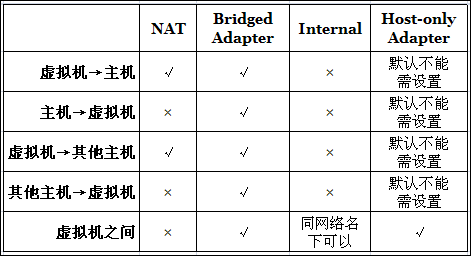
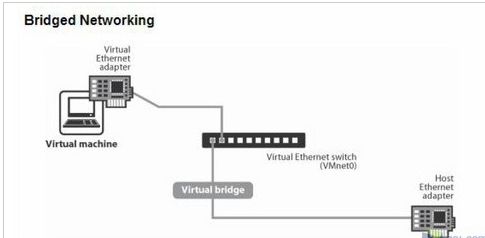
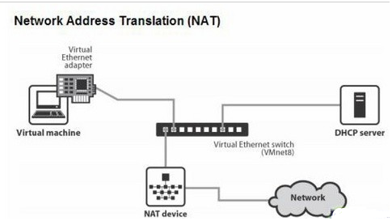
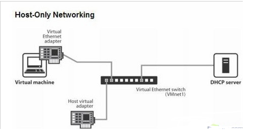

# linux虚拟机中和主机网络连接方式的区别

在介绍网络模式之前，关于网络的几个简单命令的使用

ifup eth0   //启动网卡eth0

ifdown eth0 //关闭网卡eth0

/etc/network/interfaces  //网络配置文件

/etc/init.d/networking  //网络服务位置

/etc/init.d/networking restart  //重启网络

/etc/resolv.conf //DNS配置文件

ifconfig eth0 192.168.5.111 //重新配置网卡eth0的ip

## 一、VirtualBox 与 VMware

VirtualBox中有4中网络连接方式：

- NAT
- Bridged Adapter
- Internal
- Host-only Adapter

VMWare中有三种，其实他跟VMWare 的网络连接方式都是一样概念，只是比VMWare多了Internal方式。

要让自己（或别人）理解深刻，方法就是做比较和打比方，比较之间的不同和相同，拿熟知的事物打比方。先来一张图，通过这张图就很容易看出这4种方式的区别：

> **Internal（内网模式)：** ，顾名思义就是内部网络模式。虚拟机与外网完全断开，只实现虚拟机于虚拟机之间的内部网络模式。 

下面重点讲解VMware的三种网络连接方式。

## 二、VMware的三种模式的简单介绍

VMWare提供了三种工作模式，它们是bridged(桥接模式)、NAT(网络地址转换模式)和host-only(主机模式)。要想在网络管理和维护中合理应用它们，你就应该先了解一下这三种工作模式。

#### 1、bridged(桥接模式)

​        在这种模式下，VMWare虚拟出来的操作系统就像是局域网中的一台独立的主机，它可以访问网内任何一台机器。在桥接模式下，你需要手工为虚拟 系统配置IP地址、子网掩码，而且还要和宿主机器处于同一网段，这样虚拟系统才能和宿主机器进行通信。同时，由于这个虚拟系统是局域网中的一个独立的主机 系统，那么就可以手工配置它的TCP/IP配置信息，以实现通过局域网的网关或路由器访问互联网。

​        使用桥接模式的虚拟系统和宿主机器的关系，就像连接在同一个Hub上的两台电脑。想让它们相互通讯，你就需要为虚拟系统配置IP地址和子网掩码，否则就无法通信。

　　如果你想利用VMWare在局域网内新建一个虚拟服务器，为局域网用户提供网络服务，就应该选择桥接模式。

#### 2、host-only(主机模式)

　　在某些特殊的网络调试环境中，要求将真实环境和虚拟环境隔离开，这时你就可采用host-only模式。在host-only模式中，所有的虚拟系统是可以相互通信的，但虚拟系统和真实的网络是被隔离开的。

　　提示:在host-only模式下，虚拟系统和宿主机器系统是可以相互通信的，相当于这两台机器通过双绞线互连。

　　在host-only模式下，虚拟系统的TCP/IP配置信息(如IP地址、网关地址、DNS服务器等)，都是由VMnet1(host-only)虚拟网络的DHCP服务器来动态分配的。

　　如果你想利用VMWare创建一个与网内其他机器相隔离的虚拟系统，进行某些特殊的网络调试工作，可以选择host-only模式。

#### 3、NAT(网络地址转换模式)

 在NAT网络中，会使用到VMnet8虚拟交换机，Host上的VMware Network Adapter VMnet8虚拟网卡被连接到VMnet8交换机上，来与Guest进行通信，但是VMware Network Adapter VMnet8虚拟网卡仅仅是用于和VMnet8网段通信用的，它并不为VMnet8网段提供路由功能，处于虚拟NAT网络下的Guest是使用虚拟的NAT服务器连接的Internet的。 
  这时候，你的Guest和Host就可以实现互访了，并且如果你的Host此时已经连接到了Internet，那么你的Guest也就可以连上Internet了。那么VMware Network Adapter VMnet8虚拟网卡在这里扮演了一个什么角色呢？它仅仅是为Host和NAT虚拟网络下的Guest通信提供一个接口，所以，即便Disable掉这块虚拟网卡，Guest仍然是可以上网的，只是Host无法再访问VMnet8网段而已。 
  这种方式的时候，主机需要开启vmdhcp和vmnat服务。 

　　使用NAT模式，就是让虚拟系统借助NAT(网络地址转换)功能，通过宿主机器所在的网络来访问公网。也就是说，使用NAT模式可以实现在虚拟 系统里访问互联网。NAT模式下的虚拟系统的TCP/IP配置信息是由VMnet8(NAT)虚拟网络的DHCP服务器提供的，无法进行手工修改，因此虚 拟系统也就无法和本局域网中的其他真实主机进行通讯。采用NAT模式最大的优势是虚拟系统接入互联网非常简单，你不需要进行任何其他的配置，只需要宿主机 器能访问互联网即可。

　　如果你想利用VMWare安装一个新的虚拟系统，在虚拟系统中不用进行任何手工配置就能直接访问互联网，建议你采用NAT模式。

　　提示:以上所提到的NAT模式下的VMnet8虚拟网络，host-only模式下的VMnet1虚拟网络，以及bridged模式下的 VMnet0虚拟网络，都是由VMWare虚拟机自动配置而生成的，不需要用户自行设置。VMnet8和VMnet1提供DHCP服务，VMnet0虚拟 网络则不提供

## 三、三种模式的本质区别

网络模式

　　我们首先说一下VMware的几个虚拟设备

　　VMnet0：用于虚拟桥接网络下的虚拟交换机

　　VMnet1：用于虚拟Host-Only网络下的虚拟交换机

　　VMnet8：用于虚拟NAT网络下的虚拟交换机

　　VMware Network Adepter VMnet1：Host用于与Host-Only虚拟网络进行通信的虚拟网卡

　　VMware Network Adepter VMnet8：Host用于与NAT虚拟网络进行通信的虚拟网卡

安装了VMware虚拟机后，会在网络连接对话框中多出两个虚拟网卡。

#### 1）桥接网络模式

 桥接网络是指本地物理网卡和虚拟网卡通过VMnet0虚拟交换机进行桥接，物理网卡和虚拟网卡在拓扑图上处于同等地位(虚拟网卡既不是Adepter VMnet1也不是Adepter VMnet8)。

这里的VMnet0相当于一个交换机，最终通过这个虚拟交换机使其两端在一个网段中。

那么物理网卡和虚拟网卡就相当于处于同一个网段，虚拟交换机就相当于一台现实网络中的交换机。所以两个网卡的IP地址也要设置为同一网段。

如果使虚拟机使用桥接模式连接网络，在运行cmd命令后产看两个IP，可以发现IPv4的IP 和虚拟机处于一个网段。

物理网卡和虚拟网卡的IP地址处于同一个网段，子网掩码、网关、DNS等参数都相同。两个网卡在拓扑结构中是相对独立的。

桥接网络模式是VMware虚拟机中最简单直接的模式。安装虚拟机时它为默认选项。

在桥接模式下，虚拟机和宿主计算机处于同等地位，虚拟机就像是一台真实主机一样存在于局域网中。因此在桥接模式下，我们就要像对待其他真实计算机一样为其配置IP、网关、子网掩码等等。

当我们可以自由分配局域网IP时，使用桥接模式就可以虚拟出一台真实存在的主机。

 

#### 2）NAT模式

 在NAT网络中，会用到VMware NetworkAdepter VMnet8虚拟网卡，主机上的VMware Network Adepter VMnet8虚拟网卡被直接连接到VMnet8虚拟交换机上与虚拟网卡进行通信。

VMware Network Adepter VMnet8虚拟网卡的作用仅限于和VMnet8网段进行通信，它不给VMnet8网段提供路由功能，所以虚拟机虚拟一个NAT服务器，使虚拟网卡可以连接到Internet。在这种情况下，我们就可以使用端口映射功能，让访问主机80端口的请求映射到虚拟机的80端口上。

VMware Network Adepter VMnet8虚拟网卡的IP地址是在安装VMware时由系统指定生成的，我们不要修改这个数值，否则会使主机和虚拟机无法通信。

虚拟出来的网段和NAT模式虚拟网卡的网段是一样的，都为192.168.111.X，包括NAT服务器的IP地址也是这个网段。在安装VMware之后同样会生成一个虚拟DHCP服务器，为NAT服务器分配IP地址。

　　当主机和虚拟机进行通信的时候就会调用VMware Network Adepter VMnet8虚拟网卡，因为他们都在一个网段，所以通信就不成问题了。

　　实际上，VMware Network Adepter VMnet8虚拟网卡的作用就是为主机和虚拟机的通信提供一个接口，即使主机的物理网卡被关闭，虚拟机仍然可以连接到Internet，但是主机和虚拟机之间就不能互访了。

在NAT模式下，宿主计算机相当于一台开启了DHCP功能的路由器，而虚拟机则是内网中的一台真实主机，通过路由器(宿主计算机)DHCP动态获得网络参数。因此在NAT模式下，虚拟机可以访问外部网络，反之则不行，因为虚拟机属于内网。

使用NAT模式的方便之处在于，我们不需要做任何网络设置，只要宿主计算机可以连接到外部网络，虚拟机也可以。

NAT模式通常也是大学校园网Vmware最普遍采用的连接模式，因为我们一般只能拥有一个外部IP。很显然，在这种情况下，非常适合使用NAT模式。

#### 3）host-only模式

在Host-Only模式下，虚拟网络是一个全封闭的网络，它唯一能够访问的就是主机。其实Host-Only网络和NAT网络很相似，不同的地方就是 Host-Only网络没有NAT服务，所以虚拟网络不能连接到Internet。主机和虚拟机之间的通信是通过VMware Network Adepter VMnet1虚拟网卡来实现的。

同NAT一样，VMware Network Adepter VMnet1虚拟网卡的IP地址也是VMware系统指定的，同时生成的虚拟DHCP服务器和虚拟网卡的IP地址位于同一网段，但和物理网卡的IP地址不在同一网段。

Host-Only的宗旨就是建立一个与外界隔绝的内部网络，来提高内网的安全性。这个功能或许对普通用户来说没有多大意义，但大型服务商会常常利用这个功能。如果你想为VMnet1网段提供路由功能，那就需要使用RRAS，而不能使用XP或2000的ICS，因为ICS会把内网的IP地址改为 192.168.0.1，但虚拟机是不会给VMnet1虚拟网卡分配这个地址的，那么主机和虚拟机之间就不能通信了。

在Host-only模式下，相当于虚拟机通过双绞线和宿主计算机直连，而宿主计算机不提供任何路由服务。因此在Host-only模式下，虚拟机可以和宿主计算机互相访问，但是虚拟机无法访问外部网络。

当我们要组成一个与物理网络相隔离的虚拟网络时，无疑非常适合使用Host-only模式。