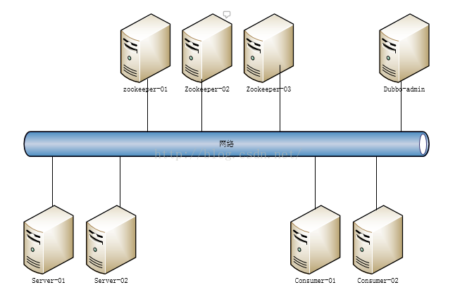
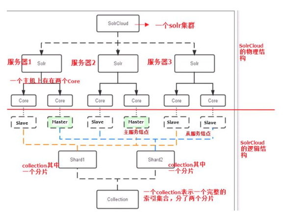
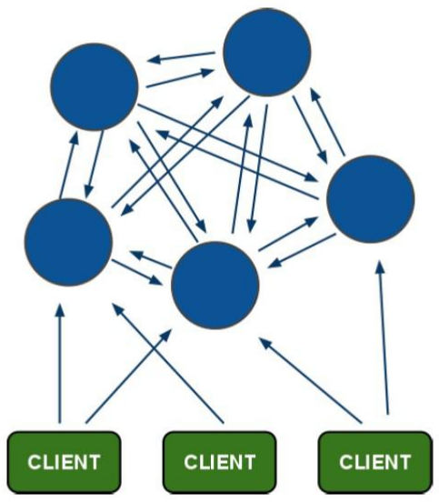

# 品优$_1 集群解决方案

## 1.集群概述

### 1.1、什么是集群

#### 1.1.1、集群概念

​	集群是一种计算机系统， 它通过一组松散集成的计算机软件和/或硬件连接起来高度紧密地协作完成计算工作。在某种意义上，他们可以被看作是一台计算机。集群系统中的单个计算机通常称为节点，通常通过局域网连接，但也有其它的可能连接方式。集群计算机通常用来改进单个计算机的计算速度和/或可靠性。一般情况下集群计算机比单个计算机，比如工作站或超级计算机性能价格比要高得多。

#### 1.1.2、集群的特点

集群拥有以下两个特点：

1. 可扩展性：集群的性能不限制于单一的服务实体，新的服务实体可以动态的添加到集群，从而增强集群的性能。

	2.   高可用性：集群当其中一个节点发生故障时，这台节点上面所运行的应用程序将在另一台节点被自动接管，消除单点故障对于增强数据可用性、可达性和可靠性是非常重要的。

### 1.1.3、集群的两大能力

集群必须拥有以下两大能力：

​	1.     负载均衡：负载均衡把任务比较均匀的分布到集群环境下的计算和网络资源，以提高数据吞吐量。

​	2.     错误恢复：如果集群中的某一台服务器由于故障或者维护需要无法使用，资源和应用程序将转移到可用的集群节点上。这种由于某个节点的资源不能工作，另一个可用节点中的资源能够透明的接管并继续完成任务的过程，叫做错误恢复。

负载均衡和错误恢复要求各服务实体中有执行同一任务的资源存在，而且对于同一任务的各个资源来说，执行任务所需的信息视图必须是相同的。

> ##### 吞吐量：


### 1.2、集群与分布式的区别

说到集群，可能大家会立刻联想到另一个和它很相近的一个词----“分布式”。那么集群和分布式是一回事吗？有什么联系和区别呢?

##### 相同点：分布式和集群都是需要有很多节点服务器通过网络协同工作完成整体的任务目标。

##### 不同点：分布式是指将业务系统进行拆分，即分布式的每一个节点都是实现不同的功能。而集群每个节点做的是同一件事情。

##### 如：

- ##### 我们品优电商系统就是一个分布式，功能分布在不同service中。

- ##### 每个功能service由多台server组成，那么这个server组就是一个集群，因为server组的各台服务器都是相同工作。


## 二、Zookeeper集群

### 2.1、为什么搭建Zookeeper集群

​	大部分分布式应用需要一个主控、协调器或者控制器来管理物理分布的子进程。目前，大多数都要开发私有的协调程序，缺乏一个通用机制，协调程序的反复编写浪费，且难以形成通用、伸缩性好的协调器，zookeeper提供通用的分布式锁服务，用以协调分布式应用。所以说zookeeper是分布式应用的协作服务。

​	zookeeper作为注册中心，服务器和客户端都要访问，如果有大量的并发，肯定会有等待。所以可以通过zookeeper集群解决。**（由于分布式锁，若不搭建集群，访问量就很难提升，即吞吐量很低！）**

​	下面是zookeeper集群部署结构图：



### 2.2、了解Leader选举 

每个服务器节点： 1  2  3  4  5

如何选举呢？ 选举谁的ID最大，谁就是老大！！！

那么 5 就是Leader，对吗？ 不一定！ （因为票数要超过一半才有效）

```properties
# 若依次启动
1  :给自己投票 ， 但是只有1票，无效，那么1处于looking状态；
1  2 :2的ID大，都给2投票，依然无效，两个处于looking;
1  2  3 :此时都给3投票，票数过半，选举3为Leader.
# 接下来，4、5就无需参与了，因为Leader已产生。
```

```
新装Linux 6.5自带open-jdk: 1.7+1.6
管理员：root/itcast
用户：hawin/123456
```


### 2.3、搭建Zookeeper集群

准备一个新的Linux环境，CentOS 6.5. 

##### 第一步：安装JDK.  一般默认情况系统都安装好了yum源。若没有，就得自己安装yum源，再安装jdk. 若是纯绿色版，解压即可使用，然后配置好环境变量即可。

##### 第二步：zookeeper集群搭建。

在这里可以使用editPlus连接Linux，方便修改zoo.cfg配置文件。

```shell
dataDir=/usr/local/zookeeper-cluster/zookeeper-1/data
clientPort=2181

dataDir=/usr/local/zookeeper-cluster/zookeeper-2/data
clientPort=2182

dataDir=/usr/local/zookeeper-cluster/zookeeper-3/data
clientPort=2183

# 每个节点的配置文件 zoo.cfg
# 2881:是服务器之间的通信端口，自定义不能与客户端访问端口冲突。3881:是投票端口
server.1=192.168.25.129:2881:3881
server.2=192.168.25.129:2882:3882
server.3=192.168.25.129:2883:3883
```

##### 第三步：分别启动zookeeper

```shell
[root@localhost bin]# ./zkServer.sh start
JMX enabled by default
Using config: /usr/local/zookeeper-cluster/zookeeper-1/bin/../conf/zoo.cfg
Starting zookeeper ... STARTED
[root@localhost bin]# ./zkServer.sh status
JMX enabled by default
Using config: /usr/local/zookeeper-cluster/zookeeper-1/bin/../conf/zoo.cfg
Error contacting service. It is probably not running.
# 结论：启动一个，集群并不能正常跑动

[root@localhost bin]# cd ../../zookeeper-2/bin
[root@localhost bin]# ./zkServer.sh start
JMX enabled by default
Using config: /usr/local/zookeeper-cluster/zookeeper-2/bin/../conf/zoo.cfg
Starting zookeeper ... STARTED
[root@localhost bin]# ./zkServer.sh status
JMX enabled by default
Using config: /usr/local/zookeeper-cluster/zookeeper-2/bin/../conf/zoo.cfg
Mode: leader
[root@localhost bin]# cd ../../zookeeper-1/bin
[root@localhost bin]# ./zkServer.sh status
JMX enabled by default
Using config: /usr/local/zookeeper-cluster/zookeeper-1/bin/../conf/zoo.cfg
Mode: follower
# 结论：当2号启动，2号当选为leader，集群正常运行。 1号是follower

[root@localhost bin]# cd ../../zookeeper-3/bin
[root@localhost bin]# ./zkServer.sh start
JMX enabled by default
Using config: /usr/local/zookeeper-cluster/zookeeper-3/bin/../conf/zoo.cfg
Starting zookeeper ... STARTED
[root@localhost bin]# ./zkServer.sh status
JMX enabled by default
Using config: /usr/local/zookeeper-cluster/zookeeper-3/bin/../conf/zoo.cfg
Mode: follower

# 模拟异常测试，只要集群超过一半有问题，集群体系就无法运转。只要超过一半正常，就会正常运转。即便是leader over 只要一半运行正常，只会重新选举。
```

##### 新搭建好集群后，但是Linux环境有防火墙。如何测试搭建好的集群能对外开放呢？

```shell
# 通过 windows telnet命令。 一般是没有安装的，要先安装telnet服务器，参考baidu.
$ telnet 192.168.25.129 2181  
# 若直接刷个黑窗口，即是可以连接zookeeper。 
# 否则，显示连接中... ， 之后连接失败。就是防火墙阻止连接了。
```

##### 设置Linux防火强：

```shell
$ vim /etc/sysconfig/iptables  

[root@localhost logs]# cat /etc/sysconfig/iptables
# Firewall configuration written by system-config-firewall
# Manual customization of this file is not recommended.
*filter
:INPUT ACCEPT [0:0]
:FORWARD ACCEPT [0:0]
:OUTPUT ACCEPT [0:0]
-A INPUT -m state --state ESTABLISHED,RELATED -j ACCEPT
-A INPUT -p icmp -j ACCEPT
-A INPUT -i lo -j ACCEPT
-A INPUT -m state --state NEW -m tcp -p tcp --dport 22 -j ACCEPT
# -A RH-Firewall-1-INPUT -m state --state NEW -m tcp -p tcp --dport 21 -j ACCEPT
#zookeeper
-A INPUT -m state --state NEW -m tcp -p tcp --dport 2181 -j ACCEPT
-A INPUT -m state --state NEW -m tcp -p tcp --dport 2888 -j ACCEPT
-A INPUT -m state --state NEW -m tcp -p tcp --dport 3888 -j ACCEPT
#tomcat
-A INPUT -m state --state NEW -m tcp -p tcp --dport 8080 -j ACCEPT
-A INPUT -j REJECT --reject-with icmp-host-prohibited
-A FORWARD -j REJECT --reject-with icmp-host-prohibited
COMMIT

# 重启防火强
$ service iptables restart 
# 查看防火强
$ service iptables status
```

> #### 特别注意：
>
> ##### 添加的Accept 端口，必须放在REJECT上面，才能生效（即最后两行），否则无效！


### 2.4、 Dubbox连接zookeeper集群 

从前面以前配置好pinyougou-common的profile。 

此时我们只需要在对应工程引用pinyougou-common，从而实现业务集群。

#### pinyougou-common:

```properties
# dubbo_pro.properties
env.address=192.168.25.129:2181,192.168.25.129:2182,192.168.25.129:2183

# dubbo.properties
address=${env.address}
```

```xml
<?xml version="1.0" encoding="UTF-8"?>
<beans xmlns="http://www.springframework.org/schema/beans"
	xmlns:xsi="http://www.w3.org/2001/XMLSchema-instance" xmlns:p="http://www.springframework.org/schema/p"
	xmlns:context="http://www.springframework.org/schema/context"
	xmlns:dubbo="http://code.alibabatech.com/schema/dubbo" xmlns:mvc="http://www.springframework.org/schema/mvc"
	xsi:schemaLocation="http://www.springframework.org/schema/beans http://www.springframework.org/schema/beans/spring-beans.xsd
        http://www.springframework.org/schema/mvc http://www.springframework.org/schema/mvc/spring-mvc.xsd
        http://code.alibabatech.com/schema/dubbo http://code.alibabatech.com/schema/dubbo/dubbo.xsd
        http://www.springframework.org/schema/context http://www.springframework.org/schema/context/spring-context.xsd">

    <context:property-placeholder location="classpath*:properties/*.properties" />
    <dubbo:registry protocol="zookeeper"  address="${address}"/>
</beans>
```

```xml
# POM.XML配置
...
<properties>
    <env>dev</env>
</properties>

<profiles>
    <profile>
        <id>dev</id>
        <properties>
            <env>dev</env>
        </properties>
    </profile>
    <profile>
        <id>pro</id>
        <properties>
            <env>pro</env>
        </properties>
    </profile>
</profiles>

...

<build>
    <filters>
        <filter>src/main/resources/filters/dubbox_${env}.properties</filter>
    </filters>
    <resources>
        <resource>
            <directory>src/main/resources</directory>
            <filtering>true</filtering>
        </resource>
    </resources>
</build>
```

- #### pinyougou-search-service:

  ##### 1 # 去除 dubbo address register

```xml

	<!-- 默认port：20880  因为有很多个服务，若不配置port就会混乱。 -->
    <dubbo:protocol name="dubbo" port="20884"></dubbo:protocol>
	<dubbo:application name="pinyougou-search-service"/>  
	<!-- <dubbo:registry address="zookeeper://192.168.25.128:2181"/> -->
    <dubbo:annotation package="com.pinyougou.search.service.impl" />  
```

##### 		2 # 添加common依赖

```
POM.XML直接添加
```

- #### pinyougou-search-web:

同上，去除dubbo address register, 添加common依赖。

同时，由于web.xml只配置springMVC的监听，那么就无法读取到common的applicationContext-service.xml数据信息。无法完成消费者的注册。

##### 下面配置到web.xml中：

```
<context-param>
		<param-name>contextConfigLocation</param-name>
		<param-value>classpath*:spring/applicationContext*.xml</param-value>
	</context-param>
	<listener>
		<listener-class>org.springframework.web.context.ContextLoaderListener</listener-class>
	</listener>
```

> zookeeper集群，若是本地模拟，vmare若挂机会影响集群状态。重启终端，检查连接状态。若一直不能连接，则需要先删除集群各zookeeper的data中的数据文件。


## 三、SolrCloud  

### 3.1 SolrCloud简介

#### 3.1.1 什么是SolrCloud

​	SolrCloud(solr 云)是 Solr 提供的分布式搜索方案，当你需要大规模，容错，分布式索引和检索能力时使用 SolrCloud。当一个系统的索引数据量少的时候是不需要使用 SolrCloud的，当索引量很大，搜索请求并发很高，这时需要使用 SolrCloud 来满足这些需求。

​	SolrCloud 是基于 Solr 和Zookeeper的分布式搜索方案，它的主要思想是使用 Zookeeper作为集群的配置信息中心。

它有几个特色功能：

1）集中式的配置信息

2）自动容错

3）近实时搜索

4）查询时自动负载均衡


#### 3.1.2 SolrCloud系统架构



#### 

上图中的SolrCloud下的Solr-1，Solr-2，Solr-3服务器存储的是同样的数据，但是同一solr的2个core是不同的，分别存储了share1,share2的数据信息。

- #### Collection: 索引库

  这是solrCloud逻辑层面一个完整索引库，当实际业务搜索时，就是在Collection索引库开始的。

- #### Shard：分片不是主从概念，那为什么要分片呢？

  Collection 的逻辑分片。每个 Shard 被化成一个或者多个 replication，通过选举确定哪个是 Leader。

  > ##### 什么是分片？ 将完整的数据划分多个部分，形成去中心化。即减少中心压力。
  >
  > 所以为什么要分片，主要就是为了缓解中心数据源的压力。提升吞吐量。当海量数据时，若所有数据都在一个数据中心，会造成数据中心增删改查很大压力。若分片了，那么由不同服务器去承担。
  >
  > 

- #### Master 或 Slave

  Master 是 master-slave 结构中的主结点（通常说主服务器），Slave 是 master-slave 结构中的从结点（通常说从服务器或备服务器）。同一个 Shard 下 master 和 slave 存储的数据是一致的，这是为了达到高可用目的。

- #### Core： 一般一台服务器会搭建独立的solr

  每个 Core 是 Solr 中一个独立运行单位，提供 索引和搜索服务。一个 shard 需要由一个Core 或多个 Core 组成。由于 collection 由多个 shard 组成，所以 collection 一般由多个 core 组成。（相当于mysql的db, 在solr对应collection1）。

  ##### 为什么要搭建两个core呢？主要为了shard最大利用，达到高可用目的。

  

### 3.2 搭建SolrCloud

```
put -r D:\apache-tomcat-8.5.31-solr # 上传文件夹
```

- ##### 上传tomcat-solr

  ```shell
  /usr/local/solr-cloud/tomcat-1
  	1、修改 conf/server.xml的端口，避免测试同时启动冲突。若是生产环境，不同Server,无需此操作；
  	2、修改 bin/catalina.sh 
  		# Make the umask available when using the org.apache.catalina.security.SecurityListener
  		JAVA_OPTS="-DzkHost=192.168.25.129:2181,192.168.25.129:2182,192.168.25.129:2183"
  		
  	3、修改webapps/solr/WEB-INF/web.xml对应的solrhome
  	<env-entry-value>/usr/local/solr-homes/solr-home-1/solrhome</env-entry-value>
  	(2,3,4修改类同)
  /usr/local/solr-cloud/tomcat-2
  /usr/local/solr-cloud/tomcat-3
  /usr/local/solr-cloud/tomcat-4
  ```

- ##### 上传solrhome

  ```xml
  /usr/local/solr-homes/solr-home-1
  	修改solr.xml，配置solrcloud信息
  	  <solrcloud>
          <str name="host">192.168.25.129</str>
          <int name="hostPort">8180</int>
          <str name="hostContext">${hostContext:solr}</str>
          <int name="zkClientTimeout">${zkClientTimeout:30000}</int>
          <bool name="genericCoreNodeNames">${genericCoreNodeNames:true}</bool>
   	 </solrcloud>
  /usr/local/solr-homes/solr-home-2
  /usr/local/solr-homes/solr-home-3
  /usr/local/solr-homes/solr-home-4
  ```

- ##### solrcloud的配置信息要交于zookeeper管理，下面命令将solrCloud关联zookeeper

  若不用zookeeper管理配置文件，每个solr-server都有各自一份，不利于管理！

```
./zkcli.sh -zkhost 192.168.25.129:2181,192.168.25.129:2182,192.168.25.129:2183 -cmd upconfig
-confdir /usr/local/solr-homes/solrhome-1/solrhome/collection1/conf -confname myconf
```

- ##### 启动solr集群 : 直接启动各自的tomcat即可。注意防火强问题。

```shell
$ cd tomcat-1/bin  
$ ./startup.sh

# 防火墙需要新增8180,8280,8380,8480 开放。
```


### 3.3 SpringDataSolr连接SolrCloud

- ##### 修改search-service 的spring-solr.xml文件

```xml
<!-- solr服务器地址 -->
<solr:solr-server id="solrServer_dev" url="http://127.0.0.1:8080/solr" />

<bean id="solrServer_pro" class="org.apache.solr.client.solrj.impl.CloudSolrServer">
    <constructor-arg value="192.168.25.129:2181,192.168.25.129:2182,192.168.25.129:2183" />
    <property name="defaultCollection" value="collection1"></property>
</bean>

<!-- solr模板，使用solr模板可对索引库进行CRUD的操作 -->
<bean id="solrTemplate" class="org.springframework.data.solr.core.SolrTemplate">
    <constructor-arg ref="solrServer_${env}" />
</bean>
```

- ##### 配置pom.xml的profile信息，类同common

- ##### tomcat7:run -P pro即是生产solrcloud环境。


### 3.4 分片配置

（1）创建新的 Collection 进行分片处理。

在浏览器输入以下地址，可以按照我们的要求  创建新的Collection 。

```shell
http://192.168.25.140:8180/solr/admin/collections?action=CREATE&name=collection2&numShards=2&replicationFactor=2
```

**参数：**

**name**:将被创建的集合的名字
 **numShard**s:集合创建时需要创建逻辑碎片的个数
 **replicationFactor**:分片的副本数。

看到这个提示表示成功

```XML
<response>
    <lst name="responseHeader">
        <int name="status">0</int>
        <int name="QTime">7774</int>
    </lst>
    <lst name="success">
        <lst>
            <lst name="responseHeader">
                <int name="status">0</int>
                <int name="QTime">6345</int>
            </lst>
            <str name="core">collection2_shard1_replica1</str>
        </lst>
        <lst>
            <lst name="responseHeader">
                <int name="status">0</int>
                <int name="QTime">5786</int>
            </lst>
            <str name="core">collection2_shard2_replica1</str>
        </lst>
        <lst>
            <lst name="responseHeader">
                <int name="status">0</int>
                <int name="QTime">6747</int>
            </lst>
            <str name="core">collection2_shard2_replica2</str>
        </lst>
        <lst>
            <lst name="responseHeader">
                <int name="status">0</int>
                <int name="QTime">6832</int>
            </lst>
            <str name="core">collection2_shard1_replica2</str>
        </lst>
    </lst>
</response>
```

（2）删除不用的 Collection。执行以下命令 

```
http://192.168.25.140:8480/solr/admin/collections?action=DELETE&name=collection1
```

> ##### 默认SecureCRT 连接后是没有Linux终端颜色区分提示，需要重新设置下：
>
> https://blog.csdn.net/qq_35428201/article/details/81447871

### 3.5模拟集群异常测试

略，类同zookeeper!


# 四、Redis Cluster

### 4.1 Redis-Cluster简介

#### 4.1.1 什么是Redis-Cluster

为何要搭建Redis集群。Redis是在内存中保存数据的，而我们的电脑一般内存都不大，这也就意味着Redis不适合存储大数据，适合存储大数据的是Hadoop生态系统的Hbase或者是MogoDB。Redis更适合处理高并发，一台设备的存储能力是很有限的，但是多台设备协同合作，就可以让内存增大很多倍，这就需要用到集群。

Redis集群搭建的方式有多种，例如使用客户端分片、Twemproxy、Codis等，但从redis 3.0之后版本支持redis-cluster集群，它是Redis官方提出的解决方案，Redis-Cluster采用无中心结构，每个节点保存数据和整个集群状态,每个节点都和其他所有节点连接。其redis-cluster架构图如下：




​	客户端与 redis 节点直连,不需要中间 proxy 层.客户端不需要连接集群所有节点连接集群中任何一个可用节点即可。

​	所有的 redis 节点彼此互联(PING-PONG 机制),内部使用二进制协议优化传输速度和带宽.

#### 4.1.2 分布存储机制-槽 （数据如何存储到redis集群服务器？）

（1）redis-cluster 把所有的物理节点映射到[0-16383]slot 上,cluster 负责维护(16384个槽)

```
node<->slot<->value
```

（2）Redis 集群中内置了 16384 个哈希槽，当需要在 Redis 集群中放置一个 key-value 时，**redis 先对 key 使用 crc16 算法算出一个结果**，然后把结果对 16384 求余数，这样每个key 都会对应一个编号在 0-16383 之间的哈希槽，redis 会根据节点数量大致均等的将哈希槽映射到不同的节点。

​    例如三个节点：槽分布的值如下：

SERVER1:  0-5460

SERVER2:  5461-10922

SERVER3:  10923-16383

#### 4.1.3 容错机制-投票（通过投票机制，排序谁出局，谁fail）

（1）选举过程是集群中所有master参与，如果半数以上master节点与故障节点通信超过(cluster-node-timeout),认为该节点故障，自动触发故障转移操作.  故障节点对应的从节点自动升级为主节点

（2）什么时候整个集群不可用(cluster_state:fail)? 

如果集群任意master挂掉,且当前master没有slave.集群进入fail状态,也可以理解成集群的slot映射[0-16383]不完成时进入fail状态. 

> ##### 若一个节点挂了，那么集群就挂了！！！
>
> 那么如何才能做到高可用呢？我们这里还要做主从备份，在redis-cluster的主节点，还需要做一个从节点，当主节点挂了，从节点马上替换上去。


### 4.2、搭建Redis-Cluster

- ##### 安装gcc-c++:  Redis 是 c 语言开发的。安装 redis 需要 c 语言的编译环境。如果没有 gcc 需要在线安装。 

  需要外网环境，并且已经设置好yum源！（yum源配置参考Linux入门）

- ##### 安装ruby: 需要使用ruby脚本来实现集群搭建 

  ```
  $ yum install ruby
  $ yum install rubygems
  ```

- 将redis源码包上传到 linux 系统  ，解压redis源码包 

  ```shell
  $ sftp> put d:/my-developer/redis-3.0.0.tar.gz # 上传
  $ tar -zxvf redis-3.0.0.tar.gz # 解压
  ```

- 编译redis源码  ，进入redis源码文件夹 :

  ```shell
  $ cd redis-3.0.0
  $ make # c的命令
  ```

- 创建目录/usr/local/redis-cluster目录，  安装6个redis实例，分别安装在以下目录 

  ```shell
  # 创建redis集群目录
  $ mkdir -p /usr/local/redis-cluster/redis-1
  $ mkdir -p /usr/local/redis-cluster/redis-2
  $ mkdir -p /usr/local/redis-cluster/redis-3
  $ mkdir -p /usr/local/redis-cluster/redis-4
  $ mkdir -p /usr/local/redis-cluster/redis-5
  $ mkdir -p /usr/local/redis-cluster/redis-6
  
  # 安装redis
  $ make install PREFIX=/usr/local/redis-cluster/redis-1
  $ make install PREFIX=/usr/local/redis-cluster/redi...6
  ```

  

- 复制配置文件  将 /redis-3.0.0/redis.conf 复制到redis下的bin目录下 


#### 4.2.3、配置集群

（1）修改每个redis节点的配置文件redis.conf

- 修改运行端口为7001 （7002 7003 .....）
- 将cluster-enabled yes 前的注释去掉(632行)

（2）启动每个redis实例 

```shell
$ cd /usr/local/redis-cluster/redis-1/bin
$ ./redis-server redis.conf
```

（3）上传redis-3.0.0.gem ，安装 ruby用于搭建redis集群的脚本。

```shell
$ gem install redis-3.0.0.gem
Successfully installed redis-3.0.0
1 gem installed
Installing ri documentation for redis-3.0.0...
Installing RDoc documentation for redis-3.0.0...
```

（4）使用 ruby 脚本搭建集群。

进入redis源码目录中的src目录  执行下面的命令 >使用

```shell
$ cd /redis-3.0.0/src
$ ./redis-trib.rb create --replicas 1 192.168.125.129:7001 192.168.125.129:7002 192.168.125.129:7003 192.168.125.129:7004 192.168.125.129:7005 192.168.125.129:7006
# 提示 输入yes即可搭建
```

### 4.3、连接Redis-Cluster

通过windows 中redis-cli 连接redis-cluster:

```shell
D:\>cd redis-2.8.9

# -h 代表远程连接， -c 代表连接集群，若没有则是单个连接
D:\redis-2.8.9>redis-cli -h 192.168.125.129 -p 7001 -c 
192.168.125.129:7001>
192.168.125.129:7001>
192.168.125.129:7001> set name abc
-> Redirected to slot [5798] located at 192.168.125.129:7002
OK
192.168.125.129:7001> quit

D:\redis-2.8.9>redis-cli -h 192.168.125.129 -p 7001
192.168.125.129:7001> get name
(error) MOVED 5798 192.168.125.129:7002 # 若单个连接，发现是无法获取name对应的值
192.168.125.129:7001> quit

D:\redis-2.8.9>redis-cli -h 192.168.125.129 -p 7001 -c
192.168.125.129:7001> get name
-> Redirected to slot [5798] located at 192.168.125.129:7002
"abc"
192.168.125.129:7001>
```


#### 4.4、SpringDataRedis连接Redis集群 

参考资料！

修改品优购工程  在pinyougou-common工程添加spring 配置文件 

##### applicationContext-redis-cluster.xml

```xml
<?xml version="1.0" encoding="UTF-8"?> 
<beans xmlns="http://www.springframework.org/schema/beans" 
       xmlns:xsi="http://www.w3.org/2001/XMLSchema-instance" xmlns:p="http://www.springframework.org/schema/p" 
       xmlns:context="http://www.springframework.org/schema/context" 
       xsi:schemaLocation="http://www.springframework.org/schema/beans   
                           http://www.springframework.org/schema/beans/spring-beans.xsd   
                           http://www.springframework.org/schema/context   
                           http://www.springframework.org/schema/context/spring-context.xsd">  
    <!-- 加载配置属性文件 -->  
    <context:property-placeholder ignore-unresolvable="true" location="classpath:properties/redis-cluster-config.properties" />  
    <bean id="redis-clusterConfiguration" class="org.springframework.data.redis.connection.redis-clusterConfiguration">  
        <property name="maxRedirects" value="${redis.maxRedirects}"></property>  
        <property name="clusterNodes">  
            <set>  
                <bean class="org.springframework.data.redis.connection.redis-clusterNode">  
                    <constructor-arg name="host" value="${redis.host1}"></constructor-arg>  
                    <constructor-arg name="port" value="${redis.port1}"></constructor-arg>  
                </bean>  
                <bean class="org.springframework.data.redis.connection.redis-clusterNode">  
                    <constructor-arg name="host" value="${redis.host2}"></constructor-arg>  
                    <constructor-arg name="port" value="${redis.port2}"></constructor-arg>  
                </bean>  
                <bean class="org.springframework.data.redis.connection.redis-clusterNode">  
                    <constructor-arg name="host" value="${redis.host3}"></constructor-arg>  
                    <constructor-arg name="port" value="${redis.port3}"></constructor-arg>  
                </bean>  
                <bean class="org.springframework.data.redis.connection.redis-clusterNode">  
                    <constructor-arg name="host" value="${redis.host4}"></constructor-arg>  
                    <constructor-arg name="port" value="${redis.port4}"></constructor-arg>  
                </bean>  
                <bean class="org.springframework.data.redis.connection.redis-clusterNode">  
                    <constructor-arg name="host" value="${redis.host5}"></constructor-arg>  
                    <constructor-arg name="port" value="${redis.port5}"></constructor-arg>  
                </bean>  
                <bean class="org.springframework.data.redis.connection.redis-clusterNode">  
                    <constructor-arg name="host" value="${redis.host6}"></constructor-arg>  
                    <constructor-arg name="port" value="${redis.port6}"></constructor-arg>  
                </bean>  
            </set>  
        </property>  
    </bean>  
    <bean id="jedisPoolConfig"   class="redis.clients.jedis.JedisPoolConfig">  
        <property name="maxIdle" value="${redis.maxIdle}" />   
        <property name="maxTotal" value="${redis.maxTotal}" />   
    </bean>  
    <bean id="jeidsConnectionFactory" class="org.springframework.data.redis.connection.jedis.JedisConnectionFactory"  >  
        <constructor-arg ref="redis-clusterConfiguration" />  
        <constructor-arg ref="jedisPoolConfig" />  
    </bean>    
    <bean id="redisTemplate" class="org.springframework.data.redis.core.RedisTemplate">  
        <property name="connectionFactory" ref="jeidsConnectionFactory" />  
    </bean>  
</beans>
```


